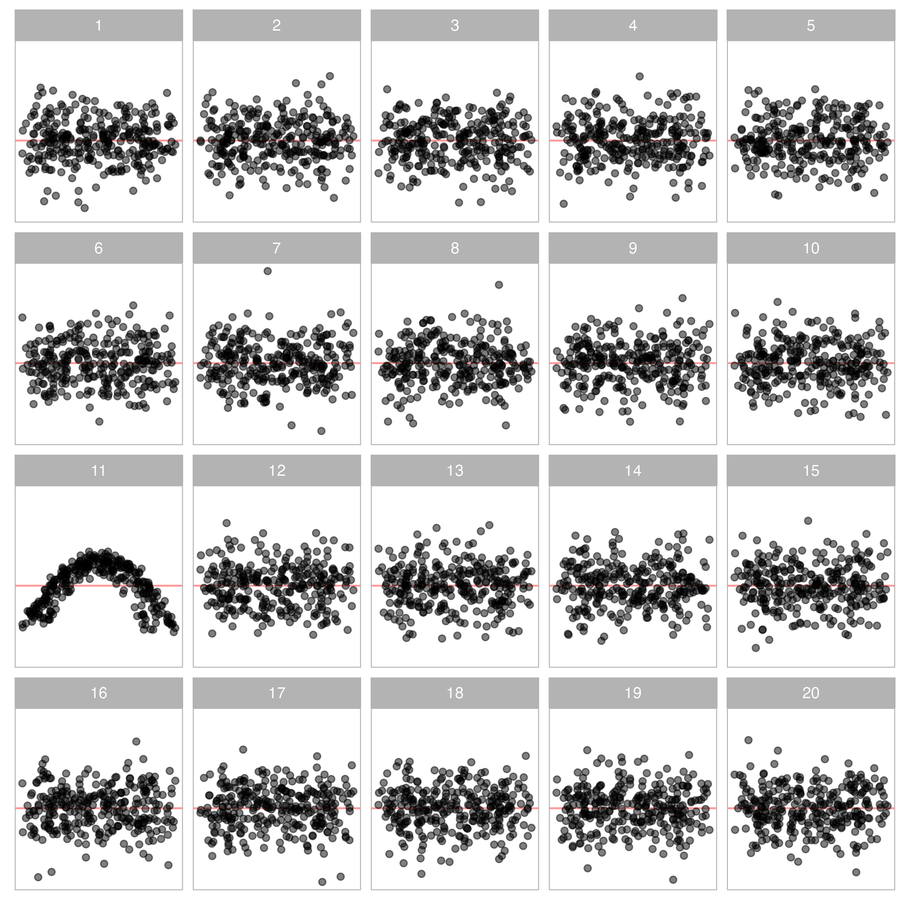
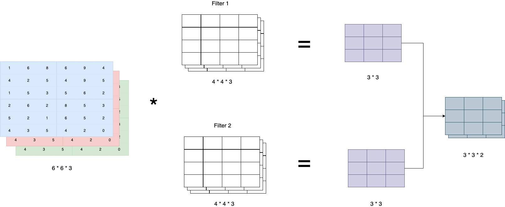
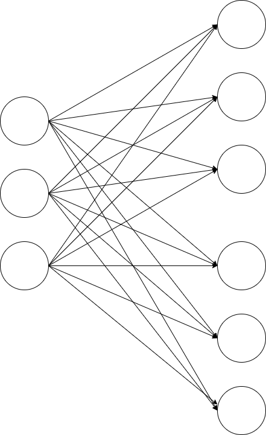
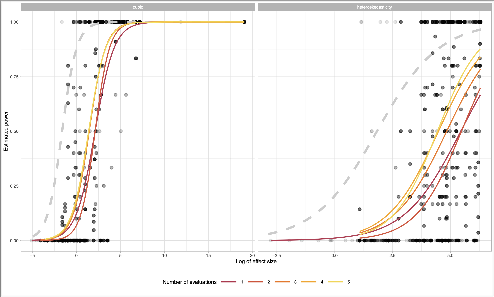
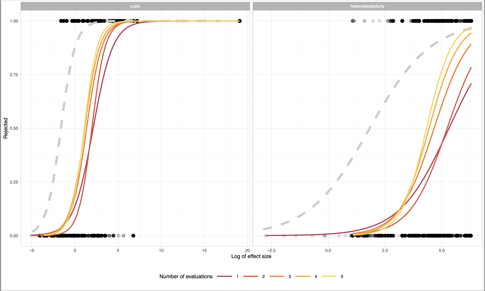

```{r setup, include=FALSE}
options(htmltools.dir.version = FALSE)
knitr::opts_chunk$set(
  fig.width=5, fig.height=5, fig.retina=3,
  out.width = "100%",
  cache = FALSE,
  echo = FALSE,
  message = FALSE, 
  warning = FALSE,
  hiline = TRUE
)
```


```{r}
library(RefManageR)
BibOptions(check.entries = FALSE,
           bib.style = "authoryear",
           cite.style = "apa",
           style = "Bibtex",
           # max.names = 3,
           longnamesfirst = FALSE,
           hyperlink = FALSE,
           dashed = FALSE)
myBib <- ReadBib("./Visual Inference.bib", check = FALSE)
```

```{r xaringan-themer, include=FALSE, warning=FALSE}
library(xaringanthemer)
library(tidyverse)
library(visage)
style_solarized_light(
  background_color = "#FFFFFF",
  header_font_google = google_font("Josefin Sans"),
  text_font_google   = google_font("Montserrat", "300", "300i"),
  code_font_google   = google_font("Fira Mono"),
  text_color = "#000000",
  text_font_size = "1.0rem",
  colors = c(myblue = "#006DAE", mywhite = "#FFFFFF")
)
```

count: false

<!-- need a backaground image -->

.pull-left-full[
<h1 class="myblue"> Automatic Visual Inference for Linear Regression </h1>

<h3 class="myblue"> First Milestone Presentation </h3>

<br>
<br>
<br>
<br>

<h3 class="myblue"> Weihao Li </h3>

<h3 class="myblue"> Supervised by Di Cook and Emi Tanaka </h3>

<!-- <h3 class="myblue"> `r format(Sys.Date(), format="%B %d, %Y")` </h3> -->
]

.pull-right[

<br>


]

---


.pull-left-center[
```{r plot1}
library(visage)

eval_data <- readRDS("data/training_original_data_single.rds")

filter(eval_data, id == 9586, null == TRUE) %>%
  VI_MODEL$plot(theme = theme_light(base_size = 12), size = 1) +
  ylab("Residuals") +
  xlab("Fitted values")
# 68

```

.center[
.caption[
Fig. 1: *Residual plot of a simple linear regression.*
]
]
]

.pull-right[
# Visual Discoveries

<br>
<br>

#### This is a residual plot of a simple linear regression.

#### Can you find the evidence on heteroskedasticity?

- Vertical spread of the points varies with the fitted values.

#### However, the residuals are actually simulated from a **correctly specified model**! 


#### Unsecured and unconfirmed visual discoveries will lead to **over or under-interpretations of the data**.

]
 
---

.pull-left[
# Visual Inference & Lineup Protocol

<br>
<br>

#### **Visual inference** was introduced by `r BibOptions(max.names = 1);Citet(myBib, "buja_statistical_2009")` as an inferential framework to extend confirmatory statistics to visual discoveries. 

#### A **lineup** consists of $m$ randomly placed plots, where one plot is the **actual data plot** and the remaining $m-1$ plots (**null plots**) contain data consistent with the null hypothesis.

#### To perform a **visual test**, observer(s) will be asked to select the **most different plot(s)** from the lineup.


]

.pull-right-center[
```{r}
mod <- HETER_MODEL$fit(filter(eval_data, id == 9586, null == FALSE))

manual_lineup <- data.frame()

for (i in 1:19) {
  tmp_dat <- HETER_MODEL$null_resid(filter(eval_data, id == 9586, null == FALSE), mod)
  tmp_dat$k <- i
  manual_lineup <- bind_rows(manual_lineup, tmp_dat)
}

manual_lineup <- bind_rows(manual_lineup, mutate(filter(eval_data, id == 9586, null == TRUE), k = 20))

VI_MODEL$plot_lineup(manual_lineup, 
                     theme = theme_light(),
                     remove_grid_line = TRUE,
                     size = 0.3
                     ) +
  xlab("Fitted values") +
  ylab("Residuals")
```

.center[
.caption[
Fig. 2: _A lineup of 20 residual plots of a simple linear regression. (Plot No.20 is Fig.1) **Can you find the most different one?**_ 
]
]

]


---

# $p$-value

#### Under the null hypothesis, it is expected that the actual data plot would have **no distinguishable difference** with the null plots.

#### Suppose observers are allowed to select **only one plot**. The probability of the observer correctly picks the actual data plot is $1/m$.

#### If we involve $K$ independent observers in a visual test, and let $X$ be a random variable denoting the number of observers correctly picking the actual data plot. Under the null hypothesis $X ∼ Binom(K, 1/m)$. The p-value of a lineup of size $m$ evaluated by $K$ observer is given as $$P(X \geq x) = \sum_{i=x}^{K}{{K}\choose{i}}\left(\frac{1}{m}\right)^i\left(\frac{m-1}{m}\right)^{k-i},$$ where $x$ is the realization of number of observers correctly picking the actual data plot.

#### The null hypothesis will be rejected if $P(X \geq x) < \alpha$, the desired significance level.

---

.pull-left-center-80[


.caption[
Fig. 3: _A Roberts loom in a weaving shed in 1835 and a Watt steam engine._ 
]

]

.pull-right-120[
# Limitation of Lineup Protocol

<br>

#### 1. Human can not evaluate lineup consisted of a large number of plots.
#### 2. Human can not evaluate a large number of lineups.
#### 3. Lineup protocol is unfriendly to vision-impaired people.
#### 4. Evaluation of lineup is high in labour cost and time consuming.

<br>

### **We need a "steam engine" for visual test!**

]

---

# Computer Vision Model

#### Large-scale evaluation of visual tests is not possible without the use of technology and machines. 

#### Modern **computer vision model** could be a promising solution to this problem. It is usually built on a **deep neural network** called **convolutional neural network** (CNN) `r BibOptions(max.names = 1);Citep(myBib, "fukushima_neocognitron_1982")`.


.caption[
Fig. 4: _A typical CNN with convolutional layers, pooling layers and fully-connected layers._ 
]

---

# Computer Vision Model - Convolutional Layer

#### **Convolutional layers** take advantages of the hierarchical pattern in data and provide regularized versions of fully-connected layers. It downscales and transforms the image by summarising information in a small space. 

.center[]

.center[.caption[
Fig. 5: _Illustration of convolution operation with two filters._ 
]]

---

# Computer Vision Model - Pooling Layer

.pull-left[

<br>
<br>

#### **Pooling layers** apply non-linear down-sampling on the feature maps. This helps reducing the number of parameters in the neural network so that the problem of overfiting can be controlled. 

#### One of the most popular pooling operations is **max pooling**. It divides the feature map into several rectangle regions and takes the maximum to form a new feature map.
]


.pull-right-center[


.caption[
Fig. 6: _Illustration of max pooling operation._ 
]
]


---

# Computer Vision Model - Fully-connected Layer

.pull-left-center-80[


.caption[
Fig. 7: _Illustration of a fully-connected layer._ 
]
]

<br>
<br>

#### **Fully-connected layer** is building block of neural network. It peformes matrix multiplication on the inputs and the weights.

<br>

#### This layer is primarily used to process information presented in the feature maps before making the prediction. The output of the layer will be passed to a special layer called **loss layer** for computing the loss or error of the prediction.

---

# Simulation Setup - Cubic Model

#### To train computer vision models, we use simulation data generated from two linear regression model with **non-linearity** and **heteroskedasticity** issues.

#### The first model is a **cubic model** which can be expressed by: $$\boldsymbol{Y}= 1 + (2-c)\boldsymbol{X} + c\boldsymbol{Z} + a[(2-c)\boldsymbol{X}]^2+a(c\boldsymbol{Z})^2+b[(2-c)\boldsymbol{X}]^3+b(c\boldsymbol{Z})^3+\boldsymbol{\varepsilon},$$ where $c \in (0,2)$, $a \in (-3,3)$, $b \in (-3,3)$, $\boldsymbol{\varepsilon}\overset{iid}{\sim} N(\boldsymbol{0},\sigma^2\boldsymbol{I})$, $\boldsymbol{Y}$, $\boldsymbol{X}$ and $\boldsymbol{Z}$ are $n\times1$ matrices.

#### In the simulation, $X_i$, $i=1,...,n$, has equal chance to follow one of the following distributions: $N(0, 0.09)$, $U(-1, 1)$, $Lognormal(0,0.36)/3 - 1$ and $-Lognormal(0,0.36)/3 + 1$. These distributions are chosen such that most the realizations will fall between $-1$ and $1$.

#### The distribution of $Z_i$, $i=1,...,n$, has $50$% chance to be a uniform distribution ranged from $-1$ to $1$, and $50$% chance to be a discrete uniform distribution with $z_n$ outcomes simulated from a uniform distribution ranged from $-1$ to $1$. $z_n$ itself is a discrete uniform distribution with outcomes $\{x: 9<x<21 \text{ and } x \in \mathbb{Z} \}$, which defines the number of possible values $Z_i$ could take.

---

# Simulation Setup - Cubic Model

#### The simulated data is fitted by OLS with equation: $$\boldsymbol{Y}= \beta_0 + \beta_1\boldsymbol{X} + \beta_2\boldsymbol{Z} +\boldsymbol{u},$$ where $\boldsymbol{u} \sim N(\boldsymbol{0}, \sigma^2_u\boldsymbol{I})$.

#### Let $\boldsymbol{X}_a=[\boldsymbol{1},\boldsymbol{X},\boldsymbol{Z}]$ denotes the set of regressors in matrix form. Then, the **residuals** obtained from the null model are $$\boldsymbol{e} \sim N(\boldsymbol{R}_a\boldsymbol{X}_b\boldsymbol{\beta}_b, \sigma^2\boldsymbol{R}_a),$$ where $\boldsymbol{R}_a=\boldsymbol{I}-\boldsymbol{X}_a(\boldsymbol{X}_a'\boldsymbol{X}_a)^{-1}\boldsymbol{X}_a'$, $\boldsymbol{X}_b=[\boldsymbol{X}^2,\boldsymbol{Z}^2,\boldsymbol{X}^3,\boldsymbol{Z}^3]$ and $\boldsymbol{\beta}_b=(a(2-c)^2,ac^2,b(2-c)^3,bc^3)'$.

#### The **effect size** is derived as: $$ES=n^{-1}||\sigma^{-1}\boldsymbol{R}_a^{-\frac{1}{2}}\boldsymbol{R}_a\boldsymbol{X}_b\boldsymbol{\beta}_b||^2=n^{-1}\sigma^{-2}||\boldsymbol{R}_a^{\frac{1}{2}}\boldsymbol{X}_b\boldsymbol{\beta}_b||^2\approx n^{-1}\sigma^{-2}||diag(\boldsymbol{R}_a)^{\frac{1}{2}}\boldsymbol{X}_b\boldsymbol{\beta}_b||^2,$$ where $diag(\boldsymbol{R}_a)$ is the diagonal matrix constructed from the diagonal elements of $\boldsymbol{R}_a$.

---

.pull-left[
```{r}
mod <- cubic_model(a = 5, b = 10, c = 1)
mod$plot_lineup(mod$gen_lineup(300), remove_grid_line = TRUE, theme = theme_light()) + xlab("Fitted values") + ylab("Residuals")
```

.caption[
Fig. 8: _A lineup of residual plots generated with the cubic model._ 
]
]

.pull-right[
```{r}
mod <- cubic_model(-1, -1, 1, 0.5)
dat <- mod$gen(500, fit_model = TRUE)
mod$plot(dat, theme = theme_light(base_size = 10), size = 1) +
  ggtitle(glue::glue("Effect size: {round(mod$effect_size(dat), 2)}")) + xlab("Fitted values") + ylab("Residuals") -> p1

mod <- cubic_model(-2, -1, 1, 0.5)
dat <- mod$gen(500, fit_model = TRUE)
mod$plot(dat, theme = theme_light(base_size = 10), size = 1) +
  ggtitle(glue::glue("Effect size: {round(mod$effect_size(dat), 2)}")) + xlab("Fitted values") + ylab("Residuals") -> p2

mod <- cubic_model(-5, -5, 1, 0.5)
dat <- mod$gen(500, fit_model = TRUE)
mod$plot(dat, theme = theme_light(base_size = 10), size = 1) +
  ggtitle(glue::glue("Effect size: {round(mod$effect_size(dat), 2)}")) + xlab("Fitted values") + ylab("Residuals") -> p3

mod <- cubic_model(-20, -20, 1, 0.5)
dat <- mod$gen(500, fit_model = TRUE)
mod$plot(dat, theme = theme_light(base_size = 10), size = 1) +
  ggtitle(glue::glue("Effect size: {round(mod$effect_size(dat), 2)}")) + xlab("Fitted values") + ylab("Residuals") -> p4

list(p1, p2, p3, p4) %>% patchwork::wrap_plots(ncol=2)
```

.caption[
Fig. 9: _Residual plots of cubic model under different effect sizes._ 
]
]


---

# Simulation Setup - Heteroskedasticity Model

<br>
<br>

#### The second model is a heteroskedasticy model which can be expressed by: $$Y_i = 1 + X_i + \varepsilon_i, ~i = 1,...,n,$$ where $a \in \{-1,0,1\}$, $b\in (0,32)$ and $\varepsilon_i \overset{iid}{\sim} N(0,1+b(2-|a|)(X_i-a)^2)$.

#### $\boldsymbol{X}$ could be one of the five distributions mentioned above - normal distribution, uniform distribution, adjusted log-normal distribution, adjusted negative log-normal distribution and discrete uniform distribution. 

---

# Simulation Setup - Heteroskedasticity Model

#### The simulated data is fitted by OLS with equation: $$\boldsymbol{Y}= \beta_0 + \beta_1\boldsymbol{X} +\boldsymbol{u},$$ where $\boldsymbol{u} \sim N(\boldsymbol{0}, \sigma^2_u\boldsymbol{I})$.

#### Let $\boldsymbol{X}_a=[\boldsymbol{1},\boldsymbol{X}]$ denotes the set of regressors in matrix form. The residuals obtained from the null model are $$\boldsymbol{e} \sim N(\boldsymbol{0}, \boldsymbol{R}_a\boldsymbol{V}),$$ where $\boldsymbol{R}_a=\boldsymbol{I}-\boldsymbol{X}_a(\boldsymbol{X}_a'\boldsymbol{X}_a)^{-1}\boldsymbol{X}_a'$ and $\boldsymbol{V}$ is a diagonal matrix with $V_{ii}=1+b(2-|a|)(X_i  -  a)^2$, $i = 1,...,n$. 

#### The **effect size** is derived as $ES = b\sqrt{n}$.

---

.pull-left[
```{r}
mod <- heter_model(a = -1, b = 30)
mod$plot_lineup(mod$gen_lineup(300), remove_grid_line = TRUE, theme = theme_light()) + xlab("Fitted values") + ylab("Residuals")
```

.caption[
Fig. 10: _A lineup of residual plots generated with the heteroskedasticity model._ 
]
]

.pull-right[

```{r}
set.seed(10086)
mod <- heter_model(0, 1)
mod$plot(mod$gen(500, fit_model = TRUE), size = 1, theme = theme_light(base_size = 10)) + ggtitle(glue::glue("Effect size: {round(mod$effect_size(mod$gen(500)),2)}")) + xlab("Fitted values") + ylab("Residuals") -> p1
mod <- heter_model(0, 3)
mod$plot(mod$gen(500, fit_model = TRUE), size = 1, theme = theme_light(base_size = 10)) + ggtitle(glue::glue("Effect size: {round(mod$effect_size(mod$gen(500)),2)}")) + xlab("Fitted values") + ylab("Residuals") -> p2
mod <- heter_model(0, 9)
mod$plot(mod$gen(500, fit_model = TRUE), size = 1, theme = theme_light(base_size = 10)) + ggtitle(glue::glue("Effect size: {round(mod$effect_size(mod$gen(500)),2)}")) + xlab("Fitted values") + ylab("Residuals") -> p3
mod <- heter_model(0, 81)
mod$plot(mod$gen(500, fit_model = TRUE), size = 1, theme = theme_light(base_size = 10)) + ggtitle(glue::glue("Effect size: {round(mod$effect_size(mod$gen(500)),2)}")) + xlab("Fitted values") + ylab("Residuals") -> p4

list(p1, p2, p3, p4) %>% patchwork::wrap_plots(ncol=2)
```

.caption[
Fig. 11: _Residual plots of heteroskedasticity model under different effect sizes._ 
]

]

---

# Human Subject Experiments

.pull-left-center[

<br>
<br>


.caption[
Fig. 12: _Layout of the study webiste._ 
]
]

.pull-right[

#### **Two human subject experiments** are conducted to compare humans with computer vision models on the ability of reading data plots.

#### **20** lineups are given to each participant, with **10** cubic lineups and **10** heteroskedasticity lineups across different effect sizes. **2** out of **20** lineups are extremely easy lineup which are used as attention checks. Participants need to pass at least one.

#### The same lineup will not be presented to a participant twice. Most of the lineups have been evaluated by **5** different participants. 

#### Participants are allowed to **select multiple plots** from a lineup. They also need to give the **reason** and the **confidence level**.


]

---

# $p$-value and Power Estimation for Multiple Selections

#### The assumptions about the **independence** still needed. Let $K$ be the number of independent evaluations of a visual test, $s_i , i = 1, ..., K$ be the **number of selections of the evaluations**, and $X$ be the random variable denoting the number of detections. Then, the $p$-value of the visual test is given as: $$P(X\geq x) = \sum_{j=x}^{K}Pr(j|s_1,...,s_K).$$


#### The distribution of $X$ given $s_1, ...s_K$ can not be **derived trivially**, as it is a **sampling without replacement problem**. In practice, this distribution can be **approximated** by computer simulation.

---

# $p$-value and Power Estimation for Multiple Selections

#### Assume there is a **visual test** $V_K$, where $K$ denoting the number of evaluations. The corresponding  $p$-value of $V_K$ can be computed. 

#### Meanwhile, if one evaluation is **randomly deleted** from $V_K$, the remaining evaluations can still be used to form another valid visual test $V_{K-1}$. 

#### In fact, considering **all the possibilities**, $K$ different outcomes for $V_{K-1}$ can be obtained. 

#### Since all outcomes occur with **equal probability**, the **proportion of outcomes which reject the null hypothesis** can be used as an **estimator of the power of the visual test** $V_{K-1}$. 

#### Similarly, if we would like to estimate the power of the visual test $V_{K-j}$ given the evaluations of $V_{K}$, for $j < K$, we could find all the possible combinations of $K$ elements, taken $k-j$ at a time to obtain $K\choose{K-j}$ different outcomes for $V_{K-j}$. Then, the estimated power is given as $R/{K\choose{K-j}}$, where $R$ is the number of outcomes which reject the null hypothesis.

---

# Human Subject Experiment - Results


<br>
<br>

#### We collect **400** lineup evaluations made by **20** participants in experiment I and **880** lineup evaluations made by **44** participants in experiment II. In total, **442** unique lineups are evaluated by 64 subjects.

#### The power of each lineup from one to five evaluations is estimated.


#### The estimated power is further used in fitting **quasi-binomial generalized linear models** with natural logarithm of effect size as the only regressor.

#### Another method we use to model the power is to collect all decisions made by $K\choose{K-j}$ different outcomes for $V_{K-j}$, and directly fit **binomial generalized linear models** with natural logarithm of effect size as the regressor.

---


.center[

.caption[
Fig. 13: _Quasibinomial GLM fitted for estimated power for different number of evaluations. The left plot is for the cubic model, the right plot is for the heteroskedasticity model. Power curves for different number of evaluations are drawn in different colors. The dashed line is the power of the conventional test._ 
]]


---

.center[

.caption[
Fig. 13: _Binomial GLM fitted for rejection for different number of evaluations. The left plot is for the cubic model, the right plot is for the heteroskedasticity model. Power curves for different number of evaluations are drawn in different colors. The dashed line is the power of the conventional test._ 
]]


---

# Automatic Visual Inference with Computer Vision Models

.pull-left[

#### We proposed an **automatic visual inference system** for evaluating lineups of residual plots, with a focus on the specification error of classical normal linear regression.

#### **Non-linearity** and **heteroskedasticity** are two features considered by the system so far. More features will be added to the system in the future however.

#### The system is built upon **computer vision models**. 
]


<!-- Modern computer vision model could be a promising solution to this problem. As a subfield of AI, computer vision with the modern deep learning architectures solved numerous critical problems in automation. Inspired by the vision processing in living organisms, the convolutional neural network (CNN) was introduced by @fukushima_neocognitron_1982. Soon, this architecture was applied to hand-written number recognition trained with back-propagation by @lecun_backpropagation_1989. This was one of the earliest attempts which human successfully extract information from digital images via self-learning algorithms. Modern computer vision model is typically built on the deep neural network with convolutional layers [@fukushima_neocognitron_1982]. Convolutional layers take advantage of the hierarchical pattern in data and provide regularized versions of fully-connected layers. It downscales and transforms the image by summarising information in a small space. Numerous studies have shown that it can be used to effectively tackle vision tasks, such as image recognition [@rawat_deep_2017]. With the development of graphics processing units and the spread of high-performance personal computers, researches in computer vision become a new hype in the 21st century. Achievements such as computer-aided diagnosis [@lee_image_2015], pedestrian detection [@brunetti_computer_2018] and facial recognition [@emami_facial_2012] had a significant impact on our daily life. -->


<!-- The first project develops a prototype of automatic visual inference system for evaluating lineups of residual plots, with a focus on the classical normal linear regression model given it is one of the simplest predictive models. The automatic system is identical to the lineup protocol except evaluators are replaced by computer vision models. The computer vision models are trained by using data simulated from linear models with violations of different classical assumptions, such as linearity and homoscedasticity. Data of human performance on evaluating residual plots generated under the same simulation setting is collected by conducting online human subject experiments, such that the comparison between the power of human subject-assessed visual tests and the system-assessed visual tests can be made. Moreover, factors that affect the performance of the automatic system are studied for improving the architecture and design of the computer vision models. -->


---


---
