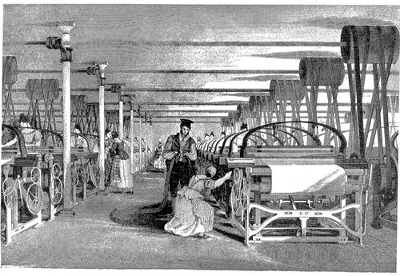

```{r setup, include=FALSE}
options(htmltools.dir.version = FALSE)
knitr::opts_chunk$set(
  fig.width=5, fig.height=5, fig.retina=3,
  out.width = "100%",
  cache = FALSE,
  echo = FALSE,
  message = FALSE, 
  warning = FALSE,
  hiline = TRUE
)
```


```{r}
library(RefManageR)
BibOptions(check.entries = FALSE,
           bib.style = "authoryear",
           cite.style = "apa",
           style = "Bibtex",
           # max.names = 3,
           longnamesfirst = FALSE,
           hyperlink = FALSE,
           dashed = FALSE)
myBib <- ReadBib("./Visual Inference.bib", check = FALSE)
```

```{r xaringan-themer, include=FALSE, warning=FALSE}
library(xaringanthemer)
library(tidyverse)
library(visage)
style_solarized_light(
  background_color = "#FFFFFF",
  header_font_google = google_font("Josefin Sans"),
  text_font_google   = google_font("Montserrat", "300", "300i"),
  code_font_google   = google_font("Fira Mono"),
  text_color = "#000000",
  text_font_size = "1.0rem",
  colors = c(myblue = "#006DAE", mywhite = "#FFFFFF")
)
```

count: false

<!-- need a backaground image -->

.pull-left-full[
<h1 class="myblue"> Automatic Visual Inference for Linear Regression </h1>

<br>
<br>
<br>
<br>
<br>


<h2 class="myblue"> Weihao Li </h2>

<h2 class="myblue"> `r format(Sys.Date(), format="%B %d, %Y")` </h2>
]

.pull-right[

]

---

.pull-left-center[
```{r plot1}
library(visage)

eval_data <- readRDS("data/training_original_data_single.rds")

filter(eval_data, id == 9586, null == TRUE) %>%
  VI_MODEL$plot(theme = theme_light(base_size = 12), size = 1) +
  ylab("Residuals") +
  xlab("Fitted values")
# 68

```

.center[
.caption[
Fig. 1: *Residual plot of a simple linear regression.*
]
]
]

.pull-right[
# Visual Discoveries

<br>
<br>

#### This is a residual plot of a simple linear regression.

#### Can you find the evidence on heteroskedasticity?

- Vertical spread of the points varies with the fitted values.

#### However, the residuals are actually simulated from a **correctly specified model**! 


#### Unsecured and unconfirmed visual discoveries will lead to **over or under-interpretations of the data**.

]
 
---

.pull-left[
# Visual Inference & Lineup Protocol

<br>
<br>

#### **Visual inference** was introduced by `r BibOptions(max.names = 1);Citet(myBib, "buja_statistical_2009")` as an inferential framework to extend confirmatory statistics to visual discoveries. 

#### A **lineup** consists of $m$ randomly placed plots, where one plot is the **actual data plot** and the remaining $m-1$ plots (**null plots**) contain data consistent with the null hypothesis.

#### To perform a **visual test**, observer(s) will be asked to select the **most different plot(s)** from the lineup.


]

.pull-right-center[
```{r}
mod <- HETER_MODEL$fit(filter(eval_data, id == 9586, null == FALSE))

manual_lineup <- data.frame()

for (i in 1:19) {
  tmp_dat <- HETER_MODEL$null_resid(filter(eval_data, id == 9586, null == FALSE), mod)
  tmp_dat$k <- i
  manual_lineup <- bind_rows(manual_lineup, tmp_dat)
}

manual_lineup <- bind_rows(manual_lineup, mutate(filter(eval_data, id == 9586, null == TRUE), k = 20))

VI_MODEL$plot_lineup(manual_lineup, 
                     theme = theme_light(),
                     remove_grid_line = TRUE,
                     size = 0.3
                     ) +
  xlab("Fitted values") +
  ylab("Residuals")
```

.center[
.caption[
Fig. 2: _A lineup of 20 residual plots of a simple linear regression. (Plot No.20 is Fig.1) **Can you find the most different one?**_ 
]
]

]


---

# $p$-value

#### Under the null hypothesis, it is expected that the actual data plot would have **no distinguishable difference** with the null plots.

#### Suppose observers are allowed to select **only one plot**. The probability of the observer correctly picks the actual data plot is $1/m$.

#### If we involve $K$ independent observers in a visual test, and let $X$ be a random variable denoting the number of observers correctly picking the actual data plot. Under the null hypothesis $X ∼ Binom(K, 1/m)$. The p-value of a lineup of size $m$ evaluated by $K$ observer is given as $$P(X \geq x) = \sum_{i=x}^{K}{{K}\choose{i}}\left(\frac{1}{m}\right)^i\left(\frac{m-1}{m}\right)^{k-i},$$ where $x$ is the realization of number of observers correctly picking the actual data plot.

#### The null hypothesis will be rejected if $P(X \geq x) < \alpha$, the desired significance level.

---

.pull-left-center-80[




.caption[
Fig. 3: _A Roberts loom in a weaving shed in 1835 and a Watt steam engine._ 
]

]

.pull-right-120[
# Limitation of Lineup Protocol

<br>

#### 1. Human can not evaluate lineup consisted of a large number of plots.
#### 2. Human can not evaluate a large number of lineups.
#### 3. Lineup protocol is unfriendly to vision-impaired people.
#### 4. Evaluation of lineup is high in labour cost and time consuming.

<br>

### **We need a "steam engine" for visual test!**

]

---

# Computer Vision Model

#### Large-scale evaluation of visual tests is not possible without the use of technology and machines. 

#### Modern **computer vision model** could be a promising solution to this problem. It is usually built on a **deep neural network** called **convolutional neural network** (CNN) `r BibOptions(max.names = 1);Citep(myBib, "fukushima_neocognitron_1982")`.


.caption[
Fig. 4: _A typical CNN with convolutional layers, pooling layers and fully-connected layers._ 
]

---

# Computer Vision Model - Convolutional Layer

#### **Convolutional layers** take advantages of the hierarchical pattern in data and provide regularized versions of fully-connected layers. It downscales and transforms the image by summarising information in a small space. 

.center[]

.center[.caption[
Fig. 5: _Illustration of convolution operation with two filters._ 
]]

---

# Computer Vision Model - Pooling Layer

.pull-left[

<br>
<br>

#### **Pooling layers** apply non-linear down-sampling on the feature maps. This helps reducing the number of parameters in the neural network so that the problem of overfiting can be controlled. 

#### One of the most popular pooling operations is **max pooling**. It divides the feature map into several rectangle regions and takes the maximum to form a new feature map.
]


.pull-right-center[


.caption[
Fig. 6: _Illustration of max pooling operation._ 
]
]


---

# Computer Vision Model - Fully-connected Layer

.pull-left-center-80[


.caption[
Fig. 7: _Illustration of a fully-connected layer._ 
]
]

<br>
<br>

#### **Fully-connected layer** is building block of neural network. It peformes matrix multiplication on the inputs and the weights.

<br>

#### This layer is primarily used to process information presented in the feature maps before making the prediction. The output of the layer will be passed to a special layer called **loss layer** for computing the loss or error of the prediction.

---

# Simulation Setup

<!-- This project focuses on building a prototype of automatic visual statistical inference system for evaluating residual plots of classical normal linear regression model. To set up a comparison between the computer vision models and humans, human subject experiments were conducted to understand the ability of human reading residual plots. -->
<!-- Because the first project is still ongoing, we consider the result we have is not enough to write as a paper at the moment. Hence, the materials provided in this chapter are two main parts of the draft paper that will contain enough details for understanding the project. -->

#### To train computer vision models for evaluating lineups, we need a large amount of data. 

#### Meanwhile, we need to set up a comparison between the computer vision models and humans on the ability of reading residual plot for understanding the performance of the models.  


---

# Automatic Visual Inference with Computer Vision Models

.pull-left[

#### We proposed an **automatic visual inference system** for evaluating lineups of residual plots, with a focus on the specification error of classical normal linear regression.

#### **Non-linearity** and **heteroskedasticity** are two features considered by the system so far. More features will be added to the system in the future however.

#### The system is built upon **computer vision models**. 
]


<!-- Modern computer vision model could be a promising solution to this problem. As a subfield of AI, computer vision with the modern deep learning architectures solved numerous critical problems in automation. Inspired by the vision processing in living organisms, the convolutional neural network (CNN) was introduced by @fukushima_neocognitron_1982. Soon, this architecture was applied to hand-written number recognition trained with back-propagation by @lecun_backpropagation_1989. This was one of the earliest attempts which human successfully extract information from digital images via self-learning algorithms. Modern computer vision model is typically built on the deep neural network with convolutional layers [@fukushima_neocognitron_1982]. Convolutional layers take advantage of the hierarchical pattern in data and provide regularized versions of fully-connected layers. It downscales and transforms the image by summarising information in a small space. Numerous studies have shown that it can be used to effectively tackle vision tasks, such as image recognition [@rawat_deep_2017]. With the development of graphics processing units and the spread of high-performance personal computers, researches in computer vision become a new hype in the 21st century. Achievements such as computer-aided diagnosis [@lee_image_2015], pedestrian detection [@brunetti_computer_2018] and facial recognition [@emami_facial_2012] had a significant impact on our daily life. -->


<!-- The first project develops a prototype of automatic visual inference system for evaluating lineups of residual plots, with a focus on the classical normal linear regression model given it is one of the simplest predictive models. The automatic system is identical to the lineup protocol except evaluators are replaced by computer vision models. The computer vision models are trained by using data simulated from linear models with violations of different classical assumptions, such as linearity and homoscedasticity. Data of human performance on evaluating residual plots generated under the same simulation setting is collected by conducting online human subject experiments, such that the comparison between the power of human subject-assessed visual tests and the system-assessed visual tests can be made. Moreover, factors that affect the performance of the automatic system are studied for improving the architecture and design of the computer vision models. -->


---


---
