```{r setup, include=FALSE}
options(htmltools.dir.version = FALSE)
knitr::opts_chunk$set(
  fig.width=5, fig.height=5, fig.retina=3,
  out.width = "100%",
  cache = FALSE,
  echo = FALSE,
  message = FALSE, 
  warning = FALSE,
  hiline = TRUE
)
```


```{r}
library(RefManageR)
BibOptions(check.entries = FALSE,
           bib.style = "authoryear",
           cite.style = "apa",
           style = "Bibtex",
           # max.names = 3,
           longnamesfirst = FALSE,
           hyperlink = FALSE,
           dashed = FALSE)
myBib <- ReadBib("./Visual Inference.bib", check = FALSE)
```

```{r xaringan-themer, include=FALSE, warning=FALSE}
library(xaringanthemer)
library(tidyverse)
library(visage)
style_solarized_light(
  background_color = "#FFFFFF",
  header_font_google = google_font("Josefin Sans"),
  text_font_google   = google_font("Montserrat", "300", "300i"),
  code_font_google   = google_font("Fira Mono"),
  text_color = "#000000",
  text_font_size = "1.0rem",
  colors = c(myblue = "#006DAE", mywhite = "#FFFFFF")
)
```

count: false

<!-- need a backaground image -->

.pull-left-full[
<h1 class="myblue"> Automatic Visual Inference for Linear Regression </h1>

<h3 class="myblue"> First Milestone Presentation </h3>

<br>
<br>
<br>
<br>

<h3 class="myblue"> Weihao Li </h3>

<h3 class="myblue"> Supervised by Di Cook and Emi Tanaka </h3>

<!-- <h3 class="myblue"> `r format(Sys.Date(), format="%B %d, %Y")` </h3> -->
]

.pull-right[

<br>


]

---


.pull-left-center[
```{r}
library(visage)

eval_data <- readRDS("data/training_original_data_single.rds")

filter(eval_data, id == 9586, null == TRUE) %>%
  VI_MODEL$plot(theme = theme_light(base_size = 12), size = 1) +
  ylab("Residuals") +
  xlab("Fitted values")
# 68

```

.center[
.caption[
Fig. 1: *Residual plot of a simple linear regression.*
]
]
]

.pull-right[
# Visual Discoveries

<br>
<br>


#### Can you find the evidence on heteroskedasticity?

]

---

count: false

.pull-left-center[
```{r}
filter(eval_data, id == 9586, null == TRUE) %>%
  VI_MODEL$plot(theme = theme_light(base_size = 12), size = 1) +
  ylab("Residuals") +
  xlab("Fitted values")
# 68

```

.center[
.caption[
Fig. 1: *Residual plot of a simple linear regression.*
]
]
]

.pull-right[
# Visual Discoveries

<br>
<br>


#### Can you find the evidence on heteroskedasticity?

- Vertical spread of the points varies with the fitted values.

]

---

count: false

.pull-left-center[
```{r}
filter(eval_data, id == 9586, null == TRUE) %>%
  VI_MODEL$plot(theme = theme_light(base_size = 12), size = 1) +
  ylab("Residuals") +
  xlab("Fitted values")
# 68

```

.center[
.caption[
Fig. 1: *Residual plot of a simple linear regression.*
]
]
]

.pull-right[
# Visual Discoveries

<br>
<br>


#### Can you find the evidence on heteroskedasticity?

- Vertical spread of the points varies with the fitted values.

#### However, the residuals are actually obtained from a **correctly specified classical normal linear model**! 

]


---

count: false

.pull-left-center[
```{r}
filter(eval_data, id == 9586, null == TRUE) %>%
  VI_MODEL$plot(theme = theme_light(base_size = 12), size = 1) +
  ylab("Residuals") +
  xlab("Fitted values")
# 68

```

.center[
.caption[
Fig. 1: *Residual plot of a simple linear regression.*
]
]
]

.pull-right[
# Visual Discoveries

<br>
<br>


#### Can you find the evidence on heteroskedasticity?

- Vertical spread of the points varies with the fitted values.

#### However, the residuals are actually obtained from a **correctly specified classical normal linear model**! 


#### Unsecured and unconfirmed visual discoveries will lead to **over or under-interpretations of the data**.

]

---

.pull-left[
# Visual Inference & Lineup Protocol

<br>
<br>

#### **Visual inference** was introduced by `r BibOptions(max.names = 1);Citet(myBib, "buja_statistical_2009")` as an inferential framework to extend confirmatory statistics to visual discoveries. 

]

.pull-right-center[
```{r}
mod <- HETER_MODEL$fit(filter(eval_data, id == 9586, null == FALSE))

manual_lineup <- data.frame()

for (i in 1:19) {
  tmp_dat <- HETER_MODEL$null_resid(filter(eval_data, id == 9586, null == FALSE), mod)
  tmp_dat$k <- i
  manual_lineup <- bind_rows(manual_lineup, tmp_dat)
}

manual_lineup <- bind_rows(manual_lineup, mutate(filter(eval_data, id == 9586, null == TRUE), k = 20))

VI_MODEL$plot_lineup(manual_lineup, 
                     theme = theme_light(),
                     remove_grid_line = TRUE,
                     size = 0.3
                     ) +
  xlab("Fitted values") +
  ylab("Residuals")
```

.center[
.caption[
Fig. 2: _A lineup of 20 residual plots of a simple linear regression. (Plot No.20 is Fig.1) **Can you find the most different one?**_ 
]
]

]

---

count: false

.pull-left[
# Visual Inference & Lineup Protocol

<br>
<br>

#### **Visual inference** was introduced by `r BibOptions(max.names = 1);Citet(myBib, "buja_statistical_2009")` as an inferential framework to extend confirmatory statistics to visual discoveries. 

#### A **lineup** consists of $m$ randomly placed plots, where one plot is the **actual data plot** and the remaining $m-1$ plots (**null plots**) contain data consistent with the null hypothesis.


]

.pull-right-center[
```{r}
VI_MODEL$plot_lineup(manual_lineup, 
                     theme = theme_light(),
                     remove_grid_line = TRUE,
                     size = 0.3
                     ) +
  xlab("Fitted values") +
  ylab("Residuals")
```

.center[
.caption[
Fig. 2: _A lineup of 20 residual plots of a simple linear regression. (Plot No.20 is Fig.1) **Can you find the most different one?**_ 
]
]

]
 
---

count: false

.pull-left[
# Visual Inference & Lineup Protocol

<br>
<br>

#### **Visual inference** was introduced by `r BibOptions(max.names = 1);Citet(myBib, "buja_statistical_2009")` as an inferential framework to extend confirmatory statistics to visual discoveries. 

#### A **lineup** consists of $m$ randomly placed plots, where one plot is the **actual data plot** and the remaining $m-1$ plots (**null plots**) contain data consistent with the null hypothesis.

#### To perform a **visual test**, observer(s) will be asked to select the **most different plot(s)** from the lineup.


]

.pull-right-center[
```{r}
VI_MODEL$plot_lineup(manual_lineup, 
                     theme = theme_light(),
                     remove_grid_line = TRUE,
                     size = 0.3
                     ) +
  xlab("Fitted values") +
  ylab("Residuals")
```

.center[
.caption[
Fig. 2: _A lineup of 20 residual plots of a simple linear regression. (Plot No.20 is Fig.1) **Can you find the most different one?**_ 
]
]

]

---

# $p$-value of Lineup Protocol

#### Under the null hypothesis, it is expected that the actual data plot would have **no distinguishable difference** with the null plots.

---

count: false

# $p$-value of Lineup Protocol

#### Under the null hypothesis, it is expected that the actual data plot would have **no distinguishable difference** with the null plots.

#### Suppose observers are allowed to select **only one plot**. The probability of the observer correctly picks the actual data plot is $1/m$.

---

count: false

# $p$-value of Lineup Protocol

#### Under the null hypothesis, it is expected that the actual data plot would have **no distinguishable difference** with the null plots.

#### Suppose observers are allowed to select **only one plot**. The probability of the observer correctly picks the actual data plot is $1/m$.

#### If we involve $K$ independent observers in a visual test, and let $X$ be a random variable denoting the number of observers correctly picking the actual data plot. Under the null hypothesis $X ∼ Binom(K, 1/m)$. 

---

count: false

# $p$-value of Lineup Protocol

#### Under the null hypothesis, it is expected that the actual data plot would have **no distinguishable difference** with the null plots.

#### Suppose observers are allowed to select **only one plot**. The probability of the observer correctly picks the actual data plot is $1/m$.

#### If we involve $K$ independent observers in a visual test, and let $X$ be a random variable denoting the number of observers correctly picking the actual data plot. Under the null hypothesis $X ∼ Binom(K, 1/m)$. 

#### The p-value is given as $$P(X \geq x) = \sum_{i=x}^{K}{{K}\choose{i}}\left(\frac{1}{m}\right)^i\left(\frac{m-1}{m}\right)^{k-i}.$$

---

count: false

# $p$-value of Lineup Protocol

#### Under the null hypothesis, it is expected that the actual data plot would have **no distinguishable difference** with the null plots.

#### Suppose observers are allowed to select **only one plot**. The probability of the observer correctly picks the actual data plot is $1/m$.

#### If we involve $K$ independent observers in a visual test, and let $X$ be a random variable denoting the number of observers correctly picking the actual data plot. Under the null hypothesis $X ∼ Binom(K, 1/m)$. 

#### The p-value is given as $$P(X \geq x) = \sum_{i=x}^{K}{{K}\choose{i}}\left(\frac{1}{m}\right)^i\left(\frac{m-1}{m}\right)^{k-i}.$$

#### The null hypothesis will be rejected if $P(X \geq x) < \alpha$, the desired significance level.

---

.pull-left-center-80[


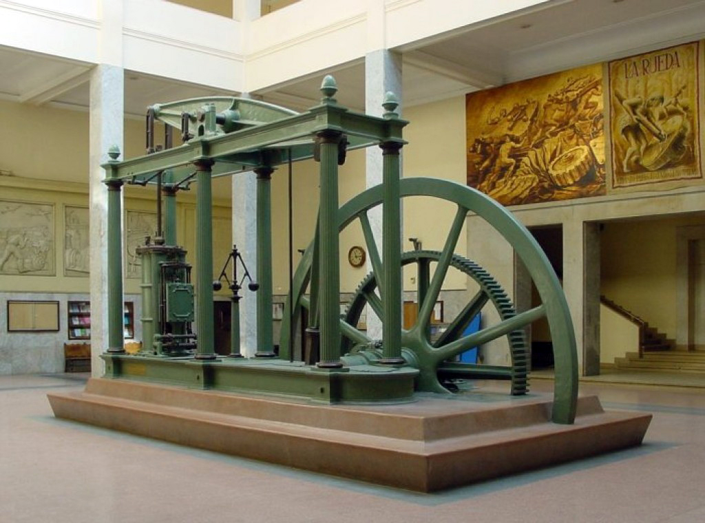

.caption[
Fig. 3: _A Roberts loom in a weaving shed in 1835 and a Watt steam engine. (https://en.wikipedia.org/wiki/Industrial_Revolution)_ 
]

]

.pull-right-120[
# Limitation of Lineup Protocol

<br>

#### 1. Human can not evaluate lineup consisted of a large number of plots.
#### 2. Human can not evaluate a large number of lineups.
#### 3. Lineup protocol is unfriendly to vision-impaired people.
#### 4. Evaluation of lineup is high in labour cost and time consuming.

<br>

]


---

count: false

.pull-left-center-80[


.caption[
Fig. 3: _A Roberts loom in a weaving shed in 1835 and a Watt steam engine. (https://en.wikipedia.org/wiki/Industrial_Revolution)_ 
]

]

.pull-right-120[
# Limitation of Lineup Protocol

<br>

#### 1. Human can not evaluate lineup consisted of a large number of plots.
#### 2. Human can not evaluate a large number of lineups.
#### 3. Lineup protocol is unfriendly to vision-impaired people.
#### 4. Evaluation of lineup is high in labour cost and time consuming.

<br>

### **We need a "steam engine" for visual test!**

]

---

# Computer Vision Model

#### Large-scale evaluation of visual tests is not possible without the use of technology and machines. 

#### Modern **computer vision model** could be a promising solution to this problem. It is usually built on a **deep neural network** called **convolutional neural network** (CNN) `r BibOptions(max.names = 1);Citep(myBib, "fukushima_neocognitron_1982")`.


.caption[
Fig. 4: _A typical CNN with convolutional layers, pooling layers and fully-connected layers. (https://en.wikipedia.org/wiki/Convolutional_neural_network)_ 
]

---

exclude: true

# Computer Vision Model - Convolutional Layer

#### **Convolutional layers** take advantages of the hierarchical pattern in data and provide regularized versions of fully-connected layers. It downscales and transforms the image by summarising information in a small space. 

.center[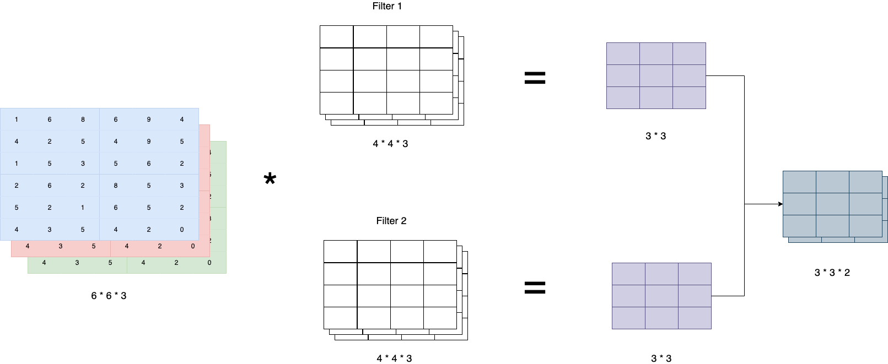]

.center[.caption[
Fig. 5: _Illustration of convolution operation with two filters._ 
]]

---

exclude: true

# Computer Vision Model - Pooling Layer

.pull-left[

<br>
<br>

#### **Pooling layers** apply non-linear down-sampling on the feature maps. This helps reducing the number of parameters in the neural network so that the problem of overfiting can be controlled. 

#### One of the most popular pooling operations is **max pooling**. It divides the feature map into several rectangle regions and takes the maximum to form a new feature map.
]


.pull-right-center[


.caption[
Fig. 6: _Illustration of max pooling operation._ 
]
]


---

exclude: true

# Computer Vision Model - Fully-connected Layer

.pull-left-center-80[


.caption[
Fig. 7: _Illustration of a fully-connected layer._ 
]
]

<br>
<br>

#### **Fully-connected layer** is building block of neural network. It peformes matrix multiplication on the inputs and the weights.

<br>

#### This layer is primarily used to process information presented in the feature maps before making the prediction. The output of the layer will be passed to a special layer called **loss layer** for computing the loss or error of the prediction.

---

# Simulation Setup - Cubic Model

#### We simulated data from two linear regression model with **non-linearity** and **heteroskedasticity** issues

--

#### The first model is a **cubic model** which can be expressed by: $$\boldsymbol{Y}= 1 + (2-c)\boldsymbol{X} + c\boldsymbol{Z} + a[(2-c)\boldsymbol{X}]^2+a(c\boldsymbol{Z})^2+b[(2-c)\boldsymbol{X}]^3+b(c\boldsymbol{Z})^3+\boldsymbol{\varepsilon},$$ where $c \in (0,2)$, $a \in (-3,3)$, $b \in (-3,3)$, $\boldsymbol{\varepsilon}\overset{iid}{\sim} N(\boldsymbol{0},\sigma^2\boldsymbol{I})$, $\boldsymbol{Y}$, $\boldsymbol{X}$ and $\boldsymbol{Z}$ are $n\times1$ matrices.

--

.pull-left[
#### $X_i$, $i=1,...,n$ follows one of the four distributions:
- $N(0, 0.09)$
- $U(-1, 1)$
- $Lognormal(0,0.36)/3 - 1$
- $-Lognormal(0,0.36)/3 + 1$

#### Most the realizations will fall between $-1$ and $1$.
]

--

.pull-right[
#### $Z_i$, $i=1,...,n$ follows one of the two distributions:
- $U(-1, 1)$
- Discrete uniform distribution with $z_n$ outcomes ranged from $-1$ to $1$

#### $z_n$ is sampled from $\{z_n: 9<z_n<21 \text{ and } z_n \in \mathbb{Z} \}$.
]


<!-- #### The distribution of $Z_i$, $i=1,...,n$, has $50$% chance to be a uniform distribution ranged from $-1$ to $1$, and $50$% chance to be a discrete uniform distribution with $z_n$ outcomes simulated from a uniform distribution ranged from $-1$ to $1$. $z_n$ itself is a discrete uniform distribution with outcomes $\{x: 9<x<21 \text{ and } x \in \mathbb{Z} \}$, which defines the number of possible values $Z_i$ could take. -->

---

# Simulation Setup - Cubic Model

#### The simulated data is fitted by OLS with equation: $$\boldsymbol{Y}= \beta_0 + \beta_1\boldsymbol{X} + \beta_2\boldsymbol{Z} +\boldsymbol{u},$$ where $\boldsymbol{u} \sim N(\boldsymbol{0}, \sigma^2_u\boldsymbol{I})$.

--

#### Let $\boldsymbol{X}_a=[\boldsymbol{1},\boldsymbol{X},\boldsymbol{Z}]$ denotes the set of regressors in matrix form. Then, the **residuals** obtained from the null model are $$\boldsymbol{e} \sim N(\boldsymbol{R}_a\boldsymbol{X}_b\boldsymbol{\beta}_b, \sigma^2\boldsymbol{R}_a),$$ where $\boldsymbol{R}_a=\boldsymbol{I}-\boldsymbol{X}_a(\boldsymbol{X}_a'\boldsymbol{X}_a)^{-1}\boldsymbol{X}_a'$, $\boldsymbol{X}_b=[\boldsymbol{X}^2,\boldsymbol{Z}^2,\boldsymbol{X}^3,\boldsymbol{Z}^3]$ and $\boldsymbol{\beta}_b=(a(2-c)^2,ac^2,b(2-c)^3,bc^3)'$.

--

#### Under the null hypothesis, $\boldsymbol{e} \sim N(\boldsymbol{0}, \sigma^2\boldsymbol{R}_a)$. The **effect size** is derived as: $$ES=n^{-1}||\sigma^{-1}\boldsymbol{R}_a^{-\frac{1}{2}}\boldsymbol{R}_a\boldsymbol{X}_b\boldsymbol{\beta}_b||^2=n^{-1}\sigma^{-2}||\boldsymbol{R}_a^{\frac{1}{2}}\boldsymbol{X}_b\boldsymbol{\beta}_b||^2\approx n^{-1}\sigma^{-2}||diag(\boldsymbol{R}_a)^{\frac{1}{2}}\boldsymbol{X}_b\boldsymbol{\beta}_b||^2,$$ where $diag(\boldsymbol{R}_a)$ is the diagonal matrix constructed from the diagonal elements of $\boldsymbol{R}_a$.

---

.pull-left[
```{r}
mod <- cubic_model(a = 5, b = 10, c = 1)
mod$plot_lineup(mod$gen_lineup(300), remove_grid_line = TRUE, theme = theme_light()) + xlab("Fitted values") + ylab("Residuals")
```

.caption[
Fig. 5: _A lineup of residual plots generated with the cubic model._ 
]
]

.pull-right[
```{r}
mod <- cubic_model(-1, -1, 1, 0.5)
dat <- mod$gen(500, fit_model = TRUE)
mod$plot(dat, theme = theme_light(base_size = 10), size = 1) +
  ggtitle(glue::glue("Effect size: {round(mod$effect_size(dat), 2)}")) + xlab("Fitted values") + ylab("Residuals") -> p1

mod <- cubic_model(-2, -1, 1, 0.5)
dat <- mod$gen(500, fit_model = TRUE)
mod$plot(dat, theme = theme_light(base_size = 10), size = 1) +
  ggtitle(glue::glue("Effect size: {round(mod$effect_size(dat), 2)}")) + xlab("Fitted values") + ylab("Residuals") -> p2

mod <- cubic_model(-5, -5, 1, 0.5)
dat <- mod$gen(500, fit_model = TRUE)
mod$plot(dat, theme = theme_light(base_size = 10), size = 1) +
  ggtitle(glue::glue("Effect size: {round(mod$effect_size(dat), 2)}")) + xlab("Fitted values") + ylab("Residuals") -> p3

mod <- cubic_model(-20, -20, 1, 0.5)
dat <- mod$gen(500, fit_model = TRUE)
mod$plot(dat, theme = theme_light(base_size = 10), size = 1) +
  ggtitle(glue::glue("Effect size: {round(mod$effect_size(dat), 2)}")) + xlab("Fitted values") + ylab("Residuals") -> p4

list(p1, p2, p3, p4) %>% patchwork::wrap_plots(ncol=2)
```

.caption[
Fig. 6: _Residual plots of cubic model under different effect sizes._ 
]
]


---

# Simulation Setup - Heteroskedasticity Model

<br>

#### The second model is a heteroskedasticy model which can be expressed by: $$Y_i = 1 + X_i + \varepsilon_i, ~i = 1,...,n,$$ where $a \in \{-1,0,1\}$, $b\in (0,32)$ and $\varepsilon_i \overset{iid}{\sim} N(0,1+b(2-|a|)(X_i-a)^2)$.

--

#### $X_i$, $i=1,...,n$ follows one of the five distributions:
- $N(0, 0.09)$
- $U(-1, 1)$
- $Lognormal(0,0.36)/3 - 1$
- $-Lognormal(0,0.36)/3 + 1$
- Discrete uniform distribution

---

# Simulation Setup - Heteroskedasticity Model

#### The simulated data is fitted by OLS with equation: $$\boldsymbol{Y}= \beta_0 + \beta_1\boldsymbol{X} +\boldsymbol{u},$$ where $\boldsymbol{u} \sim N(\boldsymbol{0}, \sigma^2_u\boldsymbol{I})$.

--

#### Let $\boldsymbol{X}_a=[\boldsymbol{1},\boldsymbol{X}]$ denotes the set of regressors in matrix form. The residuals obtained from the null model are $$\boldsymbol{e} \sim N(\boldsymbol{0}, \boldsymbol{R}_a\boldsymbol{V}),$$ where $\boldsymbol{R}_a=\boldsymbol{I}-\boldsymbol{X}_a(\boldsymbol{X}_a'\boldsymbol{X}_a)^{-1}\boldsymbol{X}_a'$ and $\boldsymbol{V}$ is a diagonal matrix with $V_{ii}=1+b(2-|a|)(X_i  -  a)^2$, $i = 1,...,n$. 

--

#### The **effect size** is derived as $ES = b\sqrt{n}$.

---

.pull-left[
```{r}
mod <- heter_model(a = -1, b = 30)
mod$plot_lineup(mod$gen_lineup(300), remove_grid_line = TRUE, theme = theme_light()) + xlab("Fitted values") + ylab("Residuals")
```

.caption[
Fig. 7: _A lineup of residual plots generated with the heteroskedasticity model._ 
]
]

.pull-right[

```{r}
set.seed(10086)
mod <- heter_model(0, 1)
mod$plot(mod$gen(500, fit_model = TRUE), size = 1, theme = theme_light(base_size = 10)) + ggtitle(glue::glue("Effect size: {round(mod$effect_size(mod$gen(500)),2)}")) + xlab("Fitted values") + ylab("Residuals") -> p1
mod <- heter_model(0, 3)
mod$plot(mod$gen(500, fit_model = TRUE), size = 1, theme = theme_light(base_size = 10)) + ggtitle(glue::glue("Effect size: {round(mod$effect_size(mod$gen(500)),2)}")) + xlab("Fitted values") + ylab("Residuals") -> p2
mod <- heter_model(0, 9)
mod$plot(mod$gen(500, fit_model = TRUE), size = 1, theme = theme_light(base_size = 10)) + ggtitle(glue::glue("Effect size: {round(mod$effect_size(mod$gen(500)),2)}")) + xlab("Fitted values") + ylab("Residuals") -> p3
mod <- heter_model(0, 81)
mod$plot(mod$gen(500, fit_model = TRUE), size = 1, theme = theme_light(base_size = 10)) + ggtitle(glue::glue("Effect size: {round(mod$effect_size(mod$gen(500)),2)}")) + xlab("Fitted values") + ylab("Residuals") -> p4

list(p1, p2, p3, p4) %>% patchwork::wrap_plots(ncol=2)
```

.caption[
Fig. 8: _Residual plots of heteroskedasticity model under different effect sizes._ 
]

]

---


# Human Subject Experiments

.pull-left-center[

<br>
<br>


.caption[
Fig. 9: _Layout of the study webiste._ 
]
]

.pull-right[

#### **Two human subject experiments** are conducted to compare humans with computer vision models on the ability of reading data plots.

]

---

count: false

# Human Subject Experiments

.pull-left-center[

<br>
<br>


.caption[
Fig. 9: _Layout of the study webiste._ 
]
]

.pull-right[

#### **Two human subject experiments** are conducted to compare humans with computer vision models on the ability of reading data plots.

#### **20** lineups are given to each participant, with **10** cubic lineups and **10** heteroskedasticity lineups across different effect sizes. 


]

---

count: false

# Human Subject Experiments

.pull-left-center[

<br>
<br>


.caption[
Fig. 9: _Layout of the study webiste._ 
]
]

.pull-right[

#### **Two human subject experiments** are conducted to compare humans with computer vision models on the ability of reading data plots.

#### **20** lineups are given to each participant, with **10** cubic lineups and **10** heteroskedasticity lineups across different effect sizes. 

#### **2** out of **20** lineups are extremely easy that are used as attention checks. Participants need to pass at least one to be paid.

]

---

count: false

# Human Subject Experiments

.pull-left-center[

<br>
<br>


.caption[
Fig. 9: _Layout of the study webiste._ 
]
]

.pull-right[

#### **Two human subject experiments** are conducted to compare humans with computer vision models on the ability of reading data plots.

#### **20** lineups are given to each participant, with **10** cubic lineups and **10** heteroskedasticity lineups across different effect sizes. 

#### **2** out of **20** lineups are extremely easy that are used as attention checks. Participants need to pass at least one to be paid.

#### The same lineup will not be presented to a participant twice. Most of the lineups have **5** replicates.

]

---

count: false

# Human Subject Experiments

.pull-left-center[

<br>
<br>


.caption[
Fig. 9: _Layout of the study webiste._ 
]
]

.pull-right[

#### **Two human subject experiments** are conducted to compare humans with computer vision models on the ability of reading data plots.

#### **20** lineups are given to each participant, with **10** cubic lineups and **10** heteroskedasticity lineups across different effect sizes. 

#### **2** out of **20** lineups are extremely easy that are used as attention checks. Participants need to pass at least one to be paid.

#### The same lineup will not be presented to a participant twice. Most of the lineups have **5** replicates.

#### Participants are allowed to **select multiple plots** from a lineup. They also need to give the **reason** and the **confidence level**.


]

---

# $p$-value Estimation for Multiple Selections

#### Let $s_i , i = 1, ..., K$ be the **number of plots selected by each observer**. Then, the $p$-value of the visual test is given as: $$P(X\geq x) = \sum_{j=x}^{K}Pr(j|s_1,...,s_K).$$

--

#### The distribution of $X$ given $s_1, ...s_K$ can not be **derived trivially**, as it is a **sampling without replacement problem**. 

--

#### In practice, this distribution can be **approximated** by computer simulation.

---

# Power Estimation for Multiple Selections

<br>

#### Suppose there is a **visual test** $V_K$, where $K$ denoting the number of evaluations. 

--

<br>

#### If one evaluation is **randomly deleted** from $V_K$, the **remaining evaluations** can still be used to form **another valid visual test** $V_{K-1}$. 

--

<br>

#### Considering **all the possibilities**, $K$ different outcomes of $V_{K-1}$ can be obtained. 

--

<br>

#### Since all outcomes occur with **equal probability**, the **proportion of outcomes which reject the null hypothesis** can be used as an **estimator of the power of the visual test** $V_{K-1}$. 

---

# Power Estimation for Multiple Selections

<br>
<br>

#### Similarly, to estimate the power of the visual test $V_{K-j}$ given the evaluations of $V_{K}$, for $j < K$,

--

<br>

#### we could find all the possible combinations of $K$ elements, taken $k-j$ at a time to obtain $K\choose{K-j}$ different outcomes for $V_{K-j}$. 

--

<br>

#### The estimated power is given as $R/{K\choose{K-j}}$, where $R$ is the number of outcomes which reject the null hypothesis.

---

# Human Subject Experiment - Results


.pull-left[
#### Experiment I:
- **400** lineup evaluations
- **20** participants
]

.pull-right[
#### Experiment II:
- **880** lineup evaluations
- **44** participants
]

<br>

--


#### The estimated power is further used in fitting **quasi-binomial generalized linear models** with **natural logarithm of effect size** as the only regressor.

--


#### **Decisions** made by $K\choose{K-j}$ different outcomes of $V_{K-j}, j = 1, ..., 4$, are fitted by **binomial generalized linear models**.

---


.center[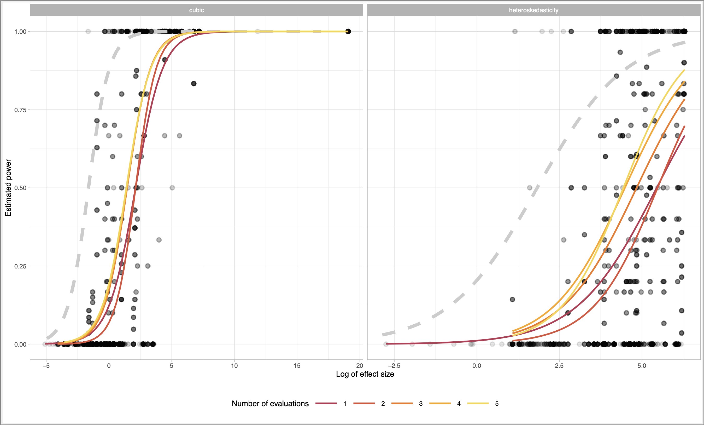

.caption[
Fig. 10: _Quasibinomial GLM fitted for estimated power for different number of evaluations. The plot on the left is for the cubic model, the plot on the right is for the heteroskedasticity model. Power curves for different number of evaluations are drawn in different colors. The dashed line is the power of the F-test and BP-test._ 
]]


---

.center[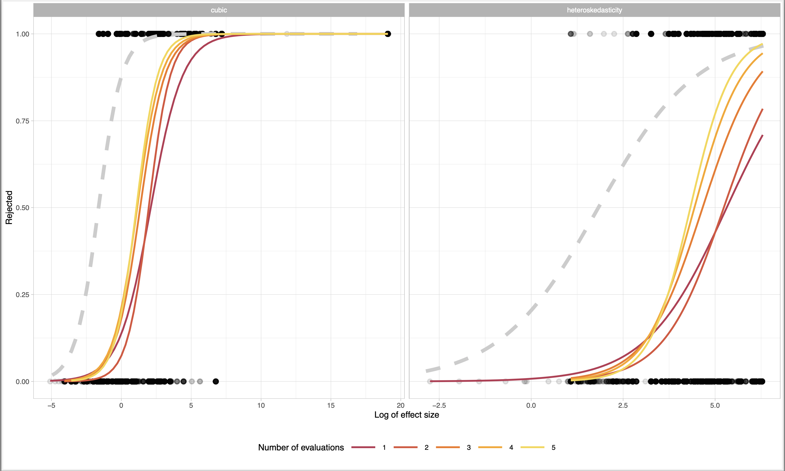

.caption[
Fig. 11: _Binomial GLM fitted for rejection for different number of evaluations. The plot on the left is for the cubic model, the plot on the right is for the heteroskedasticity model. Power curves for different number of evaluations are drawn in different colors. The dashed line is the power of the F-test and BP-test._ 
]]


---

# Human Subject Experiment - Results

#### There is a huge gap between the conventional test curves and the visual test curves when the natural logarithm of effect size is around $0$ for cubic model, and $2.5$ for heteroskedasticity model.

#### Human is hard to identify the pattern at this level of difficulty.


.pull-left[
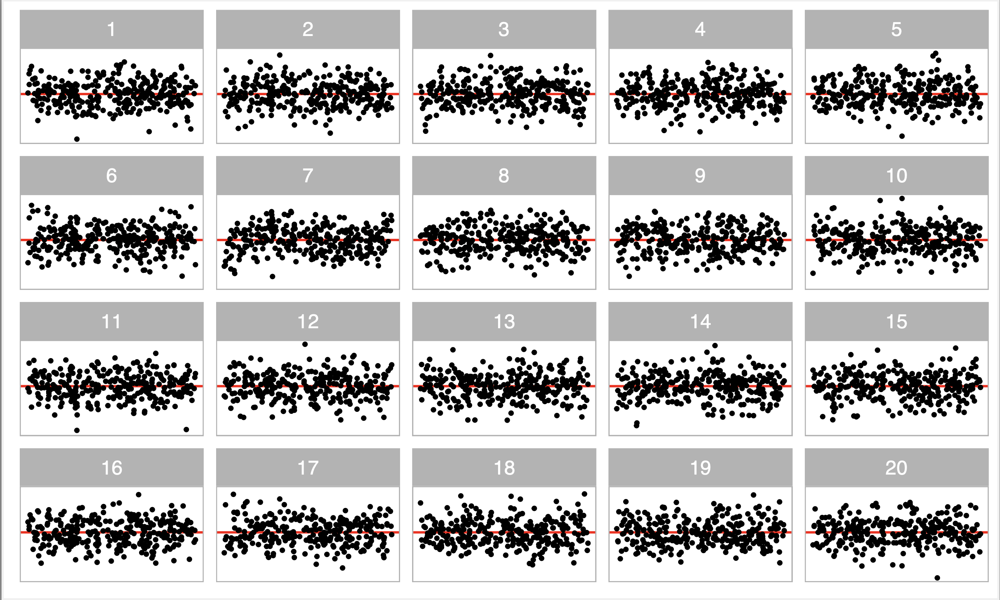

]


.pull-right[
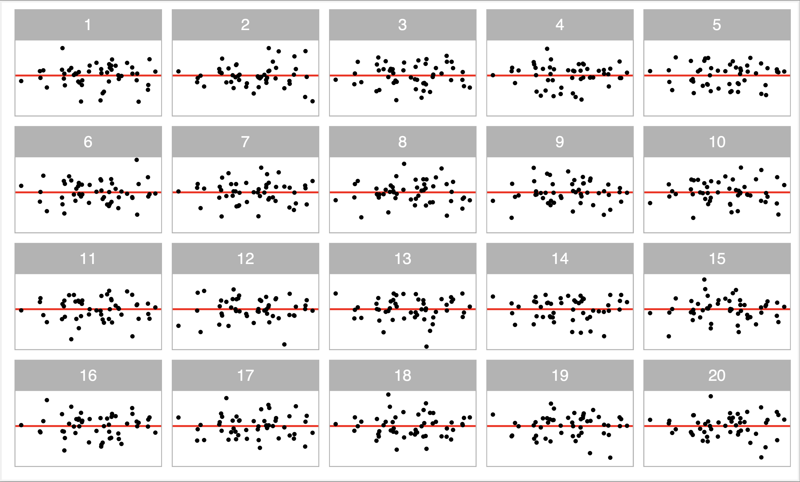

]

.center[.caption[
Fig. 12: _A cubic lineup with effect size $= 0.18$ and a heteroskedasticity lineup with effect size $= 17.5$._ 
]]

---

# Automatic Visual Inference

#### We propose a prototype **automatic visual inference system** for evaluating lineups of residual plots of classical normal linear regression. It currently only detects non-linearity and heteroskedasticity.


.center[
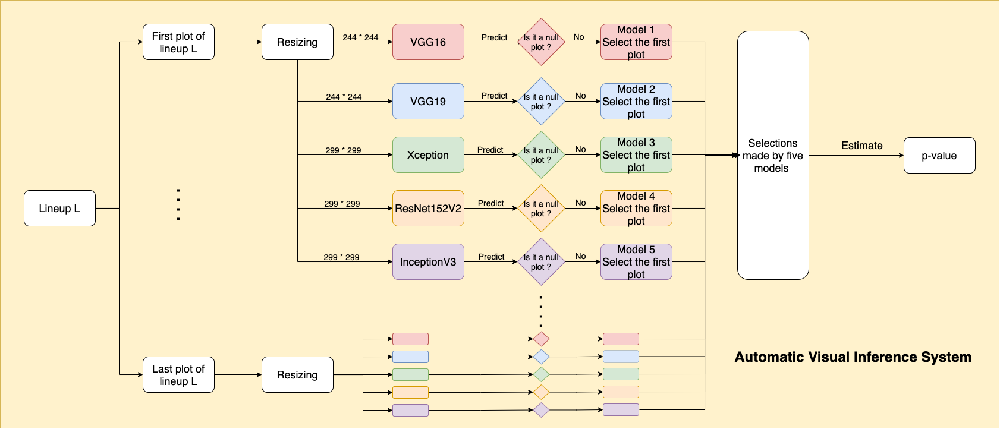

.caption[
Fig. 13: _Diagram of automatic visual inference system._ 
]]

---

# Model Architecture and Model Training

.pull-left-140[

#### Due to limited computing resources, we apply **transfer learning** `r BibOptions(max.names = 1);Citep(myBib, "weiss_survey_2016")` to train five computer vision models. 

]

.pull-right-60[
.center[

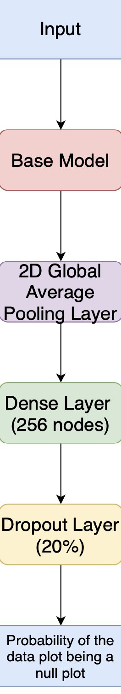

.caption[
Fig. 14: _Diagram of the transfer learning computer vision model._ 
]
]
]

---

count: false

# Model Architecture and Model Training

.pull-left-140[

#### Due to limited computing resources, we apply **transfer learning** `r BibOptions(max.names = 1);Citep(myBib, "weiss_survey_2016")` to train five computer vision models. 

#### Five **pre-trained models** are used, including **VGG16** `r BibOptions(max.names = 5);Citep(myBib, "simonyan_very_2015")`, **VGG19** `r BibOptions(max.names = 5);Citep(myBib, "simonyan_very_2015")`, **Xception** `r BibOptions(max.names = 5);Citep(myBib, "chollet_xception_2017")`, **ResNet152V2** `r BibOptions(max.names = 1);Citep(myBib, "he_identity_2016")` and **InceptionV3** `r BibOptions(max.names = 1);Citep(myBib, "szegedy_rethinking_2015")`. 

]

.pull-right-60[
.center[


.caption[
Fig. 14: _Diagram of the transfer learning computer vision model._ 
]
]
]

---

count: false


# Model Architecture and Model Training

.pull-left-140[

#### Due to limited computing resources, we apply **transfer learning** `r BibOptions(max.names = 1);Citep(myBib, "weiss_survey_2016")` to train five computer vision models. 

#### Five **pre-trained models** are used, including **VGG16** `r BibOptions(max.names = 5);Citep(myBib, "simonyan_very_2015")`, **VGG19** `r BibOptions(max.names = 5);Citep(myBib, "simonyan_very_2015")`, **Xception** `r BibOptions(max.names = 5);Citep(myBib, "chollet_xception_2017")`, **ResNet152V2** `r BibOptions(max.names = 1);Citep(myBib, "he_identity_2016")` and **InceptionV3** `r BibOptions(max.names = 1);Citep(myBib, "szegedy_rethinking_2015")`. 

#### Training: 
- $10000$ null plots and $10000$ actual data plots simulated from the cubic model and the heteroskedasticity model
- $20$% are used as validation set

]

.pull-right-60[
.center[


.caption[
Fig. 14: _Diagram of the transfer learning computer vision model._ 
]
]
]

---

count: false


# Model Architecture and Model Training

.pull-left-140[

#### Due to limited computing resources, we apply **transfer learning** `r BibOptions(max.names = 1);Citep(myBib, "weiss_survey_2016")` to train five computer vision models. 

#### Five **pre-trained models** are used, including **VGG16** `r BibOptions(max.names = 5);Citep(myBib, "simonyan_very_2015")`, **VGG19** `r BibOptions(max.names = 5);Citep(myBib, "simonyan_very_2015")`, **Xception** `r BibOptions(max.names = 5);Citep(myBib, "chollet_xception_2017")`, **ResNet152V2** `r BibOptions(max.names = 1);Citep(myBib, "he_identity_2016")` and **InceptionV3** `r BibOptions(max.names = 1);Citep(myBib, "szegedy_rethinking_2015")`. 

#### Training: 
- $10000$ null plots and $10000$ actual data plots simulated from the cubic model and the heteroskedasticity model
- $20$% are used as validation set

#### **Image augmentation**:
- **random rotation angle** ranged from $0$ to $5$ degrees
- **random brightness** ranged from $95$% to $105$%

]

.pull-right-60[
.center[


.caption[
Fig. 14: _Diagram of the transfer learning computer vision model._ 
]
]
]

---

count: false

# Model Architecture and Model Training

.pull-left-140[

#### Due to limited computing resources, we apply **transfer learning** `r BibOptions(max.names = 1);Citep(myBib, "weiss_survey_2016")` to train five computer vision models. 

#### Five **pre-trained models** are used, including **VGG16** `r BibOptions(max.names = 5);Citep(myBib, "simonyan_very_2015")`, **VGG19** `r BibOptions(max.names = 5);Citep(myBib, "simonyan_very_2015")`, **Xception** `r BibOptions(max.names = 5);Citep(myBib, "chollet_xception_2017")`, **ResNet152V2** `r BibOptions(max.names = 1);Citep(myBib, "he_identity_2016")` and **InceptionV3** `r BibOptions(max.names = 1);Citep(myBib, "szegedy_rethinking_2015")`. 

#### Training: 
- $10000$ null plots and $10000$ actual data plots simulated from the cubic model and the heteroskedasticity model
- $20$% are used as validation set

#### **Image augmentation**:
- **random rotation angle** ranged from $0$ to $5$ degrees
- **random brightness** ranged from $95$% to $105$%

#### Models are trained with **Tensorflow** and **Keras**. 

]

.pull-right-60[
.center[


.caption[
Fig. 14: _Diagram of the transfer learning computer vision model._ 
]
]
]

---

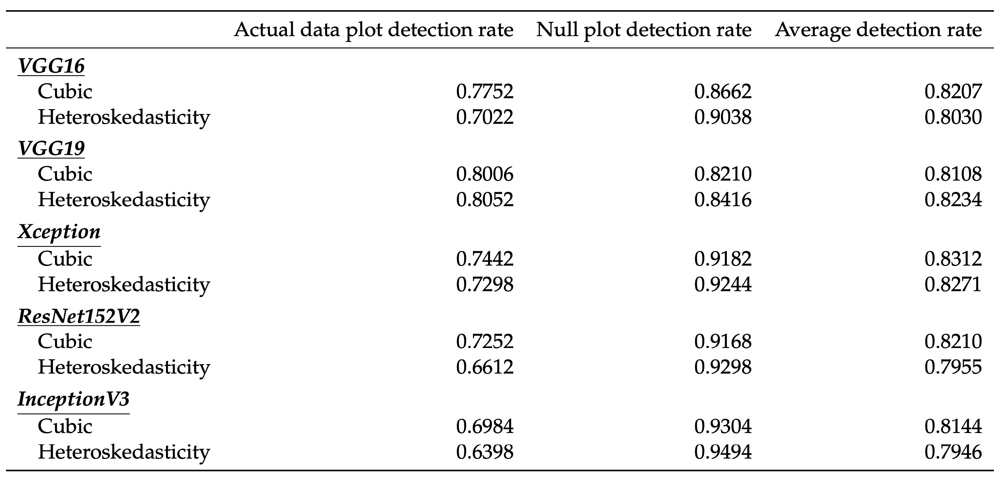

.center[.caption[
Fig. 15: _Model performance tested on 10000 null plots and 10000 actual data plots._ 
]]

---

.center[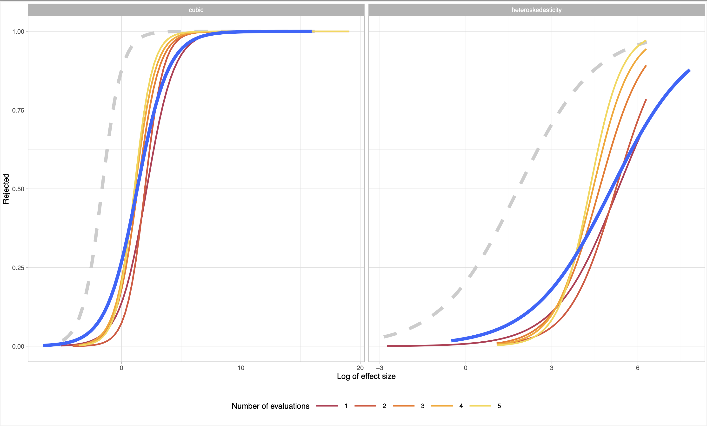

.caption[
Fig. 16: _Power of the automatic visual test compared to human visual test. The blue curve is the power of the automatic visual test. The dashed line is the power of the F-test and BP-test. The plot on the left is for cubic model, and the plot on the right is for heteroskedasticity model._ 
]]


---

.center[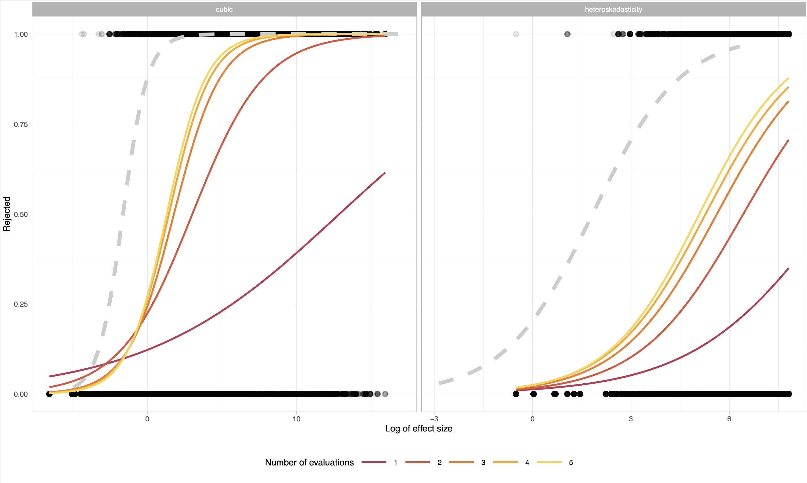

.caption[
Fig. 17: _Power of the automatic visual test with different number of evaluations. The dashed line is the power of the F-test and BP-test. The plot on the left is for cubic model, and the plot on the right is for heteroskedasticity model._ 
]]

---

# Conclusion

<br>
<br>

#### 1. Visual test is not better than conventional tests in detecting non-linearity and heteroskedasticity from residual plot of classical linear regression model.

<br>

--

#### 2. The idea of automating visual inference with computer vision models is feasible. Improvement of the automatic system still needs to be made to match the human visual test power, however.

<br>

--

#### 3. Increasing the number of computer vision models in an automatic visual inference system will result in greater statistical power. But the amount of improvement will decrease.


---

# Future work

.pull-left[
### General-Purpose Automatic Visual Statistical Inference System

#### Adopt the techniques developed in query by example content-based image retrieval to build automatic general-purpose visual inference system based on image comparison.


#### No assumption about the type of the plot and the data generating process will be made.

]

.pull-right[
### OAVIS: An online automatic visual inference system

#### Deploy the automatic visual inference as an online aplication.


#### Use online machien learning to improve system performance dynamically.
]

---

class: center, middle

# Thanks!

---

# Bibliography

Buja, A. et al. (2009). “Statistical inference for
exploratory data analysis and model diagnostics”. In:
_Philosophical Transactions of the Royal Society A:
Mathematical, Physical and Engineering Sciences_
367.1906, pp. 4361-4383. DOI:
[10.1098/rsta.2009.0120](https://doi.org/10.1098%2Frsta.2009.0120).
URL:
[https://royalsocietypublishing-org.ezproxy.lib.monash.edu.au/doi/full/10.1098/rsta.2009.0120](https://royalsocietypublishing-org.ezproxy.lib.monash.edu.au/doi/full/10.1098/rsta.2009.0120).

Chollet, F. (2017). “Xception: Deep Learning with
Depthwise Separable Convolutions”. In:
_arXiv:1610.02357 [cs]_. arXiv: 1610.02357. URL:
[http://arxiv.org/abs/1610.02357](http://arxiv.org/abs/1610.02357).

Fukushima, K. et al. (1982). “Neocognitron: A
self-organizing neural network model for a mechanism of
visual pattern recognition”. In: _Competition and
cooperation in neural nets_. Springer, pp. 267-285.

He, K. et al. (2016). “Identity Mappings in Deep
Residual Networks”. In: _arXiv:1603.05027 [cs]_. URL:
[http://arxiv.org/abs/1603.05027](http://arxiv.org/abs/1603.05027).

Simonyan, K. et al. (2015). “Very Deep Convolutional
Networks for Large-Scale Image Recognition”. In:
_arXiv:1409.1556 [cs]_. URL:
[http://arxiv.org/abs/1409.1556](http://arxiv.org/abs/1409.1556).

Szegedy, C. et al. (2015). “Rethinking the Inception
Architecture for Computer Vision”. In:
_arXiv:1512.00567 [cs]_. URL:
[http://arxiv.org/abs/1512.00567](http://arxiv.org/abs/1512.00567).

Weiss, K. et al. (2016). “A survey of transfer
learning”. En. In: _Journal of Big Data_ 3.1, p. 9.
ISSN: 2196-1115. DOI:
[10.1186/s40537-016-0043-6](https://doi.org/10.1186%2Fs40537-016-0043-6).
URL:
[http://journalofbigdata.springeropen.com/articles/10.1186/s40537-016-0043-6](http://journalofbigdata.springeropen.com/articles/10.1186/s40537-016-0043-6).


<!-- `r BibOptions(style = "markdown");PrintBibliography(myBib)` -->
