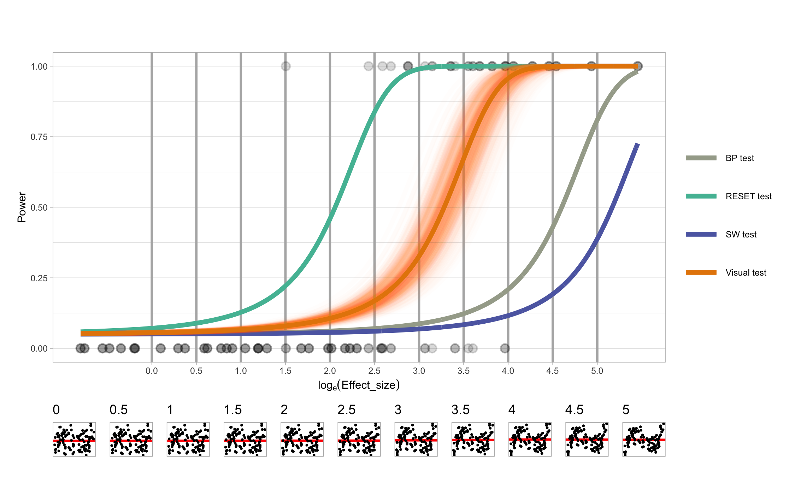

```{r setup, include=FALSE}
options(htmltools.dir.version = FALSE)
knitr::opts_chunk$set(
  fig.width=5, fig.height=5, fig.retina=3,
  out.width = "100%",
  cache = FALSE,
  echo = FALSE,
  message = FALSE, 
  warning = FALSE,
  hiline = TRUE
)
```


```{r}
set.seed(10086)
library(RefManageR)
BibOptions(check.entries = FALSE,
           bib.style = "authoryear",
           cite.style = "apa",
           style = "Bibtex",
           # max.names = 3,
           longnamesfirst = FALSE,
           hyperlink = FALSE,
           dashed = FALSE)
myBib <- ReadBib("./Visual Inference.bib", check = FALSE)
```

```{r xaringan-themer, include=FALSE, warning=FALSE}
library(xaringanthemer)
library(tidyverse)
library(visage)
style_solarized_light(
  background_color = "#FFFFFF",
  header_font_google = google_font("Josefin Sans"),
  text_font_google   = google_font("Montserrat", "300", "300i", "400i", "600"),
  code_font_google   = google_font("Fira Mono"),
  text_color = "#000000",
  text_font_size = "1.0rem",
  header_h1_font_size = "2.0rem",
  colors = c(myblue = "#006DAE", mywhite = "#FFFFFF")
)
```


count: false

<!-- need a background image -->

.pull-left-full[
<h2 class="myblue"> Advances in Artificial Intelligence for Data Visualization: Automated Reading of Residual Plots with Computer Vision </h2>

<h3 class="myblue"> Progress Review Presentation </h3>

<br>
<br>

<h4 class="myblue"> Weihao (Patrick) Li </h3>

<h4 class="myblue"> Supervised by Di Cook, Emi Tanaka and Susan VanderPlas </h3>

<!-- <h3 class="myblue"> `r format(Sys.Date(), format="%B %d, %Y")` </h3> -->
]

.pull-right[

<br>


]

---

.center[
# 📚Thesis Structure📚
]

<br>

#### **1. Exploring the application of visual inference in regression diagnostics and comparing it with conventional hypothesis tests.**

#### 2. Designing an automated visual inference system to assess lineups of residual plots of classical normal linear regression model.

#### 3. Deploying the automatic visual inference system as an online application and publishing the relevant open-source software.

<br>
<br>

This presentation will be focused on the **first project**. 

---

class: center, middle

# A Plot is Worth a Thousand Tests: Assessing Residual Diagnostics with the Lineup Protocol

#### Weihao Li, Dianne Cook, Emi Tanaka and Susan VanderPlas (2023)

---

.center[

# 🔍Regression Diagnostics🔍

]

--


**Diagnostics** are the key to determining whether there is anything **importantly wrong** with a model. **Residuals** summarise what is **not captured by the regression model**.

--

**Residual plots** are commonly used to diagnose **non-linearity** and **heteroskedasticity**. **Non-normality** is usually harder to detect from a residual plot. A favourable graphical summary for this task is the **quantile-quantile plot**.

--

<br>

.image-top-bottom-0[

```{r fig.height = 2.5, fig.width = 10}
set.seed(10086)

# Base model
mod <- poly_model(include_z = FALSE, sigma = 0.25)

# Base data
dat <- mod$gen(300)

bind_rows(
  dat %>%
    mutate(type = "(A) Good residuals"),
  mod$set_prm("include_z", TRUE)$
    gen(300, computed = select(dat, x, e)) %>%
    mutate(type = "(B) Non-linearity"),
  heter_model(b = 64)$
    gen(300, computed = select(dat, x, e)) %>%
    mutate(type = "(C) Heteroskedasticity"),
  heter_model(b = 0, e = rand_lognormal(sigma = 0.5))$
    gen(300, computed = select(dat, x)) %>%
    mutate(type = "(D) Non-normality")
) %>%
  mod$plot(remove_grid_line = TRUE, theme = theme_light(base_size = 12)) +
  facet_wrap(~type, ncol = 4, scales = "free") +
  theme(axis.text = element_blank(),
        axis.ticks = element_blank()) +
  xlab("Fitted values") +
  ylab("Residuals")
```

]


---

.center[
# 🔍Regression Diagnostics🔍
]

--

<br>
<br>

Many different **residual-based hypothesis tests** are available to detect specific model defects.

--

.pull-left-33p[

Non-linearity: 

- **F-test**

- **RESET test** (Ramsey 1969)

]

--

.pull-left-33p[

Heteroskedasticity: 


- **White test** (White 1980)

- **BP test** (Breusch and Pagan 1979)
  
]

--

.pull-left-33p[

Non-normality: 

- **SW test** (Shapiro and Wilk 1965)

- **Jarque–Bera test** (Jarque and Bera 1980)
  
]

---

.center[
# 📜Liteature of Regression Diagnostics📜
]

--

### Graphical approaches (plots) are the recommended methods for diagnosing model fits. 

--

- Draper and Smith (1998) and Belsley, Kuh, and Welsch (1980):
> Residual plots are usually revealing when the assumptions are violated.

--

- Cook and Weisberg (1982):
> Formal tests and graphical procedures are complementary and both have a place in residual analysis, but graphical methods are easier to use.

--

- Montgomery and Peck (1982):
> Residual plots are more informative in most practical situations than the corresponding conventional hypothesis tests.

---

.center[

# 🔍Motivation and Research Questions🔍

]

<br>
<br>

#### Regression experts **consistently recommend plotting residuals for regression diagnostics**, despite the existence of numerous hypothesis test procedures. 

#### We would like to **provide evidence** for why this is good advice, using data from a **visual inference experiment**.

#### We would also want to show how **visual inference** can be used to yield reliable and consistent reading of residual plots for better regression diagnostics.

---

.center[
# 🤔False Visual Discoveries🤔
]

.pull-left-center[

.image-top-bottom-0[

```{r}
set.seed(10131)
mod <- heter_model(b = 0, x = rand_lognormal())
ori_dat <- mod$gen(300)

ori_dat %>%
  VI_MODEL$plot(theme = theme_light(base_size = 12)) +
  xlab("Fitted values") +
  ylab("Residuals")
```

]

]

--

.pull-right[

<br>
<br>

Can you find the **evidence** on heteroskedasticity?

]

---

count: false

.center[
# 🤔False Visual Discoveries🤔
]

.pull-left-center[

.image-top-bottom-0[

```{r}
set.seed(10131)
mod <- heter_model(b = 0, x = rand_lognormal())
ori_dat <- mod$gen(300)

ori_dat %>%
  VI_MODEL$plot(theme = theme_light(base_size = 12)) +
  xlab("Fitted values") +
  ylab("Residuals")
```

]

]

.pull-right[

<br>
<br>

Can you find the **evidence** on heteroskedasticity?

- Vertical spread of the points varies with the fitted values.

]

---

count: false

.center[
# 🤔False Visual Discoveries🤔
]

.pull-left-center[

.image-top-bottom-0[

```{r}
set.seed(10131)
mod <- heter_model(b = 0, x = rand_lognormal())
ori_dat <- mod$gen(300)

ori_dat %>%
  VI_MODEL$plot(theme = theme_light(base_size = 12)) +
  xlab("Fitted values") +
  ylab("Residuals")
```

]

]

.pull-right[

<br>
<br>

Can you find the **evidence** on heteroskedasticity?

- Vertical spread of the points varies with the fitted values.

However, the residuals are actually obtained from a **correctly specified classical normal linear model**!

]


---

count: false

.center[
# 🤔False Visual Discoveries🤔
]

.pull-left-center[

.image-top-bottom-0[

```{r}
set.seed(10131)
mod <- heter_model(b = 0, x = rand_lognormal())
ori_dat <- mod$gen(300)

ori_dat %>%
  VI_MODEL$plot(theme = theme_light(base_size = 12)) +
  xlab("Fitted values") +
  ylab("Residuals")
```

]

]

.pull-right[

<br>
<br>

Can you find the **evidence** on heteroskedasticity?

- Vertical spread of the points varies with the fitted values.

However, the residuals are actually obtained from a **correctly specified classical normal linear model**!

**Unconfirmed** visual discoveries could result in **over or under-interpretations of the data**.

]

---

.center[
# 🔬Visual Inference🔬
]

.pull-left[

<br>

If we embed the residual plot in **a matrix of plots containing residuals simulated from the fitted model**, we will find that it is **not uncommon** for residual plots to exhibit a triangle shape.

]

.pull-right-center[

```{r}
set.seed(10131)
mod$gen_lineup(300, k = 20, pos = 8) %>%
  filter(null != FALSE) %>%
  bind_rows(ori_dat %>% mutate(k = 8, null = FALSE)) %>%
  VI_MODEL$plot_lineup(theme = theme_light(base_size = 12),
                       remove_grid_line = TRUE,
                       remove_axis = TRUE)
```

]

---

count: false

.center[
# 🔬Visual Inference🔬
]

.pull-left[

<br>

If we embed the residual plot in **a matrix of plots containing residuals simulated from the fitted model**, we will find that it is **not uncommon** for residual plots to exhibit a triangle shape.

- Please pick the **most different plot**. 

]

.pull-right-center[

```{r}
set.seed(10131)
mod$gen_lineup(300, k = 20, pos = 8) %>%
  filter(null != FALSE) %>%
  bind_rows(ori_dat %>% mutate(k = 8, null = FALSE)) %>%
  VI_MODEL$plot_lineup(theme = theme_light(base_size = 12),
                       remove_grid_line = TRUE,
                       remove_axis = TRUE)
```

]


---

count: false

.center[
# 🔬Visual Inference🔬
]

.pull-left[

<br>

If we embed the residual plot in **a matrix of plots containing residuals simulated from the fitted model**, we will find that it is **not uncommon** for residual plots to exhibit a triangle shape.

- Please pick the **most different plot**. 

- Is it plot No.8?

]

.pull-right-center[

```{r}
set.seed(10131)
mod$gen_lineup(300, k = 20, pos = 8) %>%
  filter(null != FALSE) %>%
  bind_rows(ori_dat %>% mutate(k = 8, null = FALSE)) %>%
  VI_MODEL$plot_lineup(theme = theme_light(base_size = 12),
                       remove_grid_line = TRUE,
                       remove_axis = TRUE)
```

]

---

count: false

.center[
# 🔬Visual Inference🔬
]

.pull-left[

<br>

If we embed the residual plot in **a matrix of plots containing residuals simulated from the fitted model**, we will find that it is **not uncommon** for residual plots to exhibit a triangle shape.

- Please pick the **most different plot**. 

- Is it plot No.8?

- If it is not, then the visual pattern is **over-interpreted**! You can not distinguish it from other plots!

]

.pull-right-center[

```{r}
set.seed(10131)
mod$gen_lineup(300, k = 20, pos = 8) %>%
  filter(null != FALSE) %>%
  bind_rows(ori_dat %>% mutate(k = 8, null = FALSE)) %>%
  VI_MODEL$plot_lineup(theme = theme_light(base_size = 12),
                       remove_grid_line = TRUE,
                       remove_axis = TRUE)
```

]


---

count: false

.center[
# 🔬Visual Inference🔬
]

.pull-left[

<br>

If we embed the residual plot in **a matrix of plots containing residuals simulated from the fitted model**, we will find that it is **not uncommon** for residual plots to exhibit a triangle shape.

- Please pick the **most different plot**. 

- Is it plot No.8?

- If it is not, then the visual pattern is **over-interpreted**! You can not distinguish it from other plots!

### The visual discovery is calibrated via comparison.

]

.pull-right-center[

```{r}
set.seed(10131)
mod$gen_lineup(300, k = 20, pos = 8) %>%
  filter(null != FALSE) %>%
  bind_rows(ori_dat %>% mutate(k = 8, null = FALSE)) %>%
  VI_MODEL$plot_lineup(theme = theme_light(base_size = 12),
                       remove_grid_line = TRUE,
                       remove_axis = TRUE)
```

]

---

.center[
# 🔬Visual Inference🔬
]

.pull-left[

<br>
<br>

This framework is called **visual inference** (Buja, et al. 2009).

A **lineup** consists of $m$ randomly placed plots, where one plot is the **data plot** and the remaining $m − 1$ plots (**null plots**) containing data **consistent with the null hypothesis**.

To perform a **visual test**, observer(s) will be asked to select the **most different plot(s)** from the lineup. And we check if the data plot is identified.

]

.pull-right-center[

```{r}
set.seed(10131)
mod$gen_lineup(300, k = 20, pos = 8) %>%
  filter(null != FALSE) %>%
  bind_rows(ori_dat %>% mutate(k = 8, null = FALSE)) %>%
  VI_MODEL$plot_lineup(theme = theme_light(base_size = 12),
                       remove_grid_line = TRUE,
                       remove_axis = TRUE)
```
.center[
.caption[
Fig. 4: _A lineup of 20 residual plots of a simple linear regression. (Plot No.8 is Fig.3) Can you find the most different one?_
]
]

]

---

.center[
# 🎲Simulate Residuals from the Assumed Model🎲
]

<br>

--

Data used in the $m − 1$ null plots needs to be simulated. For **classical normal linear regression model**, the **residual rotation technique** (Buja, et al. 2009) can be applied:

<br>

--


<p> 1. Generate independent random draws \(w_i, i=1,...,n\) from \(N(0, 1)\). </p>

--

<br>

<p> 2. Regress \(w\) on \(x\) and obtain the residuals \(r_i, i=1,...,n\). </p>

--

<br>

<p> 3. Rescale \(r_i\) by \(\sqrt{RSS_{old}/RSS_{new}}\) to obtain the simulated residuals, where \(RSS_{old}\) is the residual sum of square of the original regression, and \(RSS_{new}\) is the residual sum of square of the regression fitted on step 2. </p>


---

.center[
# 📈Statistical Significance📈
]

<br>

--

If we involve $K$ **independent observers** in a visual test, and show them the **same lineup**, there will be possible **dependencies** in the visual test due to **repeated evaluations** of the same lineup.

--

VanderPlas et al. (2021) addresses this by modelling the **probability of a plot $i$ being selected** from a lineup as $\theta_i$: 

$$\theta_i \sim Dirichlet(\alpha) \text{ for } i=1,...,m \text{ and } \alpha > 0.$$ 

--

- This assumes the **attractiveness distribution** of each plot.

--

The **number of times plot $i$ being selected** in $K$ evaluations is denoted as $c_i$. 

--

- In case subject $j$ makes **multiple selections**, $1/s_j$ will be added to $c_i$ instead of one, where $s_j$ is the **number of plots subject $j$ selected** for $j=1,...K$. 
- This ensures $\sum_{i}c_i=K$.

---


.center[
# 📈Statistical Significance📈
]

<br>

--

Since we are only interested in the **selections of the data plot $i$**, the **marginal model** can be simplified to a **beta-binomial model**. VanderPlas et al. (2021) derives the visual $p$-value as

$$P(C \geq c_i) = \sum_{x=c_i}^{K}{K \choose x}\frac{B(x + \alpha, K - x + (m - 1)\alpha)}{B(\alpha, (m-1)\alpha)},\text{ for } c_i \in \mathbb{Z}_0^+$$

where $B(.)$ is the beta function defined as

$$B(a, b) = \int_{0}^{1}t^{\alpha - 1}(1-t)^{b-1}dt,\text{ where } a,b>0.$$

--

We extend the equation to **non-negative real number $c_i$** by applying a linear approximation

$$
P(C \geq c_i) = P(C \geq \lceil c_i \rceil) + (\lceil c_i \rceil - c_i) P(C = \lfloor c_i \rfloor), \text{ for } c_i \in \mathbb{R}_0^+.
$$


---

.center[
# 🧪Experimental Design🧪
]

<br>
<br>

--

An experiment is conducted to investigate the difference between **conventional hypothesis testing** and **visual testing** in the application of **linear regression diagnostics**.

--

<br>

We focus on two types of residual departures - **Non-linearity** and **Heteroskedasticity**.

--

<br>

Overall, we collected **7974 evaluations** on **1152 unique lineups** performed by **443 subjects** throughout three data collection periods.

---

.center[
# 🧪Experimental Design🧪
]

**Non-linearity model**:

$$\begin{aligned} \boldsymbol{y} &= 1 + \boldsymbol{x} + \boldsymbol{z} + \boldsymbol{\varepsilon},\\ \boldsymbol{x} &= g(\boldsymbol{x}_{raw}, 1), \\ \boldsymbol{z} &= g(\boldsymbol{z}_{raw}, 1), \\ \boldsymbol{z}_{raw} &= He_j(g(\boldsymbol{x}, 2)), \end{aligned}$$
where $\boldsymbol{y}$, $\boldsymbol{x}$, $\boldsymbol{\varepsilon}$, $\boldsymbol{x}_{raw}$, $\boldsymbol{z}_{raw}$ are length $n$ vectors, $He_{j}(.)$ is the $j$th-order probabilist's Hermite polynomials, $\varepsilon \sim N(\boldsymbol{0}, \sigma^2\boldsymbol{I}_n)$, and $g(\boldsymbol{x}, k)$ is a scaling function to enforce the support of the random vector to be $[-k, k]^n$ defined as

$$g(\boldsymbol{x}, k) = (\boldsymbol{x} - min(\boldsymbol{x}))/max(\boldsymbol{x} - min(\boldsymbol{x}))2k - k, \text{ for }  k > 0. $$

The null regression model used to fit the realizations generated by the above model is formulated as

$$\boldsymbol{y} = \beta_0 + \beta_1 \boldsymbol{x} + \boldsymbol{u},$$

where $\boldsymbol{u} \sim N(\boldsymbol{0}, \sigma^2\boldsymbol{I}_n)$.

---


.center[
# 🧪Experimental Design🧪
]

**Heteroskedasticity model**:

$$\begin{aligned} \label{eq:heter-model} \boldsymbol{y} &= 1 + \boldsymbol{x} + \boldsymbol{\varepsilon},\\ \boldsymbol{x} &= g(\boldsymbol{x}_{raw}, 1),\\ \boldsymbol{\varepsilon} &\sim N(\boldsymbol{0}, 1 + (2 - |a|)(\boldsymbol{x} - a)^2b \boldsymbol{I}), \end{aligned}$$

where $\boldsymbol{y}$, $\boldsymbol{x}$, $\boldsymbol{x}_{raw}$, $\boldsymbol{\varepsilon}$ are length $n$ vectors and $g(.)$ is the scaling function defined in the previous slide.


The null regression model is also provided in the previous slide.

---

```{r}
magick::image_read_pdf("images/different-shape-of-herimite-1.pdf", pages = 1)
magick::image_read_pdf("images/different-sigma-1.pdf", pages = 1)
```

---

.image-center[

```{r out.width = "80%", fig.height = 2.67, fig.width = 8}
set.seed(10086)

stand_dist <- function(x) (x - min(x))/max(x - min(x)) * 2 - 1

a_labels <- c("left-triangle (a = -1)", "butterfly (a = 0)", "right-triangle (a = 1)")

# Generate data for a = -1
dat_a_n1 <- heter_model(a = -1, 
                        x = {
                          raw_x <- rand_uniform(-1, 1);
                          closed_form(~stand_dist(raw_x))
                          },
                        b = 128)$gen(300) %>%
  mutate(a = a_labels[1])

# Generate data for other a
map(c(0, 1), function(a) {
  heter_model(a = a,
              x = {
                raw_x <- rand_uniform(-1, 1); 
                closed_form(~stand_dist(raw_x))
                }, 
              b = 128)$
    gen(300, computed = select(dat_a_n1, x, e)) %>%
    mutate(a = a_labels[a + 2])
}) %>%
  
  # Combined with data for a = -1
  bind_rows(dat_a_n1) %>%
  mutate(a = factor(a, levels = a_labels)) %>%
  VI_MODEL$plot(remove_axis = TRUE, remove_grid_line = TRUE, theme = theme_light()) +
  facet_wrap(~a, scales = "free", ncol = 3) +
  xlab("Fitted values") +
  ylab("Residuals")
```

]

```{r}
magick::image_read_pdf("images/different-b-1.pdf", pages = 1)
```


---

```{r}
magick::image_read_pdf("images/different-dist-1.pdf", pages = 1)
```

.image-center[

```{r out.width = "80%"}
magick::image_read_pdf("images/different-n-1.pdf", pages = 1)
```

]


---

.center[
# 📏Effect size📏
]

--

We have chosen to use an approach based on **Kullback-Leibler divergence** (Kullback and Leibler 1951).

--

The effect size of the **non-linearity model** is

$$E = \frac{1}{2}\left(\boldsymbol{\mu}_z'(diag(\boldsymbol{R}\sigma^2))^{-1}\boldsymbol{\mu}_z\right),$$

where $diag(.)$ is the diagonal matrix constructed from the diagonal elements of a matrix,
$\boldsymbol{R} = \boldsymbol{I}_n - \boldsymbol{H}$ is the residual operator, $\boldsymbol{H} = \boldsymbol{X}(\boldsymbol{X}'\boldsymbol{X})^{-1}\boldsymbol{X}'$ is the hat matrix, $\boldsymbol{\mu}_z = \boldsymbol{R}\boldsymbol{Z}\boldsymbol{\beta}_z$ is the expected values of residuals with $\boldsymbol{Z}$ be any higher order terms of $\boldsymbol{X}$ leave out by the regression equation and $\boldsymbol{\beta}_z$ be the corresponding coefficients, and $\sigma^2\boldsymbol{I}$ is the assumed covariance matrix of the error term when $H_0$ is true.

--

And the effect size of the **heteroskedasticity model** is

$$E = \frac{1}{2}\left(log\frac{|diag(\boldsymbol{R}\boldsymbol{V}\boldsymbol{R}')|}{|diag(\boldsymbol{R})|} - n + tr(diag(\boldsymbol{R}\boldsymbol{V}\boldsymbol{R}')^{-1}diag(\boldsymbol{R}))\right),$$
where $\boldsymbol{V}$ is the actual covariance matrix of the error term.


---

.center[
# 💪Power of Visual Tests💪
]

--

<br>

The power of a visual test may depend on the **ability of the particular subject** (Majumder, Hofmann, and Cook 2013).

--

- We assume the **individual skill has negligible effect** to **simplify the model structure**, thereby **avoid a costly large-scale experiment** to estimate complex covariance matrices.

--

We use the **logistic regression** to estimate the power:

$$Pr(\text{reject}~H_0|H_1,E) = \Lambda\left(log\left(\frac{0.05}{0.95}\right) + \beta_1 E\right),$$

where $\Lambda(.)$ is the standard logistic function given as $\Lambda(z) = exp(z)/(1+exp(z))$. 

--

- The **effect size $E$** is the only predictor.

--


- The intercept is fixed to $log(0.05/0.95)$ so that $\hat{Pr}(\text{reject}~H_0|H_1,E = 0) = 0.05$.

---

.center[
# 🛠️Experimental Setup🛠️
]

We recruited 443 subjects from an crowd-sourcing platform called **Prolific** (Palan and Schitter 2018) throughout **three data collection periods**. 
- 160 subjects for period I
- 160 subjects for period II
- 123 subjects for period III

--

During the experiment, every subject is presented with **a block of 20 lineups**.

--

The subject is asked to:
- Select **one or more** plots that are **most different** from others.
- Provide **a reason** for their selections.
- Evaluate **how different** they think the selected plots are from others. 

--

If there is **no noticeable difference** between plots in a lineup, subjects are permitted to **select zero plots** without providing the reason.

--

A subject’s submission is only accepted if the data plot is identified for **at least one attention check**.

---

.center[
# 🌐Study Website🌐
]

.image-center[

```{r out.width = "90%"}
knitr::include_graphics("images/lineup1.png")
```

]

---

class: center, middle

# ⚖️Results - Power Comparison of the Tests⚖️


---

### Non-linearity Patterns

.image-top-bottom-0[

.image-center[

```{r out.width = "80%"}

```

]

]

---

### Heteroskedasticity Patterns

.image-top-bottom-0[

.image-center[

```{r out.width = "80%"}
knitr::include_graphics("images/heterpower-1.png")
```

]

]

---

.center[
# ⚖️Results - Power Comparison of the Tests⚖️

]

.pull-left[

<br>
<br>

The data plot (No.1) is **undistinguishable** from other plots with an extremely small effect size (\\(log_e(E) = -0.48\\)).

The non-linearity pattern is **totally undetectable**. 

However, the BP test rejects the pattern with a very small $p\text{-value} = 0.004$. In contrast, the $p\text{-value}$ produced by the visual test is $0.813$.

]

.pull-right[

```{r}

```

]

---

.center[
# ⚖️Results - Power Comparison of the Tests⚖️

]

--

Conventional tests are **more sensitive** than the visual test. This is **not necessarily a good feature** for the purposes of diagnosing model defects.

--

Visual tests:

--

- Do not require specifying the pattern **ahead of time**.

--

- Rely purely on **whether the data plot is distinguishable** from "good" residual plots.

--

- Perform **equally well** regardless of the type of residual departures.

--

- **Remove any subjective arguments** about whether a pattern is visible or not.

--

The lineup protocol provides the **calibration for detecting patterns**: that if the pattern in the data plot **can not be distinguished** from patterns in good residual plots, then **no discernible problem** with the model exists.

---

.center[
# ⚖️Results - Comparison of Test Decisions⚖️

]

The visual test rejects **less frequently** than the conventional test, and (almost) **only rejects when the conventional test does**.

.image-top-bottom-0[

.image-center[

```{r out.width = "80%"}
magick::image_read_pdf("images/p-value-comparison-1.pdf", pages = 1)
```

]

]

---

.center[
# ⚖️Results - Comparison of Test Decisions⚖️

]


.pull-left[

```{r}

```

]

.pull-right[

<br>
<br>

The data plot (No.17) displays a relatively strong heteroskedasticity pattern, and has a strong effect size (\\(log_e(E)=4.02\\)). 

This is reflected by the visual test $p\text{-value} = 0.026$. 

But the BP test $p\text{-value} = 0.056$, is slightly above the significance cutoff of $0.05$. 

Possible reasons:
- Small sample size
- Presence of a few outliers
- Others

]

---

.center[
# ⚖️Results - Effect of Amount of Non-linearity⚖️

]

The default RESET tests **under-performs significantly** in detecting the "triple-U" shape. 

To achieve a similar power as other shapes, a **higher order polynomial parameter** needs to be used for the RESET test, but this higher than the recommended value (4).

.image-top-bottom-0[

.image-center[

```{r out.width = "80%"}
magick::image_read_pdf("images/poly-power-uniform-j-1.pdf", pages = 1)
```

]

]

---

.center[
# ⚖️Results - Effect of Shape of Heteroskedasticity⚖️

]

The butterfly shape has higher power in both tests.

Curiously, the visual test has **slightly higher power** for the "left-triangle" than the "right-triangle" shape.

.image-top-bottom-0[

.image-center[

```{r out.width = "80%"}
magick::image_read_pdf("images/heter-power-uniform-a-1.pdf", pages = 1)
```

]

]

---

.center[

# ⚖️Results - Effect of Fitted Value Distributions⚖️

]

.pull-left-center-60[

<br>
<br>

Surprisingly, the fitted value distribution has produces **more variability** in the power of conventional tests than visual tests. 

**Uneven distributions** (normal and lognormal distributions) tend to yield lower power.

]

.pull-right-140[

.image-top-bottom-0[

.image-center[


```{r}

```

]

]

]

---

.center[
# 🧐Conclusion🧐
]

<br>

--

1. Conventional residual-based statistical tests are **more sensitive to weak departures** from model assumptions than visual tests as would be evaluated by humans. 

--

2. Conventional tests often reject when departures in the form of non-linearity and heteroskedasticity **are not visibly different** from null residual plots.

--

3. While conventional tests are correctly detecting the **small but real effects**, human evaluations provide a more **practical** result.

--

4. Residual plots need to be **delivered as a lineup** to enables a **careful calibration**.

--

5. Power of the conventional test are **quite sensitive** to **how the predictors are sampled**.

--

6. The **direction of heteroskedasticity** appears to affect the ability to visually detect it.

---
.center[

# ⏳Future Works⏳

]

.pull-left[
## Automatic Visual Statistical Inference System


Develop an automatic visual inference system for evaluating lineups of residual plots. 

Computer vision models will be trained on simulated data from linear models that violate classical assumptions such as linearity and homoscedasticity. 

The performance of the system will be evaluated using the data collected for the first paper.

]

.pull-right[
## OAVIS: An online automatic visual inference system

Deploy the automatic visual inference as an online application and publish relevant open-source software packages developed during the course of the research. 
]


---

.center[
# 📅Timetable📅
]


```{r}
data.frame(Date = c("April", 
                    "May",
                    "June",
                    "July",
                    "Sep",
                    "Oct",
                    "Nov",
                    "Dec",
                    "Mar",
                    "Aug"), 
           Event = c("Submit the abstract of the first paper to Australian Statistical Conference (ASC)", 
                     "Submit the first paper",
                     "Submit a poster for the first paper to Institute of Electrical and Electronics Engineers (IEEE) Visualization Conference",
                     "Leave for a month",
                     "Finalize the computer vision model",
                     "Attend the IEEE Visualization Conference",
                     "Start the web interface development",
                     "Attend the ASC",
                     "Submit the second paper",
                     "Submit thesis")) %>%
  kableExtra::kable(booktabs = TRUE) %>%
  kableExtra::group_rows("2023", 1, 8) %>%
  kableExtra::group_rows("2024", 9, 10)
```

---

class: center, middle

# Thanks!

---

.center[
# 📖Bibliography📖
]

.font-70-p[

Belsley, David A, Edwin Kuh, and Roy E Welsch. 1980. Regression diagnostics: Identifying influential data and sources of collinearity. John Wiley & Sons.

Breusch, T. S., and A. R. Pagan. 1979. “A Simple Test for Heteroscedasticity and Random Coefficient Variation.” Econometrica 47 (5): 1287–1294.

Buja, Andreas, Dianne Cook, Heike Hofmann, Michael Lawrence, Eun-Kyung Lee, Deborah F. Swayne, and Hadley Wickham. 2009. “Statistical inference for exploratory data analysis and model diagnostics.” Philosophical Transactions of the Royal Society A: Mathematical, Physical and Engineering Sciences 367 (1906): 4361–4383.


Cook, R Dennis, and Sanford Weisberg. 1982. Residuals and influence in regression. New York: Chapman and Hall.

Cook, R Dennis, and Sanford Weisberg. 1999. Applied regression including computing and graphics. John Wiley & Sons.


Draper, Norman R, and Harry Smith. 1998. Applied regression analysis. Vol. 326. John Wiley & Sons.

Jarque, Carlos M, and Anil K Bera. 1980. “Efficient tests for normality, homoscedasticity and serial independence of regression residuals.” Economics letters 6 (3): 255–259.

Kullback, Solomon, and Richard A Leibler. 1951. “On information and sufficiency.” The annals
of mathematical statistics 22 (1): 79–86.

Ramsey, J. B. 1969. “Tests for Specification Errors in Classical Linear Least-Squares Regression
Analysis.” Journal of the Royal Statistical Society. Series B (Methodological) 31 (2): 350–
371.

Shapiro, Samuel Sanford, and Martin B Wilk. 1965. “An analysis of variance test for normality (complete samples).” Biometrika 52 (3/4): 591–611.

VanderPlas, Susan, Christian R ̈ottger, Dianne Cook, and Heike Hofmann. 2021. “Statistical significance calculations for scenarios in visual inference.” Stat 10 (1): e337.

White, Halbert. 1980. “A Heteroskedasticity-Consistent Covariance Matrix Estimator and a Direct Test for Heteroskedasticity.” Econometrica 48 (4): 817–838.

]
