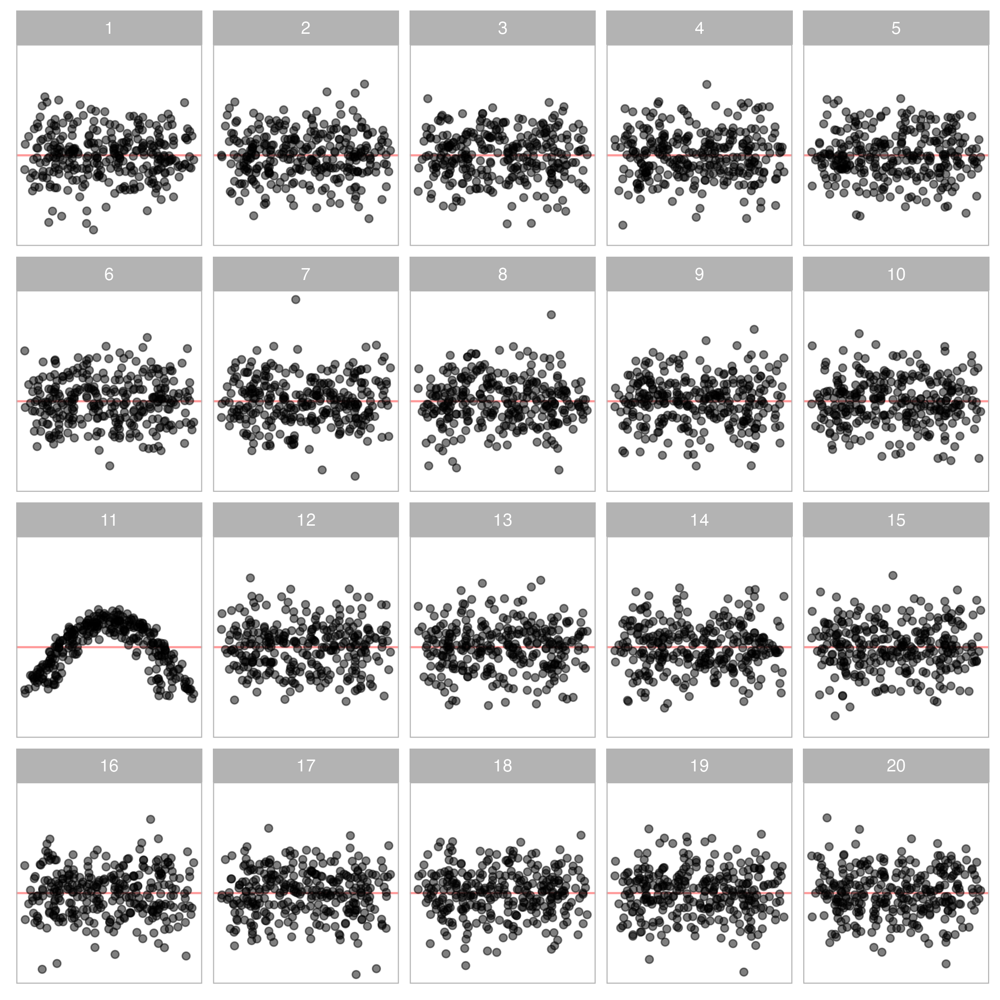

```{r setup, include=FALSE}
options(htmltools.dir.version = FALSE)
knitr::opts_chunk$set(
  fig.width=5, fig.height=5, fig.retina=3,
  out.width = "100%",
  cache = FALSE,
  echo = FALSE,
  message = FALSE, 
  warning = FALSE,
  hiline = TRUE
)
```


```{r}
library(RefManageR)
BibOptions(check.entries = FALSE,
           bib.style = "authoryear",
           cite.style = "apa",
           style = "Bibtex",
           # max.names = 3,
           longnamesfirst = FALSE,
           hyperlink = FALSE,
           dashed = FALSE)
myBib <- ReadBib("./Visual Inference.bib", check = FALSE)
```

```{r xaringan-themer, include=FALSE, warning=FALSE}
library(xaringanthemer)
library(tidyverse)
library(visage)
style_solarized_light(
  background_color = "#FFFFFF",
  header_font_google = google_font("Josefin Sans"),
  text_font_google   = google_font("Montserrat", "300", "300i"),
  code_font_google   = google_font("Fira Mono"),
  text_color = "#000000",
  text_font_size = "1.0rem",
  colors = c(myblue = "#006DAE", mywhite = "#FFFFFF")
)
```


count: false

<!-- need a backaground image -->

.pull-left-full[
<h2 class="myblue"> Advances in Artificial Intelligence for Data Visualization: Automated Reading of Residual Plots with Computer Vision </h2>

<h3 class="myblue"> Progress Review Presentation </h3>

<br>
<br>

<h3 class="myblue"> Weihao (Patrick) Li </h3>

<h3 class="myblue"> Supervised by Di Cook, Emi Tanaka and Susan VanderPlas </h3>

<!-- <h3 class="myblue"> `r format(Sys.Date(), format="%B %d, %Y")` </h3> -->
]

.pull-right[

<br>


]

---

# Thesis structure (project structure)

Mention we will focus on the first chapter. (bold the chapter text)

---

# Regression diagnostics

Why we need to perform regression diagnostics?
Available methods.

---

# Reading residual plot vs. conventional statistical testing

(Use non-linearity as the example)

How people read residual plot?
How statistical testing detect residual departures?

---

# Visual inference

What is visual inference?

Underline that it is a valid inferential framework. Highlights the difference from reading a residual plot.

---

# Integrate visual tests into regression diagnostics

(Still use non-linearity as the example)

How to perform a visual test in the context of regression diagnostics. 

Show the $p$-value by assuming the responses.


---

# Limitations of visual inference

Discuss the limitations of visual inference.

---

# Computer vision models

Briefly mention the potential solution to the problem.

---

# A compartative study

Provide the motivation and main objective of conducting such an experiment.

---

# Experiment design

Outlines the model used to simulate the experiment data.

---

# Effect size

Describe the effect size calculation.

---

# $P$-value calculation

Briefly discuss the $p$-value calculation.

---

# Power estimation

Write down the model used to estimate the power.

---

# Study website

Provide screenshots/examples of the study website.

---

# Results

Provide an overview of the collated data.

---

# Power comparison of the tests

---

# Comparison of test decisions based on $p$-values

---

# Effect of amount of non-linearity

---

# Effect of shape of heteroskedasticity

---

# Effect of fitted value distributions


---

# Timetable
