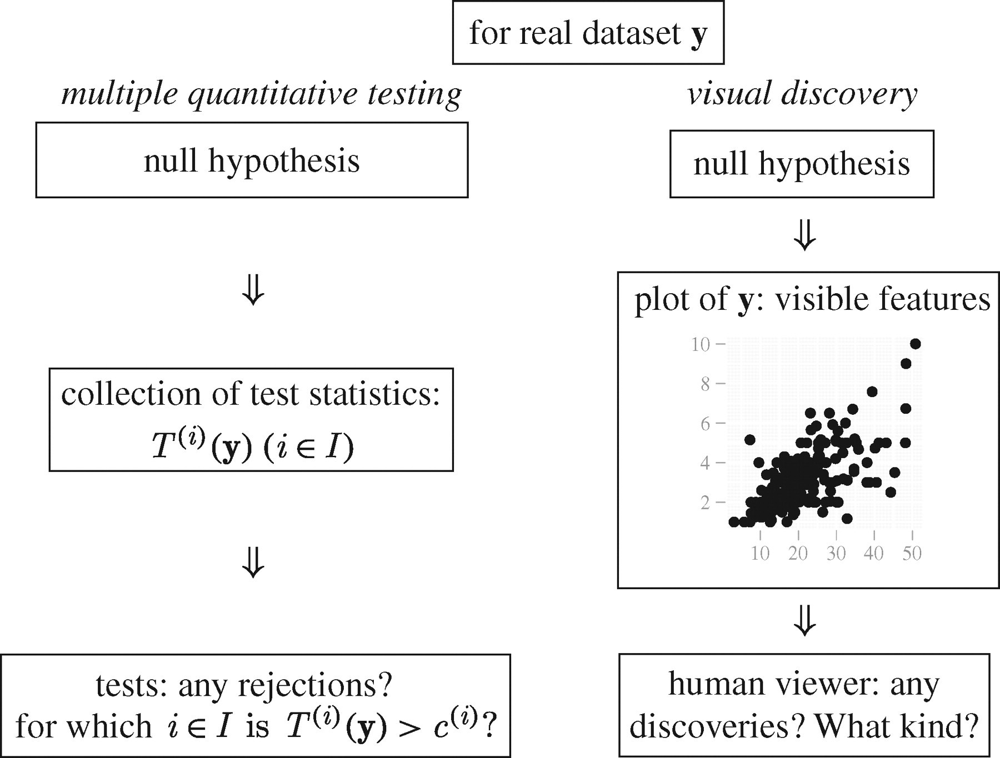
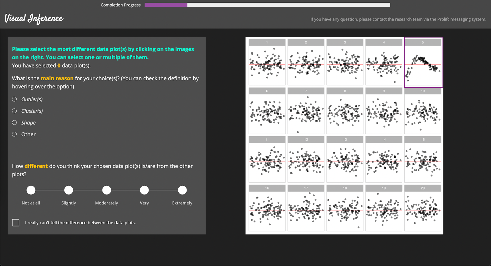

```{r setup, include=FALSE}
knitr::opts_chunk$set(echo=FALSE, message=FALSE, cache=TRUE)
# Load any R packages you need here
library(ggplot2)
```

# Introduction {#ch:intro}

## AI: Four Approaches

**Artificial intelligence** (AI) is the field of research concerned with understanding and building machines who can demonstrate intelligence. As discussed in @russell_artificial_2002, historically, there are disagreements among researchers about the definition of intelligence, which is caused by two critical questions:

<!-- [ET: don't start with a definition as that makes the narrative dull. A lot of what you are writing definitions - which is relevant - but you want to interweave this as _narrative_. Why are you defining/describing these terms/disciplines? What's relevant and exciting?] -->

1. Should AI act and think humanly or rationally? 
2. Without the thought process and reasoning, are behaviours sufficient to demonstrate intelligence?

Based on the answer to the above questions, four major approaches to pursue AI have been established. These approaches can be summarized into a two by two table as shown in Figure \@ref(fig:twodimai), where the row is "Human" vs. "Rational", and the column is "Behaviour" vs. "Thought". Positioning at the top right cell, the **rational agent approach** aims to build agent that perform mathematically perfect acts such that the best expected outcome can always be achieved. In contrast, the **"laws of thought" approach** focus on understanding the logic behind the rationality. Closely related to **cognitive science**, the **cognitive modelling approach** attempts to express theories of human cognition as computer program to mimic the thought process of human. Lastly, the **Turing test approach** is built upon the famous **Turing test** proposed by @turing_computing_1950. The test can be roughly described as, whether a human can distinguish another human from a computer with written communications only. To pass the test, several capabilities of computer are required. This includes **natural language processing** for communication with human, **knowledge representation** for encoding knowledge, **automated reasoning** for derivation of conclusions and **machine learning** for improving AI automatically through experience and data. Some researchers argued that written communication is insufficient to demonstrate intelligence, and some degree of physical simulation of a person is still necessary. One such example is the **total Turing test** proposed by @harnad_other_1991. It adds $3$ new requirements to the list, including **computer vision**, **speech recognition** and **robotics**, which are response for interactions with the physical world. Notably, all $7$ required capabilities have become major subfields of AI today. And their development has made AI one of the fastest-growing fields in the 21st century [@russell_artificial_2002].

```{r twodimai, fig.cap="Four possible approaches to pursue AI based on the two dimensions in AI research - human vs. rational and thought vs. behavior [@russell_artificial_2002]."}
ggplot() +
  geom_hline(aes(yintercept = 1), col = "grey") +
  geom_vline(aes(xintercept = 1), col = "grey") +
  geom_text(aes(x = 0.5 , y = 1.5, label = "The Turing test approach")) +
  geom_text(aes(x = 1.5 , y = 1.5, label = "The rational agent approach")) +
  geom_text(aes(x = 0.5 , y = 0.5, label = "The cognitive modelling approach")) +
  geom_text(aes(x = 1.5 , y = 0.5, label = 'The "laws of thought" approach')) +
  theme_light() +
  xlab("") +
  ylab("") +
  scale_x_continuous(breaks = c(0.5, 1.5), labels = c("Human", "Rational"), limits = c(0, 2)) +
  scale_y_continuous(breaks = c(0.5, 1.5), labels = c("Thought", "Behaviour"), limits = c(0, 2)) +
  theme(panel.grid = element_blank(), axis.ticks = element_blank())
```

With the development of AI, mature AI technologies, such as facial recognition and web recommendation system, have profoundly affected the way modern society operates and citizen's daily life. This is largely as a consequence of the huge investment in AI industry by the financial market in recent years. Further, the increasingly cheap computing cost and the massive amount of accessible e-commerce data produced in the Internet age provide the possibility for applying data-intensive AI models, which enables AI performance to reach new heights in history [@jordan_machine_2015]. Some AI systems have already been remarkably better than human in certain areas, e.g., game playing. AlphaGo and AlphaZero developed by the Google DeepMind team surpass all human Go players [@silver_general_2018].

## Predictive Modelling and Visual Diagnostics

Behind the success of AI, a great propotion of AI systems rely on the predictive modelling framework. @donoho_50_2017 in its summary of data science stated that the concept of this modelling culture could be traced back to an article written by Breiman (2001). In contrast to the generative modelling culture, which aims to develop stochastic models to make inferences about the data generating process, predictive modelling emphasizes the ability of the model to make accurate predictions. Most AI tasks are complex prediction problems where the data mechanism is mysterious, or at least, partly unknowable. @breiman_statistical_2001 suggests that generative models are obviously not applicable in these scenarios, while the predictive modelling seeks only an accurate approximated function $\boldsymbol{f}(\boldsymbol{x})$ to describe the relationship between the features $\boldsymbol{x}$ and the responses $\boldsymbol{y}$.

Predictive models are primarily evaluated by predictive accuracy with the use of validation and test data, but in predictive model diagnostics, especially model testing and tuning, data plots play an irreplaceable role. In these diagnostics, though numeric summaries are mostly available and some are even endorsed by finite or asymptotic properties, graphical representation of data is still preferred, or at least needed by researchers, due to its intuitiveness and the possibility to provide unexpected discoveries which may be abstract and unquantifiable. 

However, unlike confirmatory data analysis built upon rigorous statistical procedures, e.g., hypothesis testing, visual diagnostics relies on graphical perception - human’s ability to interpret and decode the information embedded in the graph [@cleveland_graphical_1984], which is to some extent subjective. Further, visual discovery suffers from its unsecured and unconfirmed nature where the degree of the presence of the visual features typically can not be measured quantitatively and objectively, which may lead to over or under-interpretations of the data. One such example is finding a separation between gene groups in a two-dimensional projection from a linear discriminant analysis where there is no difference in the expression levels between the gene groups [@roy_chowdhury_using_2015].

## Visual Inference

Visual inference was first introduced by @buja_statistical_2009 as an inferential framework to extend confirmatory statistics to visual discoveries. This framework redefines the test statistics, tests, null distribution, significance levels and $p$-value for visual discovery modelled on the confirmatory statistical testing. Figure \@ref(fig:parallelism) outlines the parallelism between conventional tests and visual discovery. 

{width=450 height=341}

(ref:parallelism) Parallelism between multiple quantitative testing and visual discovery [@buja_statistical_2009]. Visible features in a plot are viewed as a collection of test statistics $T^{(i)}(\boldsymbol{\mathrm{y}})~(i \in I)$, and any visual discoveries are treated as evidence against the null hypothesis.

In visual inference, a visual discovery is defined as a rejection of a null hypothesis, and the same null hypothesis can be rejected by many different visual discoveries [@buja_statistical_2009]. For model diagnostics, the null hypothesis would be the assumed model, while the visual discoveries would be any findings that are inconsistent with the null hypothesis. The same assumed model, such as classical linear regression model, can be rejected by many reasons with residual plot, including nonlinearity and heteroskedasticity as shown in Figure \@ref(fig:nonlinearityheter). 

```{r nonlinearityheter, fig.cap='Residuals vs. fitted values plot for a classical linear regression model. The residuals are produced by fitting a two-predictor multiple linear regression model with data generated from a cubic linear model. From the residual plot, "butterfly shape" can be observed which generally would be interpretd as evidence of heteroskedasticity. Further, from the outline of the shape, nonlinear patterns exist. Both visual discoveries are evidence against the null hypothesis, though heteroskedasticity actually does not exist in the data generating process.'}
library(tidyverse)

set.seed(10086)
cm <- visage::cubic_model(a = 0, b = 100, c = 1)

cm$gen(1000, fit_model = TRUE) %>%
cm$plot() +
  theme_light()
```


## Pre-specification of Visual Discoverable Features

As discussed in @buja_statistical_2009, in the practice of model diagnostics, the range of possible visual discoveries is not pre-specified. In other words, people do not explicitly specify which one or more visual features they are looking for before the read of the diagnostic plot. This is concerning since conventional hypothesis testing always requires the pre-specification of the parameter space $\Theta$ of the parameter of interest $\theta \in \Theta$ to form a valid inferential procedure. To address this issue, a collection of test statistics $T^{(i)}(\boldsymbol{\mathrm{y}})~(i \in I)$ is defined, where $\boldsymbol{\mathrm{y}}$ is the data and $\boldsymbol{I}$ is a set of all possible visual features. @buja_statistical_2009 described each of the test statistics $T^{(i)}(\boldsymbol{\mathrm{y}})$ as a measurement of the degree of presence of a visual feature. Alternatively, @majumder_validation_2013 avoids the use of visual features and defined the visual statistics $T(.)$ as a mapping from a dataset to a data plot. Both definitions of visual test statistics are valid, but in the rest of the paper the first definition will be used as it covers some details needed by the following discussion.

The size of the collection $T^{(i)}(\boldsymbol{\mathrm{y}})~(i \in I)$ depends on the size of the set $I$. Thus, if one can define $I$ comprehensively, i.e, pre-specify all the visual discoverable features, the validity issue will be solved. Unfortunately, to our knowledge, there is no such a way to list all visual features. In linear regression diagnostics, possible visual features of a residual plot may be outliers, shapes and clusters. But this is an incomplete list which does not enumerate all the visual features.

Similarly, @wilkinson_graph-theoretic_2005 proposed the work called graph theoretic scagnostics, which adopted the idea of "scagnostics" - scatter plot diagnostics from (can't find the 1984 citation). It includes 9 computable scagnostics measures defined on planar proximity graphs: "Outlying", "Convex", "Skinny", "Stringy", "Straight", "Monotonic", "Skewed", "Clumpy" and "Striated" which attempts to describe outliers, shape, density, trend and coherence of the data. This approach is inspiring but it still does not give the complete list of visual discoverable features. In fact, it is possible that such a list will never be complete as suggested in @buja_statistical_2009.

Thinking out of the box, @buja_statistical_2009 argued that there is actually no need for pre-specification of visual discoverable features. In model diagnostics, when the null hypothesis is rejected, the reasons for rejecting the hypothesis will also be known. This is because observers can not only point out the fact that visual discoveries have been found, but also describe the particular visual features they observed. Those features will correspond to the subset of the collection of visual test statistics $T^{(i)}(\boldsymbol{\mathrm{y}})~(i \in I)$ which resulted in rejection. This argument helps justifies the validity of visual inference.

## Lineup Protocol

With the validity of visual inference being justified, another aspect of hypothesis testing that needs to be addressed is the control of false positive rate or Type I error. Any visual statistic $T^{(i)}(\boldsymbol{\mathrm{y}})$ needs to pair with a critical value $c^{(i)}$ to form a hypothesis test. When a visual feature $i$ is discovered by the observer from a plot, the corresponding visual statistic $T^{(i)}(\boldsymbol{\mathrm{y}})$ may not be known as there is no general agreement on the measurement of the degree of presence of a visual feature. It is only the event that $T^{(i)}(\boldsymbol{\mathrm{y}}) > c^{(i)}$ is confirmed. Similarly, if any visual discovery is found by the observer, we say, there exists $i \in I:~T^{(i)}(\boldsymbol{\mathrm{y}}) > c^{(i)}$ [@buja_statistical_2009].

Using the above definition, the family-wise Type I error can be controlled if one can provide the collection of critical values $c^{(i)}~(i \in I)$ such that $P(\mathrm{there~exists~} i \in I: T^{(i)}(\boldsymbol{\mathrm{y}}) > c^{(i)}|\boldsymbol{\mathrm{y}}) \leq \alpha$, where $\alpha$ is the significance level. However, since the quantity of $T^{(i)}(\boldsymbol{\mathrm{y}})$ may not be known, such collection of critical values can not be provided.

@buja_statistical_2009 proposed the lineup protocol as a visual test to calibrate the Type I error issue without the specification of $c^{(i)}~(i \in I)$. It is inspired by the "police lineup" or "identity parade" which is the act of asking the eyewitness to identify criminal suspect from a group of irrelevant people. The protocol consists of $m$ randomly placed data plots, where $1$ plot is the actual data plot, and $m-1$ null plots are produced by plotting data simulate from the null distribution which is consistent with the null hypothesis. Then, an observer who have not seen the actual data plot will be asked to point out the most different plot from the lineup.

Under the null hypothesis, it is expected that the actual data plot would have no distinguishable difference with the null plots, and the probability of the observer correctly picks the actual data plot is $1/m$ due to randomness. If we reject the null hypothesis as the observer correctly picks the actual data plot, then the Type I error of this test is $1/m$.

This provides us with an mechanism to control the Type I error, because $m$ - the number of plots in a lineup can be chosen. A larger value of $m$ will result in a smaller Type I error, but the limit to the value of $m$ depends on the number of plots a human willing to view [@buja_statistical_2009]. Typically, $m$ will be set to $20$ which is equivalent to set $\alpha = 0.05$, a general choice of significance level for conventional testing among statisticians.

Further, if we involve $K$ independent observers in a visual test, and let $X$ be a random variable denoting the number of observers correctly picking the actual data plot. Then, under the null hypothesis $X \sim \mathrm{Binom}_{K,1/m}$, and therefore, the $p$-value of a lineup of size $m$ evaluated by $K$ observer is given as

$$P(X \geq x) = \sum_{i=x}^{K}{{K}\choose{i}}\left(\frac{1}{m}\right)^i\left(\frac{m-1}{m}\right)^{k-i},$$
where $x$ is the realization of number of observers correctly picking the actual data plot [@majumder_validation_2013].

The multiple individuals approach avoids the limit of $m$, while provides visual tests with $p$-value much smaller than $0.05$. In fact, the lower bound of $p$-value decreases exponentially as $K$ increases. With just $4$ individuals and $20$ data plots in a lineup, the $p$-value could be as small as $0.0001$. 

Compared to the conventional test, whose power only depends on the parameter of interest $\theta$, several studies [see @hofmann_graphical_2012; @majumder_validation_2013; @majumder_human_2014; @roy_chowdhury_using_2015; @loy_variations_2016] have shown the power of the visual test is subject-specific. Thus, to be able to account for individual's ability, an individual is required to evaluate multiple lineups [@majumder_validation_2013].  

Assumes that individuals have the same ability and a lineup has been evaluated by multiple individuals, under the alternative hypothesis, the estimated power for a lineup can be expressed as $\hat{p} = x/K$, the estimated probability of identifying the actual data plot from the lineup. If the individual skill needs to be taken into account, and $L$ lienups have been evaluated by $K$ individuals, @majumder_validation_2013 suggests that mixed effects logistic regression model can be fit as:

$$g(p_{li}) = W_{li}\delta + Z_{li}\tau_{li},$$
where $g(.)$ is the logit link function $g(p) = log(p)  - log(1-p)$; $0 \leq p \leq 1$. $W_{li}$, $1 \leq i \leq K$, $1 \leq l \leq L$, is the covariate matrix including lineup-specific elements and demographic information of individuals, and $\delta$ is a vector of parameters. $Z$ is the random effects matrix, and $\tau$ is a vector of variables follow $N(\boldsymbol{0},\sigma_{\tau}\boldsymbol{I}_{KL\times KL})$. 

Then, the estimated power for lineup $l$ and individual $i$ can be calculated as $\hat{p}_{li} = g^{-1}(W_{li}\hat{\delta} + Z_{li}\hat{\tau}_{li})$ [@majumder_validation_2013].

**null data generate mechanism** 

## Applications of Lineup Protocol

Lineup protocols are 

List applications, fields, significance here.

## Limitations of visual tests

1. infeasible in a large scale
2. unfriendly to vision-impaired people
3. high finical cost and human cost
4. time consuming

similar to Handicraft in pre-industrial society

## Automatic visual inference -> Computer vision

relieve people’s workload by automating repeating tasks, and provide standard result in a control environment

the use of technology and machinery to enable mass evaluation of visual tests

## Discussion of potential methods

### different approaches of AI

- Not aim for understanding the thought process
- Not aim for mimicking the human vision mechanism
- May be able to define distance metrics to measure difference between data plots for making mathematically prefect decisions
- May be able to use computer vision model to approximate how people evaluate lineups

computer vision model:

- Use human data to train model with human selection as target -> mimic the human behaviour
- Use simulated lineup to train model with actual data plot as target -> assume the actual data plot is the most different one
- Use simulated data plot to train model with null or not null as target -> limited to the alternatives given to the model, and Type I error can not be controlled
- Use simulated data plot to train model, then let the model evaluate each plot of a lineup -> leads to multiple selections in a lineup, and the model does not compare different plots in a lineup
  - Use a very large $m$ to ensure the null hypothesis can be rejected by a classifier slightly better than a random selector. The problem becomes how large the $m$ should be
  - Use multiple models as multiple individuals to evaluate lineup -> Which models should be used? How many models should be used?
- Let the model select multiple plots from a simulated lineup while comparing different plots in a lineup -> how to build such a system? 
  - The input is $m$ plots, what is the output? The probability of being the most different one? 
  - Then how many plots should be selected? Top 5? Or cumulative probability greater than a threshold? 
  - How to select the threshold? 

# Human Subject Exeriments (toc)


What needs to be discussed?

1. online recruitment platform (Prolific)
  - pre-screen
  - approve and reject
  - redirect
  - payment
2. study web site
  - PythonAnywhere
  - Flask, Python
  - jsPsych
  - survey
    - age
    - education
    - preferred pronoun
    - previous experience
  - training
  - 20 lineups
    - setup depends on the study
3. Cubic model
  - data generating process
  - null model
  - potential shapes
  - effect size
  - conventional test
4. Heteroskedasticity model
  - data generating process
  - null model
  - potential shapes
  - effect size
  - conventional test
4. Number of participants needed by the study
3. Study 1
  - logistic regression
    - easy
    - medium
    - hard
  - number of participants
  - time
  - countries
4. Study 2
  - logistic regression
    - easy
    - medium
    - hard
  - number of participants
  - time
  - countries
  
# Human Subject Exeriments

To collect data of human performance on reading residual plot of linear regression model with nonlinearity and heteroskedasticity defects, two human experiments were conducted. Participants of both experiments were recruited using an online platform called Prolific [@prolific_prolific_2022]. 

Prolific provides an international participant pool with the option to apply flexible pre-screening filters. In this study, we recruited $62$ participants who was fluent in English with at least $10$ previous submissions and $98$% approval rate in other Prolific studies for quality control. Further, balance sample across gender was imposed to prevent gender bias. 

In Prolific, researchers can either approve or reject submissions based on the quality of the responses. If a submission is approved by the researcher, the participant will be paid a certain amount of money per hour of time spent on the experiment. To assess the quality of the responses, two attention checks were given to each participant during the experiment, where at least one of them was required to pass for the approval of submission. 

Throughout the experiments, participants were requested to complete a short survey and evaluate 20 lineups on a website in an hour. Each lineup consists of one actual residual plot and 19 null residual plots produced by plotting null residuals simulated from the residual rotation distributions. Among the 20 lineups, there are two extremely easy lineups used as attention checks which everyone should get correct. The short survey was intended to collect information about participant that might affect their ability in reading data plot including age, highest level of education, preferred pronoun and previous experience in similar study. For the evaluation of the lineup, participant first needed to select one or multiple most different data plot(s) from the lineup by clicking the corresponding image. Then, the reason for choosing the plots needed to be provided by selecting one of the given options - "outlier(s)", "cluster(s)", "shape" and "other". Explanations about these options were provided in the training page and the mouseover text. Table \@ref(tab:lineupreason) gives the detailed explanations about these reasons. If the option "other" was selected, text input for the specified reason would be collected. Lastly, the degree of difference between their chosen data plot(s) and other data plots needed to be selected among $5$ levels - "not at all", "slightly", "moderately", "very" and "extremely". Notably, if participants could not tell the difference between the data plots, there was an option to skip the evaluation of the lineup. However, to prevent participants abusing this option, warnings were given at the beginning of the study that skipping too many lineups might lead to rejection of submission since it demonstrated clear low-effort throughout the experiment.


```{r}
data.frame(c("outlier(s)", "cluster(s)", "shape", "other"), 
           c("In a data plot, an outlier is a point that differs significantly from other points.", 
             "In a data plot, a cluster is a group of points positioned closely together. \nAnd usually, there will be gaps between different clusters.",
             "It could be any common shapes we would see in real life, like triangle shape, U-shape, butterfly shape, etc.",
             "Patricipants needs to give their reasons in the text input.")) %>%
knitr::kable(col.names = c("Reasons", "Explanations"), 
             booktabs = TRUE, 
             caption  = 'Explanations about reasons for choosing data plots from a lineup', 
             label = "lineupreason") %>%
  kableExtra::kable_styling(latex_options = c("scale_down"))
```

The study website was powered by Flask [@grinberg_flask_2018], a web framework written in Python 3 [@van_rossum_python_2009], hosted on PythonAnywhere [@pythonanywhere_pythonanywhere_2022], a web hosting service provider. Due to the limit of the storage on PythonAnywhere, lineup images needed for the website were hosted separately on Github Pages [@gtihub_github_2022-1], a static site hosting service provided by Github [@gtihub_github_2022], stored in private Github repositories. The uniform resource locator (URL) to lineup images were set to be unique random strings such that images can not be accessed by general approaches without knowing the correct URL. This avoided participants seeing the lineup beforehand. The front-end of the website was built using a JavaScript [@flanagan_javascript_2006] library jsPsych [@de_leeuw_jspsych_2015] which is specialized in creating online behavioral experiments. One of the reasons we chose to use this library was it had a modularized but highly customizable template which could record participant's response time automatically. This is essential for us to confirm the quality of the data by checking exceptionally fast or slow responses. Figure \@ref(fig:DiagramExperiment) summarizes the online experiment setup.

{width=450 height=450}

The first two pages of the website are the explanatory statement and the consent form. Participants needed to read the documents and agree with the terms to advance to the short survey. With the completion of the survey, the next page is the training page, which contained instructions on how to evaluate the lineup, give the reason and choose the confidence level. Followed by the training page, there are 20 lineups each on a single page. Figure \@ref(fig:WebsiteLayout) illustrates the layout of the website. At the end of the experiment, the participants would be redirected back to Prolific and waited for researchers' responses.

{width=550 height=299}

Next we will discuss the simulation setup for this study. The experiment data was simulated by the use of the programming language `R` [@r_core_team_r_2021]. For the ease of reproducibility, functions to build models, simulate data from models, produce lineup with data, allocate stimulis for subjects and evaluate subject responses from this study are bundled in the package `visage` with a unique object-oriented programming system built upon the environment feature of `R`. In the description of the simulation, corresponding functionalities of the package will be introduced. 

Two models were used in both experiments, which were linear models with some degree of violations of classical assumptions. Residual vs. fitted values plot were used to present the model defects.

## Cubic Model

The first model was a cubic linear model with two regressors, which can be expressed by:
\begin{equation} \label{eq:cubic}
\boldsymbol{Y}= 1 + (2-c)\boldsymbol{X} + c\boldsymbol{Z} + a[(2-c)\boldsymbol{X}]^2+a(c\boldsymbol{Z})^2+b[(2-c)\boldsymbol{X}]^3+b(c\boldsymbol{Z})^3+\boldsymbol{\varepsilon},
\end{equation}
where $c \in (0,2)$, $a \in (-3,3)$, $b \in (-3,3)$, $\boldsymbol{\varepsilon}\overset{iid}{\sim} N(\boldsymbol{0},\sigma^2\boldsymbol{I})$, $\boldsymbol{Y}$, $\boldsymbol{X}$ and $\boldsymbol{Z}$ are $n\times1$ matrices. 

This defines a cubic relationship between $\boldsymbol{Y}$, $\boldsymbol{X}$ and $\boldsymbol{Z}$. Meanwhile, to create nonlinearity defect, the null model followed the assumptions of the classical normal linear regression model (CNLRM), fitted by OLS is:
\begin{equation} \label{eq:cubic_null}
\boldsymbol{Y}=\beta_0+\beta_1\boldsymbol{X}+\beta_2\boldsymbol{Z}+\boldsymbol{u},
\end{equation}
where $\boldsymbol{u} \sim N(0,\sigma^2_u\boldsymbol{I})$.

Clearly, there will be omitted-variable bias since the null model leaves out the quadric and cubic terms. 

\begin{lemma}[Distribution of residuals produced by the cubic model] \label{lemma:cubic}
Given the data generating process in Equation (\ref{eq:cubic}), and null model in Equation (\ref{eq:cubic_null}). Let $\boldsymbol{X}_a=[\boldsymbol{1},\boldsymbol{X},\boldsymbol{Z}]$ denotes the set of regressors in matrix form. Then, the residuals obtained from the null model are $$\boldsymbol{e} \sim N(\boldsymbol{R}_a\boldsymbol{X}_b\boldsymbol{\beta}_b, \sigma^2\boldsymbol{R}_a),$$ where $\boldsymbol{R}_a=\boldsymbol{I}-\boldsymbol{X}_a(\boldsymbol{X}_a'\boldsymbol{X}_a)^{-1}\boldsymbol{X}_a'$, $\boldsymbol{X}_b=[\boldsymbol{X}^2,\boldsymbol{Z}^2,\boldsymbol{X}^3,\boldsymbol{Z}^3]$ and $\boldsymbol{\beta}_b=(a(2-c)^2,ac^2,b(2-c)^3,bc^3)'$.
\end{lemma}

\begin{proof}
Using the Frisch–Waugh–Lovell theorem, the residuals obtained by the null model are $$\boldsymbol{e}=\boldsymbol{R}_a\boldsymbol{Y}=\boldsymbol{R}_a(\boldsymbol{X}_a\boldsymbol{\beta}_a+\boldsymbol{X}_b\boldsymbol{\beta}_b+\boldsymbol{\varepsilon}),$$ where $\boldsymbol{R}_a=\boldsymbol{I}-\boldsymbol{X}_a(\boldsymbol{X}_a'\boldsymbol{X}_a)^{-1}\boldsymbol{X}_a'$, $\boldsymbol{\beta}_a=(1,2-c,c)'$, $\boldsymbol{X}_b=[\boldsymbol{X}^2,\boldsymbol{Z}^2,\boldsymbol{X}^3,\boldsymbol{Z}^3]$ and $\boldsymbol{\beta}_b=(a(2-c)^2,ac^2,b(2-c)^3,bc^3)'$. 

Because $\boldsymbol{R}_a\boldsymbol{X}_a=\boldsymbol{0}$, we have $\boldsymbol{e}=\boldsymbol{R}_a(\boldsymbol{X}_b\boldsymbol{\beta}_b+\boldsymbol{\varepsilon}).$ Since $\boldsymbol{\varepsilon} \sim N(0,\sigma^2\boldsymbol{I})$, it follows that $\boldsymbol{e} \sim N(\boldsymbol{R}_a\boldsymbol{X}_b\boldsymbol{\beta}_b, \sigma^2\boldsymbol{R}_a)$. 
\end{proof}

Lemma \@ref(lemma:cubic) shows that the expectation of the residuals is clearly a function of $\boldsymbol{X}$ and $\boldsymbol{Z}$. Hence, we would expect to see some patterns in the residual plot. Let $X_i$ and $Z_i$, $i = 1,...,n$, be independent random variables follow uniform distribution $U(-1,1)$. Given the expectation of the residuals, we could plot the expected values of residuals against the observed values. Figure \@ref(fig:cubic1), \@ref(fig:cubic2) and \@ref(fig:cubic3) illustrate the shape of residuals and their expected values under different parameter settings. 

From the Figure \@ref(fig:cubic1), it can be observed that with fixed $\sigma$ and $c$, $a$ and $b$ are controlling the 2D projection of a hypersurface, and seemingly performing some rotations along different axes. Figure \@ref(fig:cubic2) shows that with fixed $a$, $b$ and $\sigma$, $c$ is controlling the contribution of $\boldsymbol{X}$ and $\boldsymbol{Z}$ to $\boldsymbol{Y}$. If we move $c$ toward $0$ or $2$, one variable will donminate another, which will mitigate some joint effects and resemble a typical cubic function. In Figure \@ref(fig:cubic3), $a$, $b$ and $c$ is held constant, and $\sigma$ is controlling the noises around the expected values. As $\sigma$ decreases, the underlying shape shows up.

```{r cubic1, fig.cap = "cubic 1"}
library(visage)
library(tidyverse)

make_plot <- function(a, b, c, e_sigma) {
  mod <- cubic_model(a, b, c, e_sigma)
  dat <- mod$gen(1000, fit_model = TRUE)
  dat$exp <- mod$E(dat)
  mod$plot(dat, alpha = 0.3, size = 0.5, add_zero_line = FALSE, theme = theme_light(base_size = 5)) +
    geom_point(aes(.fitted, exp, col = "red"), alpha = 0.6, size = 0.1) +
    xlab("fitted values") +
    ylab("residuals") +
    ggtitle(bquote(a:.(a)~','~b:.(b)~','~c:.(c)~','~sigma:.(e_sigma))) +
    theme(legend.position = "none")
}

expand.grid(c=seq(1),
            a=seq(-1,1,1),
            b=seq(-1,1,1),
            e_sigma=c(0.5)) %>%
  arrange(a,b,c,e_sigma) %>%
  rowwise() %>%
  mutate(plots = list(make_plot(a,b,c,e_sigma))) -> result

result$plots %>% patchwork::wrap_plots(ncol=3)
```

```{r cubic2, fig.cap = "cubic 2", fig.height=1.9}
expand.grid(c=c(0,0.5,1,1.5,2),
            a=c(-1),
            b=c(1),
            e_sigma=c(0.5)) %>%
  arrange(a,b,c,desc(e_sigma)) %>%
  rowwise() %>%
  mutate(plots = list(make_plot(a,b,c,e_sigma))) -> result

result$plots %>% patchwork::wrap_plots(ncol=5)
```

```{r cubic3, fig.cap = "cubic 3", fig.height=1.9}
expand.grid(c=c(1),
            a=c(-1),
            b=c(1),
            e_sigma=c(0.25,0.5,1,2,4)) %>%
  arrange(a,b,c,desc(e_sigma)) %>%
  rowwise() %>%
  mutate(plots = list(make_plot(a,b,c,e_sigma))) -> result

result$plots %>% patchwork::wrap_plots(ncol=5)
```

The residuals used in these three figures are simulated from the cubic models built using the `cubic_model()` function from the package `visage`. `cubic_model()` is a cubic model class constructor, which takes arguments `a`, `b`, `c`, `sigma`, `x` and `z`, where the first four are numeric values defined above, and `x` and `z` are random variable instances created by the random variable abstract base class constructor `rand_var()`. 

Here, we set $\boldsymbol{X}$ and $\boldsymbol{Z}$ to be random uniform variables ranged from $-1$ to $1$. This can be done by using the random uniform variable class constructor `rand_uniform()` inherited from the random variable abstract base class. It only takes two arguments which are the lower bound and the upper bound of the support.

```{r echo = TRUE, cache = FALSE}
library(visage)
mod <- cubic_model(a = -3, b = -3, c = 1, sigma = 0.5, 
                   x = rand_uniform(-1, 1), z = rand_uniform(-1, 1))
```

An instance of cubic model class contains methods of simulating data and making residual plot. Method `mod$gen()` returns a data frame containing realizations of $X$, $Z$, $Y$ and $\varepsilon$ simulated from the model. The number of realizations depends on the integer argument `n`. In addition, if argument `fit_model = TRUE`, a null model will be fitted using the simulated data and residuals and fitted values will be included in the returned data frame.

```{r echo = TRUE, cache = FALSE}
mod$gen(n = 5, fit_model = TRUE)
```

Method `mod$plot()` produce a ggplot [@wickham_ggplot2_2011] object. It takes a data frame containing columns `.resid` and `.fitted` as input, along with a character argument `type` indicating the type of the data plot, and other aesthetic arguments such as `size` and `alpha` to control the appearance of the plot. 


```{r test3, echo = TRUE, cache = FALSE}
mod$plot(mod$gen(n = 100, fit_model = TRUE), type = "resid", size = 1)
```

Lineup can be produced by using the methods `mod$gen_lineup()` and `mod$plot_lineup()`. Method `mod$gen_lineup` takes the number of realizations `n` and the number of plots in a lineup `k` as inputs. And the method `mod$plot_lineup()` has the same user interface as `mod$plot()`.

```{r echo = TRUE, cache = FALSE}
mod$plot_lineup(mod$gen_lineup(n = 50, k = 20), type = "resid", size = 1)
```


The cubic model class also provides method to compute the expected values of residuals. Method `mod$E()` takes a data frame with columns `x` and `z` as input, and returns a vector of expected values of residuals. 

```{r echo = TRUE, cache = FALSE}
mod$E(mod$gen(n = 5))
```

Since we know that under the null hypothesis, the residual $\boldsymbol{e}\sim N(\boldsymbol{0},\sigma^2\boldsymbol{R}_a)$. Thus, the difference between the expected values $\boldsymbol{R}_a\boldsymbol{X}_b\boldsymbol{\beta}_b$ and $\boldsymbol{0}$ represents the direct impact of the parameters $a$ and $b$ on the residuals. It is expected that the larger the magnitude of the expected value relative to the variance and covariance, the easier the human to spot the patterns in the residual plot.

To obtain a measure of the impact of $a$ and $b$ on the residuals adjusted for variance and covariance, we need to address several properties of the residuals. First, the variance of the residuals $\sigma^2\boldsymbol{R}_a$ is not an identity matrix. This can be fixed by standardizing the residuals by their variance-covariance matrix. Second, the difference between $\boldsymbol{R}_a\boldsymbol{X}_b\boldsymbol{\beta}_b$ and $\boldsymbol{0}$ could be negative, which is not ideal for comparison. Thus, the magnitude needs to be squared. Third, the measure needs to be a scalar. We could apply a weighted average operator $\boldsymbol{W}$ on the transformed expected residuals to obtain a single numeric value. For simplicity, we set $\boldsymbol{W}=n^{-1}\boldsymbol{1}$. Considering the high time complexity of computing the square root of $\boldsymbol{R}_a$, off-diagonal elements of $\boldsymbol{R}_a$ are set to be zeros. This gives the effect size: $$ES=n^{-1}||\sigma^{-1}\boldsymbol{R}_a^{-\frac{1}{2}}\boldsymbol{R}_a\boldsymbol{X}_b\boldsymbol{\beta}_b||^2=n^{-1}\sigma^{-2}||\boldsymbol{R}_a^{\frac{1}{2}}\boldsymbol{X}_b\boldsymbol{\beta}_b||^2\approx n^{-1}\sigma^{-2}||diag(\boldsymbol{R}_a)^{\frac{1}{2}}\boldsymbol{X}_b\boldsymbol{\beta}_b||^2,$$ where $diag(\boldsymbol{R}_a)$ is the diagonal matrix constructed from the diagonal elements of $\boldsymbol{R}_a$.

The interpretation of this effect size is the impact of parameter $a$ and $b$ on the squared deviation of the standardized expected residual per observation. It is not directly related to the shape, or the pattern human observed from the residual plot, but it is a reasonable approximation of the degree of the visual deviation from the null residuals under our cubic model setting. Figure \@ref(fig:effectsize) shows four residual plots with different effect sizes. As effect sizes increases, the strength of the signal become stronger.

```{r effectsize, fig.cap = "Cubic model residual plots under different effect sizes. The larger the effect size, the stronger the signal."}
mod <- cubic_model(-1, -1, 1, 0.5)
dat <- mod$gen(500, fit_model = TRUE)
mod$plot(dat, theme = theme_light(base_size = 5), size = 1) +
  ggtitle(glue::glue("Effect size: {round(mod$effect_size(dat), 2)}")) -> p1

mod <- cubic_model(-2, -1, 1, 0.5)
dat <- mod$gen(500, fit_model = TRUE)
mod$plot(dat, theme = theme_light(base_size = 5), size = 1) +
  ggtitle(glue::glue("Effect size: {round(mod$effect_size(dat), 2)}")) -> p2

mod <- cubic_model(-5, -5, 1, 0.5)
dat <- mod$gen(500, fit_model = TRUE)
mod$plot(dat, theme = theme_light(base_size = 5), size = 1) +
  ggtitle(glue::glue("Effect size: {round(mod$effect_size(dat), 2)}")) -> p3

mod <- cubic_model(-20, -20, 1, 0.5)
dat <- mod$gen(500, fit_model = TRUE)
mod$plot(dat, theme = theme_light(base_size = 5), size = 1) +
  ggtitle(glue::glue("Effect size: {round(mod$effect_size(dat), 2)}")) -> p4

list(p1, p2, p3, p4) %>% patchwork::wrap_plots(ncol=2)
```

Under the cubic model setting, there is an exact conventional test for testing the nonlinearity defect, which is F-test. For F-test, the null hypothesis is $H_0:a=b=0$, and the alternative hypothesis is $H_1:\text{at least one of them} \neq 0$. During the simulation of the lineup data, the F-statistic and the p-value will be recorded for comparison between the power of conventional test and visual test.

## Heteroskedasticity Model

Another model used in the experiments was a heteroskedasticity model with one regressor, which can be expressed by: 
\begin{equation} \label{eq:heter}
Y_i = 1 + X_i + \varepsilon_i, ~i = 1,...,n,
\end{equation}
where $a \in \{-1,0,1\}$, $b\in (0,32)$ and $\varepsilon_i \overset{iid}{\sim} N(0,1+b(2-|a|)(X_i-a)^2)$.

To create heteroskedasticity defect, OLS was used to fit the null model:
\begin{equation} \label{eq:heter_null}
\boldsymbol{Y}=\beta_0+\beta_1\boldsymbol{X}+\boldsymbol{u},
\end{equation}
where $\boldsymbol{u} \sim N(\boldsymbol{0}, \sigma^2_u\boldsymbol{I})$.

In this case, estimators of $\beta_0$ and $\beta_1$ are unbiased, but the error term has non-constant variance.

\begin{lemma}[Distribution of residuals produced by the heteroskedasticity model] \label{lemma:heter}
Given the data generating process in Equation (\ref{eq:heter}) and null model in Equation (\ref{eq:heter_null}). Let $\boldsymbol{X}_a=[\boldsymbol{1},\boldsymbol{X}]$ denotes the set of regressors in matrix form. The residuals obtained from the null model are $$\boldsymbol{e} \sim N(\boldsymbol{0}, \boldsymbol{R}_a\boldsymbol{V}),$$ where $\boldsymbol{R}_a=\boldsymbol{I}-\boldsymbol{X}_a(\boldsymbol{X}_a'\boldsymbol{X}_a)^{-1}\boldsymbol{X}_a'$ and $\boldsymbol{V}$ is a diagonal matrix with $V_{ii}=1+b(2-|a|)(X_i  -  a)^2$, $i = 1,...,n$. 
\end{lemma}

\begin{proof}
Using the Frisch–Waugh–Lovell theorem, the residuals obtained by the null model are $\boldsymbol{e}=\boldsymbol{R}_a\boldsymbol{Y}=\boldsymbol{R}_a(\boldsymbol{X}_a\boldsymbol{\beta}_a+\boldsymbol{\varepsilon}),$ where $\boldsymbol{R}_a=\boldsymbol{I}-\boldsymbol{X}_a(\boldsymbol{X}_a'\boldsymbol{X}_a)^{-1}\boldsymbol{X}_a'$ and $\boldsymbol{\beta}_a=(1,1)'$.

Because $\boldsymbol{R}_a\boldsymbol{X}_a=\boldsymbol{0}$, we have $\boldsymbol{e}=\boldsymbol{R}_a\boldsymbol{\varepsilon}$. Hence, the residuals $\boldsymbol{e}$ follow $N(\boldsymbol{0}, \boldsymbol{R}_a\boldsymbol{V})$, where $\boldsymbol{V}$ is a diagonal matrix with $V_{ii}=1+b(2-|a|)(X_i  -  a)^2$, $i = 1,...,n$. 
\end{proof}

Lemma \@ref(lemma:heter) shows that variance and covariance of the residuals depend on $\boldsymbol{X}$. We could plot the one standard deviation around the residuals to indicate the region about 68% of the residuals should landed on. Figure \@ref(fig:hetershape) illustrates different shapes of residuals undder various values of $a$ and $b$. From the plot, it can be observed that if $a = 0$, the residual plot looks like the shape of butterfly. If $a = \pm 1$, it looks like a triangle, and the sign of $a$ determines the direction of the shape. Parameter $b$ is controlling the strength of the signal. As $b$ increases, the pattern becomes less noisy.

```{r hetershape, fig.height=5.25, fig.cap="test"}
make_plot2 <- function(a, b) {
  mod <- heter_model(a = a, b = b)
  dat <- mod$gen(1000, fit_model = TRUE)
  dat$one_sigma <- sqrt(1 + (2 - abs(a)) * (dat$x - a)^2 * b)
  mod$plot(dat, alpha = 0.3, size = 0.5, add_zero_line = FALSE, theme = theme_light(base_size = 5)) +
    geom_point(aes(.fitted, one_sigma, col = "red"), alpha = 0.6, size = 0.1) +
    geom_point(aes(.fitted, -one_sigma, col = "red"), alpha = 0.6, size = 0.1) +
    xlab("fitted values") +
    ylab("residuals") +
    ggtitle(bquote(a:.(a)~','~b:.(b))) +
    theme(legend.position = "none")
}


expand.grid(a = c(-1,0,1),
            b = 2^c(0,2,4)) %>%
  arrange(b,a) %>%
  rowwise() %>%
  mutate(plots = list(make_plot2(a = a, b = b))) -> results

results$plots %>% patchwork::wrap_plots(ncol=3)
```

Similar to the cubic model, the heteroskedasticity model could also be built by the heteroskedasticity model class constructor `heter_model()`. This function takes three arguments as inputs, which are `a`, `b` and `x`. `a` and `b` are numeric parameters defined in Equation (\ref{eq:heter}). `x` needs to be a random variable object.

```{r echo = TRUE}
library(visage)
mod <- heter_model(a = 0, b = 16, x = rand_uniform(-1, 1))
```

Since both the cubic model class and the heteroskedasticity class are inherited from the visual inference model class, which has defined methods of simulating data, making residual plot and producing lineup, heteroskedasticity model object can be used in a similar way as cubic model object. The following codes give examples of the use of the object.

```{r echo = TRUE}
mod$gen(5, fit_model = TRUE)
```

```{r echo = TRUE}
mod$plot(mod$gen(100, fit_model = TRUE), size = 1)
```
```{r echo = TRUE}
mod$plot_lineup(mod$gen_lineup(100), size = 1)
```
According to Lemma \ref{lemma:heter}, when $b = 0$, the matrix $\boldsymbol{V}$ collapses to an identity matrix. Assume the shape of butterfly and triangle have identical visual impacts, the only factor affects human to recognize the pattern is the strength of the signal, where parameter $a$ has no role to play. In addition, sample size has a huge impact on the chance of human recognizing the pattern. As shown in Figure \@ref(fig:hetern), as sample size increases, the pattern becomes easier to observe. However, this effect is less noticeable with large sample size as the outline of the shape has been drawn and residuals have less probability to land outside of it. Thus, the effect size of this model can be expressed by $ES = b\sqrt{n}$. The square root operator is used for addressing the large sample issue. Figure \@ref(fig:hetereffectsize) shows the effectiveness of the effect size.


```{r hetern, fig.height=1.9, fig.cap="Residuals generated from the same heteroskedasticity model but with different sample size. As sample size increases, the shape of butterfly becomes more obvious."}
mod$plot(mod$gen(10, fit_model = TRUE), size = 1, theme = theme_light(base_size = 5)) + ggtitle("n: 10") -> p1
mod$plot(mod$gen(50, fit_model = TRUE), size = 1, theme = theme_light(base_size = 5)) + ggtitle("n: 50") -> p2
mod$plot(mod$gen(100, fit_model = TRUE), size = 1, theme = theme_light(base_size = 5)) + ggtitle("n: 100") -> p3
mod$plot(mod$gen(500, fit_model = TRUE), size = 1, theme = theme_light(base_size = 5)) + ggtitle("n: 500") -> p4

list(p1, p2, p3, p4) %>% patchwork::wrap_plots(ncol=4)
```

```{r hetereffectsize, fig.cap="Residuals of heteroskedasticity model with different effect size. As effect size increases, the shape of butterfly becomes less noisy."}
set.seed(10086)
mod <- heter_model(0, 1)
mod$plot(mod$gen(500, fit_model = TRUE), size = 1, theme = theme_light(base_size = 5)) + ggtitle(glue::glue("Effect size: {round(mod$effect_size(mod$gen(500)),2)}")) -> p1
mod <- heter_model(0, 3)
mod$plot(mod$gen(500, fit_model = TRUE), size = 1, theme = theme_light(base_size = 5)) + ggtitle(glue::glue("Effect size: {round(mod$effect_size(mod$gen(500)),2)}")) -> p2
mod <- heter_model(0, 9)
mod$plot(mod$gen(500, fit_model = TRUE), size = 1, theme = theme_light(base_size = 5)) + ggtitle(glue::glue("Effect size: {round(mod$effect_size(mod$gen(500)),2)}")) -> p3
mod <- heter_model(0, 81)
mod$plot(mod$gen(500, fit_model = TRUE), size = 1, theme = theme_light(base_size = 5)) + ggtitle(glue::glue("Effect size: {round(mod$effect_size(mod$gen(500)),2)}")) -> p4

list(p1, p2, p3, p4) %>% patchwork::wrap_plots(ncol=2)
```

For the heteroskedasticity model, the conventional test we used was Breusch–Pagan test [@breusch_simple_1979], which tested whether the variance of the error terms of the regression is dependent on the regressors. @majumder_validation_2013 suggested that visual test is not expected to perform equally well as conventional test especially when there exists a exact conventional test. However, in contrast to the F-test used in the cubic model, Breusch–Pagan test is an approximate test. Thus, the power of visual test may exceed the power of Breusch–Pagan test. Throughout the study, Breusch–Pagan test statistic and p-value were recorded for comparison.

## Distribution of regressors

The model definitions given in the previous two sections does not include the specification of the regressors. In this sections, distribution of $\boldsymbol{X}$ and $\boldsymbol{Z}$ will be discussed. 

The cubic model involved the use of both $\boldsymbol{X}$ and $\boldsymbol{Z}$. In the simulation, $X_i$, $i=1,...,n$, had equal chance to follow one of the following distributions: $N(0, 0.09)$, $U(-1, 1)$, $Lognormal(0,0.36)/3 - 1$ and $-Lognormal(0,0.36)/3 + 1$. Uniform and normal distribution were symmetric and common. Adjusted lognormal distribution and adjusted negative lognormal distribution provided right-skewed and left-skewed density respectively. These distributions were chosen such that most the realizations will fall between $-1$ and $1$.

The distribution of $Z_i$, $i=1,...,n$, had $50$% chance to be a uniform distribution ranged from $-1$ to $1$, and $50$% chance to be a discrete uniform distribution with $z_n$ outcomes simulated from a uniform distribution ranged from $-1$ to $1$. $z_n$ itself was a discrete uniform distribution with outcomes $\{3,4,5,6,7,8,9,10\}$, which defined the number of possible values $Z_i$ could take. As shown in Figure \@ref(fig:discreteex), this setup would create discreteness in residual plot, which could enrich the pool of visual patterns.

```{r discreteex, fig.cap="Discreteness in residuals created by using a discrete uniform random variable as one of the regressors in a cubic model. For each residual plot of the lineup, there are three clusters because the number of possible values the regressor can take is three."}
set.seed(10093)
mod <- cubic_model(a = 2, b = -2, c = 1, z = rand_uniform_d(-1, 1, k = 3))
mod$plot_lineup(mod$gen_lineup(500), theme = theme_light(), alpha = 0.3)
```

$\boldsymbol{X}$ used in the heteroskedasticity model was a combination of $\boldsymbol{X}$ and $\boldsymbol{Z}$ used in the cubic model. It could be one of the five distributions mentioned above - normal distribution, uniform distribution, adjusted lognormal distribution, adjusted negative lognormal distribution and discrete uniform distribution. 

## Sample Size Calculation

In this study, multiple selection was allowed for the evaluation of a lineup. Given our desired significance level was $\alpha = 0.05$ and the number of plots in a lineup was $20$, a single visual test procedure needed to involve multiple evaluations. Otherwise, there would be a high chance that the $p$-value of the test was greater than $0.05$ in spite of the actual data plot was selected. The number of plots selected by a user depended on the user and the difficulty of the lineup. But according to our pilot study ran in a small group, the number would be generally smaller than $5$. Hence, a visual test consisted of $5$ lineups were sufficient to yield $p$-value smaller than $0.004$. Thus, each lineup would be replicated for $5$ times and evaluated by different participants. However, our study website was designed such that any set of lineups would be shown to only one person only once. A set of lineups consists 20 lineups generated before the start of the study. Further, whether the participant would finish the experiment was unpredictable. Therefore, some lineups only had $2$ evaluations but some had as large as $8$ evaluations. This slightly affected the estimate of the power of the visual test, which would be discussed in the (section here).

Besides, the sample size calculation was based on the difficulty of the lineup. With the data collected from the pilot study, two generalized linear model (GLM) model was developed to describe the relationship between the effect size and the detection rate. 


## Experiment I


## Experiment II


\clearpage


