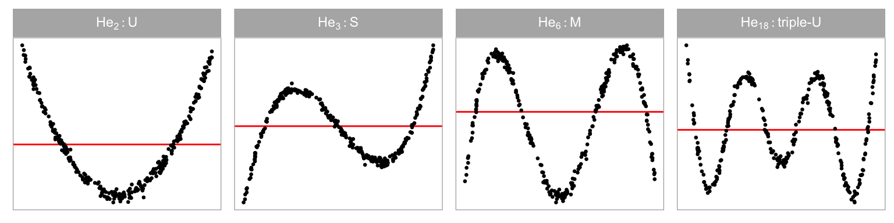
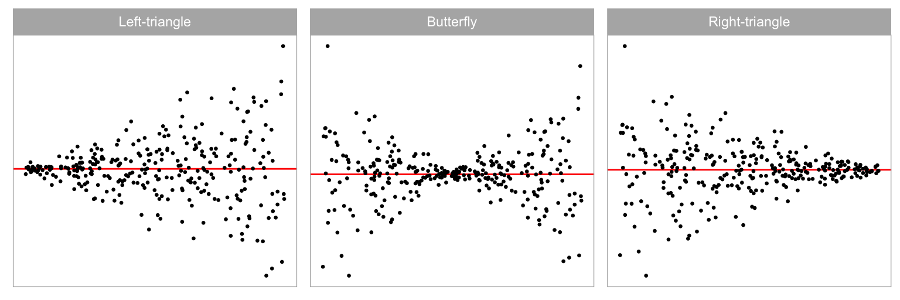
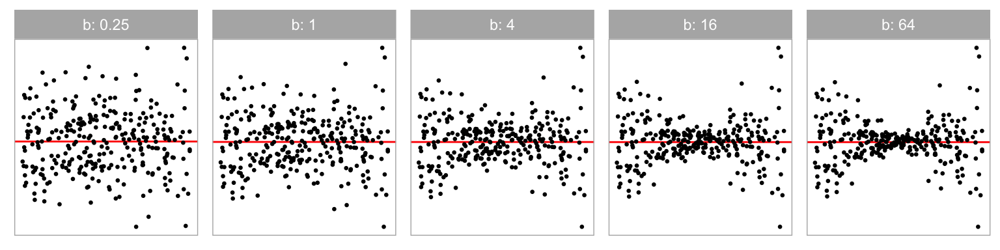
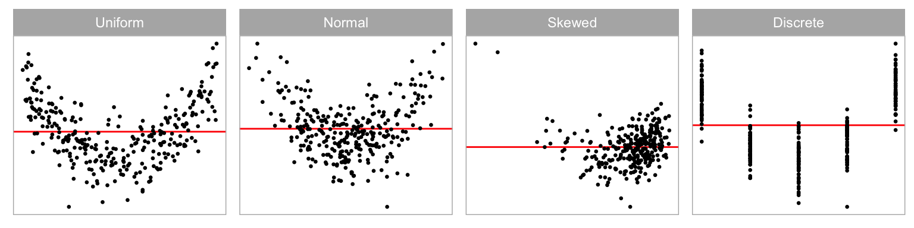

# A Plot is Worth a Thousand Tests: Assessing Residual Diagnostics with the Lineup Protocol {#sec-first-paper}

Regression experts consistently recommend plotting residuals for model diagnosis, despite the availability of many numerical hypothesis test procedures designed to use residuals to assess problems with a model fit. Here we provide evidence for why this is good advice using data from a visual inference experiment. We show how conventional tests are too sensitive, which means that too often the conclusion would be that the model fit is inadequate. The experiment uses the lineup protocol which puts a residual plot in the context of null plots. This helps generate reliable and consistent reading of residual plots for better model diagnosis. It can also help in an obverse situation where a conventional test would fail to detect a problem with a model due to contaminated data. The lineup protocol also detects a range of departures from good residuals simultaneously. Supplemental materials for the article are available online.


::: {.cell layout-align="center"}

:::

::: {.cell layout-align="center"}

:::

::: {.cell layout-align="center"}

:::

::: {.cell layout-align="center"}

:::

::: {.cell layout-align="center"}

:::


## Introduction {#sec-introduction}

> *"Since all models are wrong the scientist must be alert to what is importantly wrong."* [@box1976science]


Diagnosing a model is an important part of building an appropriate model. In linear regression analysis, studying the residuals from a model fit is a common diagnostic activity. Residuals summarise what is not captured by the model, and thus provide the capacity to identify what might be wrong. 

We can assess residuals in multiple ways. To examine the univariate distribution, residuals may be plotted as a histogram or normal probability plot. Using the classical normal linear regression model as an example, if the distribution is symmetric and unimodal, we would consider it to be well-behaved. However, if the distribution is skewed, bimodal, multimodal, or contains outliers, there would be cause for concern. We can also inspect the distribution by conducting a goodness-of-fit test, such as the Shapiro-Wilk normality test [@shapiro1965analysis].

Scatterplots of residuals against the fitted values, and each of the explanatory variables, are commonly used to scrutinize their relationships. If there are any visually discoverable associations, the model is potentially inadequate or incorrectly specified. We can also potentially discover patterns not directly connected to a linear model assumption from these residual plots, such as the discreteness or skewness of the fitted values, and outliers. To read residual plots, one looks for noticeable departures from the model such as non-linear pattern or heteroskedasticity. A non-linear pattern would suggest that the model needs to have some additional non-linear terms. Heteroskedasticity suggests that the error is dependent on the predictors, and hence violates the independence assumption. Statistical tests were developed to provide objective assessment, for example, of non-linear patterns [e.g. @ramsey1969tests], and heteroskedasticity  [e.g. @breusch1979simple]. 

The common wisdom of experts is that plotting the residuals is indispensable for diagnosing model fits [@draper1998applied; @cook1982residuals; @montgomery1982introduction]. The lack of empirical evidence for the ubiquitous advice is *curious*, and is what this article tackles. 

Additionally, relying solely on the subjective assessment of a single plot can be problematic. People will almost always see a pattern [see @kahneman2011thinking], so the question that really needs answering is whether any pattern perceived is consistent with randomness, or sampling variability, or noise. Correctly judging whether *no* pattern exists in a residual plot is a difficult task. @loy2021bringing emphasizes that this is especially difficult to teach to new analysts and students, and advocates to the broader use of the lineup protocol [@bujastatistical2009]. 

The lineup protocol places a data plot in a field of null plots, allowing for a comparison of patterns due purely by chance to what is perceived in the data plot. For residual analysis this is especially helpful for gauging whether there is *no* pattern. (@fig-first-example-lineup shows an example of a lineup of residual plots.) In its strict use, one would insist that the data plot is not seen before seeing the lineup, so that the observer does not know which is the true plot. When used this way, it provides an objective test for data plots. @majumdervalidation2013 validated that results from lineups assessed by human observers performed similarly to conventional tests. One would not use a lineup when a conventional test exists and is adequate because it is more manually expensive to conduct. However, where no adequate conventional test exists, it is invaluable, as shown by @loy2013diagnostic. Here we use the lineup as a vehicle to rigorously explore why experts advise that residual plots are indispensable despite the prevalence of numerical tests.

The paper is structured as follows. @sec-background describes the background on the types of departures that one expects to detect, and outlines a formal statistical process for reading residual plots, called visual inference. @sec-significance-calculation describes the calculation of the statistical significance and power of the test. @sec-experimental-design details the experimental design to compare the decisions made by formal hypothesis testing, and how humans would read diagnostic plots. The results are reported in @sec-results. We conclude with a discussion of the presented work, and ideas for future directions.


::: {.cell layout-align="center"}
::: {.cell-output-display}
{#fig-first-example-lineup fig-align='center' fig-pos='t!' width=100%}
:::
:::


## Background {#sec-background}


### Departures from Good Residual Plots

Graphical summaries where residuals are plotted against fitted values, or other functions of the predictors (expected to be approximately orthogonal to the residuals) are considered to be the most important residual plots by @cook1999applied. [@fig-residual-plot-common-departures]A shows an example of an ideal residual plot where points are symmetrically distributed around the horizontal zero line (red), with no discernible patterns. There can be various types of departures from this ideal pattern. Non-linearity, heteroskedasticity and non-normality, shown in [@fig-residual-plot-common-departures]B, [@fig-residual-plot-common-departures]C, and [@fig-residual-plot-common-departures]D, respectively, are three commonly checked departures. 


::: {.cell layout-align="center"}
::: {.cell-output-display}
![Example residual vs fitted value plots (horizontal line indicates 0): (A) classically good looking residuals, (B) non-linear pattern indicates that the model has not captured a non-linear association, (C) heteroskedasticity indicating that variance around the fitted model is not uniform, and (D) non-normality where the residual distribution is not symmetric around 0. The latter pattern might best be assessed using a univariate plot of the residuals, but patterns B and C need to be assessed using a residual vs fitted value plot.](02-chap2_files/figure-html/fig-residual-plot-common-departures-1.png){#fig-residual-plot-common-departures fig-align='center' fig-pos='t!' width=100%}
:::
:::


Model misspecification occurs if functions of predictors that needed to accurately describe the relationship with the response are incorrectly specified. This includes instances where a higher-order polynomial term of a predictor is wrongfully omitted. Any non-linear pattern visible in the residual plot could be indicative of this problem. An example residual plot containing visual pattern of non-linearity is shown in [@fig-residual-plot-common-departures]B. One can clearly observe the "S-shape" from the residual plot, which corresponds to the cubic term that should have been included in the model.

Heteroskedasticity refers to the presence of non-constant error variance in a regression model. It indicates that the distribution of residuals depends on the predictors, violating the independence assumption. This can be seen in a residual plot as an inconsistent spread of the residuals relative to the fitted values or predictors. An example is the "butterfly" shape  shown in [@fig-residual-plot-common-departures]C, or a "left-triangle" and "right-triangle" shape where the smallest variance occurs at one side of the horizontal axis.

[@fig-residual-plot-common-departures]D shows a scatterplot where the residuals have a skewed distribution, as seen by the uneven vertical spread. Unlike non-linearity and heteroskedasticity, non-normality is usually detected with a different type of residual plot: a histogram or a normal probability plot.  Because we focus on scatterplots, non-normality is not one of the departures examined in depth in this paper. [@loy2016variations discuss related work on non-normality checking.] 


### Conventionally Testing for Departures

Many different hypothesis tests are available to detect specific model defects. For example, the presence of heteroskedasticity can usually be tested by applying the White test [@white1980heteroskedasticity] or the Breusch-Pagan (BP) test [@breusch1979simple], which are both derived from the Lagrange multiplier test [@silvey1959lagrangian] principle that relies on the asymptotic properties of the null distribution. To test specific forms of non-linearity, one may apply the F-test as a model structural test to examine the significance of a specific polynomial and non-linear forms of the predictors, or the significance of proxy variables as in the Ramsey Regression Equation Specification Error Test (RESET) [@ramsey1969tests]. The Shapiro-Wilk (SW) normality test [@shapiro1965analysis] is the most widely used test of non-normality included by many of the statistical software programs. The Jarque-Bera test [@jarque1980efficient] is also used to directly check whether the sample skewness and kurtosis match a normal distribution.

@tbl-example-residual-plot-table displays the $p$-values from the RESET, BP and SW tests applied to the residual plots in @fig-residual-plot-common-departures. The RESET test and BP test were computed using the `resettest` and `bptest` functions from the R package `lmtest`, respectively. The SW test was computed using the `shapiro.test` from the core R package `stats`. ^[Although we did not use it, it is useful to know that the R package `skedastic` [@skedastic] also contains a large collection of functions to test for heteroskedasticity.] The RESET test requires the selection of a power parameter.  @ramsey1969tests recommends a power of four, which we adopted in our analysis. 

For residual plots in @fig-residual-plot-common-departures, we would expect the RESET test for non-linearity to reject residual plot B, the BP test for heteroskedasticity to reject the residual plot C, and the SW test for non-normality to reject residual plot D, which they all do and all tests also correctly fail to reject residual plot A. Interestingly, the BP and SW tests also reject the residual plots exhibiting structure that they were not designed for. @cook1982residuals explain that most residual-based tests for a particular departure from the model assumptions are also sensitive to other types of departures. This could be considered a Type III error [@kimball1957errors], where the null hypothesis of good residuals is correctly rejected but for the wrong reason. Also, some types of departure can have elements of other types of departure, for example, non-linearity can appear like heteroskedasticity. Additionally, other data problems such as outliers can trigger rejection (or not) of the null hypothesis [@cook1999applied]. 

With large sample sizes, hypothesis tests may reject the null hypothesis when there is only a small effect. (A good discussion can be found in @kirk1996practical.) While such rejections may be statistically correct, their sensitivity may render the results impractical. A key goal of residual plot diagnostics is to identify potential issues that could lead to incorrect conclusions or errors in subsequent analyses, but minor defects in the model are unlikely to have a significant impact and may be best disregarded for practical purposes. The experiment discussed in this paper specifically addresses this tension between statistical significance and practical significance.


::: {#tbl-example-residual-plot-table .cell layout-align="center" tbl-cap='Statistical significance testing for departures from good residuals for plots in @fig-residual-plot-common-departures. Shown are the $p$-values calculated for the RESET, the BP and the SW tests. The good residual plot (A) is judged a good residual plot, as expected, by all tests. The non-linearity (B) is detected by all tests, as might be expected given the extreme structure.'}
::: {.cell-output-display}


|Plot |Departures         |                                                RESET|                                                   BP|                                                   SW|
|:----|:------------------|----------------------------------------------------:|----------------------------------------------------:|----------------------------------------------------:|
|A    |None               |                    <span style="     " >0.779</span>|                    <span style="     " >0.133</span>|                    <span style="     " >0.728</span>|
|B    |Non-linearity      | <span style="  font-style: italic;   " >0.000</span>| <span style="  font-style: italic;   " >0.000</span>| <span style="  font-style: italic;   " >0.039</span>|
|C    |Heteroskedasticity |                    <span style="     " >0.658</span>| <span style="  font-style: italic;   " >0.000</span>| <span style="  font-style: italic;   " >0.000</span>|
|D    |Non-normality      |                    <span style="     " >0.863</span>|                    <span style="     " >0.736</span>| <span style="  font-style: italic;   " >0.000</span>|


:::
:::


### Visual Test Procedure based on Lineups {#sec-visual-test-procedure-based-on-lineups}

The examination of data plots to infer signals or patterns (or lack thereof) is fraught with variation in the human ability to interpret and decode the information embedded in a graph [@cleveland1984graphical]. In practice, over-interpretation of a single plot is common.  For instance, @roy2015using described a published example where authors over-interpreted separation between gene groups from a two-dimensional projection of a linear discriminant analysis even when there were no differences in the expression levels between the gene groups. 

One solution to over-interpretation is to examine the plot in the context of natural sampling variability assumed by the model, called the lineup protocol, as proposed in @buja2009statistical.  @majumder2013validation showed that the lineup protocol is analogous to the null hypothesis significance testing framework. The protocol consists of $m$ randomly placed plots, where one plot is the data plot, and the remaining $m - 1$ plots, referred to as the _null plots_, are constructed using the same graphical procedure as the data plot but the data is replaced with null data that is generated in a manner consistent with the null hypothesis, $H_0$. Then, an observer who has not seen the data plot is asked to point out the most different plot from the lineup. Under $H_0$, it is expected that the data plot would have no distinguishable difference from the null plots, and the probability that the observer correctly picks the data plot is $1/m$. If one rejects $H_0$ as the observer correctly picks the data plot, then the Type I error of this test is $1/m$. This protocol requires a priori specification of $H_0$ (or at least a null data generating mechanism), much like the requirement of knowing the sampling distribution of the test statistic in null hypothesis significance testing framework. 

Figure @fig-first-example-lineup is an example of a lineup protocol. If the data plot at position $6$ is identifiable, then it is evidence for the rejection of $H_0$. In fact, the actual residual plot is obtained from a misspecified regression model with missing non-linear terms. 

Data used in the $m - 1$ null plots needs to be simulated. In regression diagnostics, sampling data consistent with $H_0$ is equivalent to sampling data from the assumed model. As @buja2009statistical suggested, $H_0$ is usually a composite hypothesis controlled by nuisance parameters. Since regression models can have various forms, there is no general solution to this problem, but it sometimes can be reduced to a so called "reference distribution" by applying one of the three methods: (i) sampling from a conditional distribution given a minimal sufficient statistic under $H_0$, (ii) parametric bootstrap sampling with nuisance parameters estimated under $H_0$, and (iii) Bayesian posterior predictive sampling. The conditional distribution given a minimal sufficient statistic is the best justified reference distribution among the three [@buja2009statistical]. Under this method, the null residuals can essentially be simulated by independent drawing from  a standard normal random distribution, then regressing the draws on the predictors, and then re-scaling it by the ratio of the residual sum of square in two regressions.

The effectiveness of lineup protocol for regression analysis has been validated by @majumder2013validation under relatively simple settings with up to two predictors. Their results suggest that visual tests are capable of testing the significance of a single predictor with a similar power to a t-test, though they express that in general it is unnecessary to use visual inference if there exists a corresponding conventional test, and they do not expect the visual test to perform equally well as the conventional test. In their third experiment, where the contamination of the data violate the assumptions of the conventional test, visual test outperforms the conventional test by a large margin. This supports the use of visual inference in situations where there are no existing numerical testing procedures. Visual inference has also been integrated into diagnostics for hierarchical linear models where the lineup protocol is used to judge the assumptions of linearity, normality and constant error variance for both the level-1 and level-2 residuals [@loy2013diagnostic; -@loy2014hlmdiag; -@loy2015you].

## Calculation of Statistical Significance and Test Power {#sec-significance-calculation}


### What is Being Tested?

In diagnosing a model fit using the residuals, we are generally interested in testing whether "*the regression model is correctly specified*" ($H_0$) against the broad alternative  "*the regression model is misspecified*" ($H_a$). However, it is practically impossible to test this broad $H_0$ with conventional tests, because they need specific structure causing the departure to be quantifiable in order to be computable.  For example, the RESET test for detecting non-linear departures is formulated by fitting $y = \tau_0 + \sum_{i=1}^{p}\tau_px_p +\gamma_1\hat{y}^2 + \gamma_2\hat{y}^3 + \gamma_3\hat{y}^4 + u, ~~u \sim N(0, \sigma_u^2)$ in order to test $H_0:\gamma_1 = \gamma_2 = \gamma_3 = 0$ against $H_a: \gamma_1 \neq 0 \text{ or } \gamma_2 \neq 0 \text{ or } \gamma_3 \neq 0$. 
Similarly, the BP test is designed to specifically test $H_0:$ *error variances are all equal* ($\zeta_i=0 \text{ for } i=1,..,p$) versus the alternative $H_a:$ *that the error variances are a multiplicative function of one or more variables* ($\text{at least one } \zeta_i\neq 0$) from $e^2 = \zeta_0 + \sum_{i=1}^{p}\zeta_i x_i + u, ~ u\sim N(0,\sigma_u^2)$. 

While a battery of conventional tests for different types of departures could be applied, this is intrinsic to the lineup protocol. The lineup protocol operates as an omnibus test,  able to detect a range of departures from good residuals in a single application. 

### Statistical Significance\label{sig}

In hypothesis testing, a $p$-value is defined as the probability of observing test results at least as extreme as the observed result assuming $H_0$ is true. Conventional hypothesis tests usually have an existing method to derive or compute the $p$-value based on the null distribution. The method to estimate a $p$-value for a visual test essentially follows the process detailed by @vanderplas2021statistical. Details are given in Appendix [-@sec-appendix-a-1].


### Power of the Tests

The power of a model misspecification test is the probability that $H_0$ is rejected given the regression model is misspecified in a specific way. It is an important indicator
when one is concerned about whether model assumptions have been violated. In practice, one might be more interested in knowing how much the residuals deviate from the model assumptions, and whether this deviation is of practical significance.

The power of a conventional hypothesis test is affected by both the true parameters $\boldsymbol{\theta}$ and the sample size $n$. These two can be quantified in terms of effect size $E$ to measure the strength of the residual departures from the model assumptions. Details about the calculation of effect size are provided in @sec-effect-size after the introduction of the simulation model used in our experiment. The theoretical power of a test is sometimes not a trivial solution, but it can be estimated if the data generating process is known. We use a predefined model to generate a large set of simulated data under different effect sizes, and record if the conventional test rejects $H_0$. The probability of the conventional test rejects $H_0$ is then fitted by a logistic regression formulated as

$$
Pr(\text{reject}~H_0|H_1,E) = \Lambda\left(\log\left(\frac{0.05}{0.95}\right) + \beta_1 E\right),
$$ {#eq-logistic-regression-1-1}

\noindent where $\Lambda(.)$ is the standard logistic function given as $\Lambda(z) = \exp(z)(1+\exp(z))^{-1}$. The effect size $E$ is the only predictor and the intercept is fixed to $\log(0.05/0.95)$ so that $\hat{Pr}(\text{reject}~H_0|H_1,E = 0) = 0.05$, the desired significance level.    

The power of a visual test on the other hand, may additionally depend on the ability of the particular participant, as the skill of each individual may affect the number of observers who identify the data plot from the lineup [@majumder2013validation]. To address this issue, @majumder2013validation models the probability of participant $j$ correctly picking the data plot from lineup $l$ using a mixed-effect logistic regression, with participants treated as random effects. Then, the estimated power of a visual test evaluated by a single participant is the predicted value obtained from the mixed effects model. However, this mixed effects model does not work with scenario where participants are asked to select one or more most different plots. In this scenario, having the probability of a participant $j$ correctly picking the data plot from a lineup $l$ is insufficient to determine the power of a visual test because it does not provide information about the number of selections made by the participant for the calculation of the $p$-value. Therefore, we directly estimate the probability of a lineup being rejected by assuming that individual skill has negligible effect on the variation of the power. This assumption essentially averages out the subject ability and helps to simplify the model structure, thereby obviating a costly large-scale experiment to estimate complex covariance matrices. The same model given in Equation @eq-logistic-regression-1-1 is applied to model the power of a visual test.  

To study various factors contributing to the power of both tests, the same logistic regression model is fit on different subsets of the collated data grouped by levels of factors. These include the distribution of the fitted values, type of the simulation model and the shape of the residual departures.


## Experimental Design {#sec-experimental-design}


Our experiment was conducted over three data collection periods to investigate the difference between conventional hypothesis testing and visual inference in the application of linear regression diagnostics. Two types of departures, non-linearity and heteroskedasticity, were collected during data collection periods I and II. The data collection period III was designed primarily to measure human responses to null lineups so that the visual $p$-values can be estimated. Additional lineups for both non-linearity and heteroskedasticity, using uniform fitted value distributions, were included for additional data, and to avoid participant frustration of too many difficult tasks. 

During the experiment, every participant recruited from the Prolific crowd-sourcing platform [@palan2018prolific] was presented with a block of 20 lineups. A lineup consisted of a randomly placed data plot and 19 null plots, which were all residual plots drawn with raw residuals on the y-axis and fitted values on the x-axis. An additional horizontal red line was added at $y = 0$ as a visual reference. The data in the data plot was simulated from one of two models described in @sec-simulating-departures-from-good-residuals, while the data of the remaining 19 null plots were generated by the residual rotation technique discussed in Section @sec-visual-test-procedure-based-on-lineups.

In each lineup evaluation, the participant was asked to select one or more plots that are most different from others, provide a reason for their selections, and evaluate how different they think the selected plots are from others. If there is no noticeable difference between plots in a lineup, participants had the option to select zero plots without the need to provide a reason. During the process of recording the responses, a zero selection was considered to be equivalent to selecting all 20 plots. No participant was shown the same lineup twice. Information about preferred pronouns, age group, education, and previous experience in visual experiments were also collected. A participant's submission was only included in the analysis if the data plot is identified for at least one attention check. 

Overall, we collected 7974 evaluations on 1152 unique lineups performed by 443 participants. A summary of the factors used in the experiment can be found in @tbl-model-factor-table. There were four levels of the non-linear structure, and three levels of heteroskedastic structure. The signal strength was controlled by error variance ($\sigma$) for the non-linear pattern, and by a ratio ($b$) parameter for the heteroskedasticity. Additionally, three levels of sample size ($n$) and four different fitted value distributions were incorporated.


::: {.content-visible when-format="html"}

::: {#tbl-model-factor-table .cell layout-align="center" tbl-cap='Levels of the factors used in data collection periods I, II, and III.'}
::: {.cell-output-display}


```{=html}
<table style="margin-left: auto; margin-right: auto;">
<thead>
<tr>
<th style="border-bottom:hidden;padding-bottom:0; padding-left:3px;padding-right:3px;text-align: center; " colspan="2"><div style="border-bottom: 1px solid #ddd; padding-bottom: 5px; ">Non-linearity</div></th>
<th style="border-bottom:hidden;padding-bottom:0; padding-left:3px;padding-right:3px;text-align: center; " colspan="2"><div style="border-bottom: 1px solid #ddd; padding-bottom: 5px; ">Heteroskedasticity</div></th>
<th style="border-bottom:hidden;padding-bottom:0; padding-left:3px;padding-right:3px;text-align: center; " colspan="2"><div style="border-bottom: 1px solid #ddd; padding-bottom: 5px; ">Common</div></th>
</tr>
<tr>
<th style="border-bottom:hidden;padding-bottom:0; padding-left:3px;padding-right:3px;text-align: center; " colspan="1"><div style="border-bottom: 1px solid #ddd; padding-bottom: 5px; " data-qmd="Poly Order ($j$)"></div></th>
<th style="border-bottom:hidden;padding-bottom:0; padding-left:3px;padding-right:3px;text-align: center; " colspan="1"><div style="border-bottom: 1px solid #ddd; padding-bottom: 5px; " data-qmd="SD ($\sigma$)"></div></th>
<th style="border-bottom:hidden;padding-bottom:0; padding-left:3px;padding-right:3px;text-align: center; " colspan="1"><div style="border-bottom: 1px solid #ddd; padding-bottom: 5px; " data-qmd="Shape ($a$)"></div></th>
<th style="border-bottom:hidden;padding-bottom:0; padding-left:3px;padding-right:3px;text-align: center; " colspan="1"><div style="border-bottom: 1px solid #ddd; padding-bottom: 5px; " data-qmd="Ratio ($b$)"></div></th>
<th style="border-bottom:hidden;padding-bottom:0; padding-left:3px;padding-right:3px;text-align: center; " colspan="1"><div style="border-bottom: 1px solid #ddd; padding-bottom: 5px; " data-qmd="Size ($n$)"></div></th>
<th style="border-bottom:hidden;padding-bottom:0; padding-left:3px;padding-right:3px;text-align: center; " colspan="1"><div style="border-bottom: 1px solid #ddd; padding-bottom: 5px; " data-qmd="Distribution of the fitted values"></div></th>
</tr>
</thead>
<tbody>
  <tr>
   <td style="text-align:right;"> 2 </td>
   <td style="text-align:right;"> 0.25 </td>
   <td style="text-align:right;"> -1 </td>
   <td style="text-align:right;"> 0.25 </td>
   <td style="text-align:right;"> 50 </td>
   <td style="text-align:center;"> Uniform </td>
  </tr>
  <tr>
   <td style="text-align:right;"> 3 </td>
   <td style="text-align:right;"> 1.00 </td>
   <td style="text-align:right;"> 0 </td>
   <td style="text-align:right;"> 1.00 </td>
   <td style="text-align:right;"> 100 </td>
   <td style="text-align:center;"> Normal </td>
  </tr>
  <tr>
   <td style="text-align:right;"> 6 </td>
   <td style="text-align:right;"> 2.00 </td>
   <td style="text-align:right;"> 1 </td>
   <td style="text-align:right;"> 4.00 </td>
   <td style="text-align:right;"> 300 </td>
   <td style="text-align:center;"> Skewed </td>
  </tr>
  <tr>
   <td style="text-align:right;"> 18 </td>
   <td style="text-align:right;"> 4.00 </td>
   <td style="text-align:right;">  </td>
   <td style="text-align:right;"> 16.00 </td>
   <td style="text-align:right;">  </td>
   <td style="text-align:center;"> Discrete </td>
  </tr>
  <tr>
   <td style="text-align:right;">  </td>
   <td style="text-align:right;">  </td>
   <td style="text-align:right;">  </td>
   <td style="text-align:right;"> 64.00 </td>
   <td style="text-align:right;">  </td>
   <td style="text-align:center;">  </td>
  </tr>
</tbody>
</table>
```


:::
:::

:::

::: {.content-visible when-format="pdf"}

::: {#tbl-model-factor-table .cell layout-align="center" tbl-cap='Levels of the factors used in data collection periods I, II, and III.'}
::: {.cell-output-display}
\begin{tabular}[t]{rr|rr|rcrr|rr|rcrr|rr|rcrr|rr|rcrr|rr|rcrr|rr|rc}
\toprule
\multicolumn{2}{c}{Non-linearity} & \multicolumn{2}{c}{Heteroskedasticity} & \multicolumn{2}{c}{Common} \\
\cmidrule(l{3pt}r{3pt}){1-2} \cmidrule(l{3pt}r{3pt}){3-4} \cmidrule(l{3pt}r{3pt}){5-6}
\multicolumn{1}{c}{Poly Order ($j$)} & \multicolumn{1}{c}{SD ($\sigma$)} & \multicolumn{1}{c}{Shape ($a$)} & \multicolumn{1}{c}{Ratio ($b$)} & \multicolumn{1}{c}{Size ($n$)} & \multicolumn{1}{c}{Distribution of the fitted values} \\
\cmidrule(l{3pt}r{3pt}){1-1} \cmidrule(l{3pt}r{3pt}){2-2} \cmidrule(l{3pt}r{3pt}){3-3} \cmidrule(l{3pt}r{3pt}){4-4} \cmidrule(l{3pt}r{3pt}){5-5} \cmidrule(l{3pt}r{3pt}){6-6}
2 & 0.25 & -1 & 0.25 & 50 & Uniform\\
3 & 1.00 & 0 & 1.00 & 100 & Normal\\
6 & 2.00 & 1 & 4.00 & 300 & Skewed\\
18 & 4.00 &  & 16.00 &  & Discrete\\
 &  &  & 64.00 &  & \\
\bottomrule
\end{tabular}
:::
:::


:::


### Simulating Departures from Good Residuals {#sec-simulating-departures-from-good-residuals}

#### Non-linearity and Heteroskedasticity

Data collection period I was designed to study the ability of participants to detect non-linearity departures from residual plots. The non-linearity departure was constructed by omitting a $j$th order Hermite polynomial [@hermite1864nouveau; originally by @de1820theorie] term of the predictor from the simple linear regression equation. Four different values of $j = 2, 3, 6, 18$ were chosen so that distinct shapes of non-linearity were included in the residual plots. These include "U", "S", "M" and "triple-U" shape as shown in @fig-different-shape-of-herimite. A greater value of $j$ will result in a curve with more turning points. It is expected that the "U" shape will be the easiest to detect, and as the shape gets more complex it will be harder to perceive in a scatterplot, particularly when there is noise. @fig-different-sigma shows the "U" shape for different amounts of noise ($\sigma$). 

Data collection period II was similar to period I but focuses on heteroskedasticity departures. We generated the heteroskedasticity departures by setting the variance-covariance matrix of the error term as a function of the predictor, but fitted the data with the simple linear regression model, intentionally violated the constant variance assumption. Visual patterns of heteroskedasticity are simulated using three different shapes ($a$ = -1, 0, 1) including "left-triangle", "butterfly" and "right-triangle" shapes as displayed in @fig-different-shape-of-heter. @fig-different-b shows the butterfly shape as the ratio parameter ($b$) is changed. More details about the simulation process are provided in Appendix [-@sec-appendix-a-2].


::: {.cell layout-align="center"}
::: {.cell-output-display}
{#fig-different-shape-of-herimite fig-align='center' fig-pos='!h' width=100%}
:::
:::

::: {.cell layout-align="center"}
::: {.cell-output-display}
{#fig-different-sigma fig-align='center' fig-pos='!h' width=100%}
:::
:::

::: {.cell layout-align="center"}
::: {.cell-output-display}
{#fig-different-shape-of-heter fig-align='center' fig-pos='!h' width=100%}
:::
:::

::: {.cell layout-align="center"}
::: {.cell-output-display}
{#fig-different-b fig-align='center' fig-pos='!h' width=100%}
:::
:::


#### Factors Common to both Data Collection Periods


Fitted values are a function of the independent variables (or predictors), and the distribution of the observed values affects the distribution of the fitted values. Ideally, we would want the fitted values to have a uniform coverage across the range of observed values or have a uniform distribution across all of the predictors. This is not always present in the collected data. Sometimes the fitted values are discrete because one or more predictors were measured discretely.  It is also common to see a skewed distribution of fitted values if one or more of the predictors has a skewed distribution. This latter problem is usually corrected before modelling, using a variable transformation. Our simulation assess this by using four different distributions to represent fitted values, constructed by different sampling of the predictor, including $U(-1, 1)$ (uniform), $N(0, 0.3^2)$ (normal), $\text{lognormal}(0, 0.6^2)/3$ (skewed) and $U\{-1, 1\}$ (discrete).

@fig-different-dist shows the non-linear pattern, a "U" shape, with the different fitted value distributions. We would expect that structure in residual plots would be easier to perceive when the fitted values are uniformly distributed.

Three different sample sizes were used in our experiment: $n = 50, 100, 300$. @fig-different-n shows the non-linear "S" shape for different sample sizes. We expect signal strength to decline in the simulated data plots with smaller $n$. We chose 300 as the upper limit, because it is typically enough for structure to be visible in a scatterplot reliably. Beyond 300, the scatterplot should probably be used with transparency or replaced with a density or binned plot as scatterplots suffer from over-plotting.


::: {.cell layout-align="center"}
::: {.cell-output-display}
{#fig-different-dist fig-align='center' width=100%}
:::
:::

::: {.cell layout-align="center"}
::: {.cell-output-display}
{#fig-different-n fig-align='center' width=100%}
:::
:::


### Effect Size {#sec-effect-size}

The lineups are allocated to participants in a manner that uniformly covers the combination of experimental factors in @tbl-model-factor-table. In addition, we use effect size to measure the signal strength, which helps in assigning a set of lineups with a range of difficulties to each participant.

Effect size in statistics measures the strength of the signal relative to the noise. It is surprisingly difficult to quantify, even for simulated data as used in this experiment. 

For the non-linearity model, the key items defining effect size are sample size ($n$) and the noise level ($\sigma^2$), and so effect size would be roughly calculated as $\sqrt{n}/{\sigma}$. Increasing sample size tends to boost the effect size, while heightened noise diminishes it. However, it is not clear how the additional parameter for the model polynomial order, $j$, should be incorporated. Intuitively, the large $j$ means more complex pattern, which likely means effect size would decrease. Similarly, in the heteroskedasticity model, effect size relies on sample size ($n$) and the ratio of the largest to smallest variance, $b$. Larger values of both would produce higher effect size, but the role of the additional shape parameter, $a$, in this context is unclear.

For the purposes of our calculations we have chosen to use an approach based on Kullback-Leibler divergence [@kullback1951information]. This formulation defines effect size to be 

$$E = \frac{1}{2}\left(\log\frac{|\text{diag}(\boldsymbol{R}\boldsymbol{V}\boldsymbol{R}')|}{|\text{diag}(\boldsymbol{R}\sigma^2)|} - n + \text{tr}(\text{diag}(\boldsymbol{R}\boldsymbol{V}\boldsymbol{R}')^{-1}\text{diag}(\boldsymbol{R}\sigma^2)) + \boldsymbol{\mu}_z'(\boldsymbol{R}\boldsymbol{V}\boldsymbol{R}')^{-1}\boldsymbol{\mu}_z\right),$$

\noindent where $\text{diag}(.)$ is the diagonal matrix constructed from the diagonal elements of a matrix, $\boldsymbol{X}$ is the design matrix, $\boldsymbol{V}$ is the actual covariance matrix of the error term,
$\boldsymbol{R} = \boldsymbol{I}_n - \boldsymbol{X}(\boldsymbol{X}'\boldsymbol{X})^{-1}\boldsymbol{X}'$ is the residual operator, $\boldsymbol{\mu}_z = \boldsymbol{R}\boldsymbol{Z}\boldsymbol{\beta}_z$ is the expected values of residuals where $\boldsymbol{Z}$ contains any higher order terms of $\boldsymbol{X}$ left out of the regression equation, $\boldsymbol{\beta}_z$ contains the corresponding coefficients, and $\sigma^2\boldsymbol{I}_n$ is the assumed covariance matrix of the error term when $H_0$ is true. More details about the effect size derivation are provided in Appendix [-@sec-appendix-a-1].


## Results {#sec-results}


Data collection used a total of 1152 lineups, and resulted in a total of 7974 evaluations from 443 participants. Roughly half corresponded to the two models, non-linearity and heteroskedasticiy, and the three collection periods had similar numbers of evaluations. Each participant received two of the 24 attention check lineups which were used to filter results of participants who were clearly not making an honest effort (only 11 of 454). To estimate $\alpha$ for calculating statistical significance (see Appendix [-@sec-appendix-a-1]) there were 720 evaluations of 36 null lineups. Neither the attention checks nor null lineups were used in the subsequent analysis. The de-identified data, `vi_survey`, is made available in the R package, `visage`.

The data was collected on lineups constructed from four different fitted value distributions that stem from the corresponding predictor distribution: uniform, normal, skewed and discrete. Henceforth, we refer to these four different fitted value distributions with respect to their predictor distribution. More data was collected on the uniform distribution (each evaluated by 11 participants) than the others (each evaluated by 5 participants). The analysis in @sec-power-analysis--@sec-hetero-analysis uses only results from lineups with uniform distribution, for a total 3069 lineup evaluations. This allows us to compare the conventional and visual test performance in an optimal scenario. @sec-effect-of-fitted-value-distributions examines how the results may be affected if the fitted value distribution was different.  


### Power Comparison of the Tests {#sec-power-analysis}


@fig-nonlinearheterpower present the power curves of various tests plotted against the effect size in the residuals for non-linearity and heteroskedasticity. In each case the power of visual test is calculated for multiple bootstrap samples leading to the many (solid orange) curves. The effect size was computed at a 5% significance level and plotted on a natural logarithmic scale. To facilitate visual calibration of effect size values with the corresponding diagnostic plots, a sequence of example residual plots with increasing effect sizes is provided at the bottom of these figures. These plots serve as a visual aid to help readers understand how different effect size values translate to changes in the diagnostic plots. The horizontal lines of dots at 0 and 1 represent the non-rejection or rejection decisions made by visual tests for each lineup.


::: {.cell layout-align="center"}

:::

::: {.cell layout-align="center"}

:::

::: {.cell layout-align="center"}

:::

::: {.cell layout-align="center"}

:::

::: {.cell layout-align="center"}

:::

::: {.cell layout-align="center"}

:::

::: {.cell layout-align="center"}

:::

::: {.cell layout-align="center"}
::: {.cell-output-display}
{#fig-nonlinearheterpower fig-align='center' width=100%}
:::
:::


[@fig-nonlinearheterpower]A compares the power for the different tests for non-linear structure in the residuals. The test with the uniformly higher power is the RESET test, one that specifically tests for non-linearity. Note that the BP and SW tests have much lower power, which is expected because they are not designed to detect non-linearity. The bootstrapped power curves for the visual test are effectively a right shift from that of the RESET test. This means that the RESET test will reject at a lower effect size (less structure) than the visual test, but otherwise the performance will be similar. In other words, the RESET test is more sensitive than the visual test. This is not necessarily a good feature for the purposes of diagnosing model defects: if we scan the residual plot examples at the bottom, we might argue that the non-linearity is not sufficiently problematic until an effect size of around 3 or 3.5. The RESET test would reject closer to an effect size of 2, but the visual test would reject closer to 3.25, for a significance level of 0.05. The visual test matches the robustness of the model to (minor) violations of assumptions much better.

For the heteroskedasticity pattern, the power of BP test, designed for detecting heteroskedasticity, is uniformly higher than the other tests. The visual test power curve shifts to the right. This shows a similar story to the power curves for non-linearity pattern: the conventional test is more sensitive than the visual test. From the example residual plots at the bottom we might argue that the heteroskedasticity becomes noticeably visible around an effect size of 3 or 3.5. However the BP test would reject at around effect size 2.5. Interestingly, the power curve for the SW test (for non-normality) is only slightly different to that of the visual test, suggesting that it performs reasonably well for detecting heteroskedasticity, too. The power curve for the BP test suggests it is not useful for detecting heteroskedasticity, as expected.

Overall, the results show that the conventional tests are more sensitive than the visual test. The conventional tests do have higher power for the patterns they are designed to detect, but they typically fail to detect other patterns unless those patterns are particularly strong. The visual test does not require specifying the pattern ahead of time, relying purely on whether the observed residual plot is detectably different from "good" residual plots. They will perform equally well regardless of the type of model defect. This aligns with the advice of experts on residual analysis, who consider residual plot analysis to be an indispensable tool for diagnosing model problems. What we gain from using a visual test for this purpose is the removal of any subjective arguments about whether a pattern is visible or not. The lineup protocol provides the calibration for detecting patterns: if the pattern in the data plot cannot be distinguished from the patterns in good residual plots, then no discernible problem with the model exists.


### Comparison of Test Decisions Based on $p$-values {#sec-p-value}


::: {.cell layout-align="center"}

:::


The power comparison demonstrates that the appropriate conventional tests will reject more aggressively than visual tests, but we do not know how the decisions for each lineup would agree or disagree. Here we compare the reject or fail to reject decisions of these tests, across all the lineups. @fig-p-value-comparison shows the agreement of the conventional and visual tests using a mosaic plot for both non-linearity patterns and heteroskedasticity patterns. For both patterns the lineups resulting in a rejection by the visual test are *all* also rejected by the conventional test, except for one from the heteroskedasticity model. This reflects exactly the story from the previous section, that the conventional tests reject more aggressively than the visual test. 

For non-linearity lineups, conventional tests and visual tests reject 69% and 32% of the time, respectively. Of the lineups rejected by the conventional test, 46% are rejected by the visual test, that is, approximately half as many as the conventional test. There are no lineups that are rejected by the visual test but not by the conventional test.

In heteroskedasticity lineups, 76% are rejected by conventional tests, while 56% are rejected by visual tests. Of the lineups rejected by the conventional test, the visual test rejects more than two-thirds of them, too.  


::: {.cell layout-align="center"}

:::


Surprisingly, the visual test rejects 1 of the 33 (3%) of lineups where the conventional test does not reject. @fig-heter-example shows this lineup. The data plot in position seventeen displays a relatively strong heteroskedasticity pattern, and has a strong effect size ($\log_e(E)=4.02$), which is reflected by the visual test $p\text{-value} = 0.026$. But the BP test $p\text{-value} = 0.056$, is slightly above the significance cutoff of $0.05$. This lineup was evaluated by 11 participants, it has experimental factors $a = 0$ ("butterfly" shape), $b = 64$ (large variance ratio), $n = 50$ (small sample size), and a uniform distribution for the predictor. It may have been the small sample size and the presence of a few outliers that may have resulted in the lack of detection by the conventional test.


::: {.cell layout-align="center"}
::: {.cell-output-display}
{#fig-p-value-comparison fig-align='center' width=100%}
:::
:::

::: {.cell layout-align="center"}
::: {.cell-output-display}
{#fig-heter-example fig-align='center' fig-pos='t!' width=100%}
:::
:::


Because the power curve of the visual tests are a shift to the right of the conventional test (@fig-nonlinearheterpower) we examined whether adjusting the significance level (to .001, .0001, .00001, ...) of the conventional test would generate similar decisions to that of the visual test. Interestingly, it does not: despite resulting in less rejections, neither the RESET or BP tests come to complete agreement with the visual test (see Appendix [-@sec-appendix-a-1]).


### Effect of Amount of Non-linearity {#sec-nonlin-analysis}

The order of the polynomial is a primary factor contributing to the pattern produced by the non-linearity model. @fig-poly-power-uniform-j explores the relationship between polynomial order and power of the tests. The conventional tests have higher power for lower orders of Hermite polynomials, and the power drops substantially for the "triple-U" shape. To understand why this is, we return to the application of the RESET test, which requires a parameter indicating degree of fitted values to test for, and the recommendation is to generically use four [@ramsey1969tests]. However, the "triple-U" shape is constructed from the Hermite polynomials using power up to 18. If the RESET test had been applied using a higher power of no less than six, the power curve of "triple-U" shape will be closer to other power curves. This illustrates the sensitivity of the conventional test to the parameter choice, and highlights a limitation: it helps to know the data generating process to set the parameters for the test, which is unrealistic in practice. However, we examined this in more detail (see Appendix [-@sec-appendix-a-1]) and found that there is no harm in setting the parameter higher than four on the tests' operation for lower order polynomial shapes. Using a parameter value of six, instead of four, yields higher power regardless of generating process, and is recommended. 

For visual tests, we expect the "U" shape to be detected more readily, followed by the "S", "M" and "triple-U" shape. From @fig-poly-power-uniform-j, it can be observed that the power curves mostly align with these expectations, except for the "M" shape, which is as easily detected as the "S" shape. This suggests a benefit of the visual test: knowing the shape ahead of time is *not* needed for its application.


::: {.cell layout-align="center"}
::: {.cell-output-display}
{#fig-poly-power-uniform-j fig-align='center' width=100%}
:::
:::


### Effect of Shape of Heteroskedasticity {#sec-hetero-analysis}

@fig-heter-power-uniform-a examines the impact of the shape of the heteroskedasticity on the power of of both tests. The butterfly shape has higher power on both types of tests. The "left-triangle" and the "right-triangle" shapes are functionally identical, and this is observed for the conventional test, where the power curves are identical. Interestingly there is a difference for the visual test: the power curve of the "left-triangle" shape is slightly higher than that of the "right-triangle" shape. This indicates a bias in perceiving heteroskedasticity depending on the direction, and may be worth investigating further. 


::: {.cell layout-align="center"}
::: {.cell-output-display}
{#fig-heter-power-uniform-a fig-align='center' width=100%}
:::
:::


### Effect of Fitted Value Distributions {#sec-effect-of-fitted-value-distributions}

In regression analysis, predictions are conditional on the observed values of the predictors, that is, the conditional mean of the dependent variable $Y$ given the value of the independent variable $X$, $\text{E}(Y|X)$. This is an often forgotten element of regression analysis but it is important. Where $X$ is observed, the distribution of the $X$ values in the sample, or consequently $\hat{Y}$, may affect the ability to read any patterns in the residual plots. The effect of fitted value distribution on test performance is assess using four different distributions of fitted values stemming from the predictor distributions: uniform, normal, discrete and lognormal (skewed). We expect that if all predictors have a uniform distribution, it is easier to read the relationship with the residuals.


::: {.cell layout-align="center"}

:::

::: {.cell layout-align="center"}
::: {.cell-output-display}
![Comparison of power on lineups with different fitted value distributions for conventional and visual tests (columns) for non-linearity and heteroskedasticity patterns (rows). The power curves of conventional tests for non-linearity and heteroskedasticity patterns are produced by RESET tests and BP tests, respectively. Power curves of visual tests are estimated using five evaluations on each lineup. For lineups with a uniform fitted value distribution, the five evaluations are repeatedly sampled from the total eleven evaluations to give multiple power curves (solid grey). Surprisingly, the fitted value distribution has produces more variability in the power of conventional tests than visual tests. Uneven distributions, normal and skewed distributions, tend to yield lower power.](02-chap2_files/figure-html/fig-different-x-dist-poly-power-1.png){#fig-different-x-dist-poly-power fig-align='center' fig-pos='t!' width=100%}
:::
:::


@fig-different-x-dist-poly-power examines the impact of the fitted value distribution on the power of conventional (left) and visual (right) tests for both the non-linearity (top) and heteroskedasticity (bottom) patterns. For conventional tests, only the power curves of appropriate tests are shown:  RESET tests for non-linearity and BP tests for heteroskedasticity. For visual tests, more evaluations on lineups with uniform fitted value distribution were collected, so to have a fair comparison, we randomly sample five from the 11 total evaluations to estimate the power curves,  producing the multiple curves for the uniform condition, and providing an indication of the variability in the power estimates.

Perhaps surprisingly, the visual tests have more consistent power across the different fitted value distributions: for the non-linear pattern, there is almost no power difference, and for the heteroskedastic pattern, uniform and discrete have higher power than normal and skewed. The likely reason is that these latter two have fewer observations in the tails where the heteroskedastic pattern needs to be detected.

The variation in power in the conventional tests is at first sight, shocking. However, it is discussed, albeit rarely, in the testing literature. See, for example, @jamshidian2007study, @olvera2019relationship and  @zhang2018practical which show derivations and use simulation to assess the effect of the observed distribution of the predictors on test power. The big differences in the power curves seen in @fig-different-x-dist-poly-power is echoed in the results reported in these articles.

## Limitations and Practicality

One of the primary limitations of the lineup protocol lies in its reliance on human judgements. In this context, the effectiveness of a single lineup evaluation can be dependent on the perceptual ability and visual skills of the individual. However, when results from multiple individuals are combined the outcome is encouragingly high-quality and robust. For simple plots and strong patterns just a few individuals are needed to arrive at a clear answer, but more individuals will be needed when the plot design is complex, or the signal strength is weak. 

Using a lineup protocol removes subjectiveness in interpreting patterns in plots. A plot is compared with draws from a null model, in much the same way as a test statistic is compared to its sampling distribution. It is important to remove plot elements that might introduce bias, such as axis labels, text and legends, or to make them generic.

The lineup protocol can be used cheaply and informally with the R package `nullabor`. There is evidence that it is being used fairly broadly, based on software download rates and citations of the original papers. For residual plot analysis we recommend that the lineup be the default first plot so that the data plot is only seen in the context of null plots. When a rigorous test is needed, we recommend using a crowd-sourcing service, as done in gene expression experiment described in @RNAseq2013. While it takes extra effort it is not difficult today, and costs are tiny compared to the overall costs of conducting a scientific experiment. We do also expect that at some point a computer vision model can be developed to take over the task of employing people to evaluate residual plots.

For this study, simulated data was used to provide a precisely controlled environment within which to compare results from conventional testing to those from visual testing. We also explored only the most commonly used, the residual vs fitted value plots. However, we expect the behaviour of the conventional test and the visual test to be similar when observed residuals are diagnosed with this type of plot or other residual plots. The conventional tests will be more sensitive to small departures from the null. They will also fail to detect departures when residuals have some contamination, like outliers or anomalies, as is often encountered when working with data. The lineup approach is well-suited for generally interpreting data plots, and also detecting unexpected patterns not related to the model. This is supported by earlier research [e.g. @loy2016variations; @loy2015you; @roy2015using; @VanderPlas2015; @wickham2010].

## Conclusions

This paper has described experimental evidence providing support for the advice of regression analysis experts *that residual plots are indispensable methods for assessing model fit*, using the formal framework of the lineup protocol. We conducted a perceptual experiment on scatterplots of residuals vs fitted values, with two primary departures from good residuals: non-linearity and heteroskedasticity. We found that conventional residual-based statistical tests are more sensitive to weak departures from model assumptions than visual tests. That is, a conventional test concludes there are problems with the model fit almost twice as often as a human. Conventional tests often reject the null hypothesis when departures in the form of non-linearity and heteroskedasticity are not visibly different from null residual plots. 

While it might be argued that the conventional tests are correctly detecting small but real effects, this can also be seen as the conventional tests are rejecting unnecessarily. Many of these rejections happen even when downstream analysis and results would not be significantly affected by the small departures from a good fit. The results from human evaluations provide a more practical solution, which reinforces the statements from regression experts that residual plots are an indispensable method for model diagnostics. Further work would be needed to *quantify* how much departure from good residuals is too much.

It is important to emphasize that this work also supports a change in common practice, which is to deliver residual plots as a lineup, embedded in a field of null plots, rather than be viewed out of context. A residual plot may contain many visual features, but some are caused by the characteristics of the predictors and the randomness of the error, not by the violation of the model assumptions. These irrelevant visual features have a chance to be filtered out by participants with a comparison to null plots, resulting in more accurate reading. The lineup enables a careful calibration for reading structure in residual plots, and also provides the potential to discover interesting and important features in the data not directly connected to linear model assumptions.

Human evaluation of residuals is expensive, time-consuming and laborious. This is possibly why residual plot analysis is often not done in practice. However, with the emergence of effective computer vision, it is hoped this work helps to lay the foundation for automated residual plot assessment.

The experiment also revealed some interesting results. For the most part, the visual test performed similarly to the appropriate conventional test with a shift in the power curve. Unlike conventional tests, where one needs to specifically test for non-linearity or heteroskedasticity the visual test operated effectively across the range of departures from good residuals. If the fitted value distribution is not uniform, there is a small loss of power in the visual test. Surprisingly, there is a big difference in power of the conventional test across fitted value distributions. Another unexpected finding was that the direction of heteroskedasticity appears to affect the ability to visually detect it: both triangles being more difficult to detect than the butterfly, and a small difference in detection between left- and right-triangle.
