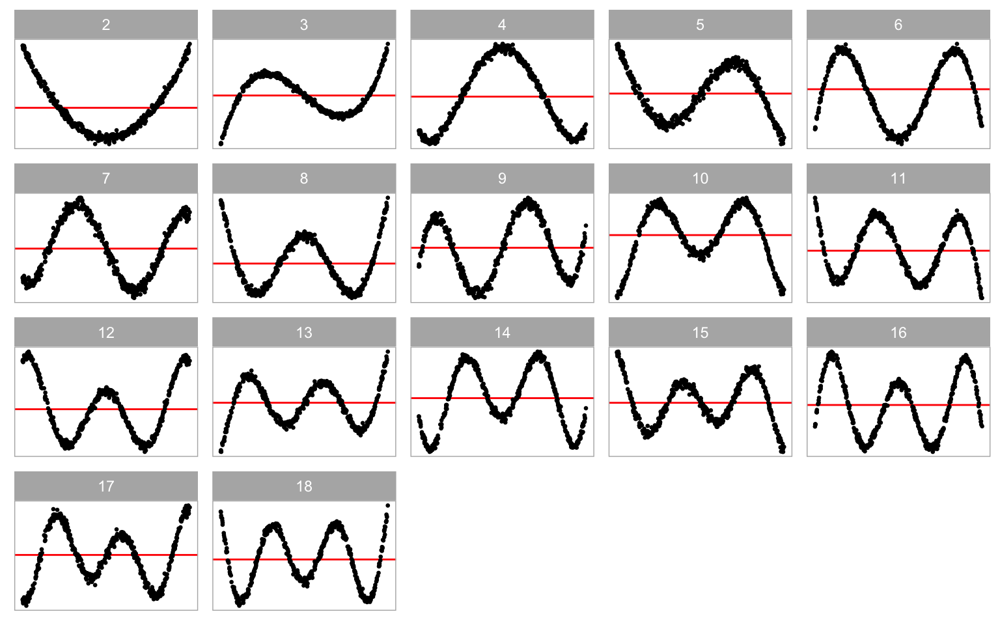
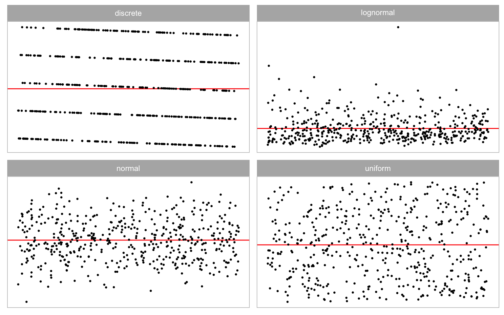
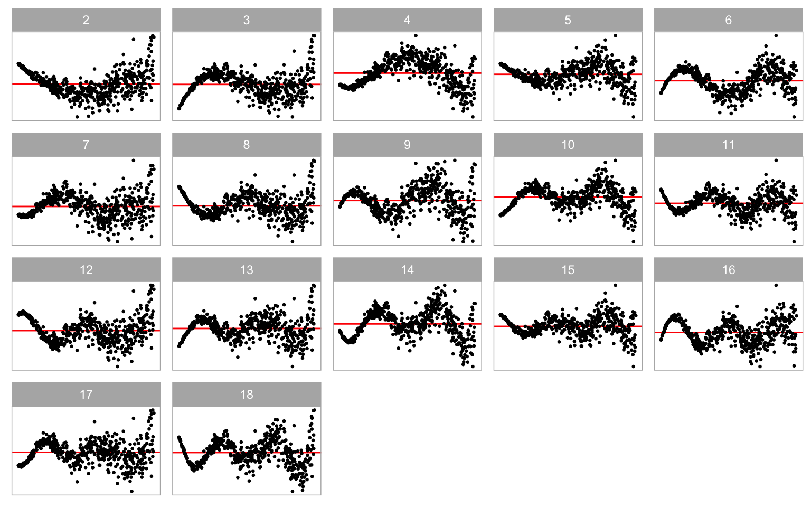
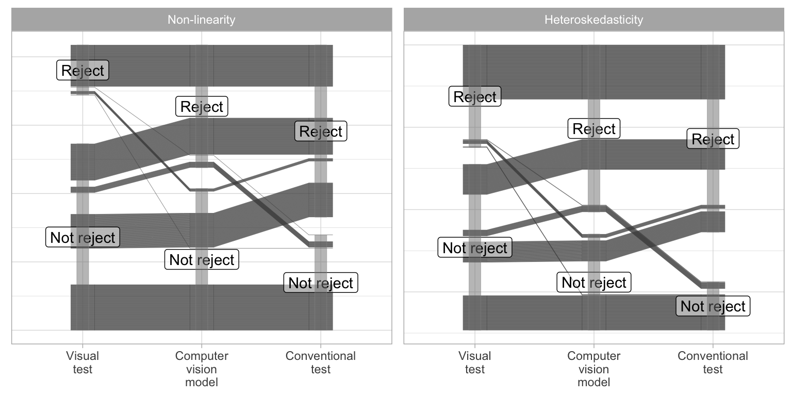
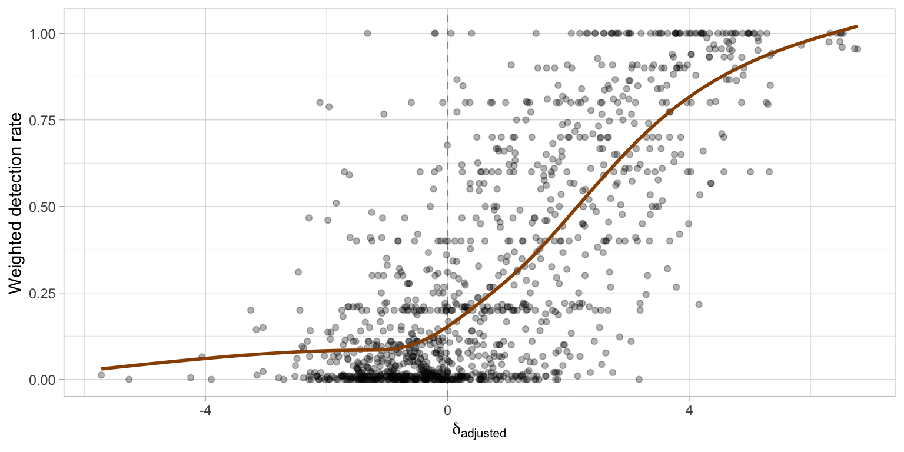
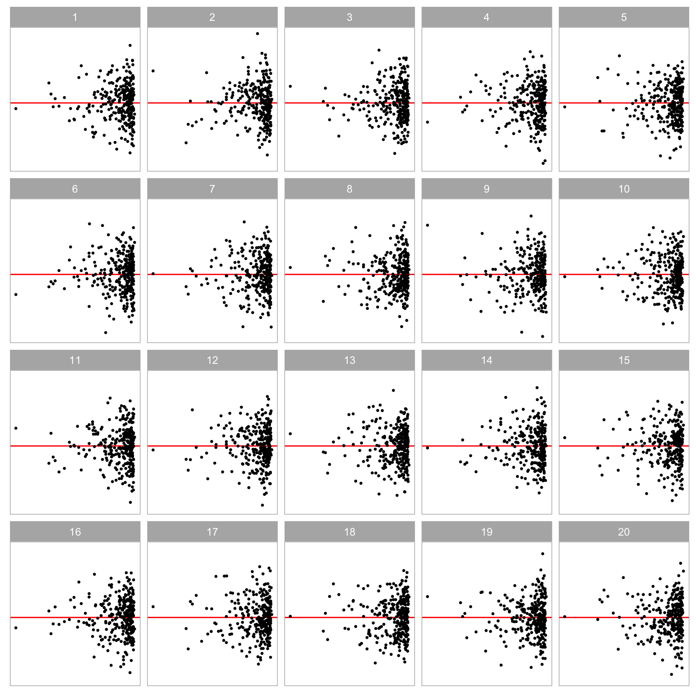
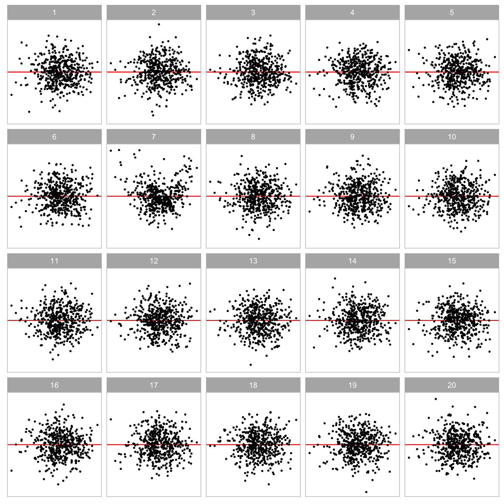
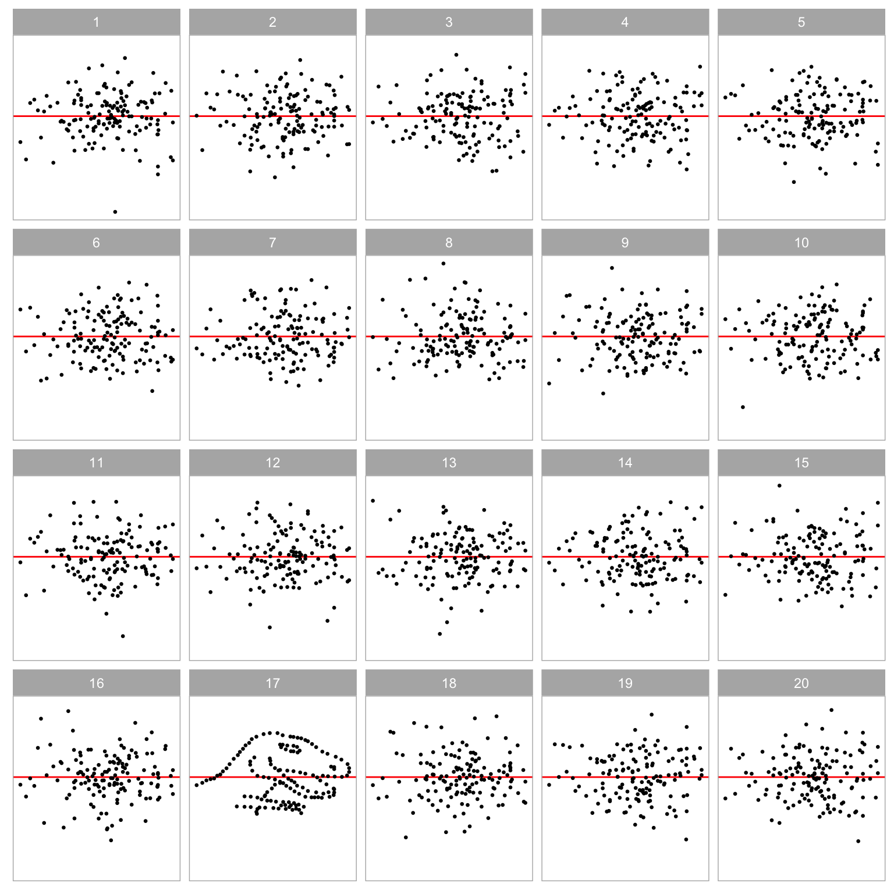

# Automated Assessment of Residual Plots with Computer Vision Models

Plotting residuals is a standard practice in linear regression diagnostics, essential for identifying deviations from model assumptions such as linearity, homoscedasticity, and normality. Visual inference provides an inferential framework to assess whether residual plots contain patterns inconsistent with model assumptions, typically using a lineup protocol. However, the lineup protocol's reliance on human judgment limits its scalability. This study addresses this limitation by automating the interpretation of residual plots using computer vision models. We develop a distance measure based on Kullback-Leibler divergence to quantify the disparity between the residual distribution of a fitted classical normal linear regression model and the reference distribution. We propose a computer vision model to estimate this distance from residual plots, facilitating formal statistical testing and bootstrapping techniques to assess model specification. Our computer vision model shows strong performance, though it performs slightly less effectively on non-linearity visual patterns. The statistical tests based on the estimated distance exhibit lower sensitivity than conventional tests but higher sensitivity than human visual tests. Examples demonstrate the method's effectiveness across different scenarios, highlighting its value in automating the diagnostic process and supplementing traditional methods.


::: {.cell}

:::


## Introduction {#sec-model-introduction}

Plotting residuals is commonly regarded as a standard practice in linear regression diagnostics [@belsley1980regression; @cook1982residuals]. This visual assessment plays a crucial role in identifying deviations from model assumptions, such as linearity, homoscedasticity, and normality. It also helps in understanding the goodness of fit and various unexpected characteristics of the model.

Generating a residual plot in most statistical software is often as straightforward as executing a line of code or clicking a button. However, accurately interpreting a residual plot can be challenging. A residual plot can exhibit various visual features, but it is crucial to recognize that some may arise from the characteristics of predictors and the natural stochastic variation of the observational unit, rather than indicating a violation of model assumptions [@li2023plot]. Consider @fig-false-finding as an example, the residual plot displays a triangular left-pointing shape. The distinct difference in the spread of the residuals across the fitted values may result in the analyst suggesting that there may be heteroskedasticity, however, it is important to avoid over-interpreting this visual pattern. In this case, the fitted regression model is correctly specified, and the triangular shape is actually a result of the skewed distribution of the predictors, rather than indicating a flaw in the model.

The concept of visual inference, as proposed by @buja2009statistical, provides an inferential framework to assess whether residual plots indeed contain visual patterns inconsistent with the model assumptions. The fundamental idea involves testing whether the true residual plot visually differs significantly from null plots, where null plots are plotted with residuals generated from the residual rotation distribution [@langsrud2005rotation], which is a distribution consistent with the null hypothesis $H_0$ that the linear regression model is correctly specified. Typically, the visual test is accomplished through the lineup protocol, where the real residual plot is embedded within a lineup alongside several null plots. If the real residual plot can be distinguished from the lineup, it provides evidence for rejecting $H_0$.

The practice of delivering a residual plot as a lineup is generally regarded as a valuable approach. Beyond its application in residual diagnostics, the lineup protocol has been integrated into the analysis of diverse subjects. For instance, Loy and Hofmann [-@loy2013diagnostic; -@loy2014hlmdiag; -@loy2015you] illustrated its applicability in diagnosing hierarchical linear models. Additionally, @widen2016graphical and @fieberg2024using demonstrated its utility in geographical and ecology research respectively, while @krishnan2021hierarchical explored its effectiveness in forensic examinations.

A practical limitation of the lineup protocol lies in its reliance on human judgements [see @li2023plot about the practical limitations]. Unlike conventional statistical tests that can be performed computationally in statistical software, the lineup protocol requires human evaluation of images. This characteristic makes it less suitable for large-scale applications, given the associated high labour costs and time requirements. There is a substantial need to develop an approach to substitute these human judgement with an automated reading of data plots using machines.

The utilization of computers to interpret data plots has a rich history, with early efforts such as "Scagnostics" by @tukey1985computer, a set of numerical statistics that summarise features of scatter plots. @wilkinson2005graph expanded on this work, introducing scagnostics based on computable measures applied to planar proximity graphs. These measures, including, but not limited to, "Outlying", "Skinny", "Stringy", "Straight", "Monotonic", "Skewed", "Clumpy", and "Striated",  aimed to characterize outliers, shape, density, trend, coherence and other characteristics of the data. While this approach has been inspiring, there is a recognition [@buja2009statistical] that it may not capture all the necessary visual features that differentiate true residual plots from null plots. A more promising alternative entails enabling machines to learn the function for extracting visual features from residual plots. Essentially, this means empowering computers to discern the crucial visual features for residual diagnostics and determining the method to extract them. 

Modern computer vision models are well-suited for addressing this challenge. They rely on deep neural networks with convolutional layers [@fukushima1982neocognitron]. These layers leverage hierarchical patterns in data, downsizing and transforming images by summarizing information in a small space. Numerous studies have demonstrated the efficacy of convolutional layers in addressing various vision tasks, including image recognition [@rawat2017deep]. Despite the widespread use of computer vision models in fields like computer-aided diagnosis [@lee2015image], pedestrian detection [@brunetti2018computer], and facial recognition [@emami2012facial], their application in reading data plots remains limited. While some studies have explored the use of computer vision models for tasks such as reading recurrence plots for time series regression [@ojeda2020multivariate], time series classification [@chu2019automatic; @hailesilassie2019financial; @hatami2018classification; @zhang2020encoding], anomaly detection [@chen2020convolutional], and pairwise causality analysis [@singh2017deep], the application of reading residual plots with computer vision models is a new field of study.

In this chapter, we develop computer vision models and integrate them into the residual plots diagnostics workflow, addressing the need for an automated visual inference. The chapter is structured as follows. @sec-model-specifications discusses various specifications of the computer vision models. @sec-model-distance-between-residual-plots defines the distance measure used to detect model violations, while @sec-model-distance-estimation explains how the computer vision models estimate this distance measure. @sec-model-statistical-testing covers the statistical tests based on the estimated distance, and @sec-model-violations-index introduces a Model Violations Index, which offers a quicker and more convenient assessment. Sections [-@sec-model-data-generation], [-@sec-model-architecture], and [-@sec-model-training] detail the data preparation, model architecture, and training process, respectively. The results are presented in @sec-model-results. Example dataset applications are discussed in @sec-examples. Finally, we conclude with a discussion of our findings and propose ideas for future research directions.


::: {.cell}
::: {.cell-output-display}
{#fig-false-finding fig-pos='!h' width=384}
:::
:::


## Model Specifications {#sec-model-specifications}

There are various specifications of the computer vision model that can be used to assess residual plots. We discuss these specifications below focusing on two key components of the model formula: the input and the output format.


### Input Formats

Deep learning models are in general very sensitive to the input data. The quality and relevance of the input data greatly influence the model's capacity to generate insightful and meaningful results. There are several designs of the input format that can be considered.

A straightforward design involves feeding a vector of residuals along with a vector of fitted values, essentially providing all the necessary information for creating a residuals vs fitted values plot. However, a drawback of this method is the dynamic input size, which changes based on the number of observations. For modern computer vision models implemented in mainstream software like TensorFlow [@abadi2016tensorflow], the input shape is typically fixed. One solution is to pad the input vectors with leading or trailing zeros when the input tensor expects longer vectors, but it may fail if the input vector surpasses the designed length. 

Another strategy is to summarize the residuals and fitted values separately using histograms and utilize the counts as the input. By controlling the number of bins in the histograms, it becomes possible to provide fixed-length input vectors. Still, since histograms only capture the marginal distribution of residuals and fitted values respectively, they can not be used to differentiate visual patterns with same marginal distributions but different joint distributions.

Another design involves using an image as input. The primary advantage of this design, as opposed to the vector format, is the availability of the existing and sophisticated image processing architectures developed over the years, such as the VGG16 architecture proposed in @simonyan2014very. These architectures can effectively capture and summarize spatial information from nearby pixels, which is less straightforward with vector input. The main considerations are the image resolution and the aesthetics of the residual plot. In general, a higher resolution provides more information to the model but comes with a trade-off of increased complexity and greater difficulty in training. As for the aesthetics of the residual plot, a practical solution is to consistently present residual plots in the same style to the model. This implies that the model can not accept arbitrary images as input but requires the use of the same pre-processing pipeline to convert residuals and fitted values into a standardized-style residual plot.

Providing multiple residual plots to the model, such as a pair of plots, a triplet or a lineup is also a possible option. @chopra2005learning have shown that computer vision models designed for image comparison can assess whether a pair of images are similar or dissimilar. Applied to our specific problem, we can define null plots of a fitted regression model to be similar to each other, while considering true residual plots to be distinct from null plots of any fitted regression model. A triplet constitutes a set of three images, denoted as $image_1$, $image_2$ and $image_3$. It is often used to predict whether $image_2$ or $image_3$ is more similar to $image_1$, proving particularly useful for establishing rankings between samples. For this setup, we can apply the same criteria to define similarity between images. However, it is important to note that these two approaches usually require additional considerations regarding the loss function and, at times, non-standard training processes due to shared weights between different convolutional blocks.

Presenting a lineup to a model aligns closely with the lineup protocol. However, as the number of residual plots in a lineup increases, the resolution of the input image grows rapidly, posing challenges in training the model. We experimented with this approach in a pilot study, but the performance of the trained model was sub-optimal.

Taking into account the implementation cost and the need for model interpretability, we used the single residual plot input format in this chapter.

### Output Formats

Given that the input is a single residual plot represented as a fixed-resolution image, we can choose the output from the computer vision model to be either binary (classification) or numeric (regression). 

The binary outcome can represent whether the input image is consistent with a null plot as determined by either (1) the data generating process or (2) the result of a visual test based on human judgement. Training a model following the latter option requires data from prior human subject experiments, presenting difficulties in controlling the quality of data due to variations in experimental settings across different studies. Additionally, some visual inference experiments are unrelated to linear regression models or residual plot diagnostics, resulting in a limited amount of available training data.

Alternatively, the output could be a meaningful and interpretable numerical measure useful for assessing residual plots, such as the strength of suspicious visual patterns reflecting the extent of model violations, or the difficulty index for identifying whether a residual plot has no issues. However, these numeric measures are often informally used in daily communication but are not typically formalized or rigorously defined. For the purpose of training a model, this numeric measure has to be quantifiable. 

In this study, we chose to define and use a distance between a true residual plot and a theoretically "good" residual plot. This is further explained in @sec-model-distance-between-residual-plots. @vo2016localizing have also demonstrated that defining a proper distance between images can enhance the matching accuracy in image search compared to a binary outcome model.

### Auxiliary Information with Scagnostics

In @sec-model-introduction, we mentioned that scagnostics consist of a set of manually designed visual feature extraction functions. While our computer vision model will learn its own feature extraction function during training, leveraging additional information from scagnostics can enhance the model's predictive accuracy.

For each residual plot used as an input image, we computed four scagnostics – "Monotonic", "Sparse", "Splines", and "Striped" – using the `cassowaryr` R package [@mason2022cassowaryr]. These computed measures, along with the number of observations from the fitted model, were provided as the second input for the computer vision model. While other scagnostics provide valuable insights, they come with high computational costs and are not suitable for quick inference.

## Distance from a Theoretically "Good" Residual Plot  {#sec-model-distance-between-residual-plots}

To develop a computer vision model for assessing residual plots within the visual inference framework, it is important to precisely define a numerical measure of "difference" or "distance" between plots. This distance can take the form of a basic statistical operation on pixels, such as the sum of square differences, however, a pixel-to-pixel comparison makes little sense in comparing residual plots where the main interest would be structural patterns. Alternatively, it could involve established image similarity metrics like the Structural Similarity Index Measure [@wang2004image] which compares images by integrating three perception features of an image: contrast, luminance, and structure (related to average, standard deviation and correlation of pixel values over a window, respectively). These image similarity metrics are tailored for image comparison in vastly different tasks to evaluating data plots, where only essential plot elements require assessment [@chowdhury2018measuring]. We can alternatively define a notion of distance by integrating key plot elements (instead of key perception features like luminance, contrast, and structure), such as those captured by scagnostics mentioned in @sec-model-introduction, but the functional form still needs to be carefully refined to accurately reflect the extent of the violations.

In this section, we introduce a distance measure between a true residual plot and a theoretically 'good' residual plot. This measure quantifies the divergence between the residual distribution of a given fitted regression model and that of a correctly specified model. The computation assumes knowledge of the data generating processes for predictors and response variables. Since these processes are often unknown in practice, we will discuss a method to estimate this distance using a computer vision model in Section @sec-model-distance-estimation.

### Residual Distribution

For a classical normal linear regression model, $\boldsymbol{y} = \boldsymbol{X}\boldsymbol{\beta} + \boldsymbol{e}$, the residual $\hat{\boldsymbol{e}}$ are derived as the difference of the fitted values and observed values $\boldsymbol{y}$. Suppose the data generating process is known and the regression model is correctly specified, by the Frisch-Waugh-Lowell theorem [@frisch1933partial], residuals $\hat{\boldsymbol{e}}$ can also be treated as random variables and written as a linear transformation of the error $\boldsymbol{e}$ formulated as $\hat{\boldsymbol{e}} = \boldsymbol{R}\boldsymbol{e}$, where $\boldsymbol{R}=\boldsymbol{I}_n -\boldsymbol{X}(\boldsymbol{X}^\top\boldsymbol{X})^{-1}\boldsymbol{X}^\top$ is the residual operator, $\boldsymbol{I}_n$ is a $n$ by $n$ identity matrix, and $n$ is the number of observations.

One of the assumptions of the classical normal linear regression model is that the error $\boldsymbol{e}$ follows a multivariate normal distribution with zero mean and constant variance, i.e., $\boldsymbol{e} \sim N(\boldsymbol{0}_n,\sigma^2\boldsymbol{I}_n)$. It can be known that residuals $\hat{\boldsymbol{e}}$ also follow a certain probability distribution transformed from the multivariate normal distribution, which will be denoted as $Q$. This reference distribution $Q$ summarizes what "good" residuals should follow given the design matrix $\boldsymbol{X}$ is known and fixed.

Suppose the design matrix $\boldsymbol{X}$ has linearly independent columns, the trace of the hat matrix $\boldsymbol{H} = \boldsymbol{X}(\boldsymbol{X}^\top\boldsymbol{X})^{-1}\boldsymbol{X}^\top$ will equal to the number of columns in $\boldsymbol{X}$ denoted as $k$. As a result, the rank of $\boldsymbol{R}$ is $n - k$, and $Q$ is a degenerate multivariate distribution. To capture the characteristics of $Q$, such as moments, we can simulate a large numbers of $\boldsymbol{\varepsilon}$ and transform it to $\boldsymbol{e}$ to get the empirical estimates. For simplicity, in this study, we replaced the variance-covariance matrix of residuals $\text{cov}(\boldsymbol{e}, \boldsymbol{e}) = \boldsymbol{R}\sigma^2\boldsymbol{R}^\top = \boldsymbol{R}\sigma^2$ with a full-rank diagonal matrix $\text{diag}(\boldsymbol{R}\sigma^2)$, where $\text{diag}(.)$ sets the non-diagonal entries of a matrix to zeros. The resulting distribution for $Q$ is $N(\boldsymbol{0}_n, \text{diag}(\boldsymbol{R}\sigma^2))$.

Distribution $Q$ is derived from the correctly specified model. However, if the model is misspecified, then the actual distribution of residuals denoted as $P$, will be different from $Q$. For example, if the data generating process contains variables correlated with any column of $\boldsymbol{X}$ but missing from $\boldsymbol{X}$, causing an omitted variable problem, $P$ will be different from $Q$ because the residual operator obtained from the fitted regression model will not be the same as $\boldsymbol{R}$. Besides, if the $\boldsymbol{\varepsilon}$ follows a non-normal distribution such as a multivariate lognormal distribution, $P$ will usually be skewed and has a long tail. 

### Distance of $P$ from $Q$

Defining a proper distance between distributions is usually easier than defining a proper distance between data plots. Given the true residual distribution $Q$ and the reference residual distribution $P$, we used a distance measure based on Kullback-Leibler divergence [@kullback1951information] to quantify the difference between two distributions as

$$
D = \log\left(1 + D_{KL}\right),
$$ {#eq-kl-0}

where $D_{KL}$ is defined as

$$
D_{KL} = \int_{\mathbb{R}^{n}}\log\frac{p(\boldsymbol{e})}{q(\boldsymbol{e})}p(\boldsymbol{e})d\boldsymbol{e},
$$ {#eq-kl-1}

\noindent and $p(.)$ and $q(.)$ are the probability density functions for distribution $P$ and distribution $Q$, respectively.

This distance measure was first proposed in @li2023plot. It was mainly designed for measuring the effect size of non-linearity and heteroskedasticity in a residual plot. @li2023plot have derived that, for a classical normal linear regression model that omits necessary higher-order predictors $\boldsymbol{Z}$ and the corresponding parameter $\boldsymbol{\beta}_z$, and incorrectly assumes $\boldsymbol{\varepsilon} \sim N(\boldsymbol{0}_n,\sigma^2\boldsymbol{I}_n)$ while in fact $\boldsymbol{\varepsilon} \sim N(\boldsymbol{0}_n, \boldsymbol{V})$ where $\boldsymbol{V}$ is an arbitrary symmetric positive semi-definite matrix, $Q$ can be represented as $N(\boldsymbol{R}\boldsymbol{Z}\boldsymbol{\beta}_z, \text{diag}(\boldsymbol{R}\boldsymbol{V}\boldsymbol{R}))$. Note that the variance-covariance matrix is replaced with the diagonal matrix to ensure it is a full-rank matrix. 

Since both $P$ and $Q$ are adjusted to be multivariate normal distributions, @eq-kl-1 can be further expanded to

$$
\begin{aligned}
D_{KL} &= \frac{1}{2}\left(\log\frac{|\boldsymbol{W}|}{|\text{diag}(\boldsymbol{R}\sigma^2)|} - n + \text{tr}(\boldsymbol{W}^{-1}\text{diag}(\boldsymbol{R}\sigma^2)) + \boldsymbol{\mu}_z^\top\boldsymbol{W}^{-1}\boldsymbol{\mu}_z\right),
\end{aligned}
$$ {#eq-kl-2}

\noindent where $\boldsymbol{\mu}_z = \boldsymbol{R}\boldsymbol{Z}\boldsymbol{\beta}_z$, and $\boldsymbol{W} = \text{diag}(\boldsymbol{R}\boldsymbol{V}\boldsymbol{R})$. The assumed error variance $\sigma^2$ is set to be $\text{tr}(\boldsymbol{V})/n$, which is the expectation of the estimated variance.


### Non-normal $P$

For non-normal error $\boldsymbol{\varepsilon}$, the true residual distribution $P$ is unlikely to be a multivariate normal distribution. Thus, @eq-kl-2 given in @li2023plot will not be applicable to models violating the normality assumption. 

To evaluate the Kullback-Leibler divergence of non-normal $P$ from $Q$, the fallback is to solve @eq-kl-1 numerically. However, since $\boldsymbol{e}$ is a linear transformation of non-normal random variables, it is very common that the general form of $P$ is unknown, meaning that we can not easily compute $p(\boldsymbol{e})$ using a well-known probability density function. Additionally, even if $p(\boldsymbol{e})$ can be calculated for any $\boldsymbol{e} \in \mathbb{R}^n$, it will be very difficult to do numerical integration over the $n$-dimensional space, because $n$ could be potentially very large.   

In order to approximate $D_{KL}$ in a practically computable manner, the elements of $\boldsymbol{e}$ are assumed to be independent of each other. This assumption solves both of the issues mentioned above. First, we no longer need to integrate over $n$ random variables. The result of @eq-kl-1 is now the sum of the Kullback-Leibler divergence evaluated for each individual residual due to the assumption of independence between observations. Second, it is not required to know the joint probability density $p(\boldsymbol{e})$ any more. Instead, the evaluation of Kullback-Leibler divergence for an individual residual relies on the knowledge of the marginal density $p_i(e_i)$, where $e_i$ is the $i$-th residual for $i = 1, ..., n$. This is much easier to approximate through simulation. It is also worth mentioning that this independence assumption generally will not hold if $\text{cov}(e_i, e_j) \neq 0$ for any $1 \leq i < j \leq n$, but its existence is essential for reducing the computational cost.

Given $\boldsymbol{X}$ and $\boldsymbol{\beta}$, the algorithm for approximating @eq-kl-1 starts from simulating $m$ sets of observed values $\boldsymbol{y}$ according to the data generating process. The observed values are stored in a matrix $\boldsymbol{A}$ with $n$ rows and $m$ columns, where each column of $\boldsymbol{A}$ is a set of observed values. Then, we can get $m$ sets of realized values of $\boldsymbol{e}$ stored in the matrix $\boldsymbol{B}$ by applying the residual operator $\boldsymbol{B} = \boldsymbol{R}\boldsymbol{A}$. Furthermore, kernel density estimation (KDE) with Gaussian kernel and optimal bandwidth selected by the Silverman's rule of thumb [@silverman2018density] is applied on each row of $\boldsymbol{B}$ to estimate $p_i(e_i)$ for $i = 1, ..., n$. The KDE computation can be done by the `density` function in R. 

Since the Kullback-Leibler divergence can be viewed as the expectation of the log-likelihood ratio between distribution $P$ and distribution $Q$ evaluated on distribution $P$, we can reuse the simulated residuals in matrix $\boldsymbol{B}$ to estimate the expectation by the sample mean. With the independence assumption, for non-normal $P$, $D_{KL}$ can be approximated by

$$
\begin{aligned}
D_{KL} &\approx \sum_{i = 1}^{n} \hat{D}_{KL}^{(i)}, \\
\hat{D}_{KL}^{(i)} &= \frac{1}{m}\sum_{j = 1}^{m} \log\frac{\hat{p}_i(B_{ij})}{q(B_{ij})},
\end{aligned} 
$$ {#eq-kl-3}


\noindent where $\hat{D}_{KL}^{(i)}$ is the estimator of the Kullback-Leibler divergence for an individual residual $e_i$, $\boldsymbol{B}_{ij}$ is the $i$-th row and $j$-th column entry of the matrix $\boldsymbol{B}$, $\hat{p}_i(.)$ is the kernel density estimator of $p_i(.)$, $q(.)$ is the normal density function with mean zero and an assumed variance estimated as $\hat{\sigma}^2 = \sum_{b \in vec(\boldsymbol{B})}(b - \sum_{b \in vec(\boldsymbol{B})} b/nm)^2/(nm - 1)$, and $vec(.)$ is the vectorization operator which turns a $n \times m$ matrix into a $nm \times 1$ column vector by stacking the columns of the matrix on top of each other.


## Distance Estimation {#sec-model-distance-estimation}

In the previous sections, we have defined a distance measure given in @eq-kl-0 for quantifying the difference between the true residual distribution $P$ and an ideal reference distribution $Q$. However, this distance measure can only be computed when the data generating process is known. In reality, we often have no knowledge about the data generating process, otherwise we do not need to do a residual diagnostic in the first place.

We use a computer vision model to estimate this distance measure for a residual plot. Let $D$ be the result of @eq-kl-0, and our estimator $\hat{D}$ is formulated as 

$$
\hat{D} = f_{CV}(V_{h \times w}(\boldsymbol{e}, \hat{\boldsymbol{y}})),
$$ {#eq-d-approx}

\noindent where $V_{h \times w}(.)$ is a plotting function that saves a residuals vs fitted values plot with fixed aesthetic as an image with $h \times w$ pixels in three channels (RGB), $f_{CV}(.)$ is a computer vision model which takes an $h \times w$ image as input and predicts the distance in the domain $[0, +\infty)$.

With the estimated distance $\hat{D}$, we can compare the underlying distribution of the residuals to a theoretically "good" residual distribution. $\hat{D}$ can also be used as an index of the model violations indicating the strength of the visual signal embedded in the residual plot. 

It is not expected that $\hat{D}$ will be equal to original distance $D$. This is largely because information contained in a single residual plot is limited and it may not be able to summarise all the important characteristics of the residual distribution. For a given residual distribution $P$, many different residual plots can be simulated, where many will share similar visual patterns, but some of them could be visually very different from the rest, especially for regression models with small $n$. This suggests the error of the estimation will vary depends on whether the input residual plot is representative or not.

## Statistical testing {#sec-model-statistical-testing}

### Lineup Evaluation {#sec-model-lineup-evaluation}

Theoretically, the distance $D$ for a correctly specified model is $0$, because $P$ will be the same as $Q$. However, the computer vision model may not necessary predict $0$ for a null plot. Using @fig-false-finding as an example, it contains a visual pattern which is an indication of heteroskedasticity. We would not expect the model to be able to magically tell if the suspicious pattern is caused by the skewed distribution of the fitted values or the existence of heteroskedasticity. Additionally, some null plots could have outliers or strong visual patterns due to randomness, and a reasonable model will try to summarise those information into the prediction, resulting in $\hat{D} > 0$.

This property is not an issue if $\hat{D} \gg 0$ for which the visual signal of the residual plot is very strong, and we usually do not need any further examination of the significance of the result. However, if the visual pattern is weak or moderate, having $\hat{D}$ will not be sufficient to determine if $H_0$ should be rejected.

To address this issue we can adhere to the paradigm of visual inference, by comparing the estimated distance $\hat{D}$ to the estimated distances for the null plots in a lineup. Specifically, if a lineup comprises 20 plots, the null hypothesis $H_0$ will be rejected if $\hat{D}$ exceeds the maximum estimated distance among the $m - 1$ null plots, denoted as $\max\limits_{1 \leq i \leq m-1} {\hat{D}_{null}^{(i)}}$, where $\hat{D}_{null}^{(i)}$ represents the estimated distance for the $i$-th null plot. This approach is equivalent to the typical lineup protocol requiring a 95% significance level, where $H_0$ is rejected if the data plot is identified as the most distinct plot by the sole observer. The estimated distance serves as a metric to quantify the difference between the data plot and the null plots, as intended.

<!-- For lineups consisting of more than 20 plots, the 95% significance level can be maintained if the number of plots is a multiple of 20. Specifically, for lineups comprising $20t$ plots, where $t$ is a positive integer, we reject $H_0$ if $\hat{D}$ exceeds 95% ${\hat{D}_{null}^{(i)}}$ for $i = 1, \ldots, 20t-1$. The $p$-value in this case is given by $\frac{1}{20t} + \frac{1}{20t}\sum_{i=1}^{20t-1} I\left(\hat{D}_{null}^{(i)} > \hat{D}\right)$, where $I(\cdot)$ is the indicator function. -->

Moreover, if the number of plots in a lineup, denoted by $m$, is sufficiently large, the empirical distribution of ${\hat{D}_{null}^{(i)}}$ can be viewed as an approximation of the null distribution of the estimated distance. Consequently, quantiles of the null distribution can be estimated using the sample quantiles, and these quantiles can be utilized for decision-making purposes. The details of the sample quantile computation can be found in @hyndman1996sample. For instance, if $\hat{D}$ is greater than or equal to the 95% sample quantile, denoted as $Q_{null}(0.95)$, we can conclude that the estimated distance for the true residual plot is significantly different from the estimated distance for null plots with a 95% significance level. Based on our experience, to obtain a stable estimate of the 95% quantile, the number of null plots, $n_{null}$, typically needs to be at least 100. However, if the null distribution exhibits a long tail, a larger number of null plots may be required. Alternatively, a $p$-value is the probability of observing a distance equally or greater than $\hat{D}$ under the null hypothesis $H_0$, and it can be estimated by $\frac{1}{m} + \frac{1}{m}\sum_{i=1}^{m-1}I\left(\hat{D}_{null}^{(i)} \geq \hat{D}\right)$.

To alleviate computation burden, a lattice of quantiles for $\hat{D}$ under $H_0$ with specified sample sizes can be precomputed. We can then map the $\hat{D}$ and sample size to the closet quantile and sample size in lattice to calculate the corresponding $p$-value. This approach lose precision in $p$-value calculation, however, significantly improves computational efficiency.

### Bootstrapping

Bootstrap is often employed in linear regression when conducting inference for estimated parameters [see @davison1997bootstrap and @efron1994introduction]. It is typically done by sampling individual cases with replacement and refitting the regression model. If the observed data accurately reflects the true distribution of the population, the bootstrapped estimates can be used to measure the variability of the parameter estimate without making strong distributional assumptions about the data generating process.

Similarly, bootstrap can be applied on the estimated distance $\hat{D}$. For each refitted model $M_{boot}^{(i)}$, there will be an associated residual plot $V_{boot}^{(i)}$ which can be fed into the computer vision model to obtain $\hat{D}_{boot}^{(i)}$, where $i = 1,...,n_{boot}$, and $n_{boot}$ is the number of bootstrapped samples. If we are interested in the variation of $\hat{D}$, we can use $\hat{D}_{boot}^{(i)}$ to estimate a confidence interval. 

Alternatively, since each $M_{boot}^{(i)}$ has a set of estimated coefficients $\hat{\boldsymbol{\beta}}_{boot}^{(i)}$ and an estimated variance $\hat{\sigma^2}_{boot}^{(i)}$, a new approximated null distribution can be construed and the corresponding 95% sample quantile $Q_{boot}^{(i)}(0.95)$ can be computed. Then, if $\hat{D}_{boot}^{(i)} \geq Q_{boot}^{(i)}(0.95)$, $H_0$ will be rejected for $M_{boot}^{(i)}$. The ratio of rejected $M_{boot}^{(i)}$ among all the refitted models provides an indication of how often the assumed regression model are considered to be incorrect if the data can be obtained repetitively from the same data generating process. But this approach is computationally very expensive because it requires $n_{boot} \times n_{null}$ times of residual plot assessment. In practice, $Q_{null}(0.95)$ can be used to replace $Q_{boot}^{(i)}(0.95)$ in the computation. 


## Model Violations Index {#sec-model-violations-index}

While statistical testing is a powerful tool for detecting model violations, it can become cumbersome and time-consuming when quick decisions are needed, particularly due to the need to evaluate numerous null plots. In practice, a more convenient and immediate method for assessing model performance is often required. This is where an index, such as the Model Violations Index (MVI), becomes valuable. It offers a straightforward way to quantify deviations from model assumptions, enabling rapid assessment and easier comparison across models.

The estimator $\hat{D}$ measures the difference between the true residual distribution and the reference residual distribution, a difference primarily arises from deviations in model assumptions. The magnitude of $D$ directly reflects the degree of these deviations, thus making $\hat{D}$ instrumental in forming a model violations index (MVI).

Note that if more observations are used for estimating the linear regression, the result of @eq-kl-1 will increase, as the integration will be performed over a higher-dimensional space. For a given data generating process, $D$ typically increases logarithmically with the number of observations. This behaviour comes from the relationship $D = \text{log}(1 + D_{KL})$, where $D_{KL} = \sum_{i=1}^{n}D_{KL}^{(i)}$ under the assumption of independence.

Since $\hat{D}$ is an estimate of $D$, it is expected that a larger number of observations will also lead to a higher $\hat{D}$. However, this does not imply that $\hat{D}$ fails to accurately represent the extent of model violations. In fact, when examining residual plots with more observations, we often observe a stronger visual signal strength, as the underlying patterns are more likely to be revealed, except in cases of significant overlapping.

Therefore, the Model Violations Index (MVI) can be proposed as

$$
\text{MVI} = C + \hat{D} - \log(n),
$$ {#eq-mvi}

\noindent where $C$ is a large enough constant keeping the result positive and the term $-\log(n)$ is used to offset the increase in $D$ due to sample size.

@fig-poly-heter-index displays the residual plots for fitted models exhibiting varying degrees of non-linearity and heteroskedasticity. Each residual plot's MVI is computed using @eq-mvi with $C = 10$. When $\text{MVI} > 8$, the visual patterns are notably strong and easily discernible by humans. In the range $6 < \text{MVI} < 8$, the visibility of the visual pattern diminishes as MVI decreases. Conversely, when $\text{MVI} < 6$, the visual pattern tends to become relatively faint and challenging to observe. @tbl-mvi provides a summary of the MVI usage and it is applicable to other linear regression models.


::: {.content-visible when-format="html"}


::: {#tbl-mvi .cell tbl-cap='Degree of model violations or the strength of the visual signals according to the Model Violations Index (MVI). The constant $C$ is set to be 10.'}
::: {.cell-output-display}


```{=html}
<table>
 <thead>
  <tr>
   <th style="text-align:center;"> <span data-qmd="Degree of Model Violations"></span> </th>
   <th style="text-align:center;"><span data-qmd="Range ($C$ = 10)"></span>  </th>
  </tr>
 </thead>
<tbody>
  <tr>
   <td style="text-align:left;"> <span data-qmd="Strong"></span>  </td>
   <td style="text-align:center;"> <span data-qmd="$\text{MVI} > 8$"></span>  </td>
  </tr>
  <tr>
   <td style="text-align:left;"> <span data-qmd="Moderate"></span>  </td>
   <td style="text-align:center;"> <span data-qmd="$6 < \text{MVI} < 8$"></span> </td>
  </tr>
  <tr>
   <td style="text-align:left;"> <span data-qmd="Weak"></span>  </td>
   <td style="text-align:center;"> <span data-qmd="$\text{MVI} < 6$"></span>  </td>
  </tr>
</tbody>
</table>

```


:::
:::

:::


::: {.content-visible when-format="pdf"}


::: {#tbl-mvi .cell tbl-cap='Degree of model violations or the strength of the visual signals according to the Model Violations Index (MVI). The constant $C$ is set to be 10.'}
::: {.cell-output-display}

`````{=html}
<table>
 <thead>
  <tr>
   <th style="text-align:left;text-align: center;"> Degree of model violations </th>
   <th style="text-align:center;text-align: center;"> Range ($C$ = 10) </th>
  </tr>
 </thead>
<tbody>
  <tr>
   <td style="text-align:left;"> Strong </td>
   <td style="text-align:center;"> $\text{MVI} &gt; 8$ </td>
  </tr>
  <tr>
   <td style="text-align:left;"> Moderate </td>
   <td style="text-align:center;"> $6 
  </td>
</tr>
  <tr>
   <td style="text-align:left;"> Weak </td>
   <td style="text-align:center;"> $\text{MVI} 
  </td>
</tr>
</tbody>
</table>

`````

:::
:::


:::


::: {.cell}

:::

::: {.cell}

:::

::: {.cell}
::: {.cell-output-display}
{#fig-poly-heter-index fig-pos='!h' width=768}
:::
:::


## Data Generation {#sec-model-data-generation}

### Simulation Scheme

While observational data is frequently employed in training models for real-world applications, the data generating process of observational data often remains unknown, making computation for our target variable $D$ unattainable. Consequently, the computer vision models developed in this study were trained using synthetic data, including 80,000 training images and 8,000 test images. This approach provided us with precise label annotations. Additionally, it ensured a large and diverse training dataset, as we had control over the data generating process, and the simulation of the training data was relatively cost-effective.

We have incorporated three types of residual departures of linear regression model in the training data, including non-linearity, heteroskedasticity and non-normality. All three departures can be summarised by the data generating process formulated as

$$
\begin{aligned}
\boldsymbol{y} &= \boldsymbol{1}_n + \boldsymbol{x}_1 + \beta_1\boldsymbol{x}_2 + \beta_2(\boldsymbol{z} + \beta_1\boldsymbol{w}) + \boldsymbol{k} \odot \boldsymbol{\varepsilon}, \\
\boldsymbol{z} &= \text{He}_j(g(\boldsymbol{x}_1, 2)), \\
\boldsymbol{w} &= \text{He}_j(g(\boldsymbol{x}_2, 2)), \\
\boldsymbol{k} &= \left[\boldsymbol{1}_n + b(2 - |a|)(\boldsymbol{x}_1 + \beta_1\boldsymbol{x}_2 - a\boldsymbol{1}_n)^{\circ2}\right]^{\circ1/2},
\end{aligned}
$$ {#eq-data-sim}

\noindent where $\boldsymbol{y}$, $\boldsymbol{x}_1$, $\boldsymbol{x}_2$, $\boldsymbol{z}$, $\boldsymbol{w}$, $\boldsymbol{k}$ and $\boldsymbol{\varepsilon}$ are vectors of size $n$, $\boldsymbol{1}_n$ is a vector of ones of size $n$, $\boldsymbol{x}_1$ and $\boldsymbol{x}_2$ are two independent predictors, $\text{He}_j(.)$ is the $j$th-order probabilist's Hermite polynomials [@hermite1864nouveau], $(.)^{\circ2}$ and $(.)^{\circ1/2}$ are Hadamard square and square root, $\odot$ is the Hadamard product, and $g(\boldsymbol{x}, k)$ is a scaling function to enforce the support of the random vector to be $[-k, k]^n$ defined as

$$g(\boldsymbol{x}, k) = 2k \cdot \frac{\boldsymbol{x} - x_{\min}\boldsymbol{1}_n}{x_{\max} - x_{\min}} - k\boldsymbol{1}_n,~for~k > 0,$$
\noindent where $x_{\min} = \underset{i \in \{ 1,...,n\}}{\min} x_i$, $x_{\max} = \underset{i \in \{ 1,...,n\}}{\max} x_i$ and $x_i$ is the $i$-th entry of $\boldsymbol{x}$.


::: {.content-visible when-format="html"}


::: {#tbl-factor .cell tbl-cap='Factors used in the data generating process for synthetic data simulation. Factor $j$ and $a$ controls the non-linearity shape and the heteroskedasticity shape respectively. Factor $b$, $\sigma_\varepsilon$ and $n$ control the signal strength. Factor $\text{dist}_\varepsilon$, $\text{dist}_{x1}$ and $\text{dist}_{x2}$ specifies the distribution of $\varepsilon$, $X_1$ and $X_2$ respectively.'}
::: {.cell-output-display}


```{=html}
<table>
 <thead>
  <tr>
   <th style="text-align:center;"> Factor </th>
   <th style="text-align:center;"> Domain </th>
  </tr>
 </thead>
<tbody>
  <tr>
   <td style="text-align:left;"> j </td>
   <td style="text-align:left;"> {2, 3, ..., 18} </td>
  </tr>
  <tr>
   <td style="text-align:left;"> a </td>
   <td style="text-align:left;"> [-1, 1] </td>
  </tr>
  <tr>
   <td style="text-align:left;"> b </td>
   <td style="text-align:left;"> [0, 100] </td>
  </tr>
  <tr>
   <td style="text-align:left;"> <span data-qmd="$\beta_1$"></span> </td>
   <td style="text-align:left;"> {0, 1} </td>
  </tr>
  <tr>
   <td style="text-align:left;"> <span data-qmd="$\beta_2$"></span> </td>
   <td style="text-align:left;"> {0, 1} </td>
  </tr>
  <tr>
   <td style="text-align:left;"> <span data-qmd="$\text{dist}_{\varepsilon}$"></span> </td>
   <td style="text-align:left;"> {discrete, uniform, normal, lognormal} </td>
  </tr>
  <tr>
   <td style="text-align:left;"> <span data-qmd="$\text{dist}_{x1}$"></span> </td>
   <td style="text-align:left;"> {discrete, uniform, normal, lognormal} </td>
  </tr>
  <tr>
   <td style="text-align:left;"> <span data-qmd="$\text{dist}_{x2}$"></span> </td>
   <td style="text-align:left;"> {discrete, uniform, normal, lognormal} </td>
  </tr>
  <tr>
   <td style="text-align:left;"> <span data-qmd="$\sigma_{\varepsilon}$"></span> </td>
   <td style="text-align:left;"> [0.0625, 9] </td>
  </tr>
  <tr>
   <td style="text-align:left;"> <span data-qmd="$\sigma_{X1}$"></span> </td>
   <td style="text-align:left;"> [0.3, 0.6] </td>
  </tr>
  <tr>
   <td style="text-align:left;"> <span data-qmd="$\sigma_{X2}$"></span> </td>
   <td style="text-align:left;"> [0.3, 0.6] </td>
  </tr>
  <tr>
   <td style="text-align:left;"> n </td>
   <td style="text-align:left;"> [50, 500] </td>
  </tr>
</tbody>
</table>

```


:::
:::

:::

::: {.content-visible when-format="pdf"}


::: {#tbl-factor .cell tbl-cap='Factors used in the data generating process for synthetic data simulation. Factor $j$ and $a$ controls the non-linearity shape and the heteroskedasticity shape respectively. Factor $b$, $\sigma_\varepsilon$ and $n$ control the signal strength. Factor $\text{dist}_\varepsilon$, $\text{dist}_{x1}$ and $\text{dist}_{x2}$ specifies the distribution of $\varepsilon$, $X_1$ and $X_2$ respectively.'}
::: {.cell-output-display}

`````{=html}
<table>
 <thead>
  <tr>
   <th style="text-align:left;text-align: center;"> Factor </th>
   <th style="text-align:left;text-align: center;"> Domain </th>
  </tr>
 </thead>
<tbody>
  <tr>
   <td style="text-align:left;"> j </td>
   <td style="text-align:left;"> \{2, 3, ..., 18\} </td>
  </tr>
  <tr>
   <td style="text-align:left;"> a </td>
   <td style="text-align:left;"> [-1, 1] </td>
  </tr>
  <tr>
   <td style="text-align:left;"> b </td>
   <td style="text-align:left;"> [0, 100] </td>
  </tr>
  <tr>
   <td style="text-align:left;"> $\beta_1$ </td>
   <td style="text-align:left;"> \{0, 1\} </td>
  </tr>
  <tr>
   <td style="text-align:left;"> $\beta_2$ </td>
   <td style="text-align:left;"> \{0, 1\} </td>
  </tr>
  <tr>
   <td style="text-align:left;"> $\text{dist}_\varepsilon$ </td>
   <td style="text-align:left;"> \{discrete, uniform, normal, lognormal\} </td>
  </tr>
  <tr>
   <td style="text-align:left;"> $\text{dist}_{x1}$ </td>
   <td style="text-align:left;"> \{discrete, uniform, normal, lognormal\} </td>
  </tr>
  <tr>
   <td style="text-align:left;"> $\text{dist}_{x2}$ </td>
   <td style="text-align:left;"> \{discrete, uniform, normal, lognormal\} </td>
  </tr>
  <tr>
   <td style="text-align:left;"> $\sigma_{\varepsilon}$ </td>
   <td style="text-align:left;"> [0.0625, 9] </td>
  </tr>
  <tr>
   <td style="text-align:left;"> $\sigma_{X1}$ </td>
   <td style="text-align:left;"> [0.3, 0.6] </td>
  </tr>
  <tr>
   <td style="text-align:left;"> $\sigma_{X2}$ </td>
   <td style="text-align:left;"> [0.3, 0.6] </td>
  </tr>
  <tr>
   <td style="text-align:left;"> n </td>
   <td style="text-align:left;"> [50, 500] </td>
  </tr>
</tbody>
</table>

`````

:::
:::


:::

The residuals and fitted values of the fitted model were obtained by regressing $\boldsymbol{y}$ on $\boldsymbol{x}_1$. If $\beta_1 \neq 0$, $\boldsymbol{x}_2$ was also included in the design matrix. This data generation process was adapted from @li2023plot, where it was utilized to simulate residual plots exhibiting non-linearity and heteroskedasticity visual patterns for human subject experiments. A summary of the factors utilized in @eq-data-sim is provided in @tbl-factor.

In @eq-data-sim, $\boldsymbol{z}$ and $\boldsymbol{w}$ represent higher-order terms of $\boldsymbol{x}_1$ and $\boldsymbol{x}_2$, respectively. If $\beta_2 \neq 0$, the regression model will encounter non-linearity issues. Parameter $j$ serves as a shape parameter that controls the number of tuning points in the non-linear pattern. Typically, higher values of $j$ lead to an increase in the number of tuning points, as illustrated in @fig-different-j.


::: {.cell}
::: {.cell-output-display}
{#fig-different-j fig-pos='!h' width=768}
:::
:::


Additionally, scaling factor $\boldsymbol{k}$ directly affects the error distribution and it is correlated with $\boldsymbol{x}_1$ and $\boldsymbol{x}_2$. If $b \neq 0$ and $\boldsymbol{\varepsilon} \sim N(\boldsymbol{0}_n, \sigma^2\boldsymbol{I}_n)$, the constant variance assumption will be violated. Parameter $a$ is a shape parameter controlling the location of the smallest variance in a residual plot as shown in @fig-different-a.


::: {.cell}
::: {.cell-output-display}
{#fig-different-a fig-pos='!h' width=921.6}
:::
:::

::: {.cell}
::: {.cell-output-display}
{#fig-different-e fig-pos='!h' width=768}
:::
:::


Non-normality violations arise from specifying a non-normal distribution for $\boldsymbol{\varepsilon}$. In the synthetic data simulation, four distinct error distributions are considered, including discrete, uniform, normal, and lognormal distributions, as presented in @fig-different-e. Each distribution imparts unique characteristics in the residual plot. The discrete error distribution introduces discrete clusters in residuals, while the lognormal distribution typically yields outliers. Uniform error distribution may result in residuals filling the entire space of the residual plot. All of these distributions exhibit visual distinctions from the normal error distribution.


::: {.cell}
::: {.cell-output-display}
{#fig-different-j-x2 fig-pos='!h' width=768}
:::
:::

::: {.cell}
::: {.cell-output-display}
{#fig-different-j-heter fig-pos='!h' width=768}
:::
:::

::: {.cell}
::: {.cell-output-display}
{#fig-different-e-heter fig-pos='!h' width=768}
:::
:::


@eq-data-sim accommodates the incorporation of the second predictor $\boldsymbol{x}_2$. Introducing it into the data generation process by setting $\beta_1 = 1$ significantly enhances the complexity of the shapes, as illustrated in @fig-different-j-x2. In comparison to @fig-different-j, @fig-different-j-x2 demonstrates that the non-linear shape resembles a surface rather than a single curve. This augmentation can facilitate the computer vision model in learning visual patterns from residual plots of the multiple linear regression model.

In real-world analysis, it is not uncommon to encounter instances where multiple model violations coexist. In such cases, the residual plots often exhibit a mixed pattern of visual anomalies corresponding to different types of model violations. @fig-different-j-heter and @fig-different-e-heter show the visual patterns of models with multiple model violations.

### Balanced Dataset

To train a robust computer vision model, we deliberately controlled the distribution of the target variable $D$ in the training data. We ensured that it followed a uniform distribution between $0$ and $7$. This was achieved by organizing $50$ buckets, each exclusively accepting training samples with $D$ falling within the range $[7(i - 1)/49, 7i/49)$ for $i < 50$, where $i$ represents the index of the $i$-th bucket. For the $50$-th bucket, any training samples with $D \geq 7$ were accepted.

With 80,000 training images prepared, each bucket accommodated a maximum of $80000/ 50 = 1600$ training samples. The simulator iteratively sampled parameter values from the parameter space, generated residuals and fitted values using the data generation process, computed the distance, and checked if the sample fitted within the corresponding bucket. This process continued until all buckets were filled.

Similarly, we adopted the same methodology to prepare 8,000 test images for performance evaluation and model diagnostics.


## Model Architecture {#sec-model-architecture}


::: {.cell}
::: {.cell-output-display}
{#fig-cnn-diag width=100%}
:::
:::


The architecture of the computer vision model is adapted from a well-established architecture known as VGG16, which has demonstrated high performance in image classification [@simonyan2014very]. @fig-cnn-diag provides a diagram of the architecture. More details about the neural network layers used in this study are provided in @sec-appendix-b.

The model begins with an input layer of shape $n \times h \times w \times 3$, capable of handling $n$ RGB images. This is followed by a grayscale conversion layer utilizing the luma formula under the Rec. 601 standard, which converts the colour image to grayscale. Grayscale suffices for our task since data points are plotted in black. We experiment with three combinations of $h$ and $w$: $32 \times 32$, $64 \times 64$, and $128 \times 128$, aiming to achieve sufficiently high image resolution for the problem at hand.

The processed image is used as the input for the first convolutional block. The model comprises at most five consecutive convolutional blocks, mirroring the original VGG16 architecture. Within each block, there are two 2D convolutional layers followed by two activation layers, respectively. Subsequently, a 2D max-pooling layer follows the second activation layer. The 2D convolutional layer convolves the input with a fixed number of $3 \times 3$ convolution filters, while the 2D max-pooling layer downsamples the input along its spatial dimensions by taking the maximum value over a $2 \times 2$ window for each channel of the input. The activation layer employs the rectified linear unit (ReLU) activation function, a standard practice in deep learning, which introduces a non-linear transformation of the output of the 2D convolutional layer. Additionally, to regularize training, a batch normalization layer is added after each 2D convolutional layer and before the activation layer. Finally, a dropout layer is appended at the end of each convolutional block to randomly set some inputs to zero during training, further aiding in regularization.

The output of the last convolutional block is summarized by either a global max pooling layer or a global average pooling layer, resulting in a two-dimensional tensor. To leverage the information contained in scagnostics, this tensor is concatenated with an additional $n \times 5$ tensor, which contains the "Monotonic", "Sparse", "Splines", and "Striped" measures, along with the number of observations for $n$ residual plots.

The concatenated tensor is then fed into the final prediction block. This block consists of two fully-connected layers. The first layer contains at least $128$ units, followed by a dropout layer. Occasionally, a batch normalization layer is inserted between the fully-connected layer and the dropout layer for regularization purposes. The second fully-connected layer consists of only one unit, serving as the output of the model.

The model weights $\boldsymbol{\theta}$ were randomly initialized and they were optimized by the Adam optimizer [@kingma2014adam] with the mean square error loss function

$$\hat{\boldsymbol{\theta}} = \underset{\boldsymbol{\theta}}{\text{arg min}}\frac{1}{n_{\text{train}}}\sum_{i=1}^{n_{\text{train}}}(D_i - f_{\boldsymbol{\theta}}(V_i, S_i))^2,$$

\noindent where $n_{\text{train}}$ is the number of training samples, $V_i$ is the $i$-th residual plot and $S_i$ is the additional information about the $i$-th residual plot including four scagnostics and the number of observations. 

## Model Training {#sec-model-training}

To achieve a near-optimal deep learning model, hyperparameters like the learning rate often need to be fine-tuned using a tuner. In our study, we utilized the Bayesian optimization tuner from the `KerasTuner` Python library [@omalley2019kerastuner] for this purpose. A comprehensive list of hyperparameters is provided in @tbl-hyperparameter.

The number of base filters determines the number of filters for the first 2D convolutional layer. In the VGG16 architecture, the number of filters for the 2D convolutional layer in a block is typically twice the number in the previous block, except for the last block, which maintains the same number of convolution filters as the previous one. This hyperparameter aids in controlling the complexity of the computer vision model. A higher number of base filters results in more trainable parameters. Likewise, the number of units for the fully-connected layer determines the complexity of the final prediction block. Increasing the number of units enhances model complexity, resulting in more trainable parameters.

The dropout rate and batch normalization are flexible hyperparameters that work in conjunction with other parameters to facilitate smooth training. A higher dropout rate is necessary when the model tends to overfit the training dataset by learning too much noise [@srivastava2014dropout]. Conversely, a lower dropout rate is preferred when the model is complex and challenging to converge. Batch normalization, on the other hand, addresses the internal covariate shift problem arising from the randomness in weight initialization and input data [@goodfellow2016deep]. It helps stabilize and accelerate the training process by normalizing the activations of each layer.

Additionally, incorporating additional inputs such as scagnostics and the number of observations can potentially enhance prediction accuracy. Therefore, we allow the tuner to determine whether these inputs were necessary for optimal model performance.

The learning rate is a crucial hyperparameter, as it dictates the step size of the optimization algorithm. A high learning rate can help the model avoid local minima but risks overshooting and missing the global minimum. Conversely, a low learning rate smoothens the training process but makes the convergence time longer and increases the likelihood of getting trapped in local minima.

Our model was trained on the MASSIVE M3 high-performance computing platform [@goscinski2014multi], using TensorFlow [@abadi2016tensorflow] and Keras [@chollet2015keras]. During training, 80% of the training data was utilized for actual training, while the remaining 20% was used as validation data. The Bayesian optimization tuner conducted 100 trials to identify the best hyperparameter values based on validation root mean square error. The tuner then restored the best epoch of the best model from the trials. Additionally, we applied early stopping, terminating the training process if the validation root mean square error fails to improve for 50 epochs. The maximum allowed epochs was set at 2,000, although no models reached this threshold.

::: {.content-visible when-format="html"}

::: {#tbl-hyperparameter .cell tbl-cap='Name of hyperparameters and their correspoding domain for the computer vision model.'}
::: {.cell-output-display}


`````{=html}
<table>
 <thead>
  <tr>
   <th style="text-align:center;"> Hyperparameter </th>
   <th style="text-align:center;"> Domain </th>
  </tr>
 </thead>
<tbody>
  <tr>
   <td style="text-align:left;"> Number of base filters </td>
   <td style="text-align:left;"> {4, 8, 16, 32, 64} </td>
  </tr>
  <tr>
   <td style="text-align:left;"> Dropout rate for convolutional blocks </td>
   <td style="text-align:left;"> [0.1, 0.6] </td>
  </tr>
  <tr>
   <td style="text-align:left;"> Batch normalization for convolutional blocks </td>
   <td style="text-align:left;"> {false, true} </td>
  </tr>
  <tr>
   <td style="text-align:left;"> Type of global pooling </td>
   <td style="text-align:left;"> {max, average} </td>
  </tr>
  <tr>
   <td style="text-align:left;"> Ignore additional inputs </td>
   <td style="text-align:left;"> {false, true} </td>
  </tr>
  <tr>
   <td style="text-align:left;"> Number of units for the fully-connected layer </td>
   <td style="text-align:left;"> {128, 256, 512, 1024, 2048} </td>
  </tr>
  <tr>
   <td style="text-align:left;"> Batch normalization for the fully-connected layer </td>
   <td style="text-align:left;"> {false, true} </td>
  </tr>
  <tr>
   <td style="text-align:left;"> Dropout rate for the fully-connected layer </td>
   <td style="text-align:left;"> [0.1, 0.6] </td>
  </tr>
  <tr>
   <td style="text-align:left;"> Learning rate </td>
   <td style="text-align:left;"><span data-qmd = "[$10^{-8}$, $10^{-1}$]"></span> </td>
  </tr>
</tbody>
</table>

`````


:::
:::

:::


::: {.content-visible when-format="pdf"}


::: {#tbl-hyperparameter .cell tbl-cap='Name of hyperparameters and their correspoding domain for the computer vision model.'}
::: {.cell-output-display}

`````{=html}
<table>
 <thead>
  <tr>
   <th style="text-align:left;text-align: center;"> Hyperparameter </th>
   <th style="text-align:left;text-align: center;"> Domain </th>
  </tr>
 </thead>
<tbody>
  <tr>
   <td style="text-align:left;"> Number of base filters </td>
   <td style="text-align:left;"> {4, 8, 16, 32, 64} </td>
  </tr>
  <tr>
   <td style="text-align:left;"> Dropout rate for convolutional blocks </td>
   <td style="text-align:left;"> [0.1, 0.6] </td>
  </tr>
  <tr>
   <td style="text-align:left;"> Batch normalization for convolutional blocks </td>
   <td style="text-align:left;"> {false, true} </td>
  </tr>
  <tr>
   <td style="text-align:left;"> Type of global pooling </td>
   <td style="text-align:left;"> {max, average} </td>
  </tr>
  <tr>
   <td style="text-align:left;"> Ignore additional inputs </td>
   <td style="text-align:left;"> {false, true} </td>
  </tr>
  <tr>
   <td style="text-align:left;"> Number of units for the fully-connected layer </td>
   <td style="text-align:left;"> {128, 256, 512, 1024, 2048} </td>
  </tr>
  <tr>
   <td style="text-align:left;"> Batch normalization for the fully-connected layer </td>
   <td style="text-align:left;"> {false, true} </td>
  </tr>
  <tr>
   <td style="text-align:left;"> Dropout rate for the fully-connected layer </td>
   <td style="text-align:left;"> [0.1, 0.6] </td>
  </tr>
  <tr>
   <td style="text-align:left;"> Learning rate </td>
   <td style="text-align:left;"> [$10^{-8}$, $10^{-1}$] </td>
  </tr>
</tbody>
</table>

`````

:::
:::


:::

Based on the tuning process described above, the optimized hyperparameter values are presented in @tbl-best-hyperparameter. It was observable that a minimum of $32$ base filters was necessary, with the preferable choice being $64$ base filters for both the $64 \times 64$ and $128 \times 128$ models, mirroring the original VGG16 architecture. The optimized dropout rate for convolutional blocks hovered around $0.4$, and incorporating batch normalization for convolutional blocks proved beneficial for performance.

All optimized models chose to retain the additional inputs, contributing to the reduction of validation error. The number of units required for the fully-connected layer was $256$, a relatively modest number compared to the VGG16 classifier, suggesting that the problem at hand was less complex. The optimized learning rates were higher for models with higher resolution input, likely because models with more parameters are more prone to getting stuck in local minima, requiring a higher learning rate.

::: {.content-visible when-format="html"}

::: {#tbl-best-hyperparameter .cell tbl-cap='Hyperparameters values for the optimized computer vision models with different input sizes.'}
::: {.cell-output-display}


`````{=html}
<table class="table" style="margin-left: auto; margin-right: auto;">
 <thead>
  <tr>
   <th style="text-align:center;"> Hyperparameter </th>
   <th style="text-align:center;"> <span data-qmd="$32 \times 32$"> </span> </th>
   <th style="text-align:center;"> <span data-qmd="$64 \times 64$"> </span> </th>
   <th style="text-align:center;"> <span data-qmd="$128 \times 128$"> </span> </th>
  </tr>
 </thead>
<tbody>
  <tr>
   <td style="text-align:left;"> Number of base filters </td>
   <td style="text-align:left;"> 32 </td>
   <td style="text-align:left;"> 64 </td>
   <td style="text-align:left;"> 64 </td>
  </tr>
  <tr>
   <td style="text-align:left;"> Dropout rate for convolutional blocks </td>
   <td style="text-align:left;"> 0.4 </td>
   <td style="text-align:left;"> 0.3 </td>
   <td style="text-align:left;"> 0.4 </td>
  </tr>
  <tr>
   <td style="text-align:left;"> Batch normalization for convolutional blocks </td>
   <td style="text-align:left;"> true </td>
   <td style="text-align:left;"> true </td>
   <td style="text-align:left;"> true </td>
  </tr>
  <tr>
   <td style="text-align:left;"> Type of global pooling </td>
   <td style="text-align:left;"> max </td>
   <td style="text-align:left;"> average </td>
   <td style="text-align:left;"> average </td>
  </tr>
  <tr>
   <td style="text-align:left;"> Ignore additional inputs </td>
   <td style="text-align:left;"> false </td>
   <td style="text-align:left;"> false </td>
   <td style="text-align:left;"> false </td>
  </tr>
  <tr>
   <td style="text-align:left;"> Number of units for the fully-connected layer </td>
   <td style="text-align:left;"> 256 </td>
   <td style="text-align:left;"> 256 </td>
   <td style="text-align:left;"> 256 </td>
  </tr>
  <tr>
   <td style="text-align:left;"> Batch normalization for the fully-connected layer </td>
   <td style="text-align:left;"> false </td>
   <td style="text-align:left;"> true </td>
   <td style="text-align:left;"> true </td>
  </tr>
  <tr>
   <td style="text-align:left;"> Dropout rate for the fully-connected layer </td>
   <td style="text-align:left;"> 0.2 </td>
   <td style="text-align:left;"> 0.4 </td>
   <td style="text-align:left;"> 0.1 </td>
  </tr>
  <tr>
   <td style="text-align:left;"> Learning rate </td>
   <td style="text-align:left;"> 0.0003 </td>
   <td style="text-align:left;"> 0.0006 </td>
   <td style="text-align:left;"> 0.0052 </td>
  </tr>
</tbody>
</table>

`````


:::
:::

:::

::: {.content-visible when-format="pdf"}


::: {#tbl-best-hyperparameter .cell tbl-cap='Hyperparameters values for the optimized computer vision models with different input sizes.'}
::: {.cell-output-display}

`````{=html}
<table class="table" style="margin-left: auto; margin-right: auto;">
 <thead>
  <tr>
   <th style="text-align:left;text-align: center;"> Hyperparameter </th>
   <th style="text-align:left;text-align: center;"> $32 \times 32$ </th>
   <th style="text-align:left;text-align: center;"> $64 \times 64$ </th>
   <th style="text-align:left;text-align: center;"> $128 \times 128$ </th>
  </tr>
 </thead>
<tbody>
  <tr>
   <td style="text-align:left;"> Number of base filters </td>
   <td style="text-align:left;"> 32 </td>
   <td style="text-align:left;"> 64 </td>
   <td style="text-align:left;"> 64 </td>
  </tr>
  <tr>
   <td style="text-align:left;"> Dropout rate for convolutional blocks </td>
   <td style="text-align:left;"> 0.4 </td>
   <td style="text-align:left;"> 0.3 </td>
   <td style="text-align:left;"> 0.4 </td>
  </tr>
  <tr>
   <td style="text-align:left;"> Batch normalization for convolutional blocks </td>
   <td style="text-align:left;"> true </td>
   <td style="text-align:left;"> true </td>
   <td style="text-align:left;"> true </td>
  </tr>
  <tr>
   <td style="text-align:left;"> Type of global pooling </td>
   <td style="text-align:left;"> max </td>
   <td style="text-align:left;"> average </td>
   <td style="text-align:left;"> average </td>
  </tr>
  <tr>
   <td style="text-align:left;"> Ignore additional inputs </td>
   <td style="text-align:left;"> false </td>
   <td style="text-align:left;"> false </td>
   <td style="text-align:left;"> false </td>
  </tr>
  <tr>
   <td style="text-align:left;"> Number of units for the fully-connected layer </td>
   <td style="text-align:left;"> 256 </td>
   <td style="text-align:left;"> 256 </td>
   <td style="text-align:left;"> 256 </td>
  </tr>
  <tr>
   <td style="text-align:left;"> Batch normalization for the fully-connected layer </td>
   <td style="text-align:left;"> false </td>
   <td style="text-align:left;"> true </td>
   <td style="text-align:left;"> true </td>
  </tr>
  <tr>
   <td style="text-align:left;"> Dropout rate for the fully-connected layer </td>
   <td style="text-align:left;"> 0.2 </td>
   <td style="text-align:left;"> 0.4 </td>
   <td style="text-align:left;"> 0.1 </td>
  </tr>
  <tr>
   <td style="text-align:left;"> Learning rate </td>
   <td style="text-align:left;"> 0.0003 </td>
   <td style="text-align:left;"> 0.0006 </td>
   <td style="text-align:left;"> 0.0052 </td>
  </tr>
</tbody>
</table>

`````

:::
:::


:::


## Results {#sec-model-results}

### Model Performance

The test performance for the optimized models with three different input sizes are summarized in @tbl-performance. Among these models, the $32 \times 32$ model consistently exhibited the best test performance. The mean absolute error of the $32 \times 32$ model indicated that the difference between $\hat{D}$ and $D$ was approximately $0.43$ on the test set, a negligible deviation considering the normal range of $D$ typically falls between $0$ and $7$. The high $R^2$ values also suggested that the predictions were largely linearly correlated with the target.

@fig-model-performance presents a hexagonal heatmap for $D - \hat{D}$ versus $D$. The brown smoothing curves, fitted by generalized additive models [@hastie2017generalized], demonstrate that all the optimized models perform admirably on the test sets when $1.5 < D < 6$, where no structural issues are noticeable. However, over-predictions occurred when $D < 1.5$, while under-predictions occurred predominantly when $\hat{D} > 6$.  

For input images representing null plots where $D = 0$, it was expected that the models will over-predict the distance, as explained in @sec-model-lineup-evaluation. However, it can not explain the under-prediction issue. Therefore, we analysed the relationship between residuals and all the factors involved in the data generating process. We found that most issues actually arose from non-linearity problems and the presence of a second predictor in the regression model as illustrated in @fig-over-under. When the variance for the error distribution was small, the optimized model tended to under-predict the distance. Conversely, when the error distribution had a large variance, the model tended to over-predict the distance.

Since most of the deviation stemmed from the presence of non-linearity violations, to further investigate this, we split the test set based on violation types and re-evaluated the performance, as detailed in @tbl-performance-sub. It was evident that metrics for null plots were notably worse compared to other categories. Furthermore, residual plots solely exhibiting non-normality issues were the easiest to predict, with very low test root mean square error (RMSE) at around $0.3$. Residual plots with non-linearity issues were more challenging to assess than those with heteroskedasticity or non-normality issues. When multiple violations were introduced to a residual plot, the performance metrics typically lay between the metrics for each individual violation.

Based on the model performance metrics, we chose to use the best-performing model evaluated on the test set, namely the $32 \times 32$ model, for the subsequent analysis.


::: {.cell}

:::


::: {.content-visible when-format="pdf"}


::: {#tbl-performance .cell tbl-cap='The test performance of three optimized models with different input sizes.'}
::: {.cell-output-display}

`````{=html}
<table>
 <thead>
  <tr>
   <th style="text-align:left;text-align: center;">  </th>
   <th style="text-align:right;text-align: center;"> RMSE </th>
   <th style="text-align:right;text-align: center;"> $R^2$ </th>
   <th style="text-align:right;text-align: center;"> MAE </th>
   <th style="text-align:right;text-align: center;"> Huber loss </th>
  </tr>
 </thead>
<tbody>
  <tr>
   <td style="text-align:left;"> $32 \times 32$ </td>
   <td style="text-align:right;"> 0.660 </td>
   <td style="text-align:right;"> 0.901 </td>
   <td style="text-align:right;"> 0.434 </td>
   <td style="text-align:right;"> 0.18 </td>
  </tr>
  <tr>
   <td style="text-align:left;"> $64 \times 64$ </td>
   <td style="text-align:right;"> 0.674 </td>
   <td style="text-align:right;"> 0.897 </td>
   <td style="text-align:right;"> 0.438 </td>
   <td style="text-align:right;"> 0.19 </td>
  </tr>
  <tr>
   <td style="text-align:left;"> $128 \times 128$ </td>
   <td style="text-align:right;"> 0.692 </td>
   <td style="text-align:right;"> 0.892 </td>
   <td style="text-align:right;"> 0.460 </td>
   <td style="text-align:right;"> 0.20 </td>
  </tr>
</tbody>
</table>

`````

:::
:::


:::


::: {.content-visible when-format="html"}

::: {#tbl-performance .cell tbl-cap='The test performance of three optimized models with different input sizes.'}
::: {.cell-output-display}


```{=html}
<table>
 <thead>
  <tr>
   <th style="text-align:center;">  </th>
   <th style="text-align:center;"> RMSE </th>
   <th style="text-align:center;"> <span data-qmd="$R^2$"></span> </th>
   <th style="text-align:center;"> MAE </th>
   <th style="text-align:center;"> Huber loss </th>
  </tr>
 </thead>
<tbody>
<tr>
   <td style="text-align:left;padding-left: 2em;" indentlevel="1"> <span data-qmd="$32 \times 32$"></span> </td>
   <td style="text-align:right;"> 0.660 </td>
   <td style="text-align:right;"> 0.901 </td>
   <td style="text-align:right;"> 0.434 </td>
   <td style="text-align:right;"> 0.181 </td>
  </tr>
  <tr>
   <td style="text-align:left;padding-left: 2em;" indentlevel="1"> <span data-qmd="$64 \times 64$"></span> </td>
   <td style="text-align:right;"> 0.674 </td>
   <td style="text-align:right;"> 0.897 </td>
   <td style="text-align:right;"> 0.438 </td>
   <td style="text-align:right;"> 0.186 </td>
  </tr>
  <tr>
   <td style="text-align:left;padding-left: 2em;" indentlevel="1"> <span data-qmd="$128 \times 128$"></span> </td>
   <td style="text-align:right;"> 0.692 </td>
   <td style="text-align:right;"> 0.892 </td>
   <td style="text-align:right;"> 0.460 </td>
   <td style="text-align:right;"> 0.199 </td>
  </tr>
</tbody>
</table>

```


:::
:::

:::


::: {.cell}
::: {.cell-output-display}
{#fig-model-performance fig-pos='!h' width=2400}
:::
:::

::: {.cell}
::: {.cell-output-display}
{#fig-over-under fig-pos='!h' width=2400}
:::
:::


::: {.content-visible when-format="html"}


::: {#tbl-performance-sub .cell tbl-cap='The test performance of the $32 \times 32$ model presented with different model violations.'}
::: {.cell-output-display}


```{=html}
<table class="table" style="margin-left: auto; margin-right: auto;">
 <thead>
  <tr>
   <th style="text-align:center;"> Violations </th>
   <th style="text-align:center;"> #samples </th>
   <th style="text-align:center;"> RMSE </th>
  </tr>
 </thead>
<tbody>
  <tr>
   <td style="text-align:left;"> no violations </td>
   <td style="text-align:right;"> 155 </td>
   <td style="text-align:right;"> 1.267 </td>
  </tr>
  <tr>
   <td style="text-align:left;"> non-linearity </td>
   <td style="text-align:right;"> 2218 </td>
   <td style="text-align:right;"> 0.787 </td>
  </tr>
  <tr>
   <td style="text-align:left;"> heteroskedasticity </td>
   <td style="text-align:right;"> 1067 </td>
   <td style="text-align:right;"> 0.602 </td>
  </tr>
  <tr>
   <td style="text-align:left;"> non-linearity + heteroskedasticity </td>
   <td style="text-align:right;"> 985 </td>
   <td style="text-align:right;"> 0.751 </td>
  </tr>
  <tr>
   <td style="text-align:left;"> non-normality </td>
   <td style="text-align:right;"> 1111 </td>
   <td style="text-align:right;"> 0.320 </td>
  </tr>
  <tr>
   <td style="text-align:left;"> non-linearity + non-normality </td>
   <td style="text-align:right;"> 928 </td>
   <td style="text-align:right;"> 0.600 </td>
  </tr>
  <tr>
   <td style="text-align:left;"> heteroskedasticity + non-normality </td>
   <td style="text-align:right;"> 819 </td>
   <td style="text-align:right;"> 0.489 </td>
  </tr>
  <tr>
   <td style="text-align:left;"> non-linearity + heteroskedasticity + non-normality </td>
   <td style="text-align:right;"> 717 </td>
   <td style="text-align:right;"> 0.620 </td>
  </tr>
</tbody>
</table>

```


:::
:::


:::


::: {.content-visible when-format="pdf"}


::: {#tbl-performance-sub .cell tbl-cap='The training and test performance of the $32 \times 32$ model presented with different model violations.'}
::: {.cell-output-display}

`````{=html}
<table class="table" style="margin-left: auto; margin-right: auto;">
 <thead>
  <tr>
   <th style="text-align:left;text-align: center;"> Violations </th>
   <th style="text-align:right;text-align: center;"> \#samples </th>
   <th style="text-align:right;text-align: center;"> RMSE </th>
  </tr>
 </thead>
<tbody>
  <tr>
   <td style="text-align:left;"> no violations </td>
   <td style="text-align:right;"> 155 </td>
   <td style="text-align:right;"> 1.267 </td>
  </tr>
  <tr>
   <td style="text-align:left;"> non-linearity </td>
   <td style="text-align:right;"> 2218 </td>
   <td style="text-align:right;"> 0.787 </td>
  </tr>
  <tr>
   <td style="text-align:left;"> heteroskedasticity </td>
   <td style="text-align:right;"> 1067 </td>
   <td style="text-align:right;"> 0.602 </td>
  </tr>
  <tr>
   <td style="text-align:left;"> non-linearity + heteroskedasticity </td>
   <td style="text-align:right;"> 985 </td>
   <td style="text-align:right;"> 0.751 </td>
  </tr>
  <tr>
   <td style="text-align:left;"> non-normality </td>
   <td style="text-align:right;"> 1111 </td>
   <td style="text-align:right;"> 0.320 </td>
  </tr>
  <tr>
   <td style="text-align:left;"> non-linearity + non-normality </td>
   <td style="text-align:right;"> 928 </td>
   <td style="text-align:right;"> 0.600 </td>
  </tr>
  <tr>
   <td style="text-align:left;"> heteroskedasticity + non-normality </td>
   <td style="text-align:right;"> 819 </td>
   <td style="text-align:right;"> 0.489 </td>
  </tr>
  <tr>
   <td style="text-align:left;"> non-linearity + heteroskedasticity + non-normality </td>
   <td style="text-align:right;"> 717 </td>
   <td style="text-align:right;"> 0.620 </td>
  </tr>
</tbody>
</table>

`````

:::
:::


:::


<!-- - check if j has an impact on residuals more carefully -->
<!-- - the RMSE has very little to do with j if x2 is not included. And its impact is not as large as sigma. -->


### Comparison with Human Visual Inference and Conventional Tests

#### Overview of the Human Subject experiment

In order to check the validity of the proposed computer vision model, residual plots presented in the human subject experiment conducted by @li2023plot will be assessed.


<!-- The experiment revealed that conventional tests are more sensitive to weak departures from model assumptions than visual test, and they often reject the null hypothesis when departures are not visibly different from null residual plots. -->

This study has collected 7,974 human responses to 1,152 lineups. Each lineup contains one randomly placed true residual plot and 19 null plots. Among the 1,152 lineups, 24 are attention check lineups in which the visual patterns are designed to be extremely obvious and very different from the corresponding to null plots, 36 are null lineups where all the lineups consist of only null plots, 279 are lineups with uniform predictor distribution evaluated by 11 participants, and the remaining 813 are lineups with discrete, skewed or normal predictor distribution evaluated by 5 participants. Attention check lineups and null lineups will not be assessed in the following analysis. 

In @li2023plot, the residual plots are simulated from a data generating process which is a special case of @eq-data-sim. The main characteristic is the model violations are introduced separately, meaning non-linearity and heteroskedasticity will not co-exist in one lineup but assigned uniformly to all lineups. Additionally, non-normality and multiple predictors are not considered in the experimental design.


#### Model Performance on the Human-evaluated Data


::: {.cell}

:::


::: {.content-visible when-format="html"}

::: {#tbl-experiment-performance .cell tbl-cap='The performance of the $32 \times 32$ model on the data used in the human subject experiment.'}
::: {.cell-output-display}


```{=html}
<table>
 <thead>
  <tr>
   <th style="text-align:center;"> Violation </th>
   <th style="text-align:center;"> RMSE </th>
   <th style="text-align:center;"> <span data-qmd="$R^2$"></span> </th>
   <th style="text-align:center;"> MAE </th>
   <th style="text-align:center;"> Huber loss </th>
  </tr>
 </thead>
<tbody>
  <tr>
   <td style="text-align:left;"> heteroskedasticity </td>
   <td style="text-align:right;"> 0.721 </td>
   <td style="text-align:right;"> 0.852 </td>
   <td style="text-align:right;"> 0.553 </td>
   <td style="text-align:right;"> 0.235 </td>
  </tr>
  <tr>
   <td style="text-align:left;"> non-linearity </td>
   <td style="text-align:right;"> 0.738 </td>
   <td style="text-align:right;"> 0.770 </td>
   <td style="text-align:right;"> 0.566 </td>
   <td style="text-align:right;"> 0.246 </td>
  </tr>
</tbody>
</table>

```


:::
:::

:::

::: {.content-visible when-format="pdf"}


::: {#tbl-experiment-performance .cell tbl-cap='The performance of the $32 \times 32$ model on the data used in the human subject experiment.'}
::: {.cell-output-display}

`````{=html}
<table>
 <thead>
  <tr>
   <th style="text-align:left;text-align: center;"> Violation </th>
   <th style="text-align:right;text-align: center;"> RMSE </th>
   <th style="text-align:right;text-align: center;"> $R^2$ </th>
   <th style="text-align:right;text-align: center;"> MAE </th>
   <th style="text-align:right;text-align: center;"> Huber loss </th>
  </tr>
 </thead>
<tbody>
  <tr>
   <td style="text-align:left;"> heteroskedasticity </td>
   <td style="text-align:right;"> 0.721 </td>
   <td style="text-align:right;"> 0.852 </td>
   <td style="text-align:right;"> 0.553 </td>
   <td style="text-align:right;"> 0.235 </td>
  </tr>
  <tr>
   <td style="text-align:left;"> non-linearity </td>
   <td style="text-align:right;"> 0.738 </td>
   <td style="text-align:right;"> 0.770 </td>
   <td style="text-align:right;"> 0.566 </td>
   <td style="text-align:right;"> 0.246 </td>
  </tr>
</tbody>
</table>

`````

:::
:::


:::

For each lineup used in @li2023plot, there is one true residual plot and 19 null plots. While the distance $D$ for the true residual plot depends on the underlying data generating process, the distance $D$ for the null plots is zero. We have used our optimized computer vision model to estimate distance for both the true residual plots and the null plots. To have a fair comparison, $H_0$ will be rejected if the true residual plot has the greatest estimated distance among all plots in a lineup. Additionally, the appropriate conventional tests including the Ramsey Regression Equation Specification Error Test (RESET) [@ramsey1969tests] for non-linearity and the Breusch-Pagan test  [@breusch1979simple] for heteroskedasticity were applied on the same data for comparison.

The performance metrics of $\hat{D}$ for true residual plots are outlined in @tbl-experiment-performance. It's notable that all performance metrics are slightly worse than those evaluated on the test data. Nevertheless, the mean absolute error remains at a low level, and the linear correlation between the prediction and the true value remains very high. Consistent with results in @tbl-performance-sub, lineups with non-linearity issues are more challenging to predict than those with heteroskedasticity issues.


@tbl-human-conv-table provides a summary of the agreement between decisions made by the computer vision model and conventional tests. The agreement rates between conventional tests and the computer vision model are 85.95% and 79.69% for residual plots containing heteroskedasticity and non-linearity patterns, respectively. These figures are higher than those calculated for visual tests conducted by human, indicating that the computer vision model exhibits behaviour more akin to the best available conventional tests. However, @fig-conv-mosaic shows that the computer vision model does not always reject when the conventional tests reject. And a small number of plots will be rejected by computer vision model but not by conventional tests.  This suggests that conventional tests are more sensitive than the computer vision model.

@fig-pcp further illustrates the decisions made by visual tests conducted by human, computer vision models, and conventional tests, using a parallel coordinate plots. It can be observed that all three tests will agree with each other for around 50% of the cases. When visual tests conducted by human do not reject, there are substantial amount of cases where computer vision model also do not reject but conventional tests reject. There are much fewer cases that do not reject by visual tests and conventional tests, but is rejected by computer vision models. This indicates computer vision model can behave like visual tests conducted by human better than conventional tests. Moreover, there are great proportion of cases where visual tests conducted by human is the only test who does not reject. 


When plotting the decision against the distance, as illustrated in @fig-power, several notable observations emerge. Firstly, compared to conventional tests, the computer vision model tends to have fewer rejected cases when $D < 2$ and fewer non-rejected cases when $2< D < 4$. This suggests tests based on the computer vision model are less sensitive to small deviations from model assumptions than conventional tests but more sensitive to moderate deviations. Additionally, visual tests demonstrate the lowest sensitivity to residual plots with small distances where not many residual plots are rejected when $D < 2$. Similarly, for large distances where $D > 4$, almost all residual plots are rejected by the computer vision model and conventional tests, but for visual tests conducted by humans, the threshold is higher with $D > 5$.

In @fig-power, rejection decisions are fitted by logistic regression models with no intercept terms and an offset equals to $\text{log}(0.05/0.95)$. The fitted curves for the computer vision model fall between those of conventional tests and visual tests for both non-linearity and heteroskedasticity, which means there is still potential to refine the computer vision model to better align its behaviour with visual tests conducted by humans.

In the experiment conducted in @li2023plot, participants were allowed to make multiple selections for a lineup. The weighted detection rate was computed by assigning weights to each detection. If the participant selected zero plots, a weight of 0.05 was assigned; otherwise, if the true residual plot was detected, the weight was 1 divided by the number of selections. This weighted detection rate allow us to assess the quality of the distance measure purposed in this chapter, by using the $\delta$-difference statistic. The $\delta$-difference is originally defined by @chowdhury2018measuring, is given by

$$
\delta = \bar{d}_{\text{true}} - \underset{j}{\text{max}}\left(\bar{d}_{\text{null}}^{(j)}\right) \quad \text{for}~j = 1,...,m-1,
$$


where $\bar{d}_{\text{null}}^{(j)}$ is the mean distance between the $j$-th null plot and the other null plots, $\bar{d}_{\text{true}}$ is the mean distance between the true residual plot and null plots, and $m$ is the number of plots in a lineup. These mean distances are used because, as noted by @chowdhury2018measuring, the distances can vary depending on which data plot is used for comparison. For instance, with three null plots, A, B and C, the distance between A and B may differ from the distance between A and C. To obtain a consistent distance for null plot A, averaging is necessary. However, this approach is not applicable to the distance proposed in this chapter, as we only compare the residual plot against a theoretically good residual plot. Consequently, the statistic must be adjusted to evaluate our distance measure effectively.

One important aspect that the $\delta$-difference was designed to capture is the empirical distribution of distances for null plot. If we were to replace the mean distances $\bar{d}_{\text{null}}^{(j)}$ directly with $D_{\text{null}}^{(j)}$, the distance of the $j$-th null plot, the resulting distribution would be degenerate, since $D_{null}$ equals zero by definition. Additionally, $D$ can not be derived from an image, meaning it falls outside the scope of the distances considered by @chowdhury2018measuring. Instead, the focus should be on the empirical distribution of $\hat{D}$, as it influences decision-making. Therefore, the adjusted $\delta$-different is defined as

$$
\delta_{\text{adj}} = \hat{D} - \underset{j}{\text{max}}\left(\hat{D}_{\text{null}}^{(j)}\right) \quad \text{for}~j = 1,...,m-1,
$$


\noindent where $\hat{D}_{\text{null}}^{(j)}$ is the estimated distance for the $j$-th null plot, and $m$ is the number of plots in a lineup.

@fig-delta displays the scatter plot of the weighted detection rate vs the adjusted $\delta$-difference. It indicates that the weighted detection rate increases as the adjusted $\delta$-difference increases, particularly when the adjusted $\delta$-difference is greater than zero. A negative adjusted $\delta$-difference suggests that there is at least one null plot in the lineup with a stronger visual signal than the true residual plot. In some instances, the weighted detection rate is close to one, yet the adjusted $\delta$-difference is negative. This discrepancy implies that the distance measure, or the estimated distance, may not perfectly reflect actual human behaviour.


::: {.cell}

:::

::: {.cell}

:::


::: {.content-visible when-format="html"}

::: {#tbl-human-conv-table .cell tbl-cap='Summary of the comparison of decisions made by computer vision model with decisions made by conventional tests and visual tests conducted by human.'}
::: {.cell-output-display}


`````{=html}
<table>
 <thead>
  <tr>
   <th style="text-align:center;"> Violations </th>
   <th style="text-align:center;"> #Samples </th>
   <th style="text-align:center;"> #Agreements </th>
   <th style="text-align:center;"> Agreement rate </th>
  </tr>
 </thead>
<tbody>
  <tr grouplength="2"><td colspan="4" style="border-bottom: 1px solid;"><strong>Compared with conventional tests</strong></td></tr>
<tr>
   <td style="text-align:left;padding-left: 2em;" indentlevel="1"> heteroskedasticity </td>
   <td style="text-align:right;"> 540 </td>
   <td style="text-align:right;"> 464 </td>
   <td style="text-align:right;"> 0.8593 </td>
  </tr>
  <tr>
   <td style="text-align:left;padding-left: 2em;" indentlevel="1"> non-linearity </td>
   <td style="text-align:right;"> 576 </td>
   <td style="text-align:right;"> 459 </td>
   <td style="text-align:right;"> 0.7969 </td>
  </tr>
  <tr grouplength="2"><td colspan="4" style="border-bottom: 1px solid;"><strong>Compared with visual tests conducted by human</strong></td></tr>
<tr>
   <td style="text-align:left;padding-left: 2em;" indentlevel="1"> heteroskedasticity </td>
   <td style="text-align:right;"> 540 </td>
   <td style="text-align:right;"> 367 </td>
   <td style="text-align:right;"> 0.6796 </td>
  </tr>
  <tr>
   <td style="text-align:left;padding-left: 2em;" indentlevel="1"> non-linearity </td>
   <td style="text-align:right;"> 576 </td>
   <td style="text-align:right;"> 385 </td>
   <td style="text-align:right;"> 0.6684 </td>
  </tr>
</tbody>
</table>

`````


:::
:::

:::

::: {.content-visible when-format="pdf"}


::: {#tbl-human-conv-table .cell tbl-cap='Summary of the comparison of decisions made by computer vision model with decisions made by conventional tests and visual tests conducted by human.'}
::: {.cell-output-display}

`````{=html}
<table>
 <thead>
  <tr>
   <th style="text-align:left;text-align: center;"> Violations </th>
   <th style="text-align:right;text-align: center;"> \#Samples </th>
   <th style="text-align:right;text-align: center;"> \#Agreements </th>
   <th style="text-align:right;text-align: center;"> Agreement rate </th>
  </tr>
 </thead>
<tbody>
  <tr grouplength="2"><td colspan="4" style="border-bottom: 1px solid;"><strong>Compared with conventional tests</strong></td></tr>
<tr>
   <td style="text-align:left;padding-left: 2em;" indentlevel="1"> heteroskedasticity </td>
   <td style="text-align:right;"> 540 </td>
   <td style="text-align:right;"> 464 </td>
   <td style="text-align:right;"> 0.8593 </td>
  </tr>
  <tr>
   <td style="text-align:left;padding-left: 2em;" indentlevel="1"> non-linearity </td>
   <td style="text-align:right;"> 576 </td>
   <td style="text-align:right;"> 459 </td>
   <td style="text-align:right;"> 0.7969 </td>
  </tr>
  <tr grouplength="2"><td colspan="4" style="border-bottom: 1px solid;"><strong>Compared with visual tests conducted by human</strong></td></tr>
<tr>
   <td style="text-align:left;padding-left: 2em;" indentlevel="1"> heteroskedasticity </td>
   <td style="text-align:right;"> 540 </td>
   <td style="text-align:right;"> 367 </td>
   <td style="text-align:right;"> 0.6796 </td>
  </tr>
  <tr>
   <td style="text-align:left;padding-left: 2em;" indentlevel="1"> non-linearity </td>
   <td style="text-align:right;"> 576 </td>
   <td style="text-align:right;"> 385 </td>
   <td style="text-align:right;"> 0.6684 </td>
  </tr>
</tbody>
</table>

`````

:::
:::


:::


::: {.cell}
::: {.cell-output-display}
![Rejection rate ($p$-value $\leq0.05$) of computer vision models conditional on conventional tests on non-linearity (left) and heteroskedasticity (right) lineups displayed using a mosaic plot. When the conventional test fails to reject, the computer vision mostly fails to reject the same plot as well as indicated by the height of the top right yellow rectangle, but there are non negliable amount of plots where the conventoinal test rejects but the computer vision model fails to reject as indicated by the width of the top left yellow rectangle.](03-chap3_files/figure-html/fig-conv-mosaic-1.png){#fig-conv-mosaic fig-pos='!h' width=768}
:::
:::

::: {.cell}
::: {.cell-output-display}
{#fig-power fig-pos='!h' width=768}
:::
:::

::: {.cell}
::: {.cell-output-display}
{#fig-pcp width=768}
:::
:::

::: {.cell}
::: {.cell-output-display}
{#fig-delta fig-pos='!h' width=768}
:::
:::


## Examples {#sec-examples}


In this section, we present the performance of trained computer vision model on three example datasets. These include the dataset associated with the residual plot displaying a "left-triangle" shape, as displayed in @fig-false-finding, along with the Boston housing dataset [@harrison1978hedonic], and the "dino" datasets from the `datasauRus` R package [@datasaurus]. 

The first example illustrates a scenario where both the computer vision model and human visual inspection successfully avoid rejecting $H_0$ when $H_0$ is true, contrary to conventional tests. This underscores the necessity of visually examining the residual plot.

In the second example, we encounter a more pronounced violation of the model, resulting in rejection of $H_0$ by all three tests. This highlights the practicality of the computer vision model, particularly for less intricate tasks.

The third example presents a situation where the model deviation is non-typical. Here, the computer vision model and human visual inspection reject $H_0$, whereas some commonly used conventional tests do not. This emphasizes the benefits of visual inspection and the unique advantage of the computer vision model, which, like humans, makes decisions based on visual discoveries.

### Left-triangle

In @sec-model-introduction, we presented an example residual plot showcased in @fig-false-finding, illustrating how humans might misinterpret the "left-triangle" shape as indicative of heteroskedasticity. Additionally, the Breusch-Pagan test yielded a rejection with a $p$-value of 0.046, despite the residuals originating from a correctly specified model. @fig-false-lineup offers a lineup for this fitted model, showcasing various degrees of "left-triangle" shape across all residual plots. This phenomenon is evidently caused by the skewed distribution of the fitted values. Notably, if the residual plot were evaluated through a visual test, it would not be rejected since the true residual plot positioned at 10 can not be distinguished from the others.

@fig-false-check presents the results of the assessment by the computer vision model. Notably, the observed visual signal strength is considerably lower than the 95% sample quantile of the null distribution. Moreover, the bootstrapped distribution suggests that it is highly improbable for the fitted model to be misspecified as the majority of bootstrapped fitted models will not be rejected. Thus, for this particular fitted model, both the visual test and the computer vision model will not reject $H_0$. However, the Breusch-Pagan test will reject $H_0$ because it can not effectively utilize information from null plots.

The attention map at [@fig-false-check]B suggests that the estimation is highly influenced by the top-right and bottom-right part of the residual plot, as it forms two vertices of the triangular shape. A principal component analysis (PCA) is also performed on the output of the global pooling layer of the computer vision model. As mentioned in @simonyan2014very, a computer vision model built upon the convolutional blocks can be viewed as a feature extractor. For the $32 \times 32$ model, there are 256 features outputted from the global pooling layer, which can be further used for different visual tasks not limited to distance prediction. To see if these features can be effectively used for distinguishing null plots and true residual plot, we linearly project them into the first and second principal components space as shown in [@fig-false-check]D. It can be observed that because the bootstrapped plots are mostly similar to the null plots, the points drawn in different colours are mixed together. The true residual plot is also covered by both the cluster of null plots and cluster of bootstrapped plots. This accurately reflects our understanding of @fig-false-lineup. 


::: {.cell}

:::

::: {.cell}

:::

::: {.cell}

:::

::: {.cell}

:::

::: {.cell}

:::

::: {.cell}
::: {.cell-output-display}
![A summary of the residual plot assessment evaluted on 200 null plots and 200 bootstrapped plots. (A) The true residual plot exhibiting a "left-triangle" shape. (B) The attention map produced by computing the gradient of the output with respect to the greyscale input.  (C) The density plot of estimated distnace for null plots and bootstrapped plots. The green area indicates the distribution of estimated distances for bootstrapped plots, while the yellow area represents the distribution of estimated distances for null plots. The fitted model will not be rejected since $\hat{D} < Q_{null}(0.95)$. (D) plot of first two principal components of features extracted from the global pooling layer of the computer vision model.  ](03-chap3_files/figure-html/fig-false-check-1.png){#fig-false-check fig-pos='!h' width=768}
:::
:::

::: {.cell}
::: {.cell-output-display}
{#fig-false-lineup fig-pos='!h' width=768}
:::
:::


### Boston Housing

The Boston housing dataset, originally published by @harrison1978hedonic, offers insights into housing in the Boston, Massachusetts area. For illustration purposes, we utilize a reduced version from Kaggle, comprising 489 rows and 4 columns: average number of rooms per dwelling (RM), percentage of lower status of the population (LSTAT), pupil-teacher ratio by town (PTRATIO), and median value of owner-occupied homes in $1000's (MEDV). In our analysis, MEDV will serve as the response variable, while the other columns will function as predictors in a linear regression model. Our primary focus is to detect non-linearity, because the relationships between RM and MEDV or LSTAT and MEDV are non-linear.

@fig-boston-check displays the residual plot and the assessment conducted by the computer vision model. A clear non-linearity pattern resembling a "U" shape is shown in the plot A. Furthermore, the RESET test yields a very small $p$-value. The estimated distance $\hat{D}$ significantly exceeds $Q_{null}(0.95)$, leading to rejection of $H_0$. The bootstrapped distribution also suggests that almost all the bootstrapped fitted models will be rejected, indicating that the fitted model is unlikely to be correctly specified. The attention map in plot B suggests the center of the image has higher leverage than other areas, and it is the turning point of the "U" shape. The CPA provided in plot D shows two distinct clusters of data points, further underling the visual differences between bootstrapped plots and null plots. This coincides the findings from @fig-boston-lineup, where the true plot exhibiting a "U" shape is visually distinctive from null plots. If a visual test is conducted by human, $H_0$ will also be rejected.


::: {.cell}

:::

::: {.cell}

:::

::: {.cell}

:::

::: {.cell}

:::

::: {.cell}
::: {.cell-output-display}
![A summary of the residual plot assessment for the Boston housing fitted model evaluted on 200 null plots and 200 bootstrapped plots. (A) The true residual plot exhibiting a "U" shape. (B) The attention map produced by computing the gradient of the output with respect to the greyscale input.  (C) The density plot of estimated distnace for null plots and bootstrapped plots. The blue area indicates the distribution of estimated distances for bootstrapped plots, while the yellow area represents the distribution of estimated distances for null plots. The fitted model will be rejected since $\hat{D} \geq Q_{null}(0.95)$. (D) plot of first two principal components of features extracted from the global pooling layer of the computer vision model. ](03-chap3_files/figure-html/fig-boston-check-1.png){#fig-boston-check fig-pos='!h' width=768}
:::
:::

::: {.cell}
::: {.cell-output-display}
{#fig-boston-lineup fig-pos='!h' width=768}
:::
:::


### DatasauRus

The computer vision model possesses the capability to detect not only typical issues like non-linearity, heteroskedasticity, and non-normality but also artifact visual patterns resembling real-world objects, as long as they do not appear in null plots. These visual patterns can be challenging to categorize in terms of model violations. Therefore, we will employ the RESET test, the Breusch-Pagan test, and the Shapiro-Wilk test [@shapiro1965analysis] for comparison.

The "dino" dataset within the `datasauRus` R package exemplifies this scenario. With only two columns, x and y, fitting a regression model to this data yields a residual plot resembling a "dinosaur", as displayed in [@fig-dino-check]A. Unsurprisingly, this distinct residual plot stands out in a lineup, as shown in @fig-dino-lineup. A visual test conducted by humans would undoubtedly reject $H_0$.

According to the residual plot assessment by the computer vision model, $\hat{D}$ exceeds $Q_{null}(0.95)$, warranting a rejection of $H_0$. Additionally, most of the bootstrapped fitted models will be rejected, indicating an misspecified model. However, both the RESET test and the Breusch-Pagan test yield $p$-values greater than 0.3, leading to a non-rejection of $H_0$. Only the Shapiro-Wilk test rejects the normality assumption with a small $p$-value. 

More importantly, the attention map in [@fig-dino-check]B clearly exhibits a "dinosaur" shape, strongly suggesting the prediction of the distance is based on human perceptible visual patterns. The computer vision model is also capable of capturing the contour or the outline of the embedded shape, just like human being reading residual plots. The PCA in [@fig-dino-check]D also shows that the cluster of bootstrapped plots is at the corner of the cluster of null plots. 

More importantly, the attention map in [@fig-dino-check]B clearly exhibits a "dinosaur" shape, strongly suggesting that the distance prediction is based on human-perceptible visual patterns. The computer vision model effectively captures the contour or outline of the embedded shape, similar to how humans interpret residual plots. Additionally, the PCA in [@fig-dino-check]D demonstrates that the cluster of bootstrapped plots is positioned at the corner of the cluster of null plots.

In practice, without accessing the residual plot, it would be challenging to identify the artificial pattern of the residuals. Moreover, conducting a normality test for a fitted regression model is not always standard practice among analysts. Even when performed, violating the normality assumption is sometimes deemed acceptable, especially considering the application of quasi-maximum likelihood estimation in linear regression. This example underscores the importance of evaluating residual plots and highlights how the proposed computer vision model can facilitate this process.


::: {.cell}

:::

::: {.cell}

:::

::: {.cell}

:::

::: {.cell}

:::

::: {.cell}
::: {.cell-output-display}
![A summary of the residual plot assessment for the datasauRus fitted model evaluted on 200 null plots and 200 bootstrapped plots. (A) The residual plot exhibits a "dinosaur" shape. (B) The attention map produced by computing the gradient of the output with respect to the greyscale input.  (C) The density plot of estimated distnace for null plots and bootstrapped plots. The blue area indicates the distribution of estimated distances for bootstrapped plots, while the yellow area represents the distribution of estimated distances for null plots. The fitted model will be rejected since $\hat{D} \geq Q_{null}(0.95)$. (D) plot of first two principal components of features extracted from the global pooling layer of the computer vision model.](03-chap3_files/figure-html/fig-dino-check-1.png){#fig-dino-check fig-pos='!h' width=768}
:::
:::

::: {.cell}
::: {.cell-output-display}
{#fig-dino-lineup fig-pos='!h' width=768}
:::
:::


## Limitations and Future Work

Despite the computer vision model performing well with general cases under the synthetic data generation scheme and the three examples used in this chapter, this study has several limitations that could guide future work.

The proposed distance measure assumes that the true model is a classical normal linear regression model, which can be restrictive. Although this chapter does not address the relaxation of this assumption, there are potential methods to evaluate other types of regression models. The most comprehensive approach would be to define a distance measure for each different class of regression model and then train the computer vision model following the methodology described in this chapter. To accelerate training, one could use the convolutional blocks of our trained model as a feature extractor and perform transfer learning on top of it, as these blocks effectively capture shapes in residual plots. Another approach would be to transform the residuals so they are roughly normally distributed and have constant variance. If only raw residuals are used, the distance-based statistical testing compares the difference in distance to a classical normal linear regression model for the true plot and null plots. This comparison is meaningful only if the difference can be identified by the distance measure proposed in this chapter.

There are other types of residual plots commonly used in diagnostics, such as residuals vs. predictor and quantile-quantile plots. In this study, we focused on the most commonly used residual plot as a starting point for exploring the new field of automated visual inference. Similarly, we did not explore other, more sophisticated computer vision model architectures and specifications for the same reason. While the performance of the computer vision model is acceptable, there is still room for improvement to achieve behavior more closely resembling that of humans interpreting residual plots. This may require external survey data or human subject experiment data to understand the fundamental differences between our implementation and human evaluation.


## Conclusion

In this chapter, we have introduced a distance measure based on Kullback-Leibler divergence to quantify the disparity between the residual distribution of a fitted classical normal linear regression model and the reference residual distribution assumed under correct model specification. This distance measure effectively captures the magnitude of model violations in misspecified models. We propose a computer vision model to estimate this distance, utilizing the residual plot of the fitted model as input. The resulting estimated distance serves as the foundation for constructing a single Model Violations Index (MVI), facilitating the quantification of various model violations.

Moreover, the estimated distance enables the development of a formal statistical testing procedure by evaluating a large number of null plots generated from the fitted model. Additionally, employing bootstrapping techniques and refitting the regression model allows us to ascertain how frequently the fitted model is considered misspecified if data were repeatedly obtained from the same data generating process.

The trained computer vision model demonstrates strong performance on both the training and test sets, although it exhibits slightly lower performance on residual plots with non-linearity visual patterns compared to other types of violations. The statistical tests relying on the estimated distance predicted by the computer vision model exhibit lower sensitivity compared to conventional tests but higher sensitivity compared to visual tests conducted by humans. While the estimated distance generally mirrors the strength of the visual signal perceived by humans, there remains scope for further improvement in its performance.

Several examples are provided to showcase the effectiveness of the proposed method across different scenarios, emphasizing the similarity between visual tests and distance-based tests. Overall, both visual tests and distance-based tests can be viewed as ensemble of tests, aiming to assess 
any violations of model assumptions collectively. In contrast, individual residual diagnostic tests such as the RESET test and the Breusch-Pagan test only evaluate specific violations of model assumptions. In practice, selecting an appropriate set of statistical tests for regression diagnostics can be challenging, particularly given the necessity of adjusting the significance level for each test. 

Our method holds significant value as it helps alleviate a portion of analysts' workload associated with assessing residual plots. While we recommend analysts to continue reading residual plots whenever feasible, as they offer invaluable insights, our approach serves as a valuable tool for automating the diagnostic process or for supplementary purposes when needed.


