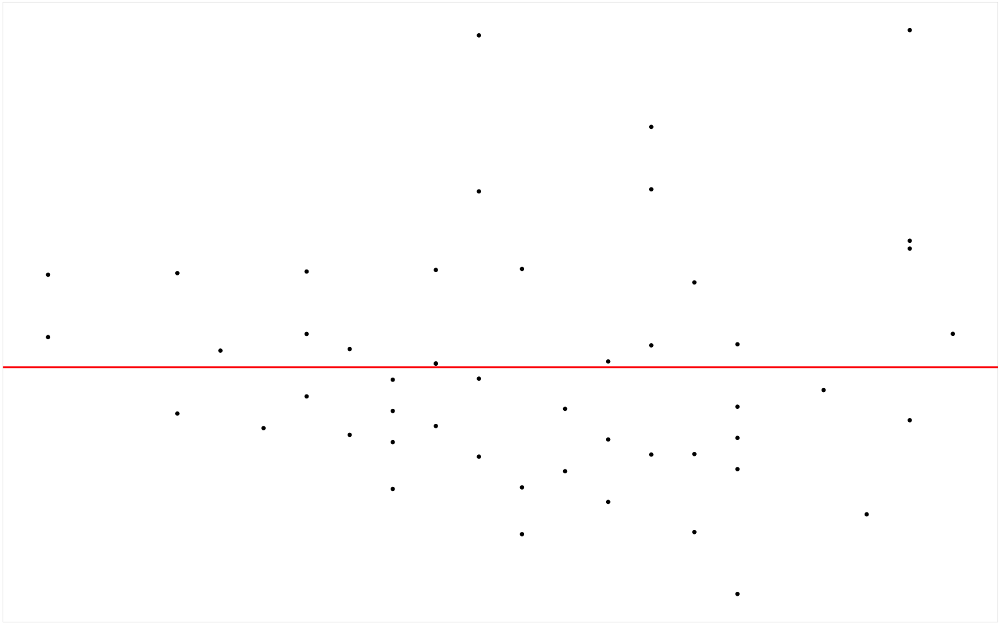
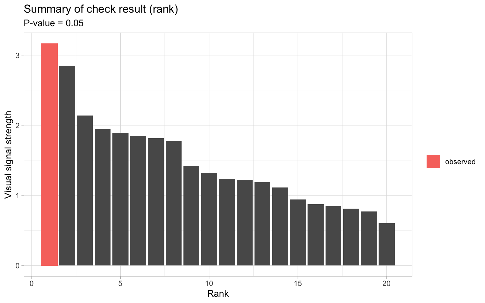

# Developing Efficient Tools for Automated Residual Plot Assessment: autovi and autovi.web

## Introduction {#sec-web-introduction}

Most statistical software offers graphical tools for diagnosing regression models. For example, the base R package `stats` [@stats] automatically generates four diagnostic plots for linear models (`lm` objects): a residuals vs. fitted values plot, a Scale-Location plot (square root of absolute residuals vs. fitted values), a normal Q-Q plot (citation here), and a residuals vs. leverage plot. Alternatively, packages hosted on The Comprehensive R Archive Network (CRAN) such as `jtools` [@jtools] provide a more comprehensive and aesthetically enhanced set of diagnostic plots. However, very few of them offer automated assessment for these plots. Users often need to manually inspect and interpret the plots, which can lead to inconsistent conclusions due to varying levels of domain and statistical knowledge. This variability makes it challenging to achieve standardized results from plot diagnostics.

The R package `autovi` was developed to address this issue by performing visual statistical testing on residual plots using computer vision. To make its algorithm and trained computer vision model widely accessible, we also developed a web-based tool called `autovi.web`. This tool provides a user-friendly web interface that allows users to diagnose their residual plots without needing to install any dependencies required by the `autovi` package.

This paper documents the design of the R package `autovi` and the web interface `autovi.web`. The rest of the paper is structured as follows: ...

## Background

- current stage of residual diagnostics (optional)
- brief introduction to visual inference
- brief overview of the second paper
- a sentence or two about why we want to develop autovi and autovi.web

## autovi

The primary goal of `autovi` is to provide rejection decisions and $p$-values for testing the null hypothesis that a regression model is correctly specified. While the classical normal linear regression model is popular and widely used, it represents a limited class of models. Therefore, `autovi` is designed to be highly modular and customizable, allowing it to handle a variety of residual diagnostic tasks.

### Quick Start


::: {.cell}

:::


```r
library(autovi)
checker <- auto_vi(fitted_model = lm(dist ~ speed, data = cars), 
                   keras_model = get_keras_model("vss_phn_32"))
checker$check()
checker
```


::: {.cell}
::: {.cell-output-display}
{width=768}
:::
:::

::: {.cell}

:::

::: {.cell}

:::

::: {.cell}

```{.r .cell-code}
checker$summary_plot()
```

::: {.cell-output-display}
{width=768}
:::
:::


### Modularized Workflow


::: {.cell}
::: {.cell-output-display}
{#fig-autovi-diag width=100%}
:::
:::


The workflow of `autovi` begins with the user providing a regression model and concludes with the delivery of visual signal strength and p-value to the user. An overview diagram of the workflow is provided in @fig-autovi-diag.

The workflow comprises two primary inputs, namely "Regression Model" and "Keras Model", and 10 core modules, including "Data Extraction", "Bootstrapping and Model Refitting", "Fitted Values and Residuals Extraction", "Auxiliary Computation", "Null Residual Simulation", "Plotting", "Plot Saving", "Image Reading and Resizing", "Visual Signal Strength Prediction" and "P-value Computation". Each module is designed to make minimal assumptions about the preceding modules, allowing for user customizations without impacting the overall workflow. The "Visual Signal Strength Prediction" and "P-value Computation" modules are predefined methods and can not be overriden, though users can interact with them directly via function arguments. The "Image Reading and Resizing" module is also unchangeable but it will adapt to different Keras models by checking their input shapes. The remaining seven modules are designed to be overriadble, accommodating users' specific needs. We will discuss these modules in details in the following sections.

#### Initialization

To manage workflow state and enable customizable modules, the `autovi` workflow is implemented using the `bandicoot` object-oriented programming framework. This framework allows for seamless integration of user-supplied data, methods, and results, storing them all within a single cohesive object.

An `autovi` checker can be initialized by supplying two primary inputs, including a regression model object, such as an `lm` object representing the result of a linear regression model, and a trained computer vision model compatible with the `Keras` Application Programming Interface (API).

The corresponding function for this step is `auto_vi` as used in the following example code. The `get_keras_model` is a helper function for retrieving trained `Keras` model from the web. We will further discuss it in @sec-trained-model-hosting.


::: {.cell}

```{.r .cell-code}
library(autovi)
checker <- auto_vi(fitted_model = lm(dist ~ speed, data = cars), 
                   keras_model = get_keras_model("vss_phn_32"))
checker
```
:::


Optionally, the user may specify the node index of the output layer of the trained computer vision model to be monitored by the checker via the `node_index` argument if there are multiple output nodes. This is particularly useful for multiclass classifiers when the user wants to use one of the nodes as a visual signal strength indicator.

#### Fitted Values and Residuals Extraction

To create a residual plot, both fitted values and residuals are required. By convention, statistical models in R, such as `lm` (linear model) and `glm` (generalized linear model), support the use of the generic functions `fitted` and `resid` for extracting these values. The "Fitted Values and Residuals Extraction" module uses the same set of generic functions by default. However, since generic functions only work with classes that have appropriate method implementations, users can override the `get_fitted_and_resid` method if their model class does not support these generic functions.

The following code example will returns a `tibble` of two columns: `.fitted` and `.resid` for fitted values and residuals, respectively 


::: {.cell}

```{.r .cell-code}
checker$get_fitted_and_resid()
```

::: {.cell-output .cell-output-stdout}

```
# A tibble: 50 × 2
   .fitted .resid
     <dbl>  <dbl>
 1   -1.85   3.85
 2   -1.85  11.8 
 3    9.95  -5.95
 4    9.95  12.1 
 5   13.9    2.12
 6   17.8   -7.81
 7   21.7   -3.74
 8   21.7    4.26
 9   21.7   12.3 
10   25.7   -8.68
# ℹ 40 more rows
```


:::
:::


The result of the module will be passed to "Auxiliary Computation" for computing auxiliary inputs of computer vision model, and "Plotting" modules for generating residual plots.


#### Data Extraction

The "Data Extraction" module involves extracting the model frame from the model object. This is typically done using the `model.frame` generic function, as implemented in the default method `get_data`. Alternatively, users can provide the data used for fitting the regression model via the `data` argument when constructing the checker, or they can override the method to suit their needs. It is worth noting that this module is not necessary if bootstrapping is not required by the user, as the model frame is not used in other steps.

The following code example will returns a `data.frame` representing the model frame of the fitted regression model


::: {.cell}

```{.r .cell-code}
checker$get_data() |> head()
```

::: {.cell-output .cell-output-stdout}

```
  dist speed
1    2     4
2   10     4
3    4     7
4   22     7
5   16     8
6   10     9
```


:::
:::


The result of the module will be passed to "Bootstrapping and Model Refitting" for getting bootstrapped regression models.

#### Bootstrapping and Model Refitting

#### Auxiliary Computation

Sometimes, a residual plot alone may not be sufficient for determining visual signal strength. For example, when the residual plot has significant overlapping, the trend and shape of the residual pattern can be difficult to identify. It can be helpful to include auxiliary variables, such as the number of observations, as inputs to the computer vision model. `autovi` addresses this need with internal functions built into the checker that automatically detect the number of inputs required by the provided Keras model. If multiple inputs are needed, the checker invokes the `auxiliary` method to compute auxiliary inputs. By default, this method calculates four scagnostics, "Monotonic", "Sparse", "Striped", and "Splines, using the `cassowaryr` package, as well as the number of observations. This approach aligns with the training process of our trained computer vision models

The following code example returns a `data.frame` with five columns: four for the scagnostics and one for the number of observations


::: {.cell}

```{.r .cell-code}
checker$auxiliary()
```

::: {.cell-output .cell-output-stdout}

```
# A tibble: 1 × 5
  measure_monotonic measure_sparse measure_splines measure_striped     n
              <dbl>          <dbl>           <dbl>           <dbl> <int>
1            0.0621          0.470          0.0901            0.62    50
```


:::
:::


The result of this module will be passed to the Keras model as part of the inputs.


#### Null Residual Simulation

The "Null Residual Simulation" module, as its name suggests, is responsible for simulating null residuals consistent with the model assumptions. For linear regression models, this assumes the model is correctly specified and simulates random draws from the residual rotation distribution [@buja2009statistical]. Other types of regression models, such as `glm` (generalized linear model) and `gam` (generalized additive model), generally can not use the same method to efficiently simulate null residuals. Therefore, it is highly recommended that users override the `null_method` for this module to suit their specific model.

The following code example returns a `tibble` of two columns: `.fitted` and `.resid` for fitted values and null residuals, respectively


::: {.cell}

```{.r .cell-code}
checker$null_method()
```

::: {.cell-output .cell-output-stdout}

```
# A tibble: 50 × 2
   .fitted  .resid
     <dbl>   <dbl>
 1   -1.85   0.297
 2   -1.85 -15.3  
 3    9.95  18.5  
 4    9.95   3.67 
 5   13.9   29.0  
 6   17.8    2.69 
 7   21.7    2.95 
 8   21.7   -8.31 
 9   21.7  -21.2  
10   25.7   22.0  
# ℹ 40 more rows
```


:::
:::


The result of this module will be passed to the "Plotting" module for generating residual plots.

#### Plotting

Plotting is a crucial aspect of residual plot diagnostics because aesthetic elements like marker size, marker color, and auxiliary lines impact the presentation of information. There are computer vision models trained to handle images captured in various scenarios. For example, the VGG16 model can classify objects in images taken under different lighting conditions and is robust to image rotation. However, data plots are a special type of image as the plotting style can always be consistent if controlled properly. Therefore, we assume computer vision models built for reading residual plots will be trained with residual plots of a specific aesthetic style. In this case, it is best to predict plots using the same style for optimal performance. The "Plotting" module handles this aspect. By default, it replicates the style we used to generate the training samples for the computer vision models. In brief, the residual plot omits axis text and ticks, titles, and background grid lines, featuring only a red line at $y = 0$. Essentially, it retains only the necessary components of a residual plot. If the computer vision model is trained with a different but consistent plot style, the corresponding method `plot_resid` should be overridden.


The following code example generates a `ggplot` object with the described aesthetic style


::: {.cell}

```{.r .cell-code}
checker$plot_resid()
```

::: {.cell-output-display}
{width=768}
:::
:::


#### Plot Saving

Another aspect of a standardized residual plot is its resolution. The original image format we used was 420 pixels in height and 525 pixels in width. This resolution was chosen because the original lineup, containing 20 residual plots in a 4x5 grid, is represented by an image of 2100 by 2100 pixels. If a different image size is required, the corresponding method `save_plot` can be overridden.

The following code example saves a residual plot to a temporary file and returns the path to that file as a string


::: {.cell}

```{.r .cell-code}
checker$plot_resid() |> checker$save_plot()
```

::: {.cell-output .cell-output-stdout}

```
[1] "/var/folders/61/bv7_1qzs20x6fjb2rsv7513r0000gn/T//RtmpJj8kCV/file175de3d6ab512.png"
```


:::
:::


The result of this module will be passed to the "Image Reading and Resizing" module to be converted to a Numpy array.

#### Image Reading and Resizing

When training computer vision models, it is common practice to test multiple input sizes for the same architecture to find the optimized setup. This requires the original training image to be prepared at a higher resolution than needed and then resized to fit the input size during training. `autovi` includes a built-in class, `KERAS_WRAPPER`, to facilitate this task. This Keras wrapper class has a method, `image_to_array`, that can read an image as a `PIL` image using the `pillow` Python package, resize it to the target input size needed by the Keras model, and convert it to a `numpy` array.

To construct a `KERAS_WRAPPER` object, you need to provide the Keras model as the main argument. However, users typically do not need to use this class directly, as the `autovi` checker can automatically call its methods when performing visual signal strength predictions.

The following code example reads an image of a residual plot and resizes it to 32 by 32 pixels to make it compatible with the computer vision model's input shape.


::: {.cell}

```{.r .cell-code}
wrapper <- keras_wrapper(keras_model = checker$keras_model)  
input_array <- checker$plot_resid() |> 
  checker$save_plot() |>
  wrapper$image_to_array()
input_array$shape
```

::: {.cell-output .cell-output-stdout}

```
(1, 32, 32, 3)
```


:::
:::


The result of this module will be passed to the "Visual Signal Strength Prediction" module as input.

#### Visual Signal Strength Prediction

Visual signal strength, as defined in (cite here), is an estimate of the distance between the input residual plot and a theoretically good residual plot. However, visual signal strength can be defined in various ways, similar to how distance between two points can be measured differently. The key is to compare the visual signal strength of the true residual plot with that of the null residual plots to determine if it significantly deviates from the null distribution.

There are multiple ways to obtain visual signal strength from the checker, with the most direct being the `vss` method. By default, it predicts the visual signal strength for the true residual plot. If a `ggplot` or a `data.frame`, such as null residuals generated by the `null_method`, is explicitly passed to this method, it will use that input to predict visual signal strength accordingly.

Another way to obtain visual signal strength is by calling the `check` and `lineup_check` methods. These comprehensive methods perform extensive diagnostics on the true residual plot and store the visual signal strength in the `check_result` field of the checker. Additionally, for obtaining visual signal strength for null residual plots and bootstrapped residual plots, there are two specialized methods, `null_vss` and `boot_vss`, designed for this purpose respectively.

The following code example predicts the visual signal strength for the residual plot of the fitted regression model


::: {.cell}

```{.r .cell-code}
checker$vss()
```

::: {.cell-output .cell-output-stdout}

```
# A tibble: 1 × 1
    vss
  <dbl>
1  3.16
```


:::
:::


The following code example predicts the visual signal strength for five null residual plots


::: {.cell}

```{.r .cell-code}
checker$null_vss(5L)
```

::: {.cell-output .cell-output-stdout}

```
# A tibble: 5 × 1
    vss
  <dbl>
1 0.861
2 1.72 
3 1.21 
4 1.79 
5 0.762
```


:::
:::


The following code example predicts the visual signal strength for five bootstrapped residual plots


::: {.cell}
::: {.cell-output .cell-output-stdout}

```
# A tibble: 5 × 1
    vss
  <dbl>
1  2.97
2  3.13
3  3.72
4  2.16
5  2.95
```


:::
:::


The result of the module will be passed to the "P-value Computation" module for calculating $p$-value and making a rejection decision.

#### P-value Computation

For a visual test conducted by a single observer using the lineup protocol, the minimum $p$-value is $1/m$, where $m$ is the number of residual plots in a lineup. This is because the Type-I error of this test is $1/m$. Similarly, when performing a lineup check via the `lineup_check` method, the checker generates $m-1$ null plots to combine with the true residual plot, forming a lineup. It then calculates the $p$-value as the ratio of plots with visual signal strength greater than or equal to that of the true plot. The $p$-value of this test is also bounded by $1/m$.

Another way to perform a visual test is to assume a null distribution for visual signal strength and then estimate quantiles of this null distribution as critical values. The $p$-value in this case is the ratio of null plots with visual signal strength greater than or equal to that of the true residual plot. This method typically requires evaluating a large number of null residual plots, as done in the `check` method.

The following code example performs a lineup check with $m = 20$. The `p_value` method will use the correct formula to compute $p$-value according to the check type. Note that the result is subject to randomness due to the small lineup size.


::: {.cell}

```{.r .cell-code}
checker$lineup_check(lineup_size = 20L)
checker$p_value()
```

::: {.cell-output .cell-output-stdout}

```
[1] 0.1
```


:::
:::


The following code example evaluates 100 null residual plots and 100 bootstrapped residual plots, such that the null distribution and bootstrapped distribution of visual signal strength can be estimated accurately. It then computes the $p$-value and prints the checker to get detailed breakdown of the check result.


::: {.cell}

```{.r .cell-code}
checker$check(boot_draws = 100L, null_draws = 100L)
checker$p_value()
```

::: {.cell-output .cell-output-stdout}

```
[1] 0.01980198
```


:::
:::

::: {.cell}

```{.r .cell-code}
checker
```

::: {.cell-output .cell-output-stderr}

```

```


:::

::: {.cell-output .cell-output-stderr}

```
── <AUTO_VI object>
Status:
 - Fitted model: lm
 - Keras model: (None, 32, 32, 3) + (None, 5) -> (None, 1)
    - Output node index: 1
 - Result:
    - Observed visual signal strength: 3.162 (p-value = 0.0198)
    - Null visual signal strength: [100 draws]
       - Mean: 1.303
       - Quantiles: 
          ╔═════════════════════════════════════════════════╗
          ║   25%    50%    75%    80%    90%    95%    99% ║
          ║0.8469 1.1012 1.6525 1.7563 1.9991 2.4538 3.1508 ║
          ╚═════════════════════════════════════════════════╝
    - Bootstrapped visual signal strength: [100 draws]
       - Mean: 2.58 (p-value = 0.0495049504950495)
       - Quantiles: 
          ╔══════════════════════════════════════════╗
          ║  25%   50%   75%   80%   90%   95%   99% ║
          ║2.144 2.762 3.105 3.208 3.351 3.452 3.542 ║
          ╚══════════════════════════════════════════╝
    - Likelihood ratio: 0.5767 (boot) / 0.04987 (null) = 11.56 
```


:::
:::


### Summary Plots


::: {.cell}

```{.r .cell-code}
checker$check(boot_draws = 100L, null_draws = 100L)
checker$summary_plot()
```

::: {.cell-output-display}
{width=768}
:::
:::

::: {.cell}

```{.r .cell-code}
checker$lineup_check(lineup_size = 20L)
checker$summary_plot()
```

::: {.cell-output-display}
{width=768}
:::
:::


### Keras Model Wrapper


::: {.cell}

```{.r .cell-code}
wrapper <- keras_wrapper(checker$keras_model)
wrapper$list_layer_name()
```

::: {.cell-output .cell-output-stdout}

```
 [1] "input_1"                  "tf.__operators__.getitem"
 [3] "tf.nn.bias_add"           "grey_scale"              
 [5] "block1_conv1"             "batch_normalization"     
 [7] "activation"               "block1_conv2"            
 [9] "batch_normalization_1"    "activation_1"            
[11] "block1_pool"              "dropout"                 
[13] "block2_conv1"             "batch_normalization_2"   
[15] "activation_2"             "block2_conv2"            
[17] "batch_normalization_3"    "activation_3"            
[19] "block2_pool"              "dropout_1"               
[21] "block3_conv1"             "batch_normalization_4"   
[23] "activation_4"             "block3_conv2"            
[25] "batch_normalization_5"    "activation_5"            
[27] "block3_conv3"             "batch_normalization_6"   
[29] "activation_6"             "block3_pool"             
[31] "dropout_2"                "block4_conv1"            
[33] "batch_normalization_7"    "activation_7"            
[35] "block4_conv2"             "batch_normalization_8"   
[37] "activation_8"             "block4_conv3"            
[39] "batch_normalization_9"    "activation_9"            
[41] "block4_pool"              "dropout_3"               
[43] "block5_conv1"             "batch_normalization_10"  
[45] "activation_10"            "block5_conv2"            
[47] "batch_normalization_11"   "activation_11"           
[49] "block5_conv3"             "batch_normalization_12"  
[51] "activation_12"            "block5_pool"             
[53] "dropout_4"                "global_max_pooling2d"    
[55] "additional_input"         "concatenate"             
[57] "dense"                    "dropout_5"               
[59] "activation_13"            "dense_1"                 
```


:::
:::

::: {.cell}

```{.r .cell-code}
checker$plot_resid() |>
  checker$save_plot() |>
  wrapper$image_to_array() |>
  wrapper$predict(auxiliary = checker$auxiliary())
```

::: {.cell-output .cell-output-stdout}

```
# A tibble: 1 × 1
    vss
  <dbl>
1  3.16
```


:::
:::


### Trained Model Hosting {#sec-trained-model-hosting}

### Dependency Considerations

## autovi.web


The R package `autovi` is designed to provide rejection decisions and $p$-values for testing the null hypothesis that a regression model is correctly specified. To construct a checker with `autovi`, one needs to supply a regression model object—typically an `lm` object representing the result of a linear regression model and a trained computer vision model compatible with the `Keras` API.

The regression model object is used to extract the fitted values and residuals for creating a residual plot. Additionally, a residual rotation technique is applied to the model object to generate null residuals, which are residuals consistent with the null hypothesis. For a linear regression model, this is conventionally achieved by simulating new random standard normal draws and using them as responses to refit the linear regression model.

Having null plots, which are residual plots consisting of null residuals and the original fitted values, is crucial for constituting a visual test. If the visual test were conducted by humans, a lineup consisting of $m-1$ null plots and one true residual plot would be presented to several observers. Observers would then be asked to select the plot they find most different out of the $m$ residual plots. If many observers correctly identify the true residual plot as the most different, it provides evidence for rejecting the null hypothesis that the model is correctly specified. This is because, under the null hypothesis, the true residual plot should be indistinguishable from the null plots.

Instead of human observers, the visual test in `autovi` is performed by a computer vision model. This model is trained to report the visual signal strength of each individual plot in a lineup. The visual signal strength estimates the divergence of the empirical residual distribution from the ideal residual distribution, effectively measuring the degree of model violations. The higher the visual signal strength, the more evidence there is against the null hypothesis.

The computer vision model's training involves estimating this divergence or distance, which quantifies how much the residuals deviate from what is expected under a correctly specified model. More details about the mathematical derivation and the training process of the computer vision model can be found in the paper by Li et.al. (2024).

Furthermore, the computer vision model used in `autovi` requires a fixed-size 4D tensor as input. The dimensions of this tensor are as follows: the first dimension represents the batch size, the second dimension represents the width of the image, the third dimension represents the height of the image, and the fourth dimension represents the number of channels. The model outputs a numeric vector that represents the visual signal strength for each image in the batch. The computer vision model is also trained with a set of fixed-aesthetic residual plots, which means that the input images must be produced using the same data pipeline that was used for the training data preparation. This consistency is crucial for ensuring that the model can accurately interpret and analyze new data.

A significant portion of our web interface is dedicated to managing this data pipeline. This involves processing the user-provided data to generate input images that conform to the required format for the computer vision model. The pipeline ensures that the residual plots created from the user data match the aesthetics and format of the training data, enabling the model to provide accurate visual signal strength assessments.

<!-- Our web interface simplifies this process for the user by automating the necessary steps to transform their data into the appropriate input format. Users can upload their CSV files, and the interface handles the extraction of residuals, the creation of residual plots, and the formatting of these plots into 4D tensors. This seamless integration allows users to focus on interpreting the results rather than on the technical details of data preparation. -->

### Data Pipeline

In this section, we will describe the entire data pipeline, including handling uploaded data, creating and saving fixed-aesthetic residual plots, loading and transforming images to the desired input format, and predicting visual signal strength.

#### Input File Format

As described in Section \ref{background}, the `autovi` package requires a regression model object to initialize the diagnostics. However, it is impractical to ask users to upload an R regression model object for inspection. There are several reasons for this: 

1. **User Complexity**: Saving an R object to the filesystem involves extra steps and requires users to have specific knowledge.
2. **Data Sensitivity**: The regression model object may contain sensitive, non-shareable data.
3. **File Size**: The R object is often unnecessarily large because it contains extra information not needed for diagnostics.

To simplify the process, the web interface instead requests a CSV file. This CSV file should contain at least two columns: `.fitted`, representing the fitted values, and `.resid`, representing the residuals. Additionally, it can contain an optional column `.sample` to indicate the ID of the residual plot. This is particularly useful if the user wants to evaluate a lineup of residual plots.

Compared to an R model object, a CSV file can be easily generated by various software programs, not just R. CSV files are widely accepted and can be easily viewed and modified using common desktop applications like Excel. CSV files are generally less sensitive than raw data because most information about the predictors is excluded. 

#### Plot Drawing and Image Loading

The training data for the computer vision models consist of $32 \times 32$ RGB residual plots. These plots display fitted values on the x-axis and residuals on the y-axis. All labels, including axis texts, are excluded, and no background grid lines are included in the plots. Residual points are drawn in black with a size of 0.5 points, where there are 72.27 points per inch. Additionally, a horizontal red line is drawn at $y = 0$ to help the computer vision model determine if the residual points are uniformly distributed on both sides of the line. The plot is then saved as a PNG file with a resolution of $420 \times 525$ pixels. This resolution mimics a typical lineup residual plot, which has a resolution of $2100 \times 2100$ pixels and is arranged in four rows and five columns.

The uploaded CSV file will be partitioned based on the values in the optional column `k`. If no optional column `k` is present, the entire data set will be used as one partition. Each partition will utilize the plot specifications to generate one residual plot and produce one PNG file.

The saved PNG plot is loaded as an array, where each entry contains a pixel value of the image. This array is then resized to match the input layer shape of the computer vision model, which is $1 \times 32 \times 32 \times 3$. If multiple images are needed for visual signal strength estimation, the arrays can be stacked together to form a larger array with the shape $n \times 32 \times 32 \times 3$, where $n$ is the number of images.

#### Visual Signal Strength Estimation

Finally, the processed image array will be fed into the computer vision model, and returned a vector of visual signal strength which are numerical values always greater than zero.
 
### Software Stack

#### Backend

To utilize the `autovi` R package, the server hosting our web interface must have a functional R interpreter. A static HTML page cannot accomplish this task, as it only serves static resources to the client and lacks the capability to execute R code. The alternative option would be WebR, a version of R designed to run within a web browser. However, integrating WebR introduces complexities into the design of the web interface, which we will explore further in Section XXX. Additionally, 
The resizing of the image is originally done by the Python `Pillow` library. To maintain the same data pipeline, we also need a working Python interpreter. Given the required conditions, we have three options: (1) Use a traditional backend like the `Spring` framework written in Java for handling all the income and outcome traffic of the web interface. Meanwhile, install R and Python in the server and call them when needed. (2) Use a Python backend framework like `Flask` so that the `Pillow` library can be used natively. Still, R needs to be installed and correctly configured in the server and called when needed. (3) Use a R backend framework like `Shiny`. This is similar to the second option, but requires to install and configure Python separately.

Option one requires a good understanding


<!-- Thus, we chose to implement the web interface with a shiny server. Shiny server is a backend framework written in R, so it allows us to receive user's input and interactively update the output rendered on the client side using R code.  -->

<!-- We deploy the shiny server using the services provided by Posit, called `shinyapps.io`. It is responsible for reading in the uploaded CSV file with the `readr` R package, splitting the dataset with the `dplyr` R package and drawing the residual plots with the `ggplot2` R package. The resulting PNG files are stored in the temporary directory of the remote machine. -->


<!-- The saved PNG file  -->


#### Frontend


#### Communications between Software

### Distribute Keras Model Files

### Performance Optimization

## Conclusions
