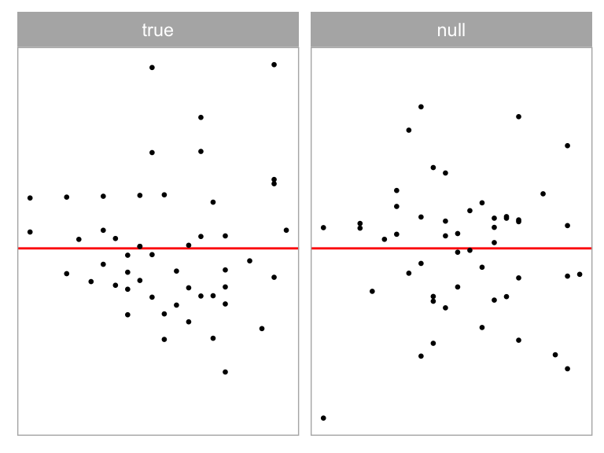
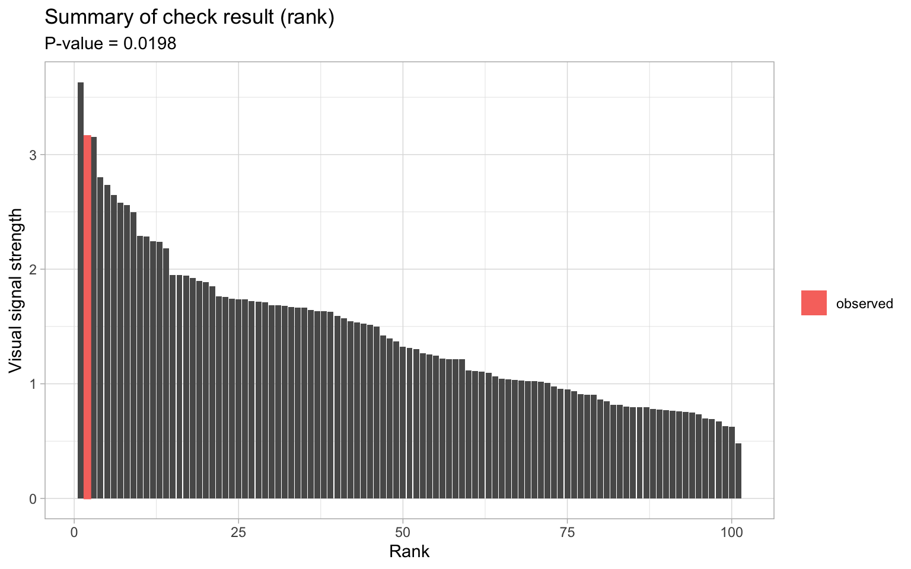
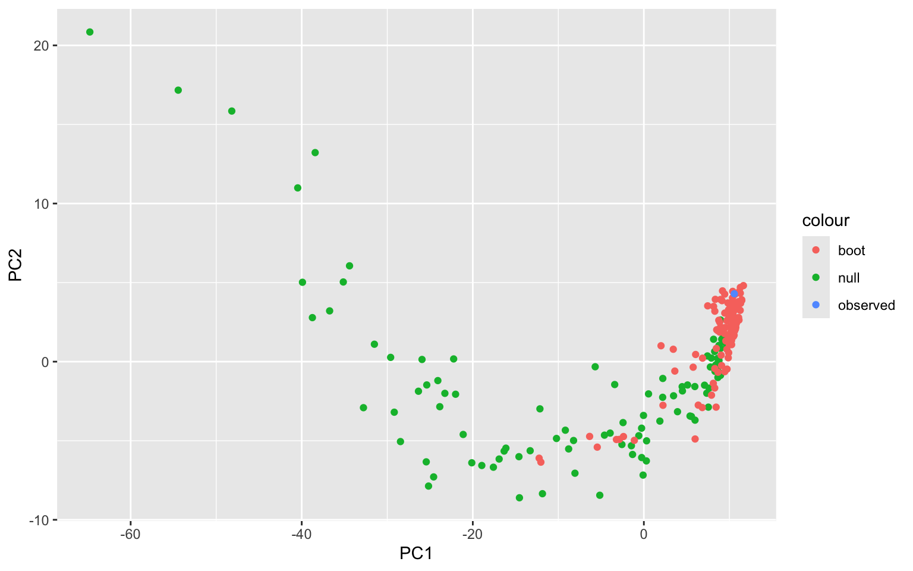

# Software for Automated Residual Plot Assessment: autovi and autovi.web {#sec-third-paper}

Regression software is widely available today, but tools for effective diagnostics are still lagging. Although it is advised to diagnose a linear model by plotting residuals, it required human effort which can be prohibit the efforts. Here we describe a new R package that includes a computer vision model for automated assessment of residual plots, and an accompanying shiny app for ease of use. 

## Introduction {#sec-autovi-introduction}

Regression analysis is a fundamental statistical technique widely used for modeling data from many fields. To diagnose the fit of a model it is recommended that the residuals are plotted. If the fit is good, any variation remaining should be noise, consistent with sampling from a distribution specified by the error model. Deviations that might be observed from a residual plot are non-normality, heteroscedasticity, and other associations with the fitted values. @paper-1 established that visual methods for assessing residuals are superior to conventional testing in that they are not so sensitive to small departures. @sec-second-paper provides a computer vision model to alleviate the human labor needed to visually assessing residual plots. The next step is to deliver the use of the computer vision model to potential users, so that it can be widely used to the benefit of the analytics community. 

Software for regression analysis tools is widely available. The Comprehensive R Archive Network (CRAN) [@hornik2012comprehensive] hosts a vast array of packages, many of which provide tools to diagnose models using residual plots. These packages can be broadly categorized into three groups: general purpose, enhanced diagnostics, diagnostics with statistical testing.

General-purpose regression analysis tools are the largest and most commonly used group. These packages aren't specifically designed for graphical diagnostics of residuals in linear regression but offer this functionality as part of a broader set of statistical tools. These include the `stats` package [@stats], which includes common diagnostic plots like residuals vs fitted values, quantile-quantile (Q-Q) plots, and residuals vs leverage plots. Other packages such as `jtools` [@jtools], `olsrr` [@olsrr], `rockchalk` [@rockchalk], and `ggResidpanel` [@ggresidpanel] provide similar graphical tools with alternative aesthetic styles or interactive features. They all fundamentally deliver diagnostic plots as outlined in the classic text @cook1982residuals. <!-- However, consistently drawing accurate conclusions from these tools can be challenging due to individual differences in interpreting statistical graphics.--> As noted in @li2024plot, relying solely on subjective assessments of data plots can lead to problems, such as over-interpreting random patterns as model violations.

Enhanced visual diagnostics forms the second group, which offer advanced visual aids for interpreting diagnostic plots. This includes `ecostats` [@ecostats], which adds simulation envelopes to  residual plots, and `DHARMa` [@dharma], which compares the empirical 0.25, 0.5, and 0.75 quantiles in scaled residuals with their theoretical counterparts. `DHARMa`'s focus is detecting model violations such as heteroscedasticity and incorrect functional forms, and uncovering issues specific to generalized linear models and mixed-effect models, like over/under-dispersion. <!--By offering these enhanced visualizations, `DHARMa` enables users to more easily identify potential issues in their regression models that might not be immediately apparent with standard diagnostic plots. In summary, this group of packages enhances the interpretability of diagnostic plots by drawing attention to critical elements such as trends, clusters, and outliers.--> It also adds results from conventional tests as annotations, labels, or text within the plot, to assist in avoiding misinterpretation. 

Statistical testing for visual discoveries is the third group, which focuses on providing tools for conducting formal statistical tests for visual discoveries obtained from diagnostic plots [@buja2009statistical]. Packages include the `nullabor` [@nullabor] `HLMdiag` [@loy2014hlmdiag] and `regressinator` [@regressinator]. These enables users to compare the actual residual plot with samples from null distributions, and can help quantify the significance of patterns. <!--This approach addresses the issue of inconsistent interpretation of diagnostic plots by bridging the gap between visual inspection and formal statistical inference, thus offering a more robust framework for regression diagnostics.

Conducting a visual test for a residual plot, which is among the most common diagnostic plots in regression analysis, involves using a lineup protocol. In this protocol, the true residual plot is embedded within a lineup of several null plots and presented to one or more observers. The null plots are created by simulating residuals consistent with the null hypothesis $H_0$ that the regression model is correctly specified. Observers are then asked to identify the plot that appears most different from the others. If a significant percentage of observers correctly identify the true residual plot, it provides evidence against the $H_0$, as according to @buja2009statistical, the true residual plot would have no distinguishable difference from the null plots if all residuals are generated by the same process.-->

However, as discussed in @sec-second-paper, the lineup protocol has significant limitations in large-scale applications due dependence on human labor. Thus a computer vision model was developed with an associated statistical testing procedure to automate the assessment of residual plots. This model takes a residual plot and a vector of auxiliary variables (such as the number of observations) as inputs and outputs a visual signal strength. This strength estimates the distance between the residual distribution of the fitted regression model and the reference distribution assumed under correct model specification.

<!--By estimating the visual signal strength for all plots in a lineup, we can compute a $p$-value based on the ratio of plots with visual signal strength greater than or equal to that of the true residual plot. This $p$-value has a lower bound of one divided by the number of plots in the lineup. Additionally, we can construct a null distribution of visual signal strength using the strengths of null plots.

We can also apply bootstrapping to obtain a distribution of visual signal strengths. This involves bootstrapping the data used to fit the linear regression model, refitting the model to obtain bootstrapped residuals, and then using the computer vision model to predict visual signal strength for these residuals. The resulting bootstrapped distribution can be compared against the null distribution. If these distributions are largely similar, it suggests that the bootstrapped residual plots are similar to the null plots. The proportion of bootstrapped visual signal strengths exceeding a critical value (such as the 95% sample quantile of the null distribution) indicates how often the assumed regression model would be considered incorrect if the data could be repeatedly obtained from the same data-generating process.-->

To make the statistical testing procedure and trained computer vision model widely accessible, we developed the R package `autovi`, and a web interface, `autovi.web` to make it easy for users to automatically read their residual plots with the trained computer vision model.

The remainder of this chapter is structured as follows: @sec-autovi provides a detailed documentation of the `autovi` package, including its usage and infrastructure. @sec-autovi-web focuses on the `autovi.web` interface, describing its design and usage, along with illustrative examples. Finally, @sec-autovi-conclusion presents the main conclusions of this work.

## R package: autovi {#sec-autovi}

The main purpose of `autovi` is to provide rejection decisions and $p$-values for testing whether a regression model is correctly specified. The package introduces a novel approach to automating statistical analysis, particularly in the interpretation of residual plots. The name `autovi` stands for automated visual inference. While initially designed for linear regression residual diagnostics, it has the potential to be extended to broader visual inference applications, as we'll discuss in section @sec-autovi-infrastructure.

### Implementation {#sec-autovi-implementation}

`autovi` is built upon the `bandicoot` object-oriented programming (OOP) system [@bandicoot], which marks a departure from R's conventional S3 generic system. The adoption of an OOP architecture enhances flexibility and modularity, enabling users to redefine key functions within the infrastructure through method overriding. While similar functionality could be replicated using R's S3 system with generic functions, the OOP system offers a more structured and extensible foundation for the package.

The infrastructure of `autovi` demonstrates the effective integration of multiple programming languages and libraries to create a comprehensive analytical tool. It depends on five core libraries from Python and R, each contributing critically to the analysis pipeline. In Python, `pillow` [@clark2015pillow] handles image processing tasks, including reading PNG files of residual plots, resizing them, and converting them into input tensors for further analysis. The `TensorFlow` [@abadi2016tensorflow] library, a cornerstone of contemporary machine learning, is employed to predict the visual signal strength of these residual plots,  utilizing a pre-trained convolutional neural network.

Within the R environment, `autovi` utilizes several powerful libraries. `ggplot2` [@ggplot2] is employed to generate the initial residual plots, which are then saved as PNG files, using as the primary visual input for the analysis. The `cassowaryr` [@mason2022cassowaryr] library calculates scagnostics (scatter plot diagnostics) of the residual plots, providing numerical features that capture various statistical properties of the plots. These scagnostics complement the visual analysis by supplying quantitative metrics as secondary input to the computer vision model. The `reticulate` [@reticulate] package is used to bridge R and Python, allowing for seamless communication between the two languages and supporting an integrated infrastructure.

The package includes internal functions to check the current Python environment used by the `reticulate` package. If the necessary Python packages are not installed in the Python interpreter, an error will be raised. If you want to select a specific Python environment, you can do so by calling the `reticulate::use_python()` function before using the `autovi` package.

### Installation

The `autovi` package is available on CRAN. It is actively developed and maintained, with the latest updates accessible on GitHub at [https://github.com/TengMCing/autovi](https://github.com/TengMCing/autovi). The code discussed in this chapter is based on `autovi` version 0.4.1.


### Usage {#sec-autovi-quick-start}

To get started quickly, users need only three lines of code to obtain a summary of the automated residual assessment:


::: {.cell}

:::


```r
library(autovi)
checker <- residual_checker(fitted_model = lm(dist ~ speed, data = cars))
checker$check()
```


::: {.cell}

:::

::: {.cell}
::: {.cell-output .cell-output-stderr}

```

```


:::

::: {.cell-output .cell-output-stderr}

```
── <AUTO_VI object>
Status:
 - Fitted model: lm
 - Keras model: UNKNOWN
    - Output node index: 1
 - Result:
    - Observed visual signal strength: 3.162 (p-value = 0.0396)
    - Null visual signal strength: [100 draws]
       - Mean: 1.274
       - Quantiles: 
          ╔═════════════════════════════════════════════════╗
          ║   25%    50%    75%    80%    90%    95%    99% ║
          ║0.8021 1.1109 1.5751 1.6656 1.9199 2.6564 3.3491 ║
          ╚═════════════════════════════════════════════════╝
    - Bootstrapped visual signal strength: [100 draws]
       - Mean: 2.786 (p-value = 0.05941)
       - Quantiles: 
          ╔══════════════════════════════════════════╗
          ║  25%   50%   75%   80%   90%   95%   99% ║
          ║2.452 2.925 3.173 3.285 3.463 3.505 3.652 ║
          ╚══════════════════════════════════════════╝
    - Likelihood ratio: 0.7275 (boot) / 0.06298 (null) = 11.55 
```


:::
:::


1. Load the package using the `library()` function.
2. Construct a checker with two inputs: a linear regression model and a pre-trained Keras model [@chollet2015keras].
3. Use `get_keras_model()`, a function provided by `autovi`, to download a trained computer vision model (described in @sec-second-paper) from GitHub. "vss_phn_32" specifies a model that predicts visual signal strength (vss) and is trained on residuals with polynomial, heteroskedasticity, and non-normality patterns (phn). More details about the hosted models will be provided in section @sec-trained-model-hosting.
4. Call the `check()` method of the checker with default arguments. This predicts the visual signal strength for the true residual plot, 100 null plots, and 100 bootstrapped plots, storing the predictions internally.
5. Use the `print()` function to generate a concise report of the check results.

The report highlights key findings such as the visual signal strength of the true residual plot and the $p$-value of the automated visual test. The $p$-value is the ratio of null plots having visual signal strength greater than or equal to the true residual plot. We typically reject the null hypothesis when the $p$-value is smaller than or equal to 5%. The report also provides sample quantiles of visual signal strength for null and bootstrapped plots, helping to explain the severity and likelihood of model violations.

Although the $p$-value is sufficient for automated decision-making, users are strongly encouraged to visually inspect the original residual plot alongside a sample null plot. This visual comparison can clarify why $H_0$ is either rejected or not, and help identify potential remedies. The `plot_pair()` method facilitates this comparison. 


::: {.cell}

```{.r .cell-code}
checker$plot_pair()
```

::: {.cell-output-display}
{width=384}
:::
:::


This method displays the true residual plot on the left and a null plot on the right. Users should look for any distinct visual patterns in the true residual plot that are absent in the null plot. It's recommended to run this function multiple times to confirm any visual findings, as each execution generates a new random null plot for comparison.

The package offers a straightforward visualization of the assessment result through the `summary_plot()` function.


::: {.cell}

```{.r .cell-code}
checker$summary_plot()
```

::: {.cell-output-display}
{width=768}
:::
:::


In the visualization, the blue area represents the density of visual signal strength for null residual plots, while the red area shows the density for bootstrapped residual plots. The dashed line indicates the visual signal strength of the true residual plot, and the solid line marks the critical value at a 95% significance level. The $p$-value and the likelihood ratio are displayed in the subtitle. The likelihood ratio represents the ratio of the likelihood of observing the visual signal strength of the true residual plot from the bootstrapped distribution compared to the null distribution.

Interpreting the plot involves several key aspects. If the dashed line falls to the right of the solid line, it suggests rejecting the null hypothesis. The degree of overlap between the red and blue areas indicates similarity between the true residual plot and null plots; greater overlap suggests more similarity. Lastly, the portion of the red area to the right of the solid line represents the percentage of bootstrapped models considered to have model violations.

This visual summary provides an intuitive way to assess the model's fit and potential violations, allowing users to quickly grasp the results of the automated analysis.


### Modularized Infrastructure {#sec-autovi-infrastructure}


::: {.cell}
::: {.cell-output-display}
{#fig-autovi-diag width=100%}
:::
:::


The initial motivation for developing `autovi` was to create a convenient interface for sharing the models described and trained in @sec-second-paper. However, recognizing that the classical normal linear regression model represents a restricted class of models, we sought to avoid limiting the potential for future extensions, whether by the original developers or other users. As a result, the package was designed to function seamlessly with linear regression models with minimal modification and few required arguments, while also accommodating other classes of models through partial infrastructure substitution. This modular and customizable design allows `autovi` to handle a wide range of residual diagnostics tasks.

The infrastructure of `autovi` consists of ten core modules: data extraction, bootstrapping and model refitting, fitted values and residuals extraction, auxiliary computation, null residual simulation, plotting, plot saving, image reading and resizing, visual signal strength prediction, and $p$-value computation. Each module is designed with minimal dependency on the preceding modules, allowing users to customize parts of the infrastructure without affecting its overall integrity. An overview of this infrastructure is illustrated in Figure @fig-autovi-diag.

The modules for visual signal strength prediction and $p$-value computation are predefined and cannot be overridden, although users can interact with them directly through function arguments. Similarly, the image reading and resizing module is fixed but will adapt to different Keras models by checking their input shapes. The remaining seven modules are designed to be overridable, enabling users to tailor the infrastructure to their specific needs. These modules will be discussed in detail in the following sections.

#### Initialization

An `autovi` checker can be initialized by supplying two primary inputs, including a regression model object, such as an `lm` object representing the result of a linear regression model, and a trained computer vision model compatible with the `Keras` [@chollet2015keras] Application Programming Interface (API), to the `AUTO_VI` class constructor `auto_vi()`. The input will be stored in the checker and can be accessed by the user through the `$` operator.

```r
library(autovi)
checker <- auto_vi(fitted_model = lm(dist ~ speed, data = cars), 
                   keras_model = get_keras_model("vss_phn_32"))
```

Optionally, the user may specify the node index of the output layer of the trained computer vision model to be monitored by the checker via the `node_index` argument if there are multiple output nodes. This is particularly useful for multiclass classifiers when the user wants to use one of the nodes as a visual signal strength indicator.

After initializing the object, you can print the checker to view its status.


::: {.cell}

```{.r .cell-code}
checker
```

::: {.cell-output .cell-output-stderr}

```

```


:::

::: {.cell-output .cell-output-stderr}

```
── <AUTO_VI object>
Status:
 - Fitted model: lm
 - Keras model: UNKNOWN
    - Output node index: 1
 - Result:
    - Observed visual signal strength: 3.162 (p-value = 0.0396)
    - Null visual signal strength: [100 draws]
       - Mean: 1.274
       - Quantiles: 
          ╔═════════════════════════════════════════════════╗
          ║   25%    50%    75%    80%    90%    95%    99% ║
          ║0.8021 1.1109 1.5751 1.6656 1.9199 2.6564 3.3491 ║
          ╚═════════════════════════════════════════════════╝
    - Bootstrapped visual signal strength: [100 draws]
       - Mean: 2.786 (p-value = 0.05941)
       - Quantiles: 
          ╔══════════════════════════════════════════╗
          ║  25%   50%   75%   80%   90%   95%   99% ║
          ║2.452 2.925 3.173 3.285 3.463 3.505 3.652 ║
          ╚══════════════════════════════════════════╝
    - Likelihood ratio: 0.7275 (boot) / 0.06298 (null) = 11.55 
```


:::
:::


The status includes the list of regression model classes (as provided by the built-in `class()` function), the input and output shapes of the Keras model in the standard `Numpy` format [@harris2020array], the output node index being monitored, and the assessment result. If no check has been run yet, the assessment result will display as "UNKNOWN".

#### Fitted Values and Residuals Extraction

To be able to predict visual signal strength for a residual plot, both fitted values and residuals are needed to be extracted from the regression model object supplied by the user. In R, statistical models like `lm` (linear model) and `glm` (generalized linear model) typically support the use of generic functions such as `fitted()` and `resid()` to retrieve these values. The `get_fitted_and_resid()` method, called by the checker, relies on these generic functions by default. However, generic functions only work with classes that have appropriate method implementations. Some regression modelling packages may not fully adhere to the `stats` package guidelines for implementing these functions. In such cases, overriding the method becomes necessary.

By design, the `get_fitted_and_resid()` method accepts a regression model object as input and returns a `tibble` with two columns: `.fitted` and `.resid`, representing the fitted values and residuals, respectively. If no input is supplied, the method uses the regression model object stored in the checker. Although modules in the `autovi` infrastructure make minimal assumptions about other modules, they do require strictly defined input and output formats to ensure data validation and prevent fatal bugs. Therefore, any overridden method should follow to these conventions.


::: {.cell}

```{.r .cell-code}
checker$get_fitted_and_resid()
```

::: {.cell-output .cell-output-stdout}

```
# A tibble: 50 × 2
   .fitted .resid
     <dbl>  <dbl>
 1   -1.85   3.85
 2   -1.85  11.8 
 3    9.95  -5.95
 4    9.95  12.1 
 5   13.9    2.12
 6   17.8   -7.81
 7   21.7   -3.74
 8   21.7    4.26
 9   21.7   12.3 
10   25.7   -8.68
# ℹ 40 more rows
```


:::
:::


#### Data Extraction

For linear regression model in R, the model frame contains all the data required by a formula for evaluation. This is essential for bootstrapping and refitting the model when constructing a bootstrapped distribution of visual signal strength. Typically, the model frame can be extracted from the regression model object using the `model.frame()` generic function, which is the default method used by `get_data()`. However, some regression models don't use a formula or are evaluated differently, potentially lacking a model frame. In such cases, users can either provide the data used to fit the regression model through the `data` argument when constructing the checker, or customize the method to better suit their needs. It's worth noting that this module is only necessary if bootstrapping is required, as the model frame is not used in other modules of the infrastructure.

The `get_data()` method accepts a regression model object as input and returns a `data.frame` representing the model frame of the fitted regression model. If no input is supplied, the regression model stored in the checker will be used.


::: {.cell}

```{.r .cell-code}
checker$get_data() |> 
  head()
```

::: {.cell-output .cell-output-stdout}

```
  dist speed
1    2     4
2   10     4
3    4     7
4   22     7
5   16     8
6   10     9
```


:::
:::


#### Bootstrapping and Model Refitting

Bootstrapping a regression model typically involves sampling the observations with replacement and refitting the model with the bootstrapped data. The `boot_method()` method follows this bootstrapping scheme by default. It accepts a fitted regression model and a `data.frame` as inputs, and returns a `tibble` of bootstrapped residuals. If no inputs are provided, the method uses the regression model stored in the checker and the result of the `get_data()` method. 

Note that instead of calling `get_data()` implicitly within the method, it is used as part of the default argument definition. This approach allows users to bypass the `get_data()` method entirely and directly supply a `data.frame` to initiate the bootstrap process. Many other methods in `autovi` adopt this principle when possible, where dependencies are explicitly listed in the formal arguments. This design choice enhances the reusability and isolation of modules, offers better control for testing, and simplifies the overall process.


::: {.cell}

```{.r .cell-code}
checker$boot_method(data = checker$get_data())
```

::: {.cell-output .cell-output-stdout}

```
# A tibble: 50 × 2
   .fitted .resid
     <dbl>  <dbl>
 1   27.0   -2.96
 2   38.8  -12.8 
 3   34.8   -8.82
 4   27.0  -13.0 
 5   11.2    4.76
 6   42.7   -2.68
 7   42.7   -2.68
 8   38.8  -18.8 
 9   38.8   15.2 
10   -4.47   6.47
# ℹ 40 more rows
```


:::
:::


#### Auxiliary Computation

According to @sec-second-paper, in some cases, a residual plot alone may not provide enough information to accurately determine visual signal strength. For instance, when the residual plot has significant overlap, the trend and shape of the residual pattern can be difficult to discern. Including auxiliary variables, such as the number of observations, as additional inputs to the computer vision model can be beneficial. To address this, `autovi` includes internal functions within the checker that automatically detect the number of inputs required by the provided Keras model. If multiple inputs are necessary, the checker invokes the `auxiliary()` method to compute these additional inputs.

The `auxiliary()` method takes a `data.frame` containing fitted values and residuals as input and returns a `data.frame` with five numeric columns. These columns represent four scagnostics — "Monotonic", "Sparse", "Striped", and "Splines" — calculated using the `cassowaryr` package, as well as the number of observations. This approach is consistent with the training process of the computer vision models described in @sec-second-paper. If no `data.frame` is provided, the method will default to retrieving fitted values and residuals by calling `get_fitted_and_resid()`. 

Technically, any Keras-implemented computer vision model can be adapted to accept an image as the primary input and additional variables as secondary inputs by adding a data pre-processing layer before the actual input layer. If users wish to override `auxiliary()`, the output should be a `data.frame` with a single row and the number of columns matching the supplied Keras model.


::: {.cell}

```{.r .cell-code}
checker$auxiliary()
```

::: {.cell-output .cell-output-stdout}

```
# A tibble: 1 × 5
  measure_monotonic measure_sparse measure_splines measure_striped     n
              <dbl>          <dbl>           <dbl>           <dbl> <int>
1            0.0585          0.470          0.0901            0.62    50
```


:::
:::


#### Null Residual Simulation {#sec-autovi-null-method}

A fundamental element of the automated residual assessment described in @sec-second-paper is comparing the visual signal strength of null plots with that of the true residual plot. However, due to the variety of regression models, there is no universal method for simulating null residuals that are consistent with model assumptions. Fortunately, for classical normal linear regression models, null residuals can be effectively simulated using the residual rotation method, as outlined in @buja2009statistical. This process involves generating random draws from a standard normal distribution, regressing these draws on the original predictors, and then rescaling the resulting residuals by the ratio of the residual sum of squares to the that of the original linear regression model. Other regression models, such as `glm` (generalized linear model) and `gam` (generalized additive model), generally cannot use this method to efficiently simulate null residuals. Therefore, it is recommended that users override the `null_method()` to suit their specific model. The `null_method()` takes a fitted regression model as input, defaulting to the regression model stored in the checker, and returns a `tibble`.


::: {.cell}

```{.r .cell-code}
checker$null_method()
```

::: {.cell-output .cell-output-stdout}

```
# A tibble: 50 × 2
   .fitted  .resid
     <dbl>   <dbl>
 1   -1.85  18.2  
 2   -1.85  -0.765
 3    9.95 -12.8  
 4    9.95  18.6  
 5   13.9    2.57 
 6   17.8    7.03 
 7   21.7  -11.1  
 8   21.7  -13.2  
 9   21.7  -12.6  
10   25.7    3.57 
# ℹ 40 more rows
```


:::
:::


#### Plotting

Plotting is a crucial aspect of residual plot diagnostics because aesthetic elements like marker size, marker color, and auxiliary lines impact the presentation of information. There are computer vision models trained to handle images captured in various scenarios. For example, the VGG16 model [@simonyan2014very] can classify objects in images taken under different lighting conditions and is robust to image rotation. However, data plots are a special type of image as the plotting style can always be consistent if controlled properly. Therefore, we assume computer vision models built for reading residual plots will be trained with residual plots of a specific aesthetic style. In this case, it is best to predict plots using the same style for optimal performance. The plotting method `plot_resid()` handles this aspect. 

`plot_resid()` accepts a `data.frame` containing fitted values and residuals, along with several customization options: a `ggplot` theme, an `alpha` value to control the transparency of data points, a `size` value to set the size of data points, and a `stroke` value to define the thickness of data point edges. Additionally, it includes four Boolean arguments to toggle the display of axes, legends, grid lines, and a horizontal red line. By default, it replicates the style we used to generate the training samples for the computer vision models described in @sec-second-paper. In brief, the residual plot omits axis text and ticks, titles, and background grid lines, featuring only a red line at $y = 0$. It retains only the necessary components of a residual plot. If the computer vision model is trained with a different but consistent aesthetic style, `plot_resid()` should be overridden. 

The method returns a `ggplot` object, which can be saved as a PNG file in the following module. If no data is provided, the method will use `get_fitted_and_resid()` to retrieve the fitted values and residuals from the regression model stored in the checker.


::: {.cell}

```{.r .cell-code}
checker$plot_resid()
```

::: {.cell-output-display}
{width=384}
:::
:::


To manually generate true residual plots, null plots, or bootstrapped residual plots, you can pass the corresponding `data.frame` produced by the `get_fitted_and_resid()`, `null_method()`, and `boot_method()` methods to the `plot_resid()` method, respectively.


::: {.cell}

```{.r .cell-code}
checker$null_method() |>
  checker$plot_resid()
```

::: {.cell-output-display}
{width=384}
:::
:::


#### Plot Saving

Another key aspect of a standardized residual plot is its resolution. In @sec-second-paper, we used an image format of 420 pixels in height and 525 pixels in width. This resolution was chosen because the original set, consisting of 20 residual plots arranged in a four by five grid, was represented by an image of 2100 by 2100 pixels. The `save_plot()` method takes a `ggplot` object as input, saves it as a temporary PNG file, and returns the file path as a string. Note that the `save_plot()` method does not have default arguments, as it is not intended to be called without a plot. While an alternative design could be to save the true residual plot by default, this might be confusing for users, given that the method's name does not fully convey this functionality.


::: {.cell}

```{.r .cell-code}
checker$plot_resid() |> 
  checker$save_plot()
```

::: {.cell-output .cell-output-stdout}

```
[1] "/var/folders/z0/8wx4nmk11ts56s77dt_pjq6xw13lmk/T//Rtmpi27QUE/file1250358e5233a.png"
```


:::
:::


#### Image Reading and Resizing

When training computer vision models, it is common to test various input sizes for the same architecture to identify the optimal setup. This involves preparing the original training image at a higher resolution than required and then resizing it to match the input size during training. The `autovi` package includes a class, `KERAS_WRAPPER`, to simplify this process. This Keras wrapper class features a method called `image_to_array()`, which reads an image as a `PIL` image using the `pillow` Python package, resizes it to the target input size required by the Keras model, and converts it to a `Numpy` array.

To construct a `KERAS_WRAPPER` object, you need to provide the Keras model as the main argument. However, users generally do not need to interact with this class directly, as the `autovi` checker automatically invokes its methods when performing visual signal strength predictions. The `image_to_array()` method takes the path to the image file, the target height, and the target width as inputs and returns a `Numpy` array. If not specified, the target height and target width will be retrieved from the input layer of the Keras model by the `get_input_height()` and `get_input_width()` method of `KERAS_WRAPPER`. 

The following code example demonstrate the way to manually generate the true residual plot, save it as PNG file, and load it back as `Numpy` array.

```r
wrapper <- keras_wrapper(keras_model = checker$keras_model)  
input_array <- checker$plot_resid() |> 
  checker$save_plot() |>
  wrapper$image_to_array()
input_array$shape
```


::: {.cell}
::: {.cell-output .cell-output-stdout}

```
(1, 32, 32, 3)
```


:::
:::


#### Visual Signal Strength Prediction

Visual signal strength, as discussed in @sec-second-paper, estimates the distance between the input residual plot and a theoretically good  residual plot. It can be defined in various ways, much like different methods for measuring the distance between two points. This will not impact the `autovi` infrastructure as long as the provided Keras model can predict the intended measure.

There are several ways to obtain visual signal strength from the checker, with the most direct being the `vss()` method. By default, this method predicts the visual signal strength for the true residual plot. If a `ggplot` or a `data.frame`, such as null residuals generated by the `null_method()`, is explicitly provided, the method will use that input to predict visual signal strength accordingly. Note that if a `ggplot` is provided, auxiliary inputs must be supplied manually via the `auxiliary` argument, as we assume that auxiliary variables can not be computed directly from a `ggplot`.

Another way to obtain visual signal strength is by calling the `check()` method. This comprehensive method perform extensive diagnostics on the true residual plot and store the visual signal strength in the `check_result` field of the checker. Additionally, for obtaining visual signal strength for null residual plots and bootstrapped residual plots, there are two specialized methods, `null_vss()` and `boot_vss()`, designed for this purpose respectively.

Calling the `vss()` method without arguments will predict the visual signal strength for the true residual plot and return the result as a single-element `tibble`.

```r
checker$vss()
```


::: {.cell}
::: {.cell-output .cell-output-stdout}

```
# A tibble: 1 × 1
    vss
  <dbl>
1  3.16
```


:::
:::


Providing a `data.frame` of null residuals or a null residual plot yields the same visual signal strength.


```r
null_resid <- checker$null_method()
checker$vss(null_resid)
```


::: {.cell}
::: {.cell-output .cell-output-stdout}

```
# A tibble: 1 × 1
    vss
  <dbl>
1  1.02
```


:::
:::


```r
null_resid |>
  checker$plot_resid() |>
  checker$vss()
```


::: {.cell}
::: {.cell-output .cell-output-stdout}

```
# A tibble: 1 × 1
    vss
  <dbl>
1  1.02
```


:::
:::


The `null_vss()` helper method primarily takes the number of null plots as input. If the user wants to use a ad hoc null simulation scheme, it can be provided via the `null_method` argument. Intermediate results, including null residuals and null plots, can be returned by enabling `keep_null_data` and `keep_null_plot`. The visual signal strength, along with null residuals and null plots, will be stored in a `tibble` with three columns. The following code example demonstrates how to predict the visual signal strength for five null residual plots while keeping the intermediate results.

```r
checker$null_vss(5L, 
                 keep_null_data = TRUE, 
                 keep_null_plot = TRUE)
```


::: {.cell}
::: {.cell-output .cell-output-stdout}

```
# A tibble: 5 × 3
    vss data              plot  
  <dbl> <list>            <list>
1 1.35  <tibble [50 × 2]> <gg>  
2 0.629 <tibble [50 × 2]> <gg>  
3 1.77  <tibble [50 × 2]> <gg>  
4 1.91  <tibble [50 × 2]> <gg>  
5 1.71  <tibble [50 × 2]> <gg>  
```


:::
:::


The `boot_vss()` helper method is similar to `null_vss()`, with some differences in argument names. The following code example demonstrates how to predict the visual signal strength for five bootstrapped residual plots while keeping the intermediate results.

```r
checker$boot_vss(5L,
                 keep_boot_data = TRUE,
                 keep_boot_plot = TRUE)
```


::: {.cell}
::: {.cell-output .cell-output-stdout}

```
# A tibble: 5 × 3
    vss data              plot  
  <dbl> <list>            <list>
1  1.26 <tibble [50 × 2]> <gg>  
2  3.35 <tibble [50 × 2]> <gg>  
3  3.16 <tibble [50 × 2]> <gg>  
4  2.87 <tibble [50 × 2]> <gg>  
5  2.54 <tibble [50 × 2]> <gg>  
```


:::
:::


#### $P$-value Computation

Once we have obtained the visual signal strength from both the true residual plot and the null plots, we can compute the $p$-value. This $p$-value represents the ratio of plots with visual signal strength greater than or equal to that of the true residual plot. We can perform this calculation using the `check()` method. The main inputs for this method are the number of null plots and the number of bootstrapped plots to generate. If you need to access intermediate residuals and plots, you can enable the `keep_data` and `keep_plot` options. The method stores the final result in the `check_result` field of the object. To obtain the p-value using the `check()` method, you can use the following code.

```r
checker$check(boot_draws = 100L, null_draws = 100L)
checker$check_result$p_value
```


::: {.cell}
::: {.cell-output .cell-output-stdout}

```
[1] 0.01980198
```


:::
:::


You can also check the $p$-value by printing the checker, which includes it in the summary report.


::: {.cell}

```{.r .cell-code}
checker
```

::: {.cell-output .cell-output-stderr}

```

```


:::

::: {.cell-output .cell-output-stderr}

```
── <AUTO_VI object>
Status:
 - Fitted model: lm
 - Keras model: UNKNOWN
    - Output node index: 1
 - Result:
    - Observed visual signal strength: 3.162 (p-value = 0.0198)
    - Null visual signal strength: [100 draws]
       - Mean: 1.42
       - Quantiles: 
          ╔═════════════════════════════════════════════════╗
          ║   25%    50%    75%    80%    90%    95%    99% ║
          ║0.9296 1.3095 1.7277 1.7810 2.2497 2.5835 3.1570 ║
          ╚═════════════════════════════════════════════════╝
    - Bootstrapped visual signal strength: [100 draws]
       - Mean: 2.623 (p-value = 0.05941)
       - Quantiles: 
          ╔══════════════════════════════════════════╗
          ║  25%   50%   75%   80%   90%   95%   99% ║
          ║2.144 2.770 3.160 3.256 3.444 3.589 3.705 ║
          ╚══════════════════════════════════════════╝
    - Likelihood ratio: 0.5334 (boot) / 0.02943 (null) = 18.12 
```


:::
:::


### Summary Plots

After executing the `check()` method, `autovi` offers two visualization options for the assessment result through the `summary_plot()` method, including the density plot and the rank plot. We have already discussed and interpreted the density plot in an earlier section. Here, we would like to highlight the flexibility in choosing which elements to display in the density plot. For instance, you can omit the bootstrapped distribution by setting `boot_dist` to `NULL`. Similarly, you can hide the null distribution (`null_dist`), the $p$-value (`p_value`), or the likelihood ratio (`likelihood_ratio`) as needed. The following example demonstrates how to create a summary plot without the results from bootstrapped plots.


::: {.cell}

```{.r .cell-code}
checker$summary_plot(boot_dist = NULL,
                     likelihood_ratio = NULL)
```

::: {.cell-output-display}
{width=768}
:::
:::


This customization allows you to focus on specific aspects of the assessment, tailoring the visualization to your analytical needs.

The rank plot, creating by setting `type` to "rank", is a bar plot where the x-axis represents the rank and the y-axis shows the visual signal strength. The bar for the true residual plot is colored in red. By examining the rank plot, you can intuitively understand how the observed visual signal strength compares to the null visual signal strengths and identify any outliers in the null distribution.


::: {.cell}

```{.r .cell-code}
checker$summary_plot(type = "rank")
```

::: {.cell-output-display}
{width=768}
:::
:::


### Feature Extraction

In addition to predicting visual signal strength and computing $p$-values, `autovi` offers methods to extract features from any layer of the Keras model. To see which layers are available in the current Keras model, you can use the `list_layer_name()` method from the `KERAS_WRAPPER` class.

The following code example lists the layer names of the currently used Keras model:


::: {.cell}

```{.r .cell-code}
wrapper <- keras_wrapper(checker$keras_model)
wrapper$list_layer_name()
```

::: {.cell-output .cell-output-stdout}

```
NULL
```


:::
:::


Among these layers, the "global_max_pooling2d" layer is a 2D global max pooling layer that outputs the results from the last convolutional blocks. As @simonyan2014very noted, all preceding convolutional blocks can be viewed as a large feature extractor. Consequently, the output from this layer provides features that can be utilized for various purposes, such as performing transfer learning.

To obtain the features, provide the layer name using the `extract_feature_from_layer` argument in the `predict()` method. This will return a `tibble` with the visual signal strength and all features extracted from that layer. Each row corresponds to one plot. The features will be flattened into 2D and named with the prefix "f_" followed by a number from one to the total number of features.

```r
checker$plot_resid() |>
  checker$save_plot() |>
  wrapper$image_to_array() |>
  wrapper$predict(auxiliary = checker$auxiliary(),
                  extract_feature_from_layer = "global_max_pooling2d")
```


::: {.cell}
::: {.cell-output .cell-output-stdout}

```
# A tibble: 1 × 257
    vss   f_1   f_2   f_3   f_4   f_5    f_6   f_7    f_8   f_9   f_10  f_11
  <dbl> <dbl> <dbl> <dbl> <dbl> <dbl>  <dbl> <dbl>  <dbl> <dbl>  <dbl> <dbl>
1  3.16 0.151     0     0     0     0 0.0203 0.109 0.0203     0 0.0834     0
# ℹ 245 more variables: f_12 <dbl>, f_13 <dbl>, f_14 <dbl>, f_15 <dbl>,
#   f_16 <dbl>, f_17 <dbl>, f_18 <dbl>, f_19 <dbl>, f_20 <dbl>, f_21 <dbl>,
#   f_22 <dbl>, f_23 <dbl>, f_24 <dbl>, f_25 <dbl>, f_26 <dbl>, f_27 <dbl>,
#   f_28 <dbl>, f_29 <dbl>, f_30 <dbl>, f_31 <dbl>, f_32 <dbl>, f_33 <dbl>,
#   f_34 <dbl>, f_35 <dbl>, f_36 <dbl>, f_37 <dbl>, f_38 <dbl>, f_39 <dbl>,
#   f_40 <dbl>, f_41 <dbl>, f_42 <dbl>, f_43 <dbl>, f_44 <dbl>, f_45 <dbl>,
#   f_46 <dbl>, f_47 <dbl>, f_48 <dbl>, f_49 <dbl>, f_50 <dbl>, f_51 <dbl>, …
```


:::
:::


Alternatively, the `AUTO_VI` class provides a way to extract features using the `vss()` method. This method is essentially a high-level wrapper around the `predict()` method of `KERAS_WRAPPER`, but it offers a more straightforward interface and better default arguments.

The results from the previous code example can be replicated with a single line of code as shown below.

```r
checker$vss(extract_feature_from_layer = "global_max_pooling2d")
```


::: {.cell}
::: {.cell-output .cell-output-stdout}

```
# A tibble: 1 × 257
    vss   f_1   f_2   f_3   f_4   f_5    f_6   f_7    f_8   f_9   f_10  f_11
  <dbl> <dbl> <dbl> <dbl> <dbl> <dbl>  <dbl> <dbl>  <dbl> <dbl>  <dbl> <dbl>
1  3.16 0.151     0     0     0     0 0.0203 0.109 0.0203     0 0.0834     0
# ℹ 245 more variables: f_12 <dbl>, f_13 <dbl>, f_14 <dbl>, f_15 <dbl>,
#   f_16 <dbl>, f_17 <dbl>, f_18 <dbl>, f_19 <dbl>, f_20 <dbl>, f_21 <dbl>,
#   f_22 <dbl>, f_23 <dbl>, f_24 <dbl>, f_25 <dbl>, f_26 <dbl>, f_27 <dbl>,
#   f_28 <dbl>, f_29 <dbl>, f_30 <dbl>, f_31 <dbl>, f_32 <dbl>, f_33 <dbl>,
#   f_34 <dbl>, f_35 <dbl>, f_36 <dbl>, f_37 <dbl>, f_38 <dbl>, f_39 <dbl>,
#   f_40 <dbl>, f_41 <dbl>, f_42 <dbl>, f_43 <dbl>, f_44 <dbl>, f_45 <dbl>,
#   f_46 <dbl>, f_47 <dbl>, f_48 <dbl>, f_49 <dbl>, f_50 <dbl>, f_51 <dbl>, …
```


:::
:::


The argument `extract_feature_from_layer` is also available in other functions that build on the `vss()` method, including `null_vss()`, `boot_vss()`, and `check()`.

The package provides tools for analyzing these extracted features through the `feature_pca()` method and its associated visualization method, `feature_pca_plot()`. The `feature_pca()` method performs principal component analysis (PCA) on the features to reduce their dimensionality. However, it requires that a `check()` is performed first, as it relies on results stored in `check_result`. Alternatively, you can manually provide features using the `feature`, `null_feature`, and `boot_feature` arguments for the true residual plot, null plots, and bootstrapped plots, respectively. The `feature_pca()` method returns a tibble containing both the original features and the principal components. The rotation matrix and standard deviations of each principal component are stored as attributes.

```r
checker$check(null_draws = 100L,
              boot_draws = 100L,
              extract_feature_from_layer = "global_max_pooling2d")
checker$feature_pca()
```


::: {.cell}
::: {.cell-output .cell-output-stdout}

```
# A tibble: 201 × 458
     f_1   f_2   f_3   f_4   f_5    f_6     f_7    f_8   f_9   f_10   f_11
   <dbl> <dbl> <dbl> <dbl> <dbl>  <dbl>   <dbl>  <dbl> <dbl>  <dbl>  <dbl>
 1 0.151 0     0     0     0     0.0203 0.109   0.0203 0     0.0834 0     
 2 1.17  1.87  2.10  1.99  0.646 0.806  1.16    1.12   1.11  0.230  1.77  
 3 0.898 1.95  1.89  1.98  0.683 0.783  1.09    1.03   1.08  0.401  1.62  
 4 0.699 2.64  2.41  3.27  1.41  1.29   1.94    1.50   1.26  1.16   2.50  
 5 0.494 1.22  0.836 0.867 0     0.212  0.231   0.172  0.835 0      0.589 
 6 0.356 0.912 0.203 0.589 0     0      0.0225  0.142  0.485 0.0311 0.162 
 7 0.514 1.25  0.817 0.900 0     0.165  0.176   0.172  0.833 0      0.589 
 8 1.13  2.15  2.30  2.26  0.785 0.932  1.31    1.21   1.25  0.363  1.95  
 9 0.270 0.795 0.123 0.438 0     0      0       0.0272 0.501 0      0.0608
10 0.245 0.807 0     0.357 0     0      0.00358 0.0494 0.426 0      0     
# ℹ 191 more rows
# ℹ 447 more variables: f_12 <dbl>, f_13 <dbl>, f_14 <dbl>, f_15 <dbl>,
#   f_16 <dbl>, f_17 <dbl>, f_18 <dbl>, f_19 <dbl>, f_20 <dbl>, f_21 <dbl>,
#   f_22 <dbl>, f_23 <dbl>, f_24 <dbl>, f_25 <dbl>, f_26 <dbl>, f_27 <dbl>,
#   f_28 <dbl>, f_29 <dbl>, f_30 <dbl>, f_31 <dbl>, f_32 <dbl>, f_33 <dbl>,
#   f_34 <dbl>, f_35 <dbl>, f_36 <dbl>, f_37 <dbl>, f_38 <dbl>, f_39 <dbl>,
#   f_40 <dbl>, f_41 <dbl>, f_42 <dbl>, f_43 <dbl>, f_44 <dbl>, f_45 <dbl>, …
```


:::
:::


The `feature_pca_plot()` method visualizes the results of the PCA. By default, it plots the first principal component on the x-axis and the second principal component on the y-axis, with points colored according to their origin, true residual plots, null residual plots, or bootstrapped residual plots. Users can customize the x and y axes by specifying symbols for the `x` and `y` arguments. Additionally, the `col_by_set` option can be disabled if you prefer not to use coloring.


::: {.cell}

```{.r .cell-code}
checker$feature_pca_plot()
```

::: {.cell-output-display}
{width=768}
:::
:::


When interpreting the principal component scatter plot, look for any outliers within the null or bootstrapped groups. Assess whether the null group and the bootstrapped group form a single cluster or distinct clusters. Additionally, evaluate whether the observed point is distinct from the null group.

### Trained Model Hosting {#sec-trained-model-hosting}

The trained computer vision models described in @sec-second-paper are hosted on a GitHub repository at [https://github.com/TengMCing/autovi_data](https://github.com/TengMCing/autovi_data). Currently, there are six models available. You can view them by calling `list_keras_model()`, which will return a `tibble` showing the input shape and a description of each model.


::: {.cell}
::: {.cell-output .cell-output-stdout}

```
# A tibble: 6 × 9
  model_name  path              volume_path volume_size input_height input_width
  <chr>       <chr>             <chr>             <int>        <int>       <int>
1 vss_32      keras_model/vss_… keras_mode…           4           32          32
2 vss_64      keras_model/vss_… keras_mode…           1           64          64
3 vss_128     keras_model/vss_… keras_mode…           8          128         128
4 vss_phn_32  keras_model/vss_… keras_mode…           2           32          32
5 vss_phn_64  keras_model/vss_… keras_mode…           8           64          64
6 vss_phn_128 keras_model/vss_… keras_mode…           8          128         128
# ℹ 3 more variables: input_channels <int>, auxiliary_input_size <int>,
#   description <chr>
```


:::
:::


The `get_keras_model()` function can be used to download a model to a temporary directory and load it into memory using `TensorFlow`. It requires only the model name, which is the value in the first column of the `tibble` returned by `list_keras_model()`.

### Extending the `AUTO_VI` class

`bandicoot` is a lightweight object-oriented system with Python-like syntax that supports multiple inheritance and incorporates a Python-like method resolution order. The system is inspired by the OOP frameworks implemented in R6 [r6] and Python. In this section, we will provide essential details for extending the `autovi::AUTO_VI` class using `bandicoot`.

In `bandicoot`, a class is declared using the `bandicoot::new_class()` function, where parent classes are provided as positional arguments, and the class name is specified through the `class_name` argument. The output of `bandicoot::new_class()` is an environment with the S3 class `bandicoot_oop`. Printing a `bandicoot` object provides a summary of the object, which can be customized via the `..str..` magic method.


::: {.cell}

:::


An extended class inherits attributes and methods from its parent class(es), so it will behave similarly to them. This can be verified using the built-in `names()` function.


::: {.cell}
::: {.cell-output .cell-output-stdout}

```
 [1] "..dir.."              "instantiate"          "summary_rank_plot"   
 [4] "del_attr"             "boot_method"          "null_vss"            
 [7] "..class_tree.."       "..instantiated.."     "summary"             
[10] "..str.."              "..repr.."             "likelihood_ratio"    
[13] "plot_resid"           "null_method"          "summary_density_plot"
[16] "..mro.."              "set_attr"             "..methods.."         
[19] "p_value"              "check"                "rotate_resid"        
[22] "lineup_check"         "..method_env.."       "feature_pca_plot"    
[25] "get_data"             "check_result"         "..new.."             
[28] "..bases.."            "plot_pair"            "feature_pca"         
[31] "plot_lineup"          "has_attr"             "summary_plot"        
[34] "..class.."            "auxiliary"            "get_attr"            
[37] "..len.."              "..type.."             "..init.."            
[40] "get_fitted_and_resid" "save_plot"            "boot_vss"            
[43] "vss"                 
```


:::
:::


To register a method for an extended class, you need to pass the class as the first argument and the method as a named argument to the `bandicoot::register_method()` function. Within a method, `self` can be used as a reference to the class or object environment. The following code example overrides the `null_method()` with a function that simulates null residuals from the corresponding normal distribution. This approach differs from the default null residual simulation scheme described in @sec-autovi-null-method. Although less efficient than the default method for linear regression models, it provides an alternative way to simulate null residuals. This method is particularly useful when the fitted model is unavailable, and only the fitted values and residuals are accessible, as discussed in @sec-autovi-web.


::: {.cell}
::: {.cell-output .cell-output-stdout}

```
# A tibble: 50 × 2
   .fitted .resid
     <dbl>  <dbl>
 1   -1.85 -12.4 
 2   -1.85 -18.8 
 3    9.95  22.6 
 4    9.95 -27.5 
 5   13.9   28.7 
 6   17.8  -13.6 
 7   21.7   21.4 
 8   21.7   12.5 
 9   21.7  -16.2 
10   25.7   -2.93
# ℹ 40 more rows
```


:::
:::


To create an object in `bandicoot`, you need to call the `instantiate()` method of a class. Alternatively, you can build a convenient class constructor for your class. It is recommended to provide the full list of arguments in the class constructor instead of using `...`, as this makes it easier for integrated development environments (IDEs) like RStudio to offer argument completion hints to the user.


::: {.cell}

:::


## Web interface: autovi.web {#sec-autovi-web}

The web interface, called `autovi.web`, builds on `autovi` to provide potential users easier access to automated residual plot assessment. It eliminates software installation issues, so users no longer need to struggle with managing Python environments or installing and maintaining the correct versions of libraries. The interface is cross-platform available across devices and operating systems, and accessible to users without R programming knowledge. An added benefit is that updates can be controlled centrally so that users will always have the latest features. 

<!-- In @sec-autovi-implementation, we discussed how `autovi` relies on several Python libraries, with a particularly strong dependency on `TensorFlow`. Managing a Python environment and correctly installing `TensorFlow` on a local machine can be challenging for many users. Moreover, `TensorFlow` is a massive library that undergoes continuous development, which inevitably leads to compatibility issues arising from differences in library versions. These challenges can create significant barriers for users who want to perform residual assessments with the `autovi` package.

Recognizing these potential barriers, we were motivated to design and implement a web interface called `autovi.web`. This web-based solution offers several major advantages. First, it eliminates dependency issues, so users no longer need to struggle with complex Python environments or worry about installing and maintaining the correct versions of libraries. The web interface handles all these dependencies on the server side. Second, `autovi.web` lowers the entry barrier by being user-friendly and accessible to individuals who may not be familiar with R programming. This broadens the potential user base of `autovi`, allowing more researchers and analysts to benefit from its capabilities. Third, the web interface can be updated centrally, ensuring that all users always have access to the latest features and improvements without needing to manage updates locally. Lastly, `autovi.web` offers cross-platform accessibility, allowing users to access it from any device with a web browser, increasing flexibility and convenience.


`autovi.web` is available at [autoviweb.netlify.app](autoviweb.netlify.app). The implementation discussed in this chapter is based on `autovi.web` version 0.1.0. By providing this web interface, we aim to significantly reduce the technical hurdles associated with using `autovi`, making advanced residual assessment techniques more accessible to a wider audience of researchers and data analysts. This approach aligns with modern trends in data science tools, where web-based interfaces are increasingly used to make advanced analytical techniques more widely available.
-->

### Implementation

`autovi.web` is built using the `shiny` [@shiny] and `shinydashboard` [@shinydashboard] R packages. Hosted on the [shinyapps.io](https://www.shinyapps.io) domain, the application is accessible through any modern web browser. The R packages `htmltools` [@htmltools] and `shinycssloaders` [@shinycssloaders] are used to render markdown documentation in shiny application, and for loading animations for shiny widgets, respectively.

Determining the best way to implement the interface was difficult. In our initial planning for `autovi.web`, we considered implementing the entire web application using the `webr` framework [@webr], which would have allowed the entire application to run directly in the user's browser. However, this approach was not feasible at the time of writing this chapter. The reason is that one of the R packages `autovi` depends on the R package `splancs` [@splancs], which uses compiled Fortran code. A working Emscripten (XXX reference?) version of this package, which would be required for `webr`, was not available.

We also explored the possibility of implementing the web interface using frameworks built on other languages, such as Python. However, server hosting domains that natively support Python servers typically do not have the latest version of R installed. Additionally, calling R from Python is typically done using the `rpy2` Python library, but this approach can be awkward when dealing with language syntax related to non-standard evaluation, making it challenging to develop our application in this manner. Another option we considered was renting a server where we could have full control, such as those provided by cloud platforms like Google Cloud Platform (GCP) or Amazon Web Services (AWS). However, correctly setting up the server and ensuring a secure deployment requires significant expertise, which we did not possess at the time. Ultimately, we decided that the most practical solution was to use the `shiny` and `shinydashboard` frameworks, which are well-established in the R community and offer a solid foundation for web application development.

The server-side configuration of `autovi.web` is carefully designed to support its functionality. Most required Python libraries, including `pillow` and `NumPy`, are pre-installed on the server. These libraries are integrated into the Shiny application using the `reticulate` package, which provides an interface between R and Python.

Due to the resource allocation policy of shinyapps.io, the server enters a sleep mode during periods of inactivity, resulting in the clearing of the local Python virtual environment. Consequently, when the application "wakes up" for a new user session, these libraries need to be reinstalled. While this ensures a clean environment for each session, it may lead to slightly longer loading times for the first user after a period of inactivity.

In contrast to `autovi`, `autovi.web` does not use the native Python version of `TensorFlow`. Instead, it leverages `TensorFlow.js`, a JavaScript library that allows the execution of machine learning models directly in the browser. This choice enables native browser execution, enhancing compatibility across different user environments, and shifts the computational load from the server to the client-side. `TensorFlow.js` also offers better scalability and performance, especially when dealing with resource-intensive computer vision models on shinyapps.io. 

While `autovi` requires downloading pre-trained computer vision models from GitHub, these models in ".keras" file format are incompatible with `TensorFlow.js`. Therefore, we extract and store the model weights in JSON files and include them as extra resources in the Shiny application. When the application initializes, `TensorFlow.js` rebuilds the computer vision model using these pre-stored weights.

To allow communication between `TensorFlow.js` and other components of the Shiny application, the `shinyjs` R package is used. This package allows calling custom JavaScript code within the Shiny framework. The specialized JavaScript code for initializing `TensorFlow.js` and calling `TensorFlow.js` for visual signal strength prediction is deployed alongside the Shiny application as additional resources.

### Design {#sec-autovi-web-design}


::: {.cell}
::: {.cell-output-display}
![Overview of the `autovi.web` graphical user interface (GUI). This default view may change based on user interactions. Region 1 is the sidebar menu, containing the residual assessment tab and the information tab. Region 2 is the data upload panel, where users can provide a CSV file and specify the type of data it contains. Region 3 includes dropdown menus for selecting the columns to be analyzed, a slider to control the number of bootstrapping samples, and a numeric input box for setting the simulation seed. Region 4 displays the initialization status and offers a button to start the analysis. Region 5 is empty in the default view but will be populated with results once the analysis is started. ](figures/autovi_web.png){#fig-autovi-web width=100%}
:::
:::


While the R package `autovi` aims to provide tools that can be extended to broader visual inference applications, `autovi.web` is only focus on to for providing  a straightforward and clean user interface. An overview of the graphical user interface of `autovi.web` is provided in @fig-autovi-web. This is the default view of the web application, and there are five regions that user can mainly interact with. Region 1 of @fig-autovi-web is a sidebar menu which can switch between the analysis page and the information page. The analysis page is the focus of this section. 

Region 2 of @fig-autovi-web is a panel for data uploading and CSV type selection. Clicking the "upload CSV" button opens a window where the user can select a file from their local system. The data status displayed above the button provides information about the number of rows and columns in the current dataset. Additionally, there are two example datasets available beneath the "upload CSV" button: one is a lineup example using a CSV file with three columns, and the other is a single plot example using a CSV file with two columns. More details about these example datasets are be discussed in @sec-autovi-web-example.

While the `autovi` package typically expects a fitted regression model object provided by the user, this approach is impractical for a web interface. Saving the R model object to the filesystem involves extra steps and requires users to have specific knowledge, which does not align with the goal of the web application. Moreover, the regression model object may contain sensitive, non-shareable data, making it unsuitable for uploading. Additionally, model objects are often unnecessarily large, containing extra information not needed for residual diagnostics. In contrast, a CSV file is easier to generate using various software programs, not just R. CSV files are widely accepted and can be easily viewed and modified using common desktop applications like Excel. They are generally less sensitive than raw data, as they exclude most information about the predictors. 

The web application is designed to assess either a single residual plot or a lineup of residual plots. Therefore, it accepts only two types of CSV files: one with at least two columns representing the fitted values and residuals of a single residual plot, and another with at least three columns, where the additional column serves as the label or identifier for a lineup of multiple residual plots. For a single residual plot, 19 null plots are generated by simulating normal random draws from a distribution with the same variance as the original residual plot, and comparisons are made with the original residual plot. For a lineup, comparisons are made among the plots within the lineup. After uploading the CSV file, the user must select the correct format to ensure the web interface interprets the data correctly. 


::: {.cell}
::: {.cell-output-display}
{#fig-autovi-web-type width=100%}
:::
:::


Region 3 of @fig-autovi-web is a panel for column selection and simulation settings. As shown in @fig-autovi-web, if the CSV type is set to a single residual plot, there will be two dropdown menus for specifying the columns for fitted values and residuals, respectively. The default variable names for these columns are `.fitted` and `.resid`. After uploading the CSV file, the content of these dropdown menus will be updated to reflect the existing columns in the dataset. As displayed in @fig-autovi-web-type, for the CSV type that is a lineup of multiple residual plots, an additional dropdown menu will appear for specifying the column of residual plot labels. The default variable name for this column is `.sample`. If this variable name does not exist in the dataset, the dropdown menu will remain empty, allowing the user to specify the correct column. The number of levels for each option in this dropdown menu will be displayed to help avoid the selection of a variable with too many levels, which could significantly slow down the application due to extensive computation.

Under the simulation settings, there is a slider for specifying the number of bootstrapped samples needed for the assessment. A higher value on this slider will result in a more accurate bootstrap distribution estimation, though it will require more computation time. The simulation seed can be set in a numeric input box below the slider to control the reproducibility of the assessment. By default, a random seed is set each time the web page is refreshed. When the CSV type is a lineup of multiple residual plots, an optional dropdown menu will appear next to the simulation seed input box, allowing the user to specify an identifier for the true residual plot. If no label is provided for the true residual plot, the assessment will only estimate the visual signal strength for each residual plot in the lineup, without providing a $p$-value, as it cannot be computed. Consequently, some result panels may be missing due to insufficient information. This option is useful when the lineup consists solely of null plots or if the user simply wants to obtain the visual signal strength for multiple residual plots.

Region 4 of @fig-autovi-web is the panel for triggering the assessment. It contains a large play button to start the assessment. Above the play button, a text message displays the status of `TensorFlow.js`, allowing users to monitor whether the JavaScript library and Keras model have been loaded correctly. The play button will remain disabled until both the data status in Region 1 and the `TensorFlow.js` status in Region 4 indicate that everything is ready, with both showing a green status.

Once the play button is clicked, region 5 of @fig-autovi-web will be populated with panels displaying the assessment results. Generally, there will be four result panels, as shown in @fig-autovi-web-result and @fig-autovi-web-result2. 


::: {.cell}
::: {.cell-output-display}
{#fig-autovi-web-result width=100%}
:::
:::

::: {.cell}
::: {.cell-output-display}
{#fig-autovi-web-result2 width=100%}
:::
:::

::: {.cell}
::: {.cell-output-display}
{#fig-autovi-web-gradient-hide width=100%}
:::
:::


Region 6 of @fig-autovi-web-result contains an interactive table created with the R package `DT` [@dt], which provides the visual signal strength. This table includes four columns: `.sample`, `vss`, `rank`, and `null`. The `.sample` column shows the residual plot labels. For a CSV type that is a lineup, these labels are taken from an identifier column in the dataset specified by the user. In the case of the CSV type is a single residual plot, labels are automatically generated from 1 to 20, with the true residual plot receiving a randomly assigned label. The `vss` column displays the visual signal strength for each residual plot, rounded to three decimal places. The `rank` column indicates the ranking of each residual plot based on visual signal strength. The `null` column reveals whether the plot is a null plot. For the CSV type that is a single residual plot, only the true residual plot will have "false" in this column, while all other plots will be marked "true." For the CSV type that is a lineup, if the true residual plot identifier has not been provided, this column will show "NA" to represent missing values. If the identifier is provided by user, the column behaves as if the CSV type is a single residual plot.

The `DT` table provides several interactive features. Users can download the table in four formats, including text, CSV, Excel, and PDF, using the buttons located above the table. Additionally, the table is searchable via the text input field also positioned above it. Below the table, a text message displays the $p$-value of the assessment for the true residual plot and summarizes the number of null plots with visual signal strength greater than that of the true residual plot. This helps the user determine whether the true residual plot shows visual patterns that suggest model violations.

Region 7 of @fig-autovi-web-result provides a lineup of plots corresponding to each `.sample` value from the table in Region 6. Due to space limitations, a maximum of 20 residual plots will be displayed, ensuring that the true residual plot, if known, will be included in the lineup. The plots are generated using `ggplot2`, the same as in `autovi`. Users can perform a visual test with this lineup to check if the true residual plot is distinguishable from the other plots, helping to determine the significance of model violations.

Region 8 of @fig-autovi-web-result2 displays the density plot for bootstrapped visual signal strength and null visual signal strength. The densities are shown in distinct colors that are friendly for colorblind users. A solid vertical line marks the visual signal strength of the true residual plot, while rug lines at the bottom of the plot provide a clearer view of individual cases. Below the plot, a text message indicates the number and percentage of bootstrapped residual plots that would be rejected by the visual test when compared to the null plots. Note that the bootstrapped residual plots in this application are generated differently from `autovi`. Since we do not have the R model object, we can not refit the regression model with bootstrapped data. Instead, we bootstrap the residuals of the true residual plot directly to obtain bootstrapped residual plots. As as result, this panel will disappear when the true residual plot is unknown.

Region 9 of @fig-autovi-web-result2 displays an attention map for the true residual plot, generated by computing the gradient of the Keras model's output with respect to the greyscale input of the plot. The attention map helps to understand how the Keras model predicts visual signal strength and which areas it is focusing on. We use a greyscale input because it is easier to generate a clear attention map in this format, and it usually conveys all the essential information, as most of the important details of the plot are drawn in black. If the $p$-value of the true residual plot is greater than 0.05, checking the attention map is not necessary. However, to provide users with the option to review it if they wish, a button will be available, as shown in @fig-autovi-web-gradient-hide. This button allows users to toggle the display of the attention map.

### Usage, from the user perspective

The user would follow the order of the numbered steps displayed in the main user interface as shown in @fig-autovi-web, <!--Since the design details have already been covered in @sec-autovi-web-design, we will not repeat the functionality of each panel in this section.-->
as follows: 

- Step 1: uploading a CSV file by clicking the "upload CSV" button. A window will pop up, allowing the user to select the CSV file. The CSV file should contain at least two columns representing fitted values and residuals of a residual plot. If a lineup needs to be evaluated, the CSV file should contain an additional column for labels of residual plot.  
- In Step 2, the user specifies the CSV type based on the uploaded file, choosing between a single residual plot or a lineup of multiple residual plots. 
- Step 3 involves selecting the appropriate columns for fitted values, residuals, and, optionally, labels of residual plots, from the dataset. 
- In Step 4, the user sets the number of bootstrapped draws needed for the analysis; more draws provide a better estimate of the bootstrapped distribution but result in slower computation. The user should also set the seed to control the simulation. If the dataset contains a lineup and the true residual plot is known, select its label. 
- Finally, clicking the play button will initiate the analysis, and the user can review the result panels.

### Example {#sec-autovi-web-example}


## Conclusions {#sec-autovi-conclusion}

## Availability

The web interface is housed at [autoviweb.netlify.app](autoviweb.netlify.app). 

The source code for both packages are available at XXX, and the current version of `autovi` can be installed from CRAN.
