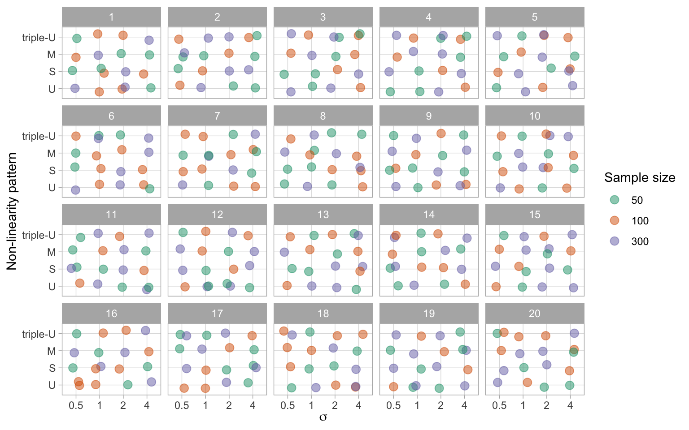

# Appendix to "A Plot is Worth a Thousand Tests: Assessing Residual Diagnostics with the Lineup Protocol" {#sec-appendix-a}


::: {.cell}

:::

::: {.cell}

:::

::: {.cell}

:::

::: {.cell}

:::

::: {.cell}

:::


## Additional Details of Testing Procedures {#sec-appendix-a-1}


### Statistical Significance

Within the context of visual inference, with $K$ independent observers, the visual $p$-value can be seen as the probability of having as many or more participants detect the data plot than the observed result.

The approach used in @majumder2013validation is as follows. Define $X_j = \{0,1\}$ to be a Bernoulli random variable measuring whether participant $j$ detected the data plot, and $X = \sum_{j=1}^{K}X_j$ be the total number of observers who detected the data plot. Then, by imposing a relatively strong assumption that all $K$ evaluations are fully independent, under $H_0$ $X \sim \mathrm{Binom}_{K,1/m}$. Therefore, the $p$-value of a lineup of size $m$ evaluated by $K$ observer is estimated with $P(X \geq x) = 1 - F(x) + f(x)$, where $F(.)$ is the binomial cumulative distribution function, $f(.)$ is the binomial probability mass function and $x$ is the realization of number of observers choosing the data plot.

As pointed out by @vanderplas2021statistical, this basic binomial model is deficient. It does not take into account the possible dependencies in the visual test due to repeated evaluations of the same lineup, or account for when participants are offered the option to select one or more "most different" plots, or none, from a lineup. They suggest three common lineup scenarios: (1) $K$ different lineups are shown to $K$ participants, (2) $K$ lineups with different null plots but the same data plot are shown to $K$ participants, and (3) the same lineup is shown to $K$ participants. Scenario 3 is the most feasible to apply, but has the most dependencies to accommodate for the $p$-value calculation. For Scenario 3, VanderPlas et al propose modelling the probability of plot $i$ being selected from a lineup as $\theta_i$, where $\theta_i \sim \text{Dirichlet}(\alpha)$ for $i=1,...,m$ and $\alpha > 0$. The number of times plot $i$ being selected in $K$ evaluations is denoted as $c_i$. In case participant $j$ makes multiple selections, $1/s_j$ will be added to $c_i$ instead of one, where $s_j$ is the number of plots participant $j$ selected for $j=1,...K$. This ensures $\sum_{i}c_i=K$. Since we are only interested in the selections of the data plot $i$, the marginal model can be simplified to a beta-binomial model and thus the visual $p$-value is given as


$$
P(C \geq c_i) = \sum_{x=c_i}^{K}{K \choose x}\frac{B(x + \alpha, K - x + (m - 1)\alpha)}{B(\alpha, (m-1)\alpha)},\quad \text{for} \quad c_i \in \mathbb{Z}_0^+
$$ {#eq-pvalue-beta-binomial}

\noindent where $B(.)$ is the beta function defined as

$$
B(a, b) = \int_{0}^{1}t^{\alpha - 1}(1-t)^{b-1}dt,\quad \text{where}\quad a,b>0.
$$ {#eq-betafunction}

\noindent We extend the equation to non-negative real number $c_i$ by applying a linear approximation

$$
P(C \geq c_i) = P(C \geq \lceil c_i \rceil) + (\lceil c_i \rceil - c_i) P(C = \lfloor c_i \rfloor), \quad \text{for}\quad c_i \in \mathbb{R}_0^+,
$$ {#eq-pvalue-beta-binomial-approx}

\noindent where $P(C \geq \lceil c_i \rceil)$ is calculated using @eq-pvalue-beta-binomial and $P(C = \lfloor c_i \rfloor)$ is calculated by

$$
P(C = c_i) = {K \choose c_i}\frac{B(c_i + \alpha, K - c_i + (m - 1)\alpha)}{B(\alpha, (m-1)\alpha)},\quad \text{for} \quad c_i \in \mathbb{Z}_0^+.
$$ {#eq-pmf-beta-binomial}

The parameter $\alpha$ used in @eq-pvalue-beta-binomial and @eq-pmf-beta-binomial is usually unknown and will need to be estimated from the survey data. An interpretation of $\alpha$ is that when it is low only a few plots are attractive to the observers and tend to be selected, and when high, most plots are equally likely to be chosen. VanderPlas et al define $c$-interesting plot to be if $c$ or more participants select the plot as the most different. The expected number of plots selected at least $c$ times, $\mathrm{E}[Z_c]$, is then calculated as

$$
\mathrm{E}[Z_c(\alpha)] = \frac{m}{B(\alpha, (m-1)\alpha)}\sum_{\lceil c \rceil}^{K}{K \choose x} B(x + \alpha, K - x + (m-1)\alpha).
$$ {#eq-c-interesting-expectation}

With @eq-c-interesting-expectation, $\alpha$ can be estimated using maximum likelihood estimation. Precise estimation of $\alpha$, is aided by evaluation of Rorschach lineups, where all plots are null plots. In a Rorschach, in theory all plots should be equally likely, but in practice some (irrelevant) visual elements may be more eye-catching than others. This is what $\alpha$ captures, the capacity for extraneous features to distract the observer for a particular type of plot display.

### Effect Size Derivation

Effect size can be defined as the difference of a parameter for a particular model or distribution,  or a statistic derived from a sample. Importantly, it needs to reflect the treatment we try to measure. Centred on a conventional statistical test, we usually can deduce the effect size from the test statistic by substituting the null parameter value. When considering the diagnostics of residual departures, there exist many possibilities of test statistics for a variety of model assumptions. Meanwhile, diagnostic plots such as the residual plot have no general agreement on measuring how strong a model violation pattern is. To build a bridge between various residual-based tests, and the visual test, we focus on the shared information embedded in the testing procedures, which is the distribution of residuals. When comes to comparison of distribution, Kullback-Leibler divergence [@kullback1951information] is a classical way to represent the information loss or entropy increase caused by the approximation to the true distribution, which in our case, the inefficiency due to the use of false model assumptions.

Following the terminology introduced by @kullback1951information, $P$ represents the measured probability distribution, and $Q$ represents the assumed probability distribution. The Kullback-Leibler divergence is defined as $\int_{-\infty}^{\infty}\log(p(x)/q(x))p(x)dx$, where $p(.)$ and $q(.)$ denote probability densities of $P$ and $Q$. 

Let $\boldsymbol{X}$ denotes the $p + 1$ predictors with $n$ observations, $\boldsymbol{b} = (\boldsymbol{X}'\boldsymbol{X})^{-1}\boldsymbol{X}'\boldsymbol{y}$ denotes the OLS solution, $\boldsymbol{R} = \boldsymbol{I}_n -\boldsymbol{X}(\boldsymbol{X}'\boldsymbol{X})^{-1}\boldsymbol{X}'$ denotes the residual operator, and let $\boldsymbol{\varepsilon} \sim N(\boldsymbol{0},\sigma^2\boldsymbol{I})$ denotes the error. The residual vector 

\begin{align*}
\boldsymbol{e} &= \boldsymbol{y} - \boldsymbol{X}\boldsymbol{b} \\
               &= \boldsymbol{y} - \boldsymbol{X}(\boldsymbol{X}'\boldsymbol{X})^{-1}\boldsymbol{X}'\boldsymbol{y} \\
               &= (\boldsymbol{I} -\boldsymbol{X}(\boldsymbol{X}'\boldsymbol{X})^{-1}\boldsymbol{X}')\boldsymbol{y} \\
               &= \boldsymbol{R}\boldsymbol{y} \\
               &= \boldsymbol{R}(\boldsymbol{X}\boldsymbol{\beta} + \boldsymbol{\varepsilon}) \\
               &= \boldsymbol{R}\boldsymbol{\varepsilon}.
\end{align*}

Because $\text{rank}(\boldsymbol{R}) = n - p - 1 < n$, $\boldsymbol{e}$ follows a degenerate multivariate normal distribution and does not have a density. Since the Kullback-Leibler divergence requires a proper density function, we need to simplify the covariance matrix of $\boldsymbol{e}$ by setting all the off-diagonal elements to 0. Then, the residuals will be assumed to follow $N(\boldsymbol{0}, diag(\boldsymbol{R}\sigma^2))$ under the null hypothesis that the model is correctly specified. If the model is however misspecified due to omitted variables $\boldsymbol{Z}$, or a non-constant variance $\boldsymbol{V}$, the distribution of residuals can be derived as $N(\boldsymbol{R}\boldsymbol{Z}\boldsymbol{\beta}_z, \text{diag}(\boldsymbol{R}\sigma^2))$ and $N(\boldsymbol{0}, \text{diag}(\boldsymbol{R}\boldsymbol{V}\boldsymbol{R}'))$ respectively.

By assuming both $P$ and $Q$ are multivariate normal density functions, the Kullback-Leibler divergence can be rewritten as 
$$KL = \frac{1}{2}\left(\log\frac{|\Sigma_p|}{|\Sigma_q|} - n + \text{tr}(\Sigma_p^{-1}\Sigma_q) + (\mu_p - \mu_q)'\Sigma_p^{-1}(\mu_p - \mu_q)\right).$$

Then, we can combine the two residual departures into one formula

\small

$$
KL = \frac{1}{2}\left(\log\frac{|\text{diag}(\boldsymbol{R}\boldsymbol{V}\boldsymbol{R}')|}{|\text{diag}(\boldsymbol{R}\sigma^2)|} - n + \text{tr}(\text{diag}(\boldsymbol{R}\boldsymbol{V}\boldsymbol{R}')^{-1}\text{diag}(\boldsymbol{R}\sigma^2)) + \boldsymbol{\mu}_z'(\boldsymbol{R}\boldsymbol{V}\boldsymbol{R}')^{-1}\boldsymbol{\mu}_z\right).
$$

\normalsize

When there are omitted variables but constant error variance, the formula can be reduced to

$$KL = \frac{1}{2}\left(\boldsymbol{\mu}_z'(\text{diag}(\boldsymbol{R}\sigma^2))^{-1}\boldsymbol{\mu}_z\right).$$

And when the model equation is correctly specified but the error variance is non-constant, the formula can be reduced to

$$KL = \frac{1}{2}\left(log\frac{|\text{diag}(\boldsymbol{R}\boldsymbol{V}\boldsymbol{R}')|}{|\text{diag}(\boldsymbol{R}\sigma^2)|} - n + \text{tr}(\text{diag}(\boldsymbol{R}\boldsymbol{V}\boldsymbol{R}')^{-1}
\text{diag}(\boldsymbol{R}\sigma^2))\right).$$

To compute the effect size for each lineup we simulate a sufficiently large number of samples from the same model with the number of observations $n$ fixed for each sample. We then compute the effect size for each sample and take the average as the final value. This ensures lineups constructed with the same experimental factors will share the same effect size.


### Sensitivity Analysis for $\alpha$

The parameter $\alpha$ used for the $p$-value calculation needs to be estimated from responses to null lineups. With a greater value of $\hat{\alpha}$, the $p$-value will be smaller, resulting in more lineups being rejected. However, The way we generate Rorschach lineup is not strictly the same as what suggested in @vanderplas2021statistical and @buja2009statistical. Therefore, we conduct a sensitivity analysis in this section to examine the impact of the variation of the estimator $\alpha$ on our primary findings.

The analysis is conducted by setting up several scenarios, where the $\alpha$ is under or overestimated by 12.5%, 25% and 50%. Using the adjusted $\hat{\alpha}$, we recalculate the $p$-value for every lineup and show the results in @fig-sensitivity. It can be observed that there are some changes to $p$-values, especially when the $\hat{\alpha}$ is multiplied by 50%. However, @tbl-sensitivity shows that adjusting $\hat{\alpha}$ will not result in a huge difference in rejection decisions. There are only a small percentage of cases where the rejection decision change. It is very unlikely the downstream findings will be affected because of the estimate of $\alpha$. 


::: {.cell}

:::

::: {.cell}
::: {.cell-output-display}
![Change of $p$-values with $\hat{\alpha}$ multiplied by $0.5$, $0.75$, $0.875$, $1.125$, $1.25$ and $1.5$. Only lineups with uniform fitted value distribution is used. The vertical dashed line indicates $p\text{-value} = 0.05$. The area coloured in red indicates $\text{adjusted }p\text{-value} < 0.05$. The x-axis is drawn on logarithmic scale. For multipliers smaller than 1, the adjusted $p\text{-value}$ will initially increase and decline when the $p\text{-value}$ increases. The trend is opposite with multipliers greater than $1$, but the difference eventually reaches $0$.](A-appA_files/figure-html/fig-sensitivity-1.png){#fig-sensitivity width=768}
:::
:::

::: {#tbl-sensitivity .cell tbl-cap='Examining how decisions might change if $\hat{\alpha}$ was different. Percentage of lineups that where the $p$-value would switch to above or below 0.05, when $\hat{\alpha}$ is multiplied by a multiplier.'}
::: {.cell-output-display}

\begin{tabular}{rrrrr}
\toprule
Multiplier & Reject to not reject & \% & Not reject to reject & \%\\
\midrule
0.500 & 7 & 2.51 & 0 & 0.00\\
0.750 & 4 & 1.43 & 0 & 0.00\\
0.875 & 3 & 1.08 & 0 & 0.00\\
\addlinespace
1.125 & 0 & 0.00 & 3 & 1.08\\
1.250 & 0 & 0.00 & 4 & 1.43\\
1.500 & 0 & 0.00 & 5 & 1.79\\
\bottomrule
\end{tabular}


:::
:::


### Effect of Number of Evaluations on the Power of a Visual Test

When comparing power of visual tests across different fitted value distributions, we have discussed the number of evaluations on a lineup will affect the power of the visual test. Using the lineups with uniform fitted value distribution, we show in @fig-n_eval the change of power of visual tests due to different number of evaluations. It can be learned that as the number of evaluations increases, the power will increase but the margin will decrease. Considering we have eleven evaluations on lineups with uniform fitted value distribution, and five evaluations on other lineups, it is necessary to use the same number of evaluations for each lineup in comparison.


::: {.cell}

:::

::: {.cell}
::: {.cell-output-display}
{#fig-n_eval width=70%}
:::
:::


### Power of a RESET Test under Different Auxiliary Regression Formulas

It is found in the result that the power of a RESET test will be affected by the highest order of fitted values included in the auxiliary formula. And we suspect that the current recommendation of the highest order - four, is insufficient to test complex non-linear structures such as the "triple-U" shape designed in this paper. @fig-reset illustrates the change of power of RESET test while testing the "U" shape and the "triple-U" shape with different highest orders. Clearly, when testing a simple shape like the "U" shape, the highest order has very little impact on the power. But for testing the "triple-U" shape, there will be a loss of power if the recommended order is used. To avoid the loss of power, the highest order needs to be set to at least six. 


::: {.cell}

:::

::: {.cell}

:::

::: {.cell}
::: {.cell-output-display}
{#fig-reset width=768}
:::
:::


### Conventional Test Rejection Rate for Varying Significance Levels

In the main paper, @sec-power-analysis and @sec-p-value compared the power, and the decisions made by the conventional tests and the visual test. The power curves for the visual test is effectively a right-shift from the conventional test. The effect is that the visual test rejects less often than the conventional test, at the same significance level. We also saw that the visual test rejected a subset of those that the conventional tests rejected. This means that they agreed quite well - only residual plots rejected by the conventional tests were rejected by the visual test. There was little disagreement, where residual plots not rejected by the conventional test were rejected by the visual test. The question arises whether the decisions made conventional test could be made similar to that of the visual test by reducing the significance level. Reducing the significance level from 0.05, to 0.01, 0.001, ... will have the effect of rejecting fewer of the residual plots. 

It would be interesting if a different conventional test significance level results in both the visual tests and conventional tests reject only the same residual plots, and fails to reject the same residual plots. This would be a state where both systems agree perfectly. @fig-rej-rates examines this. Plot A shows the percentage of residual plots rejected by the visual test, given the conventional test rejected (solid lines) or failed to reject (dashed lines). The vertical grey line marks significance level 0.05. When the significance level gets smaller, it is possible to see that the visual tests reject (nearly) 100% of the time that the conventional test rejects. However, there is no agreement, because the visual tests also increasingly reject residual plots where the conventional test failed to reject. Plot B is comparable to an ROC curve, where the percentage visual test rejection conditional on conventional test decision is plotted: Reject conditional on reject is plotted against reject conditional on fail to reject, for different significance levels. The non-linearity pattern results are close to being ideal, that the percentage of reject relative to fail to reject increases very slowly as the reject relative to reject converges to 100. The heteroskedasticity pattern is more problematic, and shows that the cost of rejecting less with the conventional test is disagreement with the visual test.


::: {.cell}
::: {.cell-output-display}
![Changing the significance level of the conventional test will change the rejection rate. A: Percentage of conventional tests also rejected by the visual test: rejected (solid), not rejected (dashed). As the significance level is reduced, the percentage rejected by the visual test that has been rejected by the conventional test approaches 100. The percentage of tests not rejected by the conventional test also increases, as expected, but the percentage of these that are rejected by the visual test increases too. B: ROC curve shows that forcing the conventional test to not reject creates a discrepancy with the visual test. Many of the residual plots not rejected by the conventional test are rejected by the visual test. It is not possible to vary the significance level of the conventional test to match the decisions made by the visual test.](A-appA_files/figure-html/fig-rej-rates-1.png){#fig-rej-rates fig-pos='t!' width=100%}
:::
:::


## Additional Details of Experimental Setup {#sec-appendix-a-2}


### Non-linearity Model

The non-linearity model used in the experiment includes a non-linear term $\boldsymbol{z}$ constructed using Hermite polynomials on random vector $\boldsymbol{x}$ formulated as

\begin{align*}
\boldsymbol{y} &= \boldsymbol{1}_n + \boldsymbol{x} + \boldsymbol{z} + \boldsymbol{\varepsilon},\\
\boldsymbol{x} &= g(\boldsymbol{x}_{raw}, 1), \\
\boldsymbol{z} &= g(\boldsymbol{z}_{raw}, 1), \\
\boldsymbol{z}_{raw} &= He_j(g(\boldsymbol{x}, 2)),
\end{align*}

\noindent where $\boldsymbol{y}$, $\boldsymbol{x}$, $\boldsymbol{\varepsilon}$, $\boldsymbol{x}_{raw}$, $\boldsymbol{z}_{raw}$ are vectors of size $n$, $\boldsymbol{1}_n$ is a vector of ones of size $n$, $He_{j}(.)$ is the $j$th-order probabilist's Hermite polynomials [@hermite1864nouveau; originally by @de1820theorie], $\varepsilon \sim N(\boldsymbol{0}_n, \sigma^2\boldsymbol{I}_n)$, and $g(\boldsymbol{x}, k)$ is a scaling function to enforce the support of the random vector to be $[-k, k]^n$ defined as

$$
g(\boldsymbol{x}, k) = 2k\cdot\frac{\boldsymbol{x} - x_{min}\boldsymbol{1}_n}{x_{max} - x_{min}} - k, \quad \text{for} \quad k > 0. 
$$ {#eq-scaling-function}

\noindent where $\displaystyle x_{min} = \min_{i\in \{1, ..., n\}} x_i$, $\displaystyle x_{max} = \max_{i\in \{1, ..., n\}} x_i$ and $x_i$ is the $i$-th entry of $\boldsymbol{x}$. The function `hermite` from the R package `mpoly` [@mpoly] is used to simulate $\boldsymbol{z}_{raw}$ to generate Hermite polynomials. 

The null regression model used to fit the realizations generated by the above model is formulated as

$$
\boldsymbol{y} = \beta_0\boldsymbol{1}_n + \beta_1 \boldsymbol{x} + \boldsymbol{u},
$$ {#eq-null-model}

\noindent where $\boldsymbol{u} \sim N(\boldsymbol{0}, \sigma^2\boldsymbol{I}_n)$. Here $\boldsymbol{z}$ is a higher order term of $\boldsymbol{x}$ and leaving it out in the null regression results in model misspecification.

### Heteroskedasticity Model

The heteroskedasticity model used in the experiment is formulated as

\begin{align*}
\boldsymbol{y} &= \boldsymbol{1}_n + \boldsymbol{x} + \boldsymbol{\varepsilon},\\
\boldsymbol{x} &= g(\boldsymbol{x}_{raw}, 1),\\
\boldsymbol{\varepsilon} &\sim N(\boldsymbol{0}_n, \boldsymbol{1}_n + (2 - |a|)(\boldsymbol{x} - a\boldsymbol{1}_n)'(\boldsymbol{x} - a\boldsymbol{1}_n) b \boldsymbol{I}_n), 
\end{align*}

\noindent where $\boldsymbol{y}$, $\boldsymbol{x}$, $\boldsymbol{\varepsilon}$ are vectors of size $n$ and $g(.)$ is the scaling function defined in @eq-scaling-function. The null regression model used to fit the realizations generated by the above model is formulated exactly the same as @eq-null-model.

For $b \neq 0$, the variance-covariance matrix of the error term $\boldsymbol{\varepsilon}$ is correlated with the predictor $\boldsymbol{x}$, which will lead to the presence of heteroskedasticity. 

Since $\text{supp}(X) = [-1, 1]$, choosing $a$ to be $-1$, $0$ and $1$ can generate "left-triangle", "butterfly" and "right-triangle" shapes. The term $(2 - |a|)$ maintains the magnitude of residuals across different values of $a$. 

### Controlling the Signal Strength 

The three parameters $n$, $\sigma$ and $b$ are important for controlling the strength of the signal to generate lineups with a variety difficulty levels. This will ensure that  estimated power curves will be smooth and continuous, and that participants are allocated a set of lineups with a range of difficulty. 

Parameter $\sigma \in \{0.5, 1, 2, 4\}$ and $b \in \{0.25, 1, 4, 16, 64\}$ are used in data collection periods I and II respectively. A large value of $\sigma$ will increase the variation of the error of the non-linearity model and decrease the visibility of the visual pattern. 
The parameter $b$ controls the variation in the standard deviation of the error across the support of the predictor. A larger value of $b$ generates a larger ratio between it is smallest and highest values, making the visual pattern more obvious. 
The sample size $n$ sharpens (or blurs) a pattern when it is larger (or smaller). 

### Lineup Allocation to Participants

There are a total of $4 \times 4 \times 3 \times 4 = 192$ and $3 \times 5 \times 3 \times 4 = 180$ combinations of parameter values for the non-linearity model and heteroskedasticity models respectively. Three replications for each combination results in $192 \times 3 = 576$ and $180 \times 3 = 540$ lineups, respectively. 

Each lineup needs to be evaluated by at least five participants. From previous work, and additional pilot studies for this experiment, we decided to record evaluations from 20 lineups for each participant. Two of the 20 lineups with clear visual patterns were used as attention checks, to ensure quality data. Thus, $576 \times 5 / (20-2) = 160$ and $540 \times 5 / (20-2) = 150$ participants were needed to cover the experimental design for the data collection periods I and II, respectively. The factor levels and range of difficulty was assigned relatively equally among participants. 

Data collection period III was primarily to obtain Rorschach lineup evaluations to estimate $\alpha$, and also to obtain additional evaluations of lineups made with uniform fitted value distribution to ensure consistency in the results. To construct a Rorschach lineup, the data is generated from a model with zero effect size, while the null data are generated using the residual rotation technique. This procedure differs from that of the canonical Rorschach lineup, where all 20 plots are generated directly from the null model, so the method suggested in @vanderplas2021statistical for typical lineups containing a data plot is used to estimate $\alpha$. The $3 \times 4 = 12$ treatment levels of the common factors, replicated three times results in 36 lineups. And 6 more evaluations on the 279 lineups with uniform fitted value distribution, results in at least $(36 \times 20 + 279 \times 3 \times 6) / (20-2) = 133$ participants needed.


### Mapping of Participants to Experimental Factors

Mapping of participants to experimental factors is an important part of experimental design. Essentially, we want to maximum the difference in factors exposed to a participant. For this purpose, we design an algorithm to conduct participant allocation. Let $L$ be a set of available lineups and $S$ be a set of available participants. According to the experimental design, the availability of a lineup is associated with the number of participants it can assign to. For lineups with uniform fitted value distribution, this value is 11. And other lineups can be allocated to at most five different participants. The availability of a participant is associated with the number of lineups that being allocated to this participant. A participant can view at most 18 different lineups. 

The algorithm starts from picking a random participant $s \in S$ with the minimum number of allocated lineups. It then tries to find a lineup $l \in L$ that can maximise the distance metric $D$ and allocate it to participant $s$. Set $L$ and $S$ will be updated and the picking process will be repeated until there is no available lineups or participants. 

Let $F_1,...,F_q$ be $q$ experimental factors, and $f_1, ...,f_q$ be the corresponding factor values. We say $f_i$ exists in $L_{s}$ if any lineup in $L_{s}$ has this factor value. Similarly, $f_if_j$ exists in $L_{s}$ if any lineup in $L_{s}$ has this pair of factor values. And $f_if_jf_k$ exists in $L_{s}$ if any lineup in $L_{s}$ has this trio of factor values. The distance metric $D$ is defined between a lineup $l$ and a set of lineups $L_{s}$ allocated to a participant $s$ if $L_{s}$ is non-empty: 

\footnotesize

\begin{equation*}
D =
C - \sum_{1\leq i \leq q}I(f_i\text{ exists in }L_{s}) - \sum_{\substack{1\leq i \leq q-1 \\ i < j \leq q}}I(f_if_j\text{ exists in }L_{s}) - \sum_{\substack{1\leq i \leq q - 2 \\ i < j \leq q - 1 \\ j < k \leq q}}I(f_if_jf_k\text{ exists in }L_{s})
\end{equation*}

\normalsize
where $C$ is a sufficiently large constant such that $D > 0$. If $L_{s}$ is empty, we define $D = 0$.

The distance measures how different a lineup is from the set of lineups allocated to the participant in terms of factor values. Thus, the algorithm will try to allocate the most different lineup to a participant at each step.

In @fig-poly-allocate and @fig-heter-allocate, we present examples of lineup allocations generated by our algorithm for data collection periods I and II, respectively. These figures illustrate the factor values presented to the first 20 participants recruited during each period. It can be observed that the algorithm effectively distributed almost all possible one-way and two-way factor combinations among the participants, thereby ensuring a diverse set of lineups for each participant.


::: {.cell}
::: {.cell-output-display}
{#fig-poly-allocate width=768}
:::
:::

::: {.cell}
::: {.cell-output-display}
{#fig-heter-allocate width=768}
:::
:::


### Data Collection Process

The survey data is collected via a self-hosted website designed by us. The complete architecture is provided in @fig-tech. The website is built with the `Flask` [@flask] web framework and hosted on `PythonAnywhere` [@pythonanywhere]. It is configured to handle HTTP requests such that participants can correctly receive webpages and submit responses. Embedded in the resources sent to participants, the `jsPsych` front-end framework [@jspsych] instructs participants' browsers to render an environment for running behavioural experiments. During the experiment, this framework will automatically collect common behavioural data such as response time and clicks on buttons. participants' responses are first validated by a scheduled `Python` script run on the server, then push to a Github repository. Lineup images shown to users are saved in multiple Github repositories and hosted in corresponding Github pages. The URLs to these images are resolved by `Flask` and bundled in HTML files. 

Once the participant is recruited from Prolific [@palan2018prolific], it will be redirected to the entry page of our study website. An image of the entry page is provided in @fig-entry-page. Then, the participant needs to submit the online consent form and fill in the demographic information as shown in @fig-consent-form and @fig-metadata respectively. Before evaluating lineups, participant also need to read the training page as provide in @fig-training-page to understand the process. An example of the lineup page is given in @fig-lineup-page. A half of the page is taken by the lineup image to attract participant's attention. The button to skip the selections for the current lineup is intentionally put in the corner of the bounding box with smaller font size, such that participants will not misuse this functionality.


::: {.cell}
::: {.cell-output-display}
{#fig-tech width=100%}
:::
:::

::: {.cell}
::: {.cell-output-display}
{#fig-entry-page width=100%}
:::
:::

::: {.cell}
::: {.cell-output-display}
{#fig-consent-form width=100%}
:::
:::

::: {.cell}
::: {.cell-output-display}
{#fig-metadata width=100%}
:::
:::

::: {.cell}
::: {.cell-output-display}
{#fig-training-page width=100%}
:::
:::

::: {.cell}
::: {.cell-output-display}
{#fig-lineup-page width=100%}
:::
:::


## Analysis of Results Relative to Data Collection Process

### Demographics

Throughout the study, we have collected 7254 evaluations on 1116 non-null lineups. @tbl-count-lineup gives further details about the number of evaluations, lineups and participants over pattern types and data collection periods. 


::: {#tbl-count-lineup .cell tbl-cap='Count of lineups, evaluations and participants over departure types and data collection periods.'}
::: {.cell-output-display}

`````{=html}
<table>
 <thead>
<tr>
<th style="empty-cells: hide;border-bottom:hidden;" colspan="1"></th>
<th style="border-bottom:hidden;padding-bottom:0; padding-left:3px;padding-right:3px;text-align: center; " colspan="3"><div style="border-bottom: 1px solid #ddd; padding-bottom: 5px; ">Non-linearity</div></th>
<th style="border-bottom:hidden;padding-bottom:0; padding-left:3px;padding-right:3px;text-align: center; " colspan="3"><div style="border-bottom: 1px solid #ddd; padding-bottom: 5px; ">Heteroskedasticity</div></th>
<th style="empty-cells: hide;border-bottom:hidden;" colspan="1"></th>
</tr>
  <tr>
   <th style="text-align:left;"> Number </th>
   <th style="text-align:right;"> I </th>
   <th style="text-align:right;"> II </th>
   <th style="text-align:right;"> III </th>
   <th style="text-align:right;"> I </th>
   <th style="text-align:right;"> II </th>
   <th style="text-align:right;"> II </th>
   <th style="text-align:right;"> Total </th>
  </tr>
 </thead>
<tbody>
  <tr>
   <td style="text-align:left;"> Lineups </td>
   <td style="text-align:right;"> 576 </td>
   <td style="text-align:right;"> 0 </td>
   <td style="text-align:right;"> 144 </td>
   <td style="text-align:right;"> 0 </td>
   <td style="text-align:right;"> 540 </td>
   <td style="text-align:right;"> 135 </td>
   <td style="text-align:right;"> 1116 </td>
  </tr>
  <tr>
   <td style="text-align:left;"> Evaluations </td>
   <td style="text-align:right;"> 2880 </td>
   <td style="text-align:right;"> 0 </td>
   <td style="text-align:right;"> 864 </td>
   <td style="text-align:right;"> 0 </td>
   <td style="text-align:right;"> 2700 </td>
   <td style="text-align:right;"> 810 </td>
   <td style="text-align:right;"> 7254 </td>
  </tr>
  <tr>
   <td style="text-align:left;"> Participants </td>
   <td style="text-align:right;"> 160 </td>
   <td style="text-align:right;"> 0 </td>
   <td style="text-align:right;"> 123 </td>
   <td style="text-align:right;"> 0 </td>
   <td style="text-align:right;"> 160 </td>
   <td style="text-align:right;"> 123 </td>
   <td style="text-align:right;"> 443 </td>
  </tr>
</tbody>
</table>

`````

:::
:::


Along with the responses to lineups, we have collected a series of demographic information including age, pronoun, education background and previous experience in studies involved data visualization. @tbl-pronoun, @tbl-age-group, @tbl-education and @tbl-experience provide summary of the demographic data. 

It can be observed from the tables that most participants have Diploma or Bachelor degrees, followed by High school or below and the survey data is gender balanced. Majority of participants are between 18 to 39 years old and there are slightly more participants who do not have previous experience than those who have. 


::: {#tbl-pronoun .cell tbl-cap='Summary of pronoun distribution of participants recruited in this study.'}
::: {.cell-output-display}

`````{=html}
<table class="table" style="margin-left: auto; margin-right: auto;">
 <thead>
  <tr>
   <th style="text-align:left;"> Pronoun </th>
   <th style="text-align:right;"> Period I </th>
   <th style="text-align:right;"> % </th>
   <th style="text-align:right;"> Period II </th>
   <th style="text-align:right;"> % </th>
   <th style="text-align:right;"> Period III </th>
   <th style="text-align:right;"> % </th>
   <th style="text-align:right;"> Total </th>
   <th style="text-align:right;"> % </th>
  </tr>
 </thead>
<tbody>
  <tr>
   <td style="text-align:left;"> He </td>
   <td style="text-align:right;"> 77 </td>
   <td style="text-align:right;"> 17.4 </td>
   <td style="text-align:right;"> 79 </td>
   <td style="text-align:right;"> 17.8 </td>
   <td style="text-align:right;"> 61 </td>
   <td style="text-align:right;"> 13.8 </td>
   <td style="text-align:right;"> 217 </td>
   <td style="text-align:right;"> 49.0 </td>
  </tr>
  <tr>
   <td style="text-align:left;"> She </td>
   <td style="text-align:right;"> 78 </td>
   <td style="text-align:right;"> 17.6 </td>
   <td style="text-align:right;"> 77 </td>
   <td style="text-align:right;"> 17.4 </td>
   <td style="text-align:right;"> 61 </td>
   <td style="text-align:right;"> 13.8 </td>
   <td style="text-align:right;"> 216 </td>
   <td style="text-align:right;"> 48.8 </td>
  </tr>
  <tr>
   <td style="text-align:left;"> Other </td>
   <td style="text-align:right;"> 5 </td>
   <td style="text-align:right;"> 1.1 </td>
   <td style="text-align:right;"> 4 </td>
   <td style="text-align:right;"> 0.9 </td>
   <td style="text-align:right;"> 1 </td>
   <td style="text-align:right;"> 0.2 </td>
   <td style="text-align:right;"> 10 </td>
   <td style="text-align:right;"> 2.3 </td>
  </tr>
  <tr>
   <td style="text-align:left;">  </td>
   <td style="text-align:right;"> 160 </td>
   <td style="text-align:right;"> 36.1 </td>
   <td style="text-align:right;"> 160 </td>
   <td style="text-align:right;"> 36.1 </td>
   <td style="text-align:right;"> 123 </td>
   <td style="text-align:right;"> 27.8 </td>
   <td style="text-align:right;"> 443 </td>
   <td style="text-align:right;"> 100.0 </td>
  </tr>
</tbody>
</table>

`````

:::
:::

::: {#tbl-age-group .cell tbl-cap='Summary of age distribution of participants recruited in this study.'}
::: {.cell-output-display}

`````{=html}
<table class="table" style="margin-left: auto; margin-right: auto;">
 <thead>
  <tr>
   <th style="text-align:left;"> Age group </th>
   <th style="text-align:right;"> Period I </th>
   <th style="text-align:right;"> % </th>
   <th style="text-align:right;"> Period II </th>
   <th style="text-align:right;"> % </th>
   <th style="text-align:right;"> Period III </th>
   <th style="text-align:right;"> % </th>
   <th style="text-align:right;"> Total </th>
   <th style="text-align:right;"> % </th>
  </tr>
 </thead>
<tbody>
  <tr>
   <td style="text-align:left;"> 18-24 </td>
   <td style="text-align:right;"> 83 </td>
   <td style="text-align:right;"> 18.7 </td>
   <td style="text-align:right;"> 86 </td>
   <td style="text-align:right;"> 19.4 </td>
   <td style="text-align:right;"> 51 </td>
   <td style="text-align:right;"> 11.5 </td>
   <td style="text-align:right;"> 220 </td>
   <td style="text-align:right;"> 49.7 </td>
  </tr>
  <tr>
   <td style="text-align:left;"> 25-39 </td>
   <td style="text-align:right;"> 69 </td>
   <td style="text-align:right;"> 15.6 </td>
   <td style="text-align:right;"> 63 </td>
   <td style="text-align:right;"> 14.2 </td>
   <td style="text-align:right;"> 63 </td>
   <td style="text-align:right;"> 14.2 </td>
   <td style="text-align:right;"> 195 </td>
   <td style="text-align:right;"> 44.0 </td>
  </tr>
  <tr>
   <td style="text-align:left;"> 40-54 </td>
   <td style="text-align:right;"> 6 </td>
   <td style="text-align:right;"> 1.4 </td>
   <td style="text-align:right;"> 8 </td>
   <td style="text-align:right;"> 1.8 </td>
   <td style="text-align:right;"> 6 </td>
   <td style="text-align:right;"> 1.4 </td>
   <td style="text-align:right;"> 20 </td>
   <td style="text-align:right;"> 4.5 </td>
  </tr>
  <tr>
   <td style="text-align:left;"> 55-64 </td>
   <td style="text-align:right;"> 2 </td>
   <td style="text-align:right;"> 0.5 </td>
   <td style="text-align:right;"> 3 </td>
   <td style="text-align:right;"> 0.7 </td>
   <td style="text-align:right;"> 3 </td>
   <td style="text-align:right;"> 0.7 </td>
   <td style="text-align:right;"> 8 </td>
   <td style="text-align:right;"> 1.8 </td>
  </tr>
  <tr>
   <td style="text-align:left;">  </td>
   <td style="text-align:right;"> 160 </td>
   <td style="text-align:right;"> 36.1 </td>
   <td style="text-align:right;"> 160 </td>
   <td style="text-align:right;"> 36.1 </td>
   <td style="text-align:right;"> 123 </td>
   <td style="text-align:right;"> 27.8 </td>
   <td style="text-align:right;"> 443 </td>
   <td style="text-align:right;"> 100.0 </td>
  </tr>
</tbody>
</table>

`````

:::
:::

::: {#tbl-education .cell tbl-cap='Summary of education distribution of participants recruited in this study.'}
::: {.cell-output-display}

`````{=html}
<table class="table" style="margin-left: auto; margin-right: auto;">
 <thead>
  <tr>
   <th style="text-align:left;"> Education </th>
   <th style="text-align:right;"> Period I </th>
   <th style="text-align:right;"> % </th>
   <th style="text-align:right;"> Period II </th>
   <th style="text-align:right;"> % </th>
   <th style="text-align:right;"> Period III </th>
   <th style="text-align:right;"> % </th>
   <th style="text-align:right;"> Total </th>
   <th style="text-align:right;"> % </th>
  </tr>
 </thead>
<tbody>
  <tr>
   <td style="text-align:left;"> High School or below </td>
   <td style="text-align:right;"> 41 </td>
   <td style="text-align:right;"> 9.3 </td>
   <td style="text-align:right;"> 53 </td>
   <td style="text-align:right;"> 12.0 </td>
   <td style="text-align:right;"> 33 </td>
   <td style="text-align:right;"> 7.4 </td>
   <td style="text-align:right;"> 127 </td>
   <td style="text-align:right;"> 28.7 </td>
  </tr>
  <tr>
   <td style="text-align:left;"> Diploma and Bachelor Degree </td>
   <td style="text-align:right;"> 92 </td>
   <td style="text-align:right;"> 20.8 </td>
   <td style="text-align:right;"> 79 </td>
   <td style="text-align:right;"> 17.8 </td>
   <td style="text-align:right;"> 66 </td>
   <td style="text-align:right;"> 14.9 </td>
   <td style="text-align:right;"> 237 </td>
   <td style="text-align:right;"> 53.5 </td>
  </tr>
  <tr>
   <td style="text-align:left;"> Honours Degree </td>
   <td style="text-align:right;"> 6 </td>
   <td style="text-align:right;"> 1.4 </td>
   <td style="text-align:right;"> 15 </td>
   <td style="text-align:right;"> 3.4 </td>
   <td style="text-align:right;"> 6 </td>
   <td style="text-align:right;"> 1.4 </td>
   <td style="text-align:right;"> 27 </td>
   <td style="text-align:right;"> 6.1 </td>
  </tr>
  <tr>
   <td style="text-align:left;"> Masters Degree </td>
   <td style="text-align:right;"> 21 </td>
   <td style="text-align:right;"> 4.7 </td>
   <td style="text-align:right;"> 13 </td>
   <td style="text-align:right;"> 2.9 </td>
   <td style="text-align:right;"> 16 </td>
   <td style="text-align:right;"> 3.6 </td>
   <td style="text-align:right;"> 50 </td>
   <td style="text-align:right;"> 11.3 </td>
  </tr>
  <tr>
   <td style="text-align:left;"> Doctoral Degree </td>
   <td style="text-align:right;"> 0 </td>
   <td style="text-align:right;"> 0.0 </td>
   <td style="text-align:right;"> 0 </td>
   <td style="text-align:right;"> 0.0 </td>
   <td style="text-align:right;"> 2 </td>
   <td style="text-align:right;"> 0.5 </td>
   <td style="text-align:right;"> 2 </td>
   <td style="text-align:right;"> 0.5 </td>
  </tr>
  <tr>
   <td style="text-align:left;">  </td>
   <td style="text-align:right;"> 160 </td>
   <td style="text-align:right;"> 36.1 </td>
   <td style="text-align:right;"> 160 </td>
   <td style="text-align:right;"> 36.1 </td>
   <td style="text-align:right;"> 123 </td>
   <td style="text-align:right;"> 27.8 </td>
   <td style="text-align:right;"> 443 </td>
   <td style="text-align:right;"> 100.0 </td>
  </tr>
</tbody>
</table>

`````

:::
:::

::: {#tbl-experience .cell tbl-cap='Summary of previous experience distribution of participants recruited in this study.'}
::: {.cell-output-display}

`````{=html}
<table class="table" style="margin-left: auto; margin-right: auto;">
 <thead>
  <tr>
   <th style="text-align:left;"> Previous experience </th>
   <th style="text-align:right;"> Period I </th>
   <th style="text-align:right;"> % </th>
   <th style="text-align:right;"> Period II </th>
   <th style="text-align:right;"> % </th>
   <th style="text-align:right;"> Period III </th>
   <th style="text-align:right;"> % </th>
   <th style="text-align:right;"> Total </th>
   <th style="text-align:right;"> % </th>
  </tr>
 </thead>
<tbody>
  <tr>
   <td style="text-align:left;"> No </td>
   <td style="text-align:right;"> 96 </td>
   <td style="text-align:right;"> 21.7 </td>
   <td style="text-align:right;"> 88 </td>
   <td style="text-align:right;"> 19.9 </td>
   <td style="text-align:right;"> 67 </td>
   <td style="text-align:right;"> 15.1 </td>
   <td style="text-align:right;"> 251 </td>
   <td style="text-align:right;"> 56.7 </td>
  </tr>
  <tr>
   <td style="text-align:left;"> Yes </td>
   <td style="text-align:right;"> 64 </td>
   <td style="text-align:right;"> 14.4 </td>
   <td style="text-align:right;"> 72 </td>
   <td style="text-align:right;"> 16.3 </td>
   <td style="text-align:right;"> 56 </td>
   <td style="text-align:right;"> 12.6 </td>
   <td style="text-align:right;"> 192 </td>
   <td style="text-align:right;"> 43.3 </td>
  </tr>
  <tr>
   <td style="text-align:left;">  </td>
   <td style="text-align:right;"> 160 </td>
   <td style="text-align:right;"> 36.1 </td>
   <td style="text-align:right;"> 160 </td>
   <td style="text-align:right;"> 36.1 </td>
   <td style="text-align:right;"> 123 </td>
   <td style="text-align:right;"> 27.8 </td>
   <td style="text-align:right;"> 443 </td>
   <td style="text-align:right;"> 100.0 </td>
  </tr>
</tbody>
</table>

`````

:::
:::


### Data Collection Periods


::: {.cell}
::: {.cell-output-display}
{#fig-poly-boxplot-lineup width=768}
:::
:::

::: {.cell}
::: {.cell-output-display}
{#fig-heter-boxplot-lineup width=768}
:::
:::


We have the same type of model collected over different data collection periods, that may lead to unexpected batch effect.
@fig-poly-boxplot-lineup and @fig-heter-boxplot-lineup provide two lineups to examine whether there is an actual difference across data collection periods for non-linearity model and heteroskedasticity model respectively. To emphasize the tail behaviour and display fewer outliers, we use the "letter-value" boxplot [@hofmann2017value] which is an extension of the number of "letter value" statistics to check the weighed proportion of detect over different data collection period. The weighted proportion of detect is calculated by taking the average of $c_i$ of a lineup over a data collection period. Within our research team, we can not identify the data plot from the null plots for these two lineups, result in $p$-values much greater than $5$%. Thus, there is no clear evidence of batch effect.

